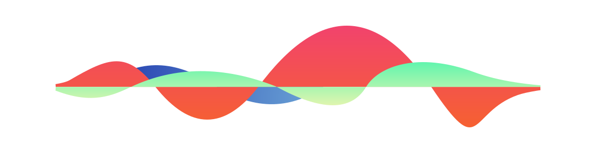
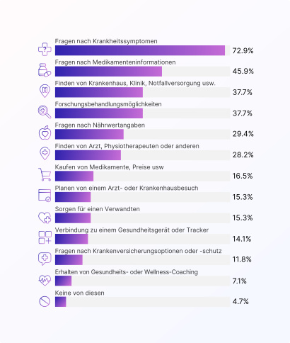
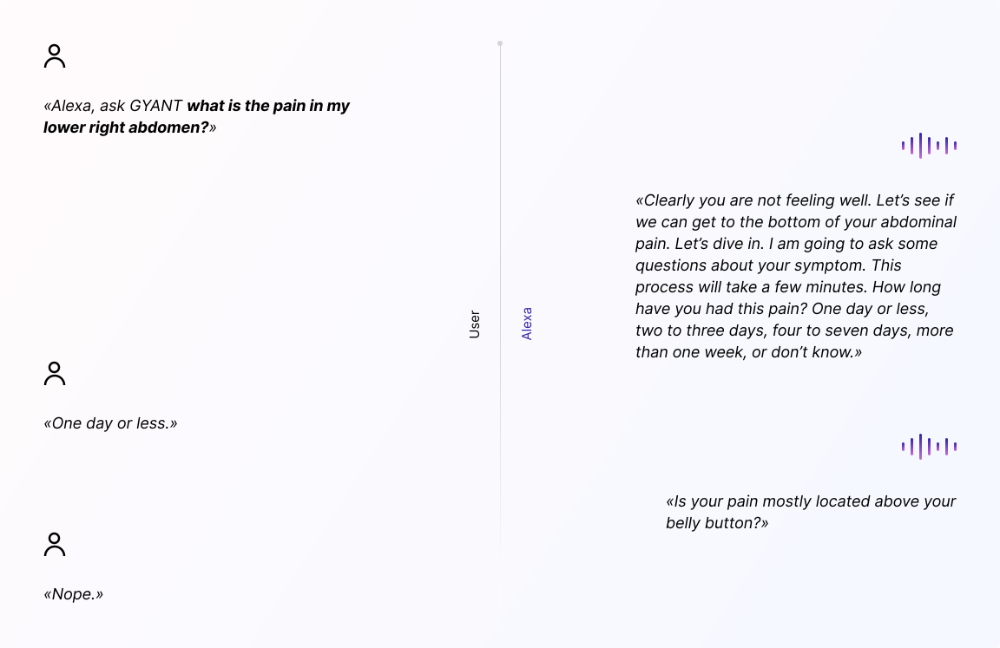
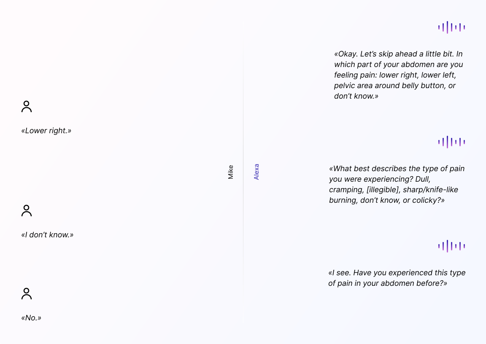
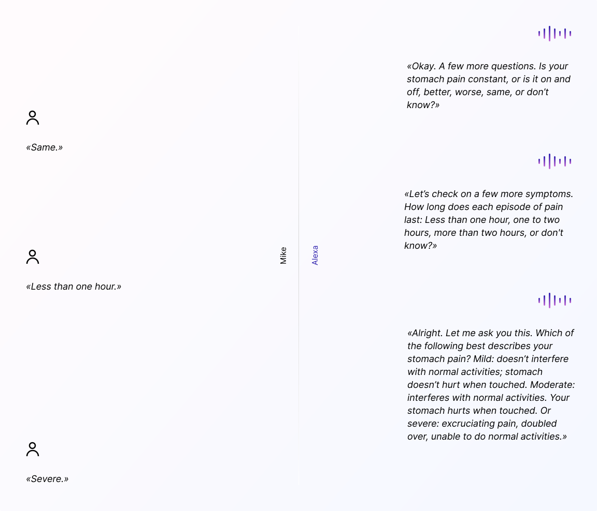
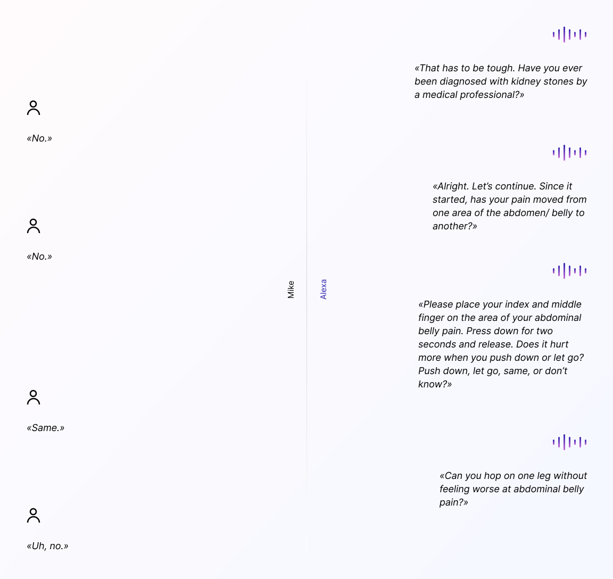
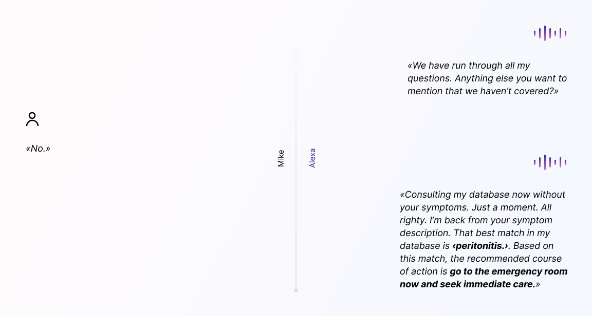
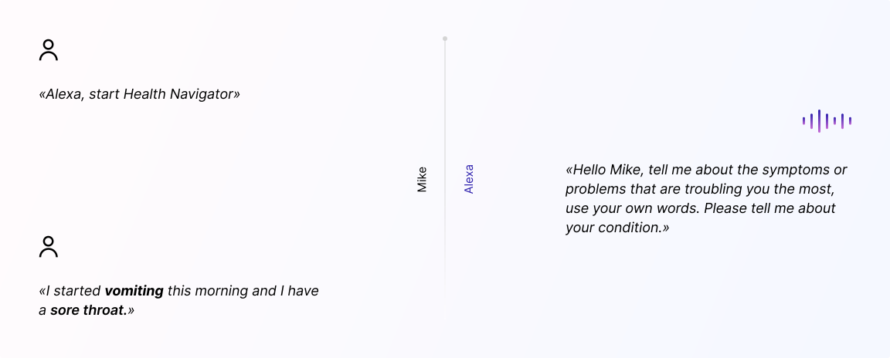
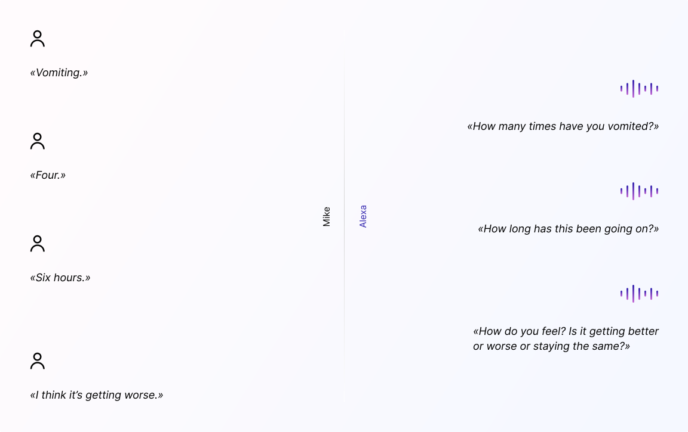
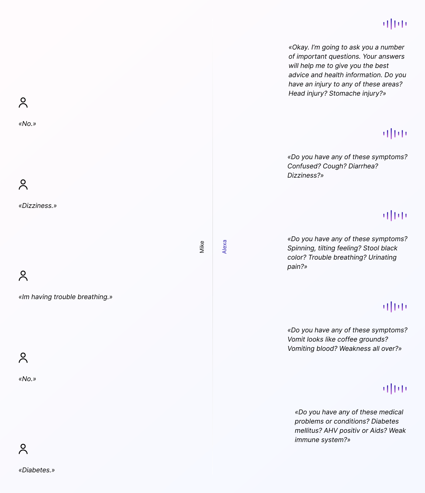

import Margin from 'gatsby-theme-signalwerk/src/components/Margin';
import Grid from 'gatsby-theme-signalwerk/src/components/Grid';
import Column from 'gatsby-theme-signalwerk/src/components/Column';
import Box from 'gatsby-theme-signalwerk/src/components/Box';


<Grid>



</Grid>

## Inhaltsverzeichnis

```toc
exclude: Inhaltsverzeichnis
from-heading: 2
to-heading: 3
```

## Einleitung

2019 meldete das [Bundesamt für Gesundheit (BAG)](https://www.bag.admin.ch/bag/de/home.html) mithilfe des schweizweiten [Sentinella-Meldesystem](https://www.bag.admin.ch/bag/de/home/krankheiten/infektionskrankheiten-bekaempfen/meldesysteme-infektionskrankheiten/sentinella-meldesystem.html), dass die Grippe jedes Jahr zu 112&#x202F;000 bis 275&#x202F;000&nbsp;Arztkonsultationen in der Schweiz führte. Dies entspricht ungefähr drei Prozent der Gesamtbevölkerung der Schweiz.[^:qu:bag] 

Wahrscheinlich sind Symptome wie Husten, Gliederschmerzen sowie erhöhte Temperatur den meisten bekannt und für gewöhnlich weisen diese auf eine einfache Erkältung hin. Dabei ist die Wahrscheinlichkeit gross eine Erkältung mit einer Grippe zu verwechseln&nbsp;– oder umgekehrt. Besonders für nicht medizinisch ausgebildete Personen ist die richtige Zuordnung von Symptomen zu einer vorhandenen Krankheit kaum ohne Hilfe zu bewerkstelligen. Es ist daher keineswegs verwerflich, dass erkrankte Menschen auf Nummer sicher gehen wollen und einen Arzt oder eine Ärztin aufsuchen möchten. Bereits bekannte Alternativen wie das Hausarzt- oder das Telmed-Modell versuchen hier Entlastung zu schaffen, indem bereits vor Konsultation in einer Praxis versucht wird einfache Krankheiten oder Bagatellfälle abzufangen. Eine in diesem Gebiet noch eher unbekannte Anwendung öffnet möglicherweise mit fortgeschrittener Technik neue Türen&nbsp;– der Einsatz von Sprachassistenten und mithilfe von Künstlicher Intelligenz könnte neue Chancen mit sich bringen.

Diese Arbeit bietet einen Einblick in den aktuellen Stand von Sprachassistenten und wie diese funktionieren. Dabei wird anhand zweier Anwendungsbeispiele untersucht, wie dem Menschen durch den Einsatz von Sprachassistenten geholfen wird den Schweregrad einer Krankheit anhand einer Triage-Diagnose zu bestimmen und/oder diverse Symptome einer Krankheit zuzuordnen. Beide Anwendungsmöglichkeiten werden mit den Zielen der Kommunikation zwischen Arzt/Ärztin und PatientIn anhand des [Modells von Bird und Cohen-Cole](#bird-und-cohen-cole-modell) untersucht. Dabei werden Gemeinsamkeiten hervorgehoben, welche sowohl innerhalb des Anwendungsbeispiels als auch im Bird und Cohen-Cole Modell vorkommen. Es wird speziell auf die Veränderung hinsichtlich der Dynamik und deren Auswirkung eingegangen.

Im [ersteren Anwendungsbeispiel](#medizinische-beratung-über-alexa-mittels-gyant-skill) wird die Abfrage von verifizierten Gesundheitsinformationen über eine Voice-App von GYANT untersucht. Im [letzteren Anwendungsbeispiel](#eine-eigenständige-triage-diagnose-stellen-über-alexa-mittels-«health-navigator»-skill) wird ein durch die Zusammenarbeit von Health Navigator und des Softwareentwicklungsunternehmens Macadamian entstandener Proof-of-Concept beschrieben. Es wird untersucht, wie Menschen im Dialog mit einem Sprachassistenten selbstständig eine Krankheit und deren Schweregrad durch vorhandene Symptome herausfinden können. Dabei kann je nach verwendeter Voice-App und Schweregrad der Krankheit eine zusätzliche Empfehlung ein Arzt, eine Ärztin oder ein Spital aufzusuchen wiedergegeben werden. 

**Folgende Fragestellungen werden innerhalb der Arbeit untersucht und beantwortet:**

1. Wie funktionieren Sprachassistenten technisch?
2. Inwiefern können Sprachassistenten dem Menschen helfen eine Krankheit zu erkennen? 
3. Wie können Sprachassistenten dem Mensch helfen eine Diagnose zu stellen?
4. Wie verändert sich das Erkennen von Krankheiten zum bisherigen klassischen Verfahren?

## Aktuelle Sprachassistenten und wie sie funktionieren

Siri, Google Assistant, Cortana oder Alexa. Begriffe oder besser gesagt Namen, die wir wahrscheinlich des Öfteren schon gehört haben. Alle diese lassen sich einem Sprachassistenten zuordnen. Doch wer ist diese «Siri» und was ist eigentlich ein «Google Assistant»? 

Wahrscheinlich sind auch Sie bereits in Besitz einer der oben genannten Sprachassistenten. NutzerInnen eines iPhones oder Android-Geräts verfügen nämlich bereits Zugang zu einem Sprachassistenten. In Form einer herunterladbaren App oder durch eine bereits vorhandene Integration im Betriebssystem, lassen sich Sprachassistenten direkt über das eigene Smartphone ansprechen.

### Wie Sprachassistenten kommunizieren

Sprachassistenten scheinen also nicht nur schön verpackt in kleinen, meist runden Gehäusen, auf ihre Käufer im Laden zu warten. Sondern lassen sich, wie bereits erwähnt, auf anderen Geräten benutzen und müssen daher nicht speziell separat für dessen Gebrauch in einem Laden gekauft werden. Man soll sich daher bewusst sein, dass das gekaufte Gerät nicht der eigentliche Sprachassistent ist, sondern nur eine Art VermittlerIn zwischen BenutzerIn und Sprachassistenten bzw.&nbsp;der Software, die auf riesigen Rechenzentren des jeweiligen Anbieters läuft (Hörner, 2019: 10).[^:lit:hoerner]

Durch diese Trennung von Hardware und dem eigentlichen Sprachassistenten lassen sich letztere dynamisch einsetzen. So ist es möglich gleiche Interaktionen und Anfragen sowohl über sein Smartphone, als auch in den eigenen vier Wänden über ein fest installiertes Gerät, wie zum Beispiel Amazon Echo durchzuführen.

Ausgestattet mit speziellen Mikrofonen lauschen die Geräte mittels eingebauter Elektronik ununterbrochen nach bestimmten Aktivierungsworten. Diese variieren je nach Hersteller: Alexa reagiert dabei auf das gleichnamige Aktivierungswort «Alexa», der Google Assistent hingegen reagiert auf «Ok, Google». Gemäss Hersteller wird bis zur Nennung des Aktivierungsworts die Kommunikation nicht aufgezeichnet. Wird aber ein Aktivierungswort durch das Mikrofon erfasst, beginnt die eigentliche Übertragung des gesprochenen Satzes über ein komprimiertes Dateiformat zu den entsprechenden Rechenzentren (Hörner, 2019: 10).[^:lit:hoerner]

Nach erfolgreicher Übertragung wird in weiteren Schritten mithilfe von komplexen Algorithmen das Gesprochene analysiert und fürs inhaltliche Verstehen weiterverarbeitet. Dies geschieht hauptsächlich mittels Natural Language Processing (NLP), Speech Signal Enhancement (SSE), Stimmbiometrie, Beamforming und Ähnliches. Ich möchte jedoch nicht weiter in die Tiefen der technischen Funktionsweise der Algorithmen eingehen, sondern diese nur für ein besseres Verständnis auflisten. Damit der Sprachassistent eine Antwort bzw.&nbsp;Ausgabe zurück an den/die Nutzer/-in liefern kann, muss nämlich zuerst die Absicht richtig erkannt und die zugehörigen Parameter extrahiert werden (Hörner, 2019: 11).[^:lit:hoerner]

Um dabei besser verstehen zu können, was nun genau eine Absicht ist und was Parameter sind, beziehen ich mich auf eine bereits vorhandene Beschreibung durch Hörner&nbsp;T. Hörner definierte Absichten und Parameter in seinem Beispiel folgendermassen: 

> *«Sagt man z.&#x202F;B.: ‹Ok Google, erhöhe die Raumtemperatur im Wohnzimmer um zwei Grad›, so wäre die Absicht (Intent) die Erhöhung der Raumtemperatur (also die Steuerung eines Thermostatventils) und die Parameter (Slots) wären Name des Zimmers und Gradzahl (also einmal Wohnzimmer und einmal zwei Grad als Parameterwerte). Hätte man gesagt ‹Ok Google, bitte Schlafzimmertemperatur um drei Grad hoch› wäre das der gleiche Intent und die gleichen Slots (Zimmername und Gradzahl), letztere wären jedoch mit einem Wert belegt worden (Schlafzimmer statt Wohnzimmer und drei statt zwei Grad).»* (vgl.&nbsp;Hörner, 2019: 12).[^:lit:hoerner]

Ist dem Sprachassistenten sowohl Absicht und Parameter bekannt, ruft dieser den entsprechenden Softwareteil auf. Diese Verarbeitungsphase ist für DrittanbieterInnen besonders interessant. Hersteller von Voice-Apps können sich hier einklinken und die Bearbeitung sowie Beantwortung der Absicht, über Ihre eigene Voice-App durchführen lassen (Hörner, 2019: 12).[^:lit:hoerner]

### Voice-Apps 

Mittels Voice-Apps lässt sich ein Sprachassistent beliebig erweitern, vergleichbar mit Smartphone-Apps können diese aus dem eigenen App-Store für den Assistenten heruntergeladen werden. Werden diese aktiviert, bringen sie neue Anwendungsfunktionen mit sich, welche das Gerät von Haus aus nicht unterstützt. Je nach Sprachassistenten-Anbieter kann die Bezeichnung des Voice-App-Dienstes variieren, so heisst dieser bei Google z.&#x202F;B.&nbsp;«Google Actions» und bei Amazon «Alexa Skills». Trotz unterschiedlicher Namen, sind Voice-Apps in ihrer Kernfunktion grundsätzlich gleich und verfolgen dasselbe Ziel. Nämlich die Erweiterung des Sprachassistenten durch DrittanbieterInnen-Funktionen (Hörner, 2019: 14, 15).[^:lit:hoerner]

Für die Benutzung der Voice-App ist ein beim Sprachassistenten-Anbieter hinterlegter `Invocation-Name` (Voice-App-Name) notwendig. Über diesen kann die Voice-App mittels Sprachbefehl gestartet werden. Sprechen NutzerInnen den Sprachassistenten Alexa in der Form: «Alexa, frage `Invocation-Name` …» oder den Google-Assistenten mit: «Ok Google, spreche mit `Invocation-Name` …» an, erkennt die Software, dass NutzerInnen nicht über den Sprachassistenten selbst, sondern die Verarbeitung mit der gewünschten Voice-App ausführen möchte (Hörner, 2019: 16).[^:lit:hoerner]

Dadurch wird die Antwort nicht direkt durch die Rechenzentren der Sprachassistenten-Anbieter beantwortet, sondern von DrittanbieterInnen der Voice-App selbst. Die Absicht wird lediglich durch den Sprachassistenten vorbereitet und über eine technische Schnittstelle zu den gewünschten  DrittanbieterInnen weitergeleitet. Die inhaltliche Bearbeitung selbst erfolgt beim Hersteller der Voice-App und das daraus folgende Ergebnis wird auf gleichem Weg zurück zur Ausgabe auf das Gerät der NutzerInnen übermittelt (Hörner, 2019: 16).[^:lit:hoerner]

Dabei lässt sich festhalten, dass sich Voice-Apps grundsätzlich in zwei Teilbereiche aufteilen lassen. Zum einen gehört dazu die Schnittstelle des Sprachassistenten, welche die Kommunikation zwischen Voice-App und Sprachassistenten-Software ermöglicht. Zum anderen wäre da noch die eigene Logik der Voice-App. Bei herkömmlichen Fragen übernimmt normalerweise die interne Software der Sprachassistenten-Anbieter die Beantwortung. Durchaus gibt es aber Fälle, bei denen der Sprachassistent die Beantwortung durch eine Voice-App vorzieht, anstatt diese mit der eigenen Wissensdatenbank zu verarbeiten. Dies erlaubt z.&#x202F;B.&nbsp;folgende Fragestellung: «Alexa, was ist das Wort des Tages?» und eben nicht, «Alexa, frage `Invocation-Name`, nach dem Wort des Tages?». Je nach Sprachassistenten verfügen diese über die Möglichkeit bei bestimmten Fragen automatisch auf eine Voice-App zurückzugreifen, welche die richtige Antwort auf eben diese Fragen besitzt, ohne dass dabei der `Invocation-Name` genannt werden muss (Hörner, 2019: 17, 21).[^:lit:hoerner]

## Ziele der Kommunikation zwischen Arzt/Ärztin und PatientIn

Gemäss neuestem Report von Voicebot.ai und Orbit ist bereits heute ersichtlich, dass ca. 7,5&nbsp;Prozent aller Konsumenten oder Konsumentinnen innerhalb den Vereinigten Staaten von Amerika mindestens einmal einen Sprachassistenten für Anfragen im Zusammenhang mit dem Gesundheitswesen gebraucht haben. Auch wenn 7,5&nbsp;Prozent klein scheint, sind das umgerechnet ca.&#x202F;19&nbsp;Millionen Personen. Der Bedarf ist bereits in einigen Anwendungsgebieten sehr gross: fast 73&nbsp;Prozent aller Befragten gaben an, den Sprachassistenten mindestens einmal verwendet zu haben, um nach ihren Krankheitssymptomen zu fragen (Kinsella, 2019: 11, 12).[^:lit:voicebot]


*Benutzererfahrung mittels Sprachassistenten sortiert nach Anwendungsbereichen innerhalb des Gesundheitswesens.[^:abb:img-1]*

In den nächsten Kapiteln wird näher auf zwei konkrete Voice-Apps im Bereich Gesundheitswesen eingegangen. Für ein besseres Verständnis dieser Kapitel braucht es einen kurzen theoretischen Ausflug in die klassische Medizin bzw.&nbsp;in die Theorie eines Gesprächsablaufs von Arzt/Ärztin zu PatientIn.

### Bird und Cohen-Cole Modell

Anhand des Modells der beiden Wissenschaftler Bird und Cohen-Cole aus dem Jahr 1990, werden die klassischen Kommunikationsziele zwischen PatientIn und Arzt oder Ärztin anhand drei grundlegenden Zielen erklärt (SAMW, 2013: 11):[^:lit:samw]

1. Daten gewinnen;
2. PatientIn informieren;
3. auf die Gefühle von Patienten und Patientinnen eingehen.

Das erste Ziel «Daten gewinnen» kann mittels der Beobachtung durch einen Arzt oder eine Ärztin überprüft werden, welche dann durch die gewonnenen Daten in der Lage sind, eine mehr oder weniger vollständige Vorgeschichte einer Krankheit zu erheben. Genauso gilt selbiges auch für das dritte Ziel. Dieses lehnt sich an das erste Ziel an und kann durch ein konkretes Verhalten der Ärzte überprüft werden, wann immer Patienten oder Patientinnen direkt oder indirekt über seine Gefühle sprechen (SAMW, 2013: 11).[^:lit:samw]

Es wird jedoch schnell ersichtlich, dass selbst einfach scheinende Ziele sich als komplexe Aufgaben herausstellen können. Ist zum Beispiel als Ziel vorgesehen, dass Patienten oder Patientinnen nach der Konsultation mehr wissen als vorher, braucht es am Ende einer Informationsvermittlung eine weitere Überprüfung durch einen Arzt oder eine Ärztin, um herauszufinden was die Patienten oder Patientinnen verstanden haben. Das gleiche Prinzip gilt auch für das zweite Ziel «PatientIn informieren» bzw.&nbsp;die eigentliche Vermittlungsphase. Information kann erst dann als erfolgreich übermittelt angesehen werden, wenn die Übermittlung als rekursiver Prozess (vermitteln, Reaktion abwarten, vermitteln, Reaktion abwarten) verstanden wird (SAMW, 2013: 12).[^:lit:samw]

Diese kurze Erläuterung in diesem Kapitel macht deutlich, dass die Definition von einem erfolgreichen Arzt/Ärztin-PatientIn-Gespräch und dessen Ziele, nicht so einfach ist. Da innerhalb eines Gespräches komplexe Aufgaben aufeinandertreffen können und diese zudem nicht immer in jeder Konsultation konstant zum Ziel führen müssen (SAMW, 2013: 12).[^:lit:samw]

## Medizinische Beratung über Alexa mittels GYANT Skill

Das Kommunikationsmodell von Bird und Cohen-Cole zeigt eine Möglichkeit wie ein erfolgreiches Arzt/Ärztin-PatientIn-Gespräch ablaufen kann. Es basiert grundsätzlich auf einem direkten Austausch und physischen Kontakt zwischen Arzt oder Ärztin und PatientIn. Der GYANT Skill verschiebt diese physische Ebene ins Digitale und verändert so den Austausch zwischen «Arzt/Ärztin und PatientIn» zu «Sprachassistenten und PatientIn».

Gestüzt auf den eigenen Alexa Skill, hebt das Ministerium für Gesundheit und soziale Fürsorge in England hervor, dass sprachbasierte Anwendungen durch die dynamische und vereinfachte Bedienung mittels Sprache hauptsächlich Patienten und Patientinnen helfen, welche auf klassischem Weg das Internet nicht nutzen können, insbesondere älteren und blinden Personen (Department of Health and Social Care, 2019).[^:qu:dhsc]

Die Bedienung herkömmlicher Geräte wie zum Beispiel Computer kann für ältere Personen schnell zur Herausforderung werden. Für blinde Personen gar zur Unmöglichkeit ohne Einsatz von Lesehilfen wie Bildschirmlesegeräten und Braillezeilen. Diese Hürde wird nun durch die Anwendung einfacher Sprachbefehle aufgehoben. In Sekundenschnelle können nun NutzerInnen professionelle durch GYANT verifizierte Gesundheitsinformationen erhalten.

### Wie Alexa mit GYANT kommuniziert

Der Skill wird angetrieben von einer Künstlichen Intelligenz. Starten NutzerInnen den Skill über Alexa z.&#x202F;B.&nbsp;mit dem Sprachbefehl: «Alexa, bitte GYANT meine Symptome zu prüfen.» oder «Alexa, starte GYANT.», beginnt GYANT über einen Dialog Daten zu sammeln, um eine ausführliche Vorgeschichte der Krankheit abzubilden, dabei werden mehrere Fragen an den/die Nutzer/-in gestellt (Amazon GYANT, 2019).[^:qu:agyant]

Sobald GYANT alle benötigten Informationen durch den/die Nutzer/-in erhalten hat, werden diese durch die eigens entwickelte Künstliche Intelligenz analysiert und mit der Datenbank von GYANT abgeglichen. Der Skill informiert nun den/die Nutzer/-in über die mögliche Krankheit, dabei wird je nach Einschätzung der Symptome eine Empfehlung abgegeben. Sofern nötig werden die NutzerInnen aufgefordert, möglichst schnell einen Termin beim Arzt, bei einer Ärztin oder einer Notfallpraxis zu vereinbaren (Ellen Foley K. und Zhou Y., 2018).[^:qu:qz]

### Anwendungsbeispiel (User Journey)

Angenommen NutzerInnen möchten über den klassischen Weg einen Abruf über ein Computer oder ein Smartphone starten, um herauszufinden wieso z.&#x202F;B.&nbsp;der rechte Unterbauch schmerzt, ist die erste Anlaufstelle sehr wahrscheinlich Dr. Google oder ein bereits bekanntes Gesundheitsforum. Dabei ist dieses Vorgehen vergleichbar mit einer Suche nach der Nadel im Heuhaufen. Hunderte Webseiten geben vor, die korrekte Antwort zu haben. Doch welche hat nun die richtige Antwort und welche davon ist wirklich vertrauenswürdig? Der/die Nutzer/-in wird regelrecht mit einer Auswahl an Webseiten überflutet. 

Nehmen NutzerInnen nun die Hilfe eines Sprachassistenten dazu und sagen zum Beispiel: «Alexa, was ist der Schmerz in meinem rechten Unterbauch?», so wird die entsprechende Absicht bzw.&nbsp;die Ursache des Schmerzens im rechten Unterbauch herauszufinden, direkt durch Alexa erkannt, analysiert und weiterverarbeitet. Alexa selbst wird diese Frage jedoch ohne weitere Hilfe noch nicht exakt beantworten können oder würde mit grosser Wahrscheinlichkeit einfach auf Google, Wikipedia oder relevante Webseiten zurückgreifen. Für eine verifizierte Antwort braucht es zuerst erweitertes Wissen von DrittanbieterInnen. Hier kommt der Skill von GYANT ins Spiel. Dafür müssen NutzerInnen die Anfrage für Alexa umformulieren: «Alexa, frage GYANT was der Schmerz in meinem rechten Unterbauch ist?». Alexa verbindet sich nun über den vorhandene Skill und leitet die Anfrage an die entsprechenden Rechenzentren von GYANT weiter. Der Skill beginnt mit dem/der Nutzer/-in zu sprechen und startet mit der Analyse der Symptome.

Der GYANT Skill ist klinisch verifiziert und NutzerInnen können sich deshalb auf die ausgegebenen Informationen verlassen. Besonders im Bereich der Triage-Diagnose wurde eine umfassende Studie durchgeführt, um die Genauigkeit zu garantieren (MEDCITY NEWS, 2019).[^:qu:medcity]

<Grid>


*(1/5) – Gespräch zwischen GYANT und User.[^:abb:img-2]*

</Grid>

GYANT fragt den User an welcher Stelle der Schmerz genau auftaucht und versucht zusätzlich herauszufinden wie sich der Schmerz anfühlt.

<Grid>


*(2/5) – Gespräch zwischen GYANT und User.[^:abb:img-2]*

</Grid>

GYANT fragt nun den User nach der Stärke der Schmerzen, um so den Schweregrad der Bauchschmerzen herauszufinden.

<Grid>


*(3/5) – Gespräch zwischen GYANT und User.[^:abb:img-2]*

</Grid>

Durch Selbstüberprüfung am eigenen Körper wird nun dem Skill mittgeteilt, ob die Schmerzen auch bei gewissen Bewegungen oder Druck auftauchen.

<Grid>


*(4/5) – Gespräch zwischen GYANT und User.[^:abb:img-2]*

</Grid>

GYANT fragt den User, ob noch ungeklärte Fragen offen sind. Der Skill gleicht die Daten mit der eigenen Datenbank ab und teilt dem User mit, dass es sich um eine **Bauchfellentzündung** handelt. Zusätzlich bittet der Skill den User eine **Notfallpraxis** aufzusuchen.

<Grid>


*(5/5) – Gespräch zwischen GYANT und User.[^:abb:img-2]*

</Grid>


### Vergleich durch das Bird und Cohen-Cole Modell hinsichtlich der Dynamik

Verglichen mit den Zielen aus dem Modell von Bird und Cohen-Cole überschneiden sich zwar gewisse Berührungspunkte miteinander, jedoch rückt das Ziel «Daten gewinnen» mehr in den Vordergrund, die restlichen Ziele reduzieren sich stark und rücken in den Hintergrund. Der Sprachassistent bricht zwar die Ziele einer Kommunikation stark herunter, bildet aber so gleichzeitig ein dynamisches Umfeld. Zum einen durch die Minimierung von Berührungspunkten zwischen Arzt/Ärztin und PatientIn, sowie die Unabhängigkeit von Zeit und Ort. PatientInnen gelangen so schneller zu ihrem eigentlichen Ziel, den Ursprung ihrer Symptome herauszufinden, da der einzige Berührungspunkt das Starten von Alexa ist. Sei im Normalfall für ein persönliches Gespräch mit einem Arzt oder einer Ärztin zuerst eine Terminvereinbarung und eine Konsultation in der Praxis notwendig, entfallen diese Punkte mittels Sprachassistenten. Der Abruf kann auf jedem beliebigen Gerät erfolgen, welches Zugang zu einem Sprachassistenten bietet. Gleichzeitig erweitert sich auch das von Öffnungszeiten der Praxis abhängige Zeitfenster auf 24 Stunden 7 Tage in der Woche. Dadurch kann nun mittels Sprache jederzeit eine Anfrage an den Sprachassistenten gesendet werden, unabhängig von Ort und Uhrzeit.

## Eine eigenständige Triage-Diagnose stellen über Alexa mittels «Health Navigator»-Skill

Im ersteren Anwendungsbeispiel sprechen NutzerInnen mit dem Sprachassistenten über ihre Symptome um so eine Triage-Diagnose inkl. Bezeichnung der Krankheit zu erhalten. Auch dieses Anwendungsbeispiel folgt diesem Prinzip. Mit Bezug auf das erstere, gilt auch in diesem Anwendungsbeispiel, dass durch die dynamische und vereinfachte Bedienung mittels Sprache vor allem Patienten und Patientinnen, insbesondere älteren und blinden Personen geholfen wird. Auch hier wird die Hürde der Bedienung durch den Einsatz einfacher Sprachbefehle aufgehoben.

Health Navigator ist ein Unternehmen, welches klinische Inhalte für digitale Gesundheit, Telemedizin und eHealth bereitstellt. In Zusammenarbeit mit dem Beratungsunternehmen für Softwaredesign Macadamian wurde ein Proof-of-Concept für den «Health Navigator»-Skill erarbeitet bzw.&nbsp;der Nachweis der Durchführbarkeit über Alexa belegt. Mit der «Health Navigator»-Skill können Menschen über ihren Sprachassistenten jederzeit und überall Gesundheitsinformationen und Ratschläge einholen. Der Schwerpunkt des «Health Navigator»-Skills liegt vor allem auf der bereits existierenden Triage-Engine von Health Navigator. Menschen können so einfach über einen Sprachbefehl den Schweregrad einer Krankheit feststellen. So lassen sich zum Beispiel folgende Fragen über den «Health Navigator»-Skill beantworten (Tabor, 8. August 2018):[^:qu:tabor]

* Wie ernst sind meine Symptome?
* Ist das ein Notfall?
* Muss ich einen Arzt oder eine Ärztin aufsuchen?
* Kann ich mich zu Hause um dieses Problem kümmern?

### Wie Alexa mit Health Navigator kommuniziert

Sobald der «Health Navigator»-Skill gestartet wird, werden mehrere Fragen zu Alter, Geschlecht, Symptomen und wichtigen Faktoren an den/die Nutzer/-in gestellt, um so eine ausführliche Vorgeschichte der Krankheit abzubilden. Health Navigator gibt so je nach Einschätzung und Schweregrad der Symptome eine Empfehlung ab. Beispielsweise können NutzerInnen Optionen zur Selbstversorgung erhalten oder werden aufgefordert, möglichst schnell einen Termin beim Arzt, bei einer Ärztin oder einer Notfallpraxis zu vereinbaren. Durch die Hilfe von Macadamian und deren Fachwissen im Bereich User Experience und Sprachassistenten konnte ein neuer Skill bzw.&nbsp;ein Proof-of-Concept erschaffen werden, welcher über die vorhandene Anwendungsschnittstelle (API) auf die riesigen Datenbanken von Health Navigator zugreift. Diese wurden mit mehr als fast zwei jahrzehntelangen Expertenarbeiten, Literaturrecherchen, Data Mining, Analysen sowie Tests durch Health Navigator sorgfältig erarbeitet (Tabor, 8. August 2018).[^:qu:tabor]

### Anwendungsbeispiel (User Journey)

Aus dem [Demonstrationsvideo](https://www.healthnavigator.com/demo-videos/Health+Navigator+Alexa+Skill+Video.mp4) von Health Navigator ist folgender Dialog ersichtlich, welcher zwischen Mike und Alexa entstand. Sobald Mike per Sprachbefehl Alexa auffordert den «Health Navigator»-Skill zu starten, beginnt die Diagnose (Health Navigator, 2018):[^:qu:hn]

#### Dauer des gesamten Gesprächs:

ca.&#x00A0;1&#x202F;min 45&#x202F;s

<Grid>


*(1/6) – Gespräch zwischen Health Navigator und Mike.[^:abb:img-3]*

</Grid>

Mike leidet an **Erbrechen** und einem **entzündetem Hals**, diese Symptome teilt er im ersten Schritt dem Skill über Alexa mit. 

<Grid>


*(2/6) – Gespräch zwischen Health Navigator und Mike.[^:abb:img-3]*

</Grid>

Der Skill versucht nun herauszufinden, welche Symptome den/die Nutzer/-in am meisten plagen. Der Fokus wird durch Mike selbst auf das Erbrechen gelegt und der Skill versucht nun mittels mehreren Fragen zusätzliche Informationen über dieses Symptom zu sammeln.

<Grid>


*(3/6) – Gespräch zwischen Health Navigator und Mike.[^:abb:img-3]*

</Grid>

Der Skill springt nach einigen Fragen wieder zurück zum Anfang und setzt den Fokus kurz anders. So werden neben dem Symptom «Erbrechen» zusätzliche Informationen über die Halsentzündung gesammelt. 

<Grid>


*(4/6) – Gespräch zwischen Health Navigator und Mike.[^:abb:img-3]*

</Grid>

Es wird nun versucht über wichtige allgemeine Fragen die Krankheit und der mögliche Schweregrad einzugrenzen. Dabei werden durch Alexa mögliche weitere Symptome aufgezählt und je nachdem wie Mike antwortet, hilft dies dem Skill mögliche Krankheiten auszusortieren.

<Grid>


*(5/6) – Gespräch zwischen Health Navigator und Mike.[^:abb:img-3]*

</Grid>

Die Diagnose wird abgeschlossen und der Skill übermittelt eine Triage-Diagnose an Mike. Durch die Beantwortung aller Fragen durch Mike wird festgestellt, dass es sich um einen **Notfall** handeln könnte. Da Menschen mit ähnlichen Symptomen normalerweise **sofortige Massnahmen** ergreifen müssen, wird Mike sofort gebeten ins nächste Krankenhaus zu gehen oder einen Arzt oder eine Ärztin aufzusuchen.

<Grid>


*(6/6) – Gespräch zwischen Health Navigator und Mike.[^:abb:img-3]*

</Grid>

### Vergleich durch das Bird und Cohen-Cole Modell hinsichtlich der Dynamik

Verglichen mit dem Modell von Bird und Cohen-Cole liegt der Fokus vor allem auf dem Ziel der Datengewinnung, um so eine ausführliche Vorgeschichte der Krankheit zu erheben. Wie bereits im ersten Anwendungsbeispiel erwähnt, entfällt auch hier durch den Einsatz von Sprachassistenten, die im Normalfall für ein persönliches Arztgespräch benötigte Konsultation in einer Praxis. Es findet eine Verschiebung der Abhängigkeit von Öffnungszeiten einer Praxis zu einer dynamischen Allzeit-Bereitschaft statt, es kann nun mittels Sprache jederzeit eine Anfrage an den Sprachassistenten gesendet werden, unabhängig von Ort und Uhrzeit. Die Ziele zwei und drei: «Patienten informieren» und «auf die Gefühle von Patienten und Patientinnen eingehen», rücken in den Hintergrund und verursachen eine Minimierung von Berührungspunkten zwischen Arzt/Ärztin und PatientIn, somit wird eine dynamische Effizienz geschaffen, indem die Dauer einer Diagnose signifikant verkürzt wird. Dies lässt sich gut anhand der Dauer von Start bis hin zur gestellten Diagnose im Anwendungsbeispiel erkennen.

## Diskussion

Weshalb sollen wir zum Arzt oder zur Ärztin, wenn es sich doch nur um eine kleine Erkältung handelt? Es liegt daher fast schon auf der Hand, die Symptome bereits im Vorfeld eines Arzttermins zu prüfen. Dadurch kann nicht nur bares Geld, sondern auch Zeit eingespart werden. 

Durchaus lässt das Gesundheitssystem in der Schweiz bereits zu, dass in Krankheitsfällen eine entsprechende Fachperson 24 Stunden am Tag, 7 Tage die Woche konsultiert werden kann&nbsp;– jedoch sind solche Anlaufstellen für Notfallsituationen geschaffen. Für einfache Krankheiten oder Bagatellfällen ist der eigene Hausarzt oder die eigene Hausärztin die beste Anlaufstelle. Meist ist die Praxis an fixe Öffnungszeiten gebunden und zum Beispiel an Feiertagen nicht geöffnet. Hier können PatientInnen von den durchgehenden «Öffnungszeiten» eines Sprachassistenten profitieren und ihre Symptome auch in solchen Situationen überprüfen lassen, ob ein Notfall besteht oder um welche Krankheit es sich handelt. 

Auch im Internet gibt es unzählige Möglichkeiten und Webseiten um nach Symptomen zu suchen. Dies bringt auch eine gewisse Gefahr mit sich, da die Quellen nicht immer *vertrauenswürdig* sind oder gewisse Abhängigkeiten von Symptomen auf den ersten Blick nicht erkenntlich sind und so schnell Fehlinformationen durch unseriöse Webseiten übermittelt werden können. Die Wahrscheinlichkeit ist gross, dass durch Google einen Tumor diagnostiziert wird, obwohl es sich nur um starke Kopfschmerzen handelt (Lobe, 2016).[^:qu:lobe]

Der Sprachassistent hilft hier eine Übersicht zu schaffen, da er seine Informationsbeschaffung bereits im Voraus auf eine verifizierte Datenbank (bspw.&nbsp;des Unternehmens GYANT) reduziert, vorausgesetzt man benutzt eine Voice-App und nicht die eingebaute Suche. Je nach verwendeter Voice-App wird durch einen Dialog und dem Beantworten von Fragen die Auswahl an möglichen Krankheiten eingeschränkt, um solche Abschweifungen einer Falschdiagnose zu verhindern. 

Natürlich dürfen wir uns nun nicht ausschliesslich auf das Internet bzw.&nbsp;einen Sprachassistenten verlassen. Anhand des Bird und Cohen-Cole Modells können wir erfahren, dass ein Gespräch mit Sprachassistenten nicht annähernd so gut ist wie tatsächlich seine Symptome mit einem Arzt oder einer Ärztin zu besprechen. Dies stützt sich zum einen auf der fehlenden Möglichkeit der physischen Interaktion und Beurteilung durch einen Arzt oder einer Ärztin und zum anderen auf der einseitigen Betrachtung eines Sprachassistenten, sobald nämlich komplexe Gespräche entstehen, nimmt der Sprachassistent keinen Einfluss darauf&nbsp;– als folge dieser einfach einem simplen «Ja»- oder «Nein»-Algorithmus, welcher innerhalb eines Entscheidungsbaums so lange eine Auswahl trifft, bis dieser so weit heruntergebrochen ist und zu einer Antwort in der Datenbank gelangt. 

Tian Wang, Neurologin an der Georgetown University, fasste diese suggestive Kommunikation als Trübung des klinischen Urteilsvermögens zusammen:

> *«Während des Medizinstudiums und des Praktikums wurde uns wiederholt mitgeteilt, dass die schlimmste Art von Patientenkontakt darin besteht, suggestive Fragen zu stellen, die mit «Ja» oder «Nein» beantwortet werden können, da dies zu falschen Ergebnissen führt und Ihr klinisches Urteilsvermögen trübt. Offene Fragen werden bevorzugt, insbesondere Fragen wie «Erzählen Sie mir mehr über Ihre Schmerzen», da sie nicht angeben, wo oder wie sich die Schmerzen einer Person anfühlen sollen.»* (vgl. Ellen Foley K. und Zhou Y., 2018).[^:qu:qz]

Dieses klinische Urteilsvermögen und die physische Interaktion sind wahrscheinlich die grösste Schwäche eines Sprachassistenten, hingegen für einen Arzt oder eine Ärztin die grösste Stärke. Bereits durch das persönliche Sehen des Patienten oder der Patientin, kann ein Arzt oder eine Ärztin bereits ungefähr erahnen welche Fragen gestellt werden müssen und so bereits unnötige oder irrelevante Fragen im Voraus verhindern, welche ein Sprachassistent aber durchaus stellen könnte.

Ellen Foley K. und Zhou Y. beschrieben dazu folgendes Szenario, welches diese Problemstellung gut abbildet:

> *«Zum Beispiel kann ein/eine PatientIn mit anhaltenden Kopfschmerzen zum Arzt oder zur Ärztin kommen. Der Arzt oder die Ärztin könnte den Patienten oder die Patientin fragen, ob er/sie müde ist, und er/sie könnte nein sagen. In der Arztpraxis können jedoch andere Faktoren wie das körperliche Erscheinungsbild den Arzt oder die Ärztin dazu veranlassen, bestimmte Vitalwerte wie den Blutdruck zu bestimmen. Diese Messwerte können wiederum in Verbindung mit den Kopfschmerzen dazu führen, dass der Arzt oder die Ärztin bei dem Patienten oder der Patientin eine Schlafstörung diagnostiziert. Dasselbe Gespräch mit einer Voice-App könnte dazu führen, dass der Sprachassistent beschliesst, den «Schlaf» als unproblematisch einzuschränken.»* (vgl. Ellen Foley K. und Zhou Y., 2018).[^:qu:qz]

## Fazit

Rückblickend auf die Arbeit, sind hier die wichtigsten Erkenntnisse und Punkte nochmals zusammengefasst. Mit dem Aspekt auf die technische Funktionsweise der Sprachassistenten kann nun gesagt werden, dass es zwei verschiedene Arten gibt, wie wir Sprachassistenten ansprechen können: die «direkte Suche» und die «indirekte Suche» mittels Voice-App. Zum einen kann über ihre bereits eingebaute Suchfunktion Informationen abgerufen werden, diese Suche beschränkt sich möglicherweise auf Informationen von Google, Wikipedia oder auf jede mögliche Internetseite oder Datenbank die Alexa als sinnvoll betrachtet. Zum anderen lassen sich Sprachassistenten durch sogenannte Voice-Apps erweitern, um so eine Suche in Datenbanken von DrittanbieterInnen zu starten. Dank dieser Erweiterung durch Voice-Apps, öffnen sich neue Türen und Einsatzgebiete für Sprachassistenten.

### GYANT

Zur Beantwortung der Frage: «Inwiefern können Sprachassistenten dem Mensch helfen eine Krankheit zu erkennen?», lässt sich feststellen, dass durch den Skill von GYANT über Sprache und Alexa eine vertrauenswürdige Datenbank angesteuert werden kann und so NutzerInnen verifizierte Gesundheitsinformationen erhalten. Anhand von Symptomen oder Schmerzen an einer gewissen Stelle, z.&#x202F;B.&nbsp;Kopfschmerzen, kann eine Anfrage an den Skill gestellt werden und so die mögliche Krankheit herausgefunden werden. In diesem Anwendungsbeispiel wird eine Anfrage an GYANT über Alexa gestellt. Der/die Nutzer/-in möchte dabei herausfinden, was die Schmerzen im rechten Unterbauch verursacht. Darauf hin wird der/die Nutzer/-in durch ein Dialog mit Fragen geführt, bis dieser durch GYANT eine verifizierte Antwort erhält. Dabei wird festgestellt, dass es sich um einen Notfall und eine Bauchfellentzündung handelt.

### Health Navigator

Das zweite Anwendungsbeispiel, die Health Navigator Skill wählt hier einen ähnlichen Ansatz. Der Skill hilft dem Menschen eine Diagnose zu stellen. Zusammen mit dem Unternehmen Macadamian wurde ein Proof-of-Concept anhand eines Alexa Skills vorgestellt, welcher anhand mehrerer Fragen innerhalb eines Dialogs eine Triage-Diagnose stellt. So können NutzerInnen Optionen zur Selbstversorgung erhalten oder werden je nach Schweregrad der Krankheit aufgefordert, möglichst schnell einen Termin in einer Klinik oder Notfallpraxis zu vereinbaren. In diesem Anwendungsbeispiel wird durch Mike ein Dialog mit Alexa geführt, dabei beschreibt er seine Symptome und beantwortet weitere zusätzliche Fragen. Durch die Beantwortung aller Fragen stellt Health Navigator fest, dass es sich um einen Notfall handelt. 

### Veränderung zum bisherigen Verfahren hinsichtlich der Dynamik

Die Veränderung zum bisherigen Verfahren hinsichtlich der Dynamik lässt sich gut am Modell von Bird und Cohen-Cole erkennen. Der Sprachassistent bricht die definierten Ziele einer Kommunikation durch Bird und Cohen-Cole stark herunter und schafft so gleichzeitig ein dynamisches Umfeld. Denn durch die Minimierung von Berührungspunkten zwischen Arzt/Ärztin und PatientIn und der dynamischen Verschiebung des physischen Gesprächs ins digitale, also zu «Sprachassistenten und PatientIn», wird eine allzeit verfügbare Alternative für ein Praxisgespräch zur ortsabhängigen Konsultation in der Klinik geschaffen. Patienten oder Patientinnen gelangen so schneller zu ihrem eigentlichen Ziel, den Ursprung ihrer Symptome herauszufinden, da der einzige Berührungspunkt das Starten von Alexa ist. Sofern die erforderliche Schnittstelle zum Sprachassistenten vorhanden ist, kann die Benutzung eines Sprachassistenten auf jedem beliebigen Gerät erfolgen. Gleichzeitig erweitert sich das bisher eingeschränkte Zeitfenster, welches von den Öffnungszeiten der Praxis abhängig ist, auf 24 Stunden, 7 Tage in der Woche. Dadurch können NutzerInnen nun mittels Sprache jederzeit eine Anfrage an den Sprachassistenten senden, unabhängig von Uhrzeit und Ort an dem er sich gerade befindet. Zusätzlich wird durch den Einsatz von Sprachassistenten eine dynamische Effizienz geschaffen, indem die Dauer bis der/die Patient/-in eine Diagnose erhält signifikant verkürzt wird.

## Ausblick 

Es zeichnen sich trotz allem bereits einige Muster ab, wie Alexa eine bedeutende Rolle innerhalb des Gesundheitswesens spielen könnte&nbsp;– jedoch *noch* nicht in der Diagnostik. Bewusst soll hier die Betonung auf *noch* liegen, denn selbst wenn die Technik ausgereift sein wird, sollten NutzerInnen klar sein, dass die erhaltenen Informationen keine ärztlich anerkannte Ratschläge sind und diese eher als handlungsorientierte Informationen angesehen werden sollten und nicht als Diagnose oder Empfehlung (Ellen Foley K. und Zhou Y., 2018).[^:qu:qz]

Vor allem als Assistent im Alltag könnten die Sprachassistenten eine Oberhand gewinnen. Durch die Weiterentwicklung der künstlichen Intelligenz könnte zum Beispiel täglich Schlaf-, Ess-, Bewegungs- und Sprachgebrauchsmuster von BesitzerInnen analysiert werden und im Idealfall könnten diese dann durch den Sprachassistenten aufgefordert werden zum Arzt oder zur Ärztin zu gehen oder es wird gleich direkt einen Termin durch den Sprachassistenten vereinbart. Dies würde jedoch einige strukturellen Änderungen in der Funktionsweise von Sprachassistenten erfordern, denn zurzeit entspricht diese nicht den rechtlichen Grundlagen, sodass Gesundheitsdaten an Dritte weitergegeben werden dürfen, nicht einmal an den eigenen Arzt oder die eigene Ärztin (Ellen Foley K. und Zhou Y., 2018).[^:qu:qz]

## Literaturverzeichnis

[^:lit:hoerner]: Hörner T. (2019). *Marketing mit Sprachassistenten: «So setzen Sie Alexa, Google Assistant & Co strategisch erfolgreich ein»*. Bamberg, Bayern, Deutschland: Gabler Verlag.
[^:lit:samw]: SAMW (2013). *Kommunikation im medizinischen Alltag: Ein Leitfaden für die Praxis*. Basel, Schweiz: Schweizerische Akademie der Medizinischen Wissenschaften.
[^:lit:voicebot]: Kinsella B. (2019). *Voice assistant consumer adoption in healthcare*. Vereinigte Staaten von Amerika: Voicebot.ai und Orbita.

```references
group-include: lit
inline-link-prefix: 'Lit.&#x202F;'
reference-link-prefix: '↑ Lit.&#x202F;'
reference-link-suffix: ''
reference-text-suffix: ' – '
```

## Quellenverzeichnis

[^:qu:dhsc]: Department of Health and Social Care. (10. Juli 2019). *NHS health information available through Amazon's Alexa*. Abgerufen am 17. Dezember 2019, von [gov.uk](https://www.gov.uk/government/news/nhs-health-information-available-through-amazon-s-alexa)
[^:qu:tabor]: Tabor B. (8. August 2018). *Health Navigator and Macadamian Bring Easy-access Health Triage to Consumers With New Alexa Skill*. Abgerufen am 23. Dezember 2019, von [prweb.com](https://www.prweb.com/releases/health_navigator_and_macadamian_bring_easy_access_health_triage_to_consumers_with_new_alexa_skill/prweb15677711.htm)
[^:qu:hn]: Health Navigator (2018). *Macadamian – Alexa Skill*. Abgerufen am 23. Dezember 2019, von [healthnavigator.com](https://www.healthnavigator.com/index.html@p=7565.html)
[^:qu:bag]: BAG 30. Oktober 2019). *Saisonale Grippe (Influenza)*. Abgerufen am 25. Dezember 2019, von [bag.admin.ch](https://www.bag.admin.ch/bag/de/home/krankheiten/krankheiten-im-ueberblick/grippe.html)
[^:qu:qz]: Ellen Foley K. und Zhou Y. (12. Juli 2018). *Alexa is a terrible doctor*. Abgerufen am 26. Dezember 2019, von [qz.com](https://qz.com/1323940/alexa-is-a-terrible-doctor/)
[^:qu:agyant]: Amazon GYANT (2019). *Alexa Skill GYANT*. Abgerufen am 02. Januar 2020, von [amazon.com](https://www.amazon.com/GYANT/dp/B071GRTWV9)
[^:qu:medcity]: MEDCITY NEWS (3. Juni 2019). *MedCitizen Founders’ story: GYANT*. Abgerufen am 02. Januar 2020, von [medcitynews.com](https://medcitynews.com/2019/06/medcitizen-founders-story-gyant/?rf=1)
[^:qu:lobe]: Lobe A. (30. November 2016). *Google ist ein schlechter Arzt: Suche nach Symptomen kann Krankheit fördern*. Abgerufen am 02. Januar 2020, von [aargauerzeitung.ch](https://www.aargauerzeitung.ch/leben/gesundheit/google-ist-ein-schlechter-arzt-suche-nach-symptomen-kann-krankheit-foerdern-130755301)

```references
group-include: qu
inline-link-prefix: 'Qu.&#x202F;'
reference-link-prefix: '↑ Qu.&#x202F;'
reference-link-suffix: ''
reference-text-suffix: ' – '
```

## Abbildungsverzeichnis

[^:abb:img-1]: Grafik: Ava Mutchler, Voicebot.ai aus: Kinsella B. (2019). *Voice assistant consumer adoption in healthcare*. Vereinigte Staaten von Amerika: Voicebot.ai und Orbita; S.&#x202F;12.
[^:abb:img-2]: Inhalt der Grafik aus: Ellen Foley K. und Zhou Y. (12. Juli 2018). *Alexa is a terrible doctor*. Abgerufen am 26. Dezember 2019, von [qz.com](https://qz.com/1323940/alexa-is-a-terrible-doctor/); Visualisierung durch: Lars Mäder
[^:abb:img-3]: Inhalt der Grafik aus: Health Navigator (2018). *Macadamian – Alexa Skill*. Abgerufen am 23. Dezember 2019, von [healthnavigator.com](https://www.healthnavigator.com/index.html@p=7565.html); Visualisierung durch: Lars Mäder


```references
# gets repalced with footnotes
group-include: abb
inline-link-prefix: 'Abb.&#x202F;'
reference-link-prefix: '↑ Abb.&#x202F;'
reference-link-suffix: ''
reference-text-suffix: ' – '
```

Alle hier nicht eigens nachgewiesenen Abbildungen stammen vom Autor.

<Grid>

---

<Column start="1" end="5">

#### Mentoring durch

Ulrike Felsing<br/>
HFIAD 2017<br/>
Schule für Gestaltung Zürich<br/>
[ulrike.felsing@sfgz.ch](mailto:ulrike.felsing@sfgz.ch)

</Column>

<Column start="5" end="13">

#### Vorgelegt von

Lars Mäder<br/>
Zürichstrasse 8<br/>
8610 Uster<br/>
[mail@larsmaeder.ch](mailto:mail@larsmaeder.ch)

</Column>

</Grid>