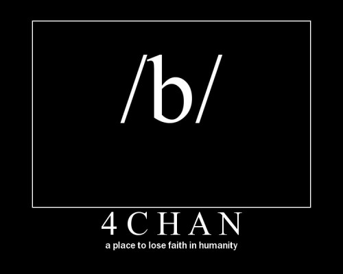
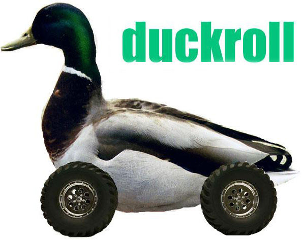

import Margin from 'gatsby-theme-signalwerk/src/components/Margin';
import Grid from 'gatsby-theme-signalwerk/src/components/Grid';
import Column from 'gatsby-theme-signalwerk/src/components/Column';
import Box from 'gatsby-theme-signalwerk/src/components/Box';

## Inhaltsverzeichnis
```toc
exclude:
  - Inhaltsverzeichnis
  - Mentoring durch
  - Vorgelegt von
from-heading: 2
to-heading: 6
```

## Einleitung
In dieser Arbeit beschäftige ich mich mit Gruppendynamiken im Internet und wie Anonymität diese beeinflussen. Ich gehe auf die Grundsätze der Gruppendynamik ein, was eine Gruppe ausmacht und was diese braucht um zu existieren. Danach behandle ich die Rolle der Anonymität im Internet. Anhand von Beispielen des «Trolling» zeige ich auf, wie sich etwas im Web entwickeln, verbreiten und etablieren kann. Ich beginne mit dem «Duckrolling», einer der ersten bekannten und viral gegangenen Trollings, aus welchem sich das «Rickrolling» entwickelte, welches dem Musiker Rick Ashley unerwartet den Titel  «Best Act Ever» an den MTV Europe Music Awards 2008 eingebracht hat. Das negative Gegenstück, der kurze aber heftigen Konflikt der 4chan- und tumblr-Communitys, behandelt die Gruppendynamiken, welche zu tief beleidigenden und diskriminierenden Auseinandersetzungen führen können.

Das Finden von zuverlässigen Quellen bezüglich den Geschehnissen auf 4chan gestaltet sich äusserst schwierig, da die Beiträge auf 4chan nicht archiviert werden, und bisher keine wissenschaftlichen Arbeiten und nur sehr wenige Artikel publiziert wurden. Auch Seiten, welche diese Ereignisse festhalten, können von der 4chan-Community erstellt oder manipuliert worden sein und sind daher nur mit äusserster Vorsicht zu geniessen.

## Einstieg in die Theorie

### Gruppendynamik

#### Definition
Als Gruppendynamik wird das Zusammenarbeiten einzelner Individuen bezeichnet, welche ein gleiches Ziel anstreben. Die Dynamik entsteht durch die Bildung von Hierarchien und Rollen innerhalb der Gruppe. Um ein positives Beeinflussen auf die Gruppe zu gewährleisten, ist eine Unterschiedlichkeit der einzelnen Personen in der Gruppe Voraussetzung. Nur ein Mix verschiedener Kompetenzen und Interessen kann eine Gruppe effektiv zum Ziel führen. Dadurch wird auch eine einseitige Polarisierung vermieden.[^:qv:SDI-Research]

Den Begriff «Gruppendynamik» hat der Psychologe Kurt Lewin 1939 erstmals im Zusammenhang mit der Bildung des Dritten Reiches in Deutschland in verschiedenen seiner Fachartikeln verwendet.

Die Gruppendynamik ergibt sich aber nicht einfach aus der Summe der Mitglieder der Gruppe, da während der Interaktion der einzelnen Individuen untereinander ein Prozess stattfindet. Es werden Rollen verteilt, eine Hierarchie entsteht, es werden Regeln und Umgangsformen entwickelt und die Ziele der Gruppe definiert.[^:qv:Kurt-Levin]

#### Grundsätze der Gruppendynamik
Laut Prof. Dr. Olaf Germanis von der Hochschule für Soziale Arbeit FHNW bildet sich Gruppendynamik aus den folgenden drei Grundsätzen:

1. Der Mensch ist in der Lage, absichtsvoll zu handeln. Er verfügt über prinzipielle Wahlfreiheit. Dazu gehören Entscheidung wie Zustimmung und Ablehnung.

2. Der Mensch ist ein abhängiges und kooperatives Wesen. Er braucht und sucht die Nähe zu anderen Menschen. Er verlangt nach Zugehörigkeit, Nähe und möchte Vertrauen aufbauen.

3. Gruppen verfolgen ein restriktives Gleichgewichtsmodell. Darin ist die individuelle Wahlfreiheit aufgehoben. Das bedeutet, dass alle ihren Platz, ihre erwartbare Rolle bekommen. Und je erwartbarer eine solche Rolle ist, desto weniger ist diese frei gestaltbar, und die Gruppe sorgt dafür, dass diese auch eingehalten werden.

Somit ist die Individualität der einzelnen Person aufgehoben. Das Konstrukt von Gruppen ist demnach widersprüchlich, da eine Gruppe von der Individualität der Personen lebt, diese aber nur in vorgegebener Form zulässt.
Damit Individualität möglich und Entscheidungen zurechenbar werden, muss sich eine Gruppe ausdifferenzieren. Wenn eine Person neu in eine Gruppe kommt, macht diese sichtbar, was die Gruppe von ihr erwarten kann und ihr wird eine Rolle zugeteilt. Dabei werden Normen und Routinen eingeführt. Dadurch wird die Individualität genau genommen verunmöglicht. Das heisst, je genauer die einzelne Person ihre Rolle einnimmt, ihren Aufgaben nachgeht und die Erwartungen erfüllt, desto eingeengter ist sie in ihrer eigenen Individualität.
Doch erst in dieser Form ermöglicht eine Gruppe Individualität: über den Weg der gemeinsamen Entscheidung über die Routinen und Normen. Das heisst, die Rollen der einzelnen Personen können durch Vorschläge und gemeinsame Entscheidungen verändert und erweitert werden. Jedoch ist dies ein dynamischer Prozess der gesamten Gruppe. Wenn eine Person ihre Rolle verändert, werden die restlichen Personen in der Gruppe ebenfalls ihre Rollen verändern und anpassen, um weiterhin das Ziel der Gruppe zu erfüllen. Durch eine kontinuierliche Infragestellung der Standpunkte, Routinen, Normen und Rollenzuteilungen und die Fähigkeit, diese gegebenenfalls immer wieder anpassen zu können, konstruiert eine Gruppe ihre eigene Wirklichkeit. Und das wiederum ermöglicht die individuelle Freiheit der einzelnen Person. Die Ermöglichung von Individualität durch Aufhebung der Individualität.[^:qv:Olaf-Germanis]

### Anonymität

#### Definition
Anonymität wird laut Duden mit «das Nichtbekanntsein, Nichtgenanntsein; Namenlosigkeit» bezeichnet.  

Das Wort «Anonym» kommt aus dem Griechischen:  
*anṓnymos, zu: an- = nicht, un- und ónoma (ónyma) = Name.*[^:qv:Duden-Anoym]  

Das Fehlen folgender Informationen macht aus Identität Anonymität: Der Gesetzliche Name, die Adresse, Alphanumerische Symbole wie Personalausweisnummer, Matrikelnummern für Studenten und Personalkennziffer für Angestellte einer Firma, Pseudonyme welche einem bestimmten Bekanntenkreis bekannt sind, Verhaltensmuster, Soziale Kategorisierung, Zertifikate und Bestätigungen.[^:qv:BSI-Anoymität]  

Die Wertvorstellungen von Anonymität sind weltweit verschieden. In der Schweiz ist die Sensibilität gross, wenn es um Daten von Banken und Sozialleistungen geht, in Frankreich gelten die philosophischen Überzeugungen und die Gewerkschaftszugehörigkeit als besonders schützenswert. In den USA hingegen bezieht sich der Schutz vor Daten eher gegenüber dem Staat und weniger den Konzernen. In Japan wiederum ist das Bewusstsein des Datenschutzes gegenüber dem Staat und kommerziellen Datensammlungen von Konzernen ein sehr neues. Ein Datenschutzgesetz existiert dort erst seit 2003, welches aber viele Unternehmen, Hochschulen und die Presse ausschliesst.[^:qv:Anonym-im-Web]

#### Anonymität im Internet
Im Web treffen alle verschiedenen Kulturen und Wertvorstellungen aufeinander und es ist nicht mehr einfach zu unterscheiden, welches datenschutzrechtliche Gebiet nun zählt.

*«Das Internet eröffnet die Möglichkeit zur anonymen Kommunikation in einem Ausmass, das in der Geschichte der Menschheit bisher unbekannt war»* sagte 1998 der Jurist Professor David Post von der Temple University in Philadelphia.[^:qv:Anonym-DavisPost]  

Die UserInnen können mithilfe von Pseudonymen ihre offensichtliche Identität verschleiern. Jedoch ist das nur auf den ersten Blick anonym. Beim Browsen hinterlassen alle NutzerInnen Spuren im Internet durch benutzte Dienste und besuchte Webseiten. Anhand der IP-Adresse kann identifiziert werden, welcher Rechner wann und wo benutzt wird, und so kann ein Verhaltensmuster erstellt werden, welches auf die Persönlichkeit schliessen lässt. Durch den Einsatz eines Tor-Browsers kann anonymes Surfen im Internet ermöglicht werden.[^:qv:Anonym-Tor]

Mark Zuckerberg, auf den Datenschutz von Facebook angesprochen, meinte 2010:
*«Die Menschen fühlen sich wohl dabei, Informationen über sich offen an viele Menschen weiterzugeben»*[^:qv:Anonym-im-Web]

### 4chan und Trolling

#### 4chan
4chan.org ist ein am 1. Oktober 2003 von Christopher Poole gegründetes Imageboard. «4chan is a forum. It's an image board, so it's just kind of a forum that the primary focus is the posting of images.» beschreibt Christopher Poole die Seite 4chan dem Richter Thomas W. Phillips am  22. April 2010. 4chan ist für alle BenutzerInnen kostenlos und ohne Anmeldung zugänglich und alle können auf einem der Boards einen neuen Thread erfassen, solange auch ein Bild hochgeladen wird. Antworten auf einen Post müssen kein Bild mehr beinhalten und können aus reinem Text bestehen.
Das Posten von Bildern und Kommentaren geschieht ohne Anmeldung, ist kostenlos und Anonym. Nur die Administratoren haben Einblick auf die IP-Adresse des/der VerfasserIn. Alle Posts werden unter dem Pseudonym «Anonymous» veröffentlicht und bekommen eine vom System generierte Nummer, welche als Link auf den jeweiligen Beitrag verwendet werden kann.

Das bekannteste und meistgenutzte Board auf 4chan ist das /b/ Board, auch bezeichnet als das Random-Board. Dieses ist für jedmöglichen Inhalt gedacht solange dieser das US-Amerikanische Recht befolgt und der/die VerfasserIn über 18 Jahre alt ist.
Alle anderen Boards verfügen über weitere Regeln, welche Pornografie (ausgenommen den Boards der Kategorie «Adult») und Rassismus (ausgenommen dem /pol/ «Politically Incorrect» Board) untersagen. Bei Nichtbefolgen dieser Regeln können die Administratoren von 4chan die Beiträge löschen und die IP-Adresse des/der BenutzerIn vorübergehend sperren.[^:qv:4chan-rules] [^:qv:Christopher-Poole] [^:qv:kym-4chan]


*D4chan - a place to lose faith in humanity[^:abb:4chan-meme]*

#### Trolling
Ein Internet-Troll ist eine Person, welche andere BenutzerInnen mittels einer falschen Information oder eines Links, welcher nicht auf die angepriesene Seite führt, versucht zu verwirren oder zu verärgern. Der Name «Troll» kommt nicht von einem Fabelwesen, sondern von einer Art zu Angeln, bei der der Köder hinter einem Boot hergezogen wird, bis etwas anbeisst.[^:qv:Trolling-DavidPorter]  

Das Ziel des Trolls ist es, die Aufmerksamkeit gezielt vom eigentlichen Thema abzulenken und gruppeninterne Konflikte zu erzeugen. Die Ideale einer Community, einen konstruktiven Dialog zu führen, muss oft gegen das Bedürfnis nach Sicherheit und Schutz abgewägt werden, und sind somit besonders anfällige Ziele von Troll-Angriffen.[^:qv:Trolling-SusanHerring]  

Dass Trolling nicht zwingend an Online gebunden ist und Anonymität voraussetzt, zeigt das Beispiel des Klassenzimmers. Der Versuch eines Schülers die Lehrperson oder andere Mitschüler mit einer Frage oder Aussage vom Thema abzubringen, aus dem Konzept zu bringen und zu verwirren kann als Trolling verstanden werden.[^:qv:Trolling-Offline]


Erfolgreiches Trolling setzt die Mithilfe der Community voraus, auch wenn diese unfreiwillig geschieht. Damit eine einfachen Aussage eine Diskussion entfacht, welche nicht selten in Beleidigungen und Rassismus endet, kann auf den Beitrag des Trolls verschieden eingegangen werden: Wird er ignoriert, verliert sich das Interesse des Trolls meist schnell. Auch kann der Post mit *«Don’t feed the trolls»* kommentiert werden, so dass andere BenutzerInnen wissen, dass sie es mit einem Troll zu tun haben.

Die Motivation eines Trolls ist, entgegen der Definition auf Wikipedia, oft nicht die verbreitung von Verachtung und Hass. Er unterscheidet sich von Personen, welche einzelne Opfer gezielt in die Verzweiflung treiben wollen. Vielmehr sieht er sich selbst provoziert und stösst mit einer offensiven Aktion eine Gruppendynamik an, welche sich durch die aktive Teilnahme anderer Personen verselbstständigt, und dann nicht selten vom eigentlichen Thema wegkommt.[^:qv:Trolling-dontfeed]

Die Broken Window Theory von James Q. Wilson und George L. Kelling:
Wenn eine Fensterscheibe eingeschlagen wurde, sollte diese schnellstmöglich repariert werden, um weitere zerbrochene Scheiben zu vermeiden. Diese Theorie ist auch auf Internet-Trolls anwendbar. Je mehr Trolling auf einer Plattform betrieben wird, desto mehr Trolle zieht diese an.[^:qv:Trolling-window]

## Fallbeispiele
Die Internet-Community versucht immer wieder, mit verschiedensten Aktion ein existierendes System zu manipulieren, ins lächerliche zu ziehen und somit deren Ernsthaftigkeit und glaubwürdigkeit in Frage zu stellen.

### Duckrolling
Um ca. 2005 (das genaue Datum kann nicht ermittelt werden) installierte der 4chan-Gründer Christopher Poole alias «m00t» ein Skript auf 4chan, welches das geschriebene Wort «egg» in «duck» umwandelte. Somit wurde auch aus dem Wort «eggroll» das Wort «duckroll». Die darüber amüsierte 4chan Community griff diesen Begriff auf und begann, beliebige Links auf ein Bild zu führen, welches eine Ente mit Rädern zeigt. Die User des /b/ Boards auf 4chan eröffneten Threads mit dem Bild der rollenden Ente und posteten in andere Boards, zum Beispiel dem /v/ Board (Video Games), Links welche zu Game-relevanten Threads führen sollten. Diese endeten aber auf dem Duckroll-Thread.[^:qv:Duckroll-kym] [^:qv:Duckroll-lurkmore]


*Duckroll[^:abb:4chan-duckroll]*

#### Rickrolling
Rickrolling ist ein Lockvogelstreich, bei dem ein Hyperlink gepostet wird, der angeblich für das Thema einer Online-Diskussion relevant sein soll, den Betrachter aber auf das Musikvideo von «Never Gonna Give You Up», einer Dance-Pop-Single des englischen Singer-Songwriters Rick Astley von 1987, weiterleitet.[^:qv:Rickroll-kym]

Den Höhepunkt erreichte der Rickroll-Hype am MTV Europe Music Awards im Jahr 2008. Da durch das rege Rickrolling seit 2007 das Youtube Video des Songs über 20 Millionen Klicks erreicht hatte, gewann der Song eine neue Generation von Fans, welche Rick Ashleys Hit von 1987 mit über 100 Millionen Stimmen zum «Best Act Ever» kürten. «We've been well and truly Rickrolled» sagte dazu der Senior Vizepräsident und Executive Producer der Awards, Richard Godfrey. «I am honoured that my fans worked so hard to help me win Best Act Ever at the 2008 MTV Europe Music Awards (...) This is the first time I have been nominated for the EMAs and I would like to thank everyone who voted for me.» bedankte sich Rick Ashley, welcher selber der Preisverleihung aber fern blieb.[^:qv:Rickroll-telegraph]  

Die grosse und begeisterungsfähige Masse der 4chan-Community ermöglichte damit einen Hype, der weit über die Grenzen von 4chan reichte und einen Grossteil des Internets infiltrierte.


<Box ratio="16:9">

<iframe width="560" height="315" src="https://www.youtube.com/embed/dQw4w9WgXcQ" frameborder="0" allow="accelerometer; autoplay; encrypted-media; gyroscope; picture-in-picture" allowfullscreen></iframe>


</Box>  

*Das oft verlinkte Video von Rick Ashley[^:abb:RickAshley]*

### 4chan/tumblr Raid
Dass eben diese leicht zu begeisternde Masse an UserInnen auch genutzt werden kann, um Schaden anzurichten, zeigt folgendes Beispiel:  
Am 9. Juni 2014 wurde auf dem tumblr Blog “shutdown4chan” ein Aufruf mit dem Plan veröffentlicht, das /b/ Board von 4chan.org mit Rügen über deren Lügen zu überhäufen, so dass diese merken, wie die Welt wirklich über sie denke.

*«It’s time to shutdown 4chan.org  
Join us on July 4th to celebrate our freedom and independence from racists by shutting down 4chan.  
We will go to their site and as a form of protest we will overwhelm them with corrections to their awful lies and let them really know what the world thinks of them.  
TW: I don’t think it’s really safe to go alone. The misogyny, transphobia, homophobia, anti-semitism, rape jokes and blatant racism will often be too much for any sane person.  
Please spread the message and don’t be afraid to get involved!  
Comics, stories, poetry, essays or pictures are all welcome! Every little helps!  
See you on July 4th  
#ShutDown4chan»*[^:qv:shutdown4chan]

Am 4. Juli 2014 erschienen auf 4chan mehrere Posts, welche die Nutzer von 4chan als rücksichtslos und ungerecht beschuldigten. Daraufhin erschienen auf tumblr unter den Hashtags #ableism, #feminism, #fatacceptance, #peace und Weiteren, viele pornografische und rassistische Schockbilder, gepostet von Fake-Profilen aus der 4chan-Community. Um die Lage wieder unter Kontrolle zu bringen, posteten Benutzer der tumblr-Community niedliche Bilder wie Katzenbabys unter dieselben Hashtags. Jedoch war der Schaden schon angerichtet und die Hashtags waren für ihren eigentlichen Zweck, für Akzeptanz einzustehen, bereits entfremdet.  

Die Gerüchte über daraus folgende Suizidversuche können nicht bestätigt werden, und es ist bis jetzt nicht klar, ob der Blog «shutdown4chan» nicht doch von der 4chan-Community initiiert wurde, um den Konflikt anzustossen.[^:qv:4chan-tumblr-war]  

Dennoch war es ein Konflikt, in dem zwei in sich funktionierende Gruppen aufeinander stiessen, und sich somit gegenseitig aus dem Gleichgewicht brachten.


## Diskussion
Um das Problem des Trollings in den Griff zu bekommen, führte Südkorea im Jahr 2007 eine Klarnamenspflicht für das Verfassen von Beiträgen und Kommentaren auf Webseiten mit mehr als 100’000 Besuchern pro Jahr ein. Die UserInnen mussten sich mit ihrer Identitätsnummer oder einer Kreditkarte registrieren um zu Posten. Der Staat erhoffte sich dadurch, eine hohe Hemmschwelle für Hasskommentare und Trollings gesetzt zu haben. Tatsächlich wurden diese Seiten aber sehr schnell zum Ziel von Hackern, welche nach den persönlichen Daten der BenutzerInnen trachteten. Hinzu kam, dass der Anteil von Hass- und Trollkommentaren von 13.9% um nur 0.9% auf 13% sank. Dass der Unterschied so klein ausgefallen ist, liegt aber auch an der Tatsache, dass viele der Kommentare von ausserhalb der südkoreanischen Grenzen kamen, und das Gesetz nur in Südkorea selbst umgesetzt wurde. 2012 hob Südkorea das Gesetz aufgrund der fehlenden Datensicherheit und des ausbleibenden Erfolges wieder auf.[^:qv:korea]  

Nicola Döring behandelt in ihrer Arbeit «Belohnungen und Bestrafungen im Netz: Verhaltenskontrolle in Chat-Foren» den Umgang mit der Anonymität in Chat-Foren. Die Arbeit zusammenfassend kann gesagt werden, dass die Anonymität nicht zwingend zu Hasskommentaren führt, sonder sich sehr häufig selbst regulieren kann. Durch das Aufstellen und Durchsetzen von Regeln und Umgangsformen, bis hin zur Ablehnung diskriminierender und anstössiger Benutzernamen, kann eine durchaus ernste und liebliche Kommunikation stattfinden.[^:qv:Umgang]


## Fazit
Der Mensch braucht das Gefühl von Zugehörigkeit und die Möglichkeit, sich austauschen zu können, und Gruppen, ob online oder offline, bieten diese Mittel. Die Dynamiken, wie diese zustande kommen und sich entwickeln, liegt an den Individuen, welche die Gruppe ausmachen.
Die Anonymität hat demnach nur einen marginalen Einfluss auf die Gruppendynamiken im Internet. Der wichtigere Teil besteht im Umgang mit der Anonymität und derer Nebenwirkungen wie Trolle und Hasskommentare. Das Aufstellen von Regeln und Umgangsformen und derer Durchsetzung können einer Gruppe die nötige Sicherheit geben um ihr Ziel zu verfolgen. Abgesehen von der schieren technischen Unmachbarkeit wäre eine Auflösung der Anonymität ein enormer Rückschritt in der Entwicklung des Internets und eine Zensur von Menschen, welche aufgrund eingeschränkter Meinungsfreiheit, Bedrohungen und Verfolgungen gerade durch die Anonymität eine Stimme haben.    


## Quellenverzeichnis

[^:qv:SDI-Research]: SDI Research: [_Gruppendynamik_](https://www.sdi-research.at/lexikon/gruppendynamik.html), Abgerufen am 04. Januar 2020.

[^:qv:Kurt-Levin]: Kurt Levin: [_Gruppendynamik_](http://www.kurt-lewin.de/gruppendynamik.shtml), Abgerufen am 03. Januar 2020.

[^:qv:Olaf-Germanis]: Hochschule für Soziale Arbeit FHN: [_Das Prinzip Gruppendynamik_](https://www.youtube.com/watch?v=iM3A5jkDcbQ), Abgerufen am 03. Januar 2020.

[^:qv:BSI-Anoymität]: BSI Deutschland: [_Was ist Anonymität?_](https://www.bsi.bund.de/DE/Publikationen/Studien/Anonym/wasistanonymitaet.html), Abgerufen am 03. Januar 2020.

[^:qv:Duden-Anoym]: Duden: [_anonym_](https://www.duden.de/rechtschreibung/anonym), Abgerufen am 03. Januar 2020.

[^:qv:Duden-Anoym]: Duden: [_anonym_](https://www.duden.de/rechtschreibung/anonym), Abgerufen am 03. Januar 2020.

[^:qv:Anonym-im-Web]: Thomas Hoeren: [_Anonym im Web – Grundfragen und aktuelle Entwicklungen_](https://www.jstor.org/stable/23430006), Zeitschrift für Rechtspolitik, 43. Jahrg., H. 8 (25. November 2010) Seiten 251-252, Verlag C.H.Beck

[^:qv:4chan-rules]: 4chan: [_Rules_](http://4chan.org/rules), Abgerufen am 03. Januar 2020.

[^:qv:kym-4chan]: Know your meme: [_4chan_](https://knowyourmeme.com/memes/sites/4chan), Abgerufen am 03. Januar 2020.

[^:qv:Christopher-Poole]: Direct examination: [_Transcript of Chris Poole before the Honorable_](https://de.scribd.com/doc/35688046/Christopher-Moot-Poole-Testimony-in-Palin-Email-Trial#download), Thomas W. Phillips on April 22, 2010.

[^:qv:Trolling-DavidPorter]: David Porter: [_Internet Culture_](https://books.google.ch/books?id=zmMLSZJPXoIC&lpg=PR9&ots=3fKPLCdPp1&dq=troll+internet&lr=&pg=PA40&redir_esc=y#v=onepage&q&f=true), Routledge, London 1997, ISBN 0-415-91683-6, S. 40.

[^:qv:Trolling-SusanHerring]: Searching for Safety Online: [_Managing "Trolling" in a Feminist Forum_](https://www.tandfonline.com/doi/abs/10.1080/01972240290108186), Abgerufen am 03. Januar 2020.

[^:qv:Trolling-Offline]: Schule Social Media: [_Warum die Schule Trolle braucht_](https://schulesocialmedia.com/2012/10/26/warum-die-schule-trolle-braucht-mein-vortrag-auf-der-trollcon/), Abgerufen am 03. Januar 2020.

[^:qv:Trolling-dontfeed]: Spielgel Netzwelt: [_Igelbabys gegen Trolle_](https://www.spiegel.de/netzwelt/web/s-p-o-n-die-mensch-maschine-igelbabys-gegen-trolle-a-795324.html), Abgerufen am 03. Januar 2020.

[^:qv:Trolling-window]: Manhattan Institute: [_Broken window_](https://media4.manhattan-institute.org/pdf/_atlantic_monthly-broken_windows.pdf), by James Q. Wilson and George L. Kelling.

[^:qv:Duckroll-kym]: Know your meme: [_Duckroll_](https://knowyourmeme.com/memes/duckroll), Abgerufen am 03. Januar 2020.

[^:qv:Duckroll-lurkmore]: Lurkmore: [_Duckroll_](https://www.lurkmore.com/view/Duckroll), Abgerufen am 03. Januar 2020.

[^:qv:Rickroll-kym]: Know your meme: [_Rickroll_](https://knowyourmeme.com/memes/rickroll), Abgerufen am 03. Januar 2020.

[^:qv:Rickroll-telegraph]: The Telegraph: [_Rickrolling MTV Europe Music Awards_](https://www.telegraph.co.uk/news/celebritynews/3395589/Rickrolling-Rick-Astley-named-Best-Act-Ever-at-the-MTV-Europe-Music-Awards.html), Abgerufen am 03. Januar 2020.

[^:qv:shutdown4chan]: tumblr: [_Shutdown 4chan_](https://shutdown4chan.tumblr.com/post/88296900118/its-time-to-shutdown-4chanorg-join-us-on-july), Abgerufen am 03. Januar 2020.

[^:qv:4chan-tumblr-war]: Encyclopedia Dramatica: [_Indipendence Day Invasion_](https://encyclopediadramatica.rs/Independence_Day_Invasion), Abgerufen am 03. Januar 2020.

[^:qv:korea]: The Mary Sue: [_South Korean Real Name Policy Proved Ineffective_](https://www.themarysue.com/korea-name-policy/), Abgerufen am 03. Januar 2020.

[^:qv:Umgang]: Nicola Döring: [_Belohnungen und Bestrafungen im Netz: Verhaltenskontrolle in Chat-Foren_](https://link.springer.com/article/10.1007%2Fs11612-001-0014-y), Abgerufen am 03. Januar 2020.

[^:qv:Anonym-DavisPost]: Deutschlandfunk: [_US-Forscher untersuchen die Anonymität im Internet_](https://www.deutschlandfunk.de/us-forscher-untersuchen-die-anonymitaet-im-internet.684.de.html?dram:article_id=40199), Abgerufen am 03. Januar 2020.

[^:qv:Anonym-Tor]: PC WELT: [_Anonymisierungs-Programm: Tor-Browser_](https://www.pcwelt.de/downloads/Anonymisierungs-Programm-Tor-562093.html), Abgerufen am 03. Januar 2020.


```references
group-include: qv

inline-link-prefix: 'Qu.&#x202F;'

reference-link-prefix: '↑ Qu. '
reference-link-suffix: ''

reference-text-suffix: ' – '
```

## Abbildungsverzeichnis

[^:abb:RickAshley]: YouTube: [_Rick Ashley: Never Gonna Give You Up_](https://www.youtube.com/watch?v=dQw4w9WgXcQ)

[^:abb:4chan-meme]: Know your meme: [_4chan_](https://knowyourmeme.com/memes/sites/4chan)

[^:abb:4chan-duckroll]: Know your meme: [_Duckroll_](https://knowyourmeme.com/memes/duckroll)


```references
group-include: abb

inline-link-prefix: 'Abb.&#x202F;'

reference-link-prefix: '↑ Abb. '
reference-link-suffix: ''

reference-text-suffix: ' – '
```

<Grid>

---

<Column start="1" end="5">

#### Mentoring durch
Vorname Nachname <br/>
HFIAD 2017 <br/>
Schule für Gestaltung Zürich <br/>
[name@xyz.ch](mailto:name@xyz.ch)

</Column>

<Column start="5" end="13">

#### Vorgelegt von
Marius Becker <br/>
Wohllebgasse 11 <br/>
8001 Zürich <br/>
[becker.m@hotmail.com](becker.m@hotmail.com)
</Column>

</Grid>
