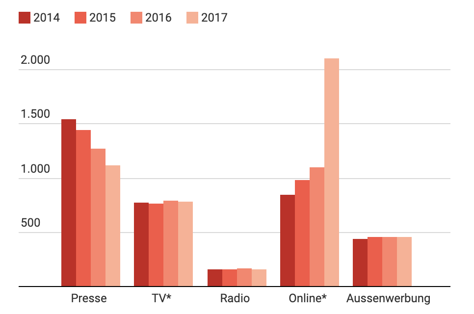
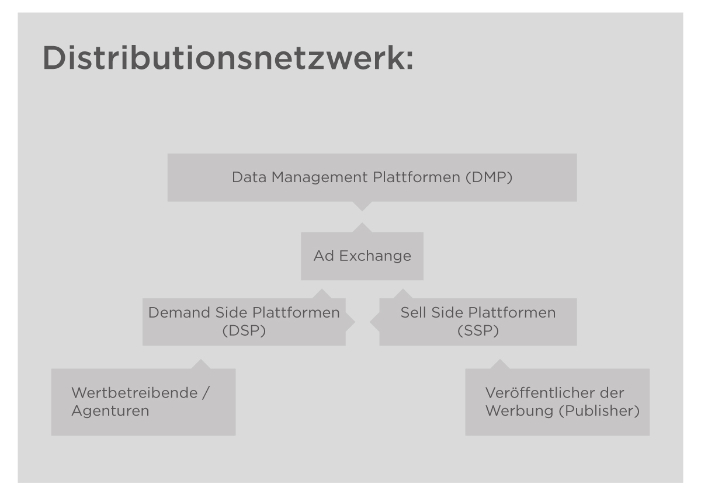

import Margin from 'gatsby-theme-signalwerk/src/components/Margin';
import Grid from 'gatsby-theme-signalwerk/src/components/Grid';
import Column from 'gatsby-theme-signalwerk/src/components/Column';
import Box from 'gatsby-theme-signalwerk/src/components/Box';

## 1. Fragestellung, Zielsetzung & Abgrenzung
Diese Arbeit beschäftigt sich mit dem dem Einfluss der Digitalisierung auf die Online-Werbung. Es wird beschrieben, mit welcher Mechanik Online-Werbung personalisiert wird und weshalb die Personalisierung der Werbung so effektiv ist. In diesem  Zusammenhang soll der Leserin und dem  Leser einen Einblick geben, wie Benutzer- und Nutzungsdaten gesammelt werden und wie die daraus resultierende Daten-Auswertung einen Einfluss auf die Werbung nimmt. Weiter wird bearbeitet, wie Marketingfachleute ihre Zielgruppen ansprechen können, um diesen die relevanteste Werbung zu zeigen. Dabei geht in dieser Arbeit nicht um die Tiefe der psychologischen Auswertungen der Daten.
In der Arbeit wird ebenfalls ein Einblick gewährt, welchen Einfluss die personalisierte Werbung auf das Konsumverhalten haben kann. In diesem Zusammenhang wird anhand eines aktuellen Beispiels aus der Politik erklärt, wie eine konkrete Anwendung der Online-Werbung funktioniert und wie die Gesellschaft darauf reagierte. Zudem soll das Potential der Personalisierung der Online-Werbung anhand des Beispiels aufgezeigt werden.
Zum Schluss der Arbeit sollen auch die Chancen, Risiken und Gefahren der personalisierten Online-Werbung diskutiert und aufgezeigt werden.

## Inhaltsverzeichnis
```toc
exclude:
  - Inhaltsverzeichnis
  - Mentoring durch
  - Vorgelegt von
from-heading: 2
to-heading: 3
```


## 2. Grundlagen der personalisierten Online-Werbung

### 2.1 Einführung
In der Schweiz hat die Online-Werbung die klassische Print-, TV- und Radiowerbung deutlich überholt [^quote-one]. Dies liegt vor allem daran, dass mit klassischer Werbung ein zu breites Publikum angesprochen und die eigentliche Zielgruppe konnte viel schwieriger erreicht werden. Dies hat zur Folge dass ein Streuverlust generiert wurde. Das Phänomen des nicht erreichen seines Zielpublikum wird in der Werbebranche auch Streuverlust genannt. Das Ziel der Werbenden ist es, diesen Streuverlust möglichst gering zu halten und die Werbung möglichst denjenigen Personen zu präsentieren, welche als Zielgruppen des beworbenen Produkts oder Dienstleistung definiert wurden. Heute kann mit Hilfe von moderner Technik und Psychologie der Streuverlust praktisch eliminiert werden.
Anders als bei der klassischen Werbung, welche sich auf den Durchschnitt einer Zielgruppe bezieht, spricht die personalisierte Werbung Personen direkt an, ohne dabei an Glaubwürdigkeit zu verlieren, da in der Regel die Hintergründe über die Entstehung der personalisierten Werbung den Konsumierenden nicht bewusst sind. Die personalisierte Werbung ist so höchst effektiv, weil sie durch ihre individuelle Ansprache des Betrachtenden Bedürfnisse und emotionale Reaktionen sehr präzise auslösen kann. Personalisierte Werbung kann in unterschiedlichen Formen erscheinen. Die heutzutage bekanntesten Varianten sind: Display-Werbungen wie Banner oder Videos auf Webseiten und Suchmaschinen-Werbung, welche Suchergebnisse in der Suchergebnis-Liste weiter oben darstellt. 


*Abb. 1: Online Werbung in der Schweiz im Vergleich mit Klassischer Werbung von [persoenlich.com](https://www.persoenlich.com/kategorie-werbung/online-ist-das-grosste-kuchenstuck)[^:fig:one]*


### 2.2 Bedeutung von Big Data für die personalisierte Werbung
Jede unserer Bewegung im Internet hinterlässt eine Daten-Spur. Diese Daten beinhalten grundlegende Informationen wie zum Beispiel, Verweildauer auf der Webseite, Gerät bis hin zu persönlichen Angaben wie unser Alter und Geschlecht[^quote-two]. Diese Informationen existieren, weil sie von uns selbst erfasst oder generiert wurden – meistens nicht nur auf einem Gerät. Bei dem Erstellen von Accounts und Profilen für Services geben wir unsere persönlichen Daten preis. Meistens erlauben wir den Anbietern, diese Daten durch das Akzeptieren der Allgemeinen Geschäftsbedingungen (AGB) zu verwenden. Durch das einfache Akzeptieren von sogenannten «Cookies» auf Webseite, erlauben wir den Webseitenbetreibern diese Daten zu sammeln und auszuwerten. Die Webseite merkt sich, wie viel Zeit wir auf welcher Seite verbracht haben, welche Links wir angeklickt und welche Interaktionen wir ausgelöst haben. Diese Informationen werden mit Hilfe von diversen Trackingmethoden ausgelesen, gesammelt und ausgewertet. Die Summe sämtlicher damit gesammelten Daten werden «Big Data» genannt.

Die bereits erwähnten Cookies gehören zu den am häufigsten verwendeten Trackingmethoden. First-Party-Cookies dienen zum Beispiel dazu, Einstellungen von Usern für Webseiten zu speichern oder um zu speichern, was von dem User in den Warenkorb gelegt wurde[^quote-two]. Ein First-Party Cookie ist an eine Domain gebunden und kann nur von dieser ausgelesen werden[^quote-four]. Ein Beispiel dazu: Beim Besuch einer Website stellt der User die  Sprachpräferenz «Deutsch» ein. Diese Einstellung wird auf dem Browser des Users in einem First-Party-Cookie gespeichert. Nach mehreren Wochen besucht der User die Webseite erneut, aufgrund der gespeicherten informationen in dem Cookie weiss die Webseite, dass der User beim letzten Mal die Sprache auf Deutsch eingestellt hat, so wird die Webseite also direkt wieder auf Deutsch angezeigt. In vielen Fällen sind First-Party-Cookies essentiell für eine einwandfreie Funktionsweise der Webseite.

Anhand von Drittanbieter-Cookies oder auch «Third-Party-Cookies» genannt, können Browseraktivitäten Webseiten übergreifend verfolgt werden[^quote-two]. Diese Verfolgung ist möglich, weil auf einigen Webseiten bis zu mehreren Hundert Cookies vorkommen. Eigentlich kann ein Cookie ja nur von einer Seite aufgerufen werden, es sei denn, diese Seite beinhaltet eingebettete Technologien einer anderen Seite und somit auch deren Cookies. Als Beispiel: Wenn ein Nachrichtenportal unterhalb eines Beitrags einen «Gefällt mir»-Button von Facebook einsetzt, so hat Facebook die Möglichkeit zu sehen, auf welcher Webseite sich der User gerade befindet[^quote-four]. Für Facebook ist das auf jeder Webseite möglich, welche eine dieser bestimmten Technologien von Facebook verwendet. Diese Methode wird bereits schon einige Jahre so eingesetzt und Facebook dient hier nur als Beispiel. Die Drittanbieter-Cookies sind datenschutztechnisch umstritten. Ein Selbstversuch von Geoffrey A. Fowler, Reporter bei der Washington Post, ergab, dass er innerhalb einer Woche ungefilterten Surfens im Internet mit dem Google Chrome Browser insgesamt 11’189 Cookies ausgesetzt war[^quote-seven]. 

Weiter gibt es noch die sogenannte Super Cookies. Anders als bei den Third-Party-Cookies werden Super Cookies nicht auf dem Browser des Users gespeichert sondern direkt im HTTP-Header einer Webseite und werden dort von dem Internet Service Provider (ISP) implementiert. Super Cookies dienen aber genau so wie die Third-Party-Cookies zum Tracking und Sammeln von Informationen zum Surfverhalten der User[^quote-five]. Super Cookies ermöglichen, dass gesammelten Daten an Dritte weiter gesendet werden. In den meisten Fällen wissen Benutzer und Benutzerinnen nicht, dass sie von Super Cookies getrackt werden. Zudem können Super Cookies nicht einfach auf dem Browser gelöscht werden, sie müssen beim ISP direkt abgewählt werden. Super Cookies sind jedoch auf eine HTTP Verbindung angewiesen und können nicht über HTTPS verschlüsselte Webseiten implementiert werden. Alternativ kann auch ein VPN Service benutzt werden, welcher die Internetverbindung verschlüsselt und es so dem Internet Service Provider unmöglich macht, ein Super Cookie zu implementieren[^quote-six].

Cookies sind nur eine Art des Trackings. Weitere Tracking-Methoden sind: IP-Adresse, HTTP Referrer, User Agent oder Browser Fingerprinting[^quote-two]. In den meisten Fällen werden diverse Methoden zum Tracking kombiniert eingesetzt. Durch die Kombination von verschiedenen Trackingmethoden können die Daten auf Grund ihrer Individualität, geräteübergreifend auf eine Person zurückgeführt werden[^quote-two]. Tausende von Firmen sind im Gebiet der Datensammlung und -auswertung tätig, einige der spezialisierten Firmen verfügen über Datensätze von bis zu einer Milliarde Personen, wobei auf einzelne Personen mehrere Tausend Datenpunkte zurückzuführen sind _Wie Digitalisierung den Konsum verändert, 2019, s.36_[^quote-three].


### 2.3 Platzierung der Werbung
Die Ad-Exchange-Anbieter stehen zwischen dem Veröffentlicher der Werbung, den sogenannten «Publishern» und den werbetreibenden Firmen, respektive deren vertretenden Agenturen. Für den Werbetreibenden gibt es Demand-Side-Plattformen (DSP), welche zur Unterstützung zum Finden der passenden Werbeplätze dienen. Die Werbeplätze werden von den Publishern zur Verfügung gestellt und von sogenannten Sell-Side-Plattformen (SSP) verkauft. Anbieter von Demand-Side-Plattformen und Sell-Side-Plattformen betreiben sogenannte Data-Management-Plattformen (DMP)[^quote-fifteen], Deren Hauptaufgaben besteht darin, Cookie IDs sowie verschiedene Datensätze miteinander zu verknüpfen und in Zielgruppen aufzuteilen, um damit eine Basis für das Targeting zur Verfügung zu stellen[^quote-eight]. Die Unterteilung zwischen den jeweiligen Anbietern wird immer unklarer. DMP können zudem zur Messung und Auswertung von Kampagnen genutzt werden[^quote-eight]. Aufgrund dieser Auswertungen der DMP können laufende Kampagnen dynamisch angepasst werden. Datengetriebenes und intelligentes Retargeting sind Stichpunkte aus dem sogenannten Programmatic Marketing, welches für dynamisches, automatisiertes und datengetriebenes Marketing mithilfe von Algorithmen steht[^quote-seventeen].
Zusätzlich zur Auswertung der Daten werden die Daten anhand von Modellen aus der Psychologie interpretiert, wie zum Beispiel das Big-Five-Modell, auch bekannt als das OCEAN Modell. Mit diesem Modell werden verschiedene Persönlichkeitsprofile erstellt. Das Ergebnis einer Auswertung der Daten ist in der Regel eine Filterung, womit Werbetreibende die Zielgruppe für die entsprechende Werbung auswählen können. So wird beispielsweise bei Facebook eine Filterung von bis zu 100 Parametern ausgegeben.

*Abb. 1: Online Webung Distributionsnetzwerk, eigene Abbildung basierend auf: [Guide to Digital Display Advertising](https://www.youtube.com/watch?v=efHVOWcNJZo)[^:fig:two]*

### 2.4 Targeting der Werbung
Werbetreibende können diverse Werbungen in verschiedenen Varianten aufbereiten, um die Zielgruppe jeweils spezifischer anzusprechen. Mithilfe des Targetings kann die richtige Werbung der entsprechenden Zielgruppe ausgeliefert werden und wird zudem dynamisch bei diversen Publishern veröffentlicht. Werbetreibende können bestimmen, wo, wie oft und wie lange die Zielgruppe die Werbung sehen soll, so dass möglichst kein Streuverlust entsteht. Die Werbetreibenden können anhand diverser «Targeting-Methoden» ihre Zielgruppen eingrenzen. 

Zu den Targeting Methoden gehören:

* Geo Targeting: Mit Hilfe von GeoTargeting kann die Zielgruppe nach Standort eingegrenzt werden. Der Standort der Zielgruppe kann über diverse technische Möglichkeiten ziemlich genau ermittelt werden[^quote-nine]. 


* Technisches Targeting: User können nach Betriebssystem, Browser, Gerät, Internetgeschwindigkeit und Internetanbieter gefiltert werden[^quote-nine]. 


* Content Targeting: Mittels Content Targeting kann Werbung spezifisch auf einigen Seiten platziert werden (Whitelisting) und auf anderen Seiten wird sie bewusst nicht platziert (Blacklisting). Es kann auch so definiert werden, dass die Werbung nicht auf Seiten mit sensitiven Inhalten angezeigt wird. Dafür kann mit Kontext-Targeting, welches anhand von Algorithmen und Keywords erkennt, worum es auf der Publisher-Seite geht, die Werbung im richtigen Kontext publiziert wird, um so noch grössere Wirkung der Werbung zu erreichen[^quote-nine].


* Nutzerzentriertes Targeting: Darunter fällt das Demographie Targeting nach Alter und Geschlecht oder auch das Targeting nach bestimmten Eigenschaften der User, welche entweder direkt von diesen gesammelt oder gekauft werden. Einige Anbieter stellen Targeting-Listen zur Verfügung, in welchen User nach Interessen kategorisiert sind[^quote-nine].


* Behavioral Targeting oder «Audience» wie es Google nennt, lassen sich zum Beispiel anhand bestehender Besucher einer Webseite oder anhand eines bereits eingestellten Targetings Zielgruppen mit ähnlichen Interessen oder Verhaltensmuster ermitteln, welche dann im Targeting zur Zielgruppe hinzugefügt werden können[^quote-ten].


### 2.5 Auktion & Kosten
Bemühen sich mehrere Werbetreibende um eine ähnliche Zielgruppe, dann wird anhand einer komplexen Auktion - auch «Real Time Bidding» genannt - entschieden, welche Werbung ausgeliefert wird. In der Auktion spielen diverse Faktoren eine Rolle. Google gibt zum Beispiel nicht bekannt, wie genau entschieden wird, wer die Auktion gewinnt. Bei Google können die Werbetreibenden ein Tagesbudgets festlegen. Anhand dessen und des Targetings wird geschätzt, wie viele Impressionen und Klicks die Werbung generieren könnte. Zudem kann anhand dieser Schätzung multipliziert mit einer Klickrate, der «Click-through Rate» (CTR), der «Costs per Click» (CPC) berechnet werden. Die CPC steht für den Preis eines Klicks auf die geschaltete Werbeanzeige. Ebenfalls kann bei einigen Anbietern für die Anzahl Klicks in «Cost per Mille» ( Kosten per Tausend, CPM) oder für Anzahl Impressionen und Sichtbarkeit bezahlt werden[^quote-sixteen].

### 2.6 Optimierungen und Auswertungen
Mit dem Start einer Kampagne wird auch gleichzeitig begonnen, die Erfolge der Kampagne zu messen und auf verschiedene Versionen zu testen. Die daraus resultierenden Daten werden ausgewertet und führen wiederum zu Erkenntnissen, welche in den Optimierungsprozess einfliessen. So kann während einer laufenden Kampagne dynamisch das Targeting, die Inhalte und deren Kombinationen angepasst werden.

Um die Erfolge einer personalisierten Kampagne zu messen, gibt es diverse Möglichkeiten:

Google bietet beispielsweise die [«Google Marketing Platform»](https://marketingplatform.google.com/intl/de/about/analytics/) an. Auf dieser Plattform haben Werbetreibende die Möglichkeit, verschiedene Marketing-Angebote von Google miteinander zu verknüpfen. So kann zum Beispiel das Tool zur Analyse von Webseiten [«Google Analytics»](https://accounts.google.com/signin/v2/identifier?service=analytics&passive=1209600&continue=https%3A%2F%2Fanalytics.google.com%2Fanalytics%2Fweb%2F%23&followup=https%3A%2F%2Fanalytics.google.com%2Fanalytics%2Fweb%2F&flowName=GlifWebSignIn&flowEntry=ServiceLogin) mit [«Google Ads»](https://ads.google.com/intl/de_ch/home/), dem Google Angebot zum Schalten von Werbung, verknüpft werden. Der Mehrwert für den Werbetreibenden mit dieser Verknüpfung ist, dass er aufgrund der Analytics-Daten weiss, wer sich auf der Webseite wie verhält und mit Hilfe von «Google Ads» können Kampagnen erstellt werden, welche die Zielgruppe der entsprechenden Webseite anspricht[^quote-sixteen]. Die Auswertungen können nahezu in Echtzeit auf den jeweiligen Dashboards eingesehen werden.

### 2.7 Einfluss auf das Konsumverhalten
Mit dem zunehmenden Einfluss der personalisierten Werbung verändert sich nicht nur die Konsummenge, sondern auch die Art und Weise wie konsumiert wird. Dabei ist die Gefahr, dass aufgrund des angelegten Persönlichkeitsprofils ähnliche Produkte zum Kauf vorgeschlagen werden. Aufgrund der Positionierung und Sichtbarkeit dieser vorgeschlagenen Produkte werden diese eher gekauft und mit dem getätigten Kauf wird wiederum bestätigt, dass sich der Algorithmus bewahrheitet hat. Aufgrund dessen wird das Persönlichkeitsprofil weiter eingeschränkt, was zur Folge haben kann, dass die Käuferin oder der Käufer zwar weiterhin dynamisch konsumiert, er aber hauptsächlich in einer für ihn personalisierter und eingeschränkter digitaler Blase einkauft _Wie Digitalisierung den Konsum verändert, 2019, s.39_[^quote-three].

Eine zu starke Personalisierung der Werbung könnte Konsumenten auch immun auf nicht personalisierte Werbung machen, da die Konsumierenden eine nicht personalisierte Werbung als irrelevant empfinden würden _Wie Digitalisierung den Konsum verändert, 2019, s.40_[^quote-three]. Werbung, die auf einen «Durchschnittskonsumenten» ausgelegt ist, würde so keine entsprechende emotionale Reaktionen bei den Betrachtenden auslösen.

Personalisierung der Inhalte und Angebote werden von einigen Konsumenten auch als Service oder als eine Dienstleistung wahrgenommen. Der Konsument erwartet bei einem Streaming-Anbieter, dass ihm Vorschläge aufgrund seiner Interessen vorgeschlagen werden, dasselbe erwarten die Konsumierenden bei Rabattwerbungen der Lebensmittelwaren oder beim Onlineshopping von neuen Kleidern _Wie Digitalisierung den Konsum verändert, 2019, s.41_[^quote-three].


### 2.8 Zusammenfassung der Theorie
Nahezu jede unserer Bewegungen im Internet hinterlässt eine Daten-Spur, welche mit Hilfe von diversen Trackingmethoden aufgezeichnet wird. Aufgrund der Individualität der generierten Daten können die gesammelten Daten ausgewertet und geräteübergreifende einer Person zugewiesen werden.

Durch die Analyse der gesammelten Daten haben Unternehmen von klein bis gross die Möglichkeit, ihre Kunden und deren Bedürfnisse besser zu verstehen. Durch den Einfluss dieser Daten lassen sich den entsprechenden Zielkunden spannende und relevante Angebote präsentieren, was zu einer Stärkung der Kundenbindung führt. Zudem erhöhen die Unternehmen mit Hilfe von Marketing-Tools, eine geschickte Positionierung ihrer Sichtbarkeit auf dem Markt und können zudem Ihre Kampagnen dynamisch steuern, testen und entsprechend anpassen. 

Durch das spezifische Ansprechen der Zielgruppen lassen sich auch gezielt Bedürfnisse kreieren. In dieser Hinsicht der personalisierten Werbung stellt sich die ethische Frage: Wo liegt die Grenze zwischen Manipulation und Marketing? 

Die Beantwortung diese Frage wird an dieser Stelle nicht weiter behandelt. Aber – Intransparenz der personalisierten Werbung bringt auch einigen Gefahren für ein Unternehmen mit sich:

* Wenn personalisierte Werbung offensichtlich manipulativ und beeinflussend ist, können Konsumierende auch mit einer Reaktanz reagieren, welche ins Gegenteil des eigentlichen Werbenutzen kippt.


* Unvorsichtiges Targeting kann zu Fehl-Platzierungen der Werbung führen, welche die Unternehmens-Marke schädigen kann.

## 3.0 Fallbeispiel: CVP Wahlkampf 2019
### 3.1 Die Kampagne
Im Wahljahr 2019 setzte die [Christlichdemokratische Volkspartei](https://www.cvp.ch/de) der Schweiz (CVP) hauptsächlich auf ihre digitalen Kanäle und verzichtete auf die herkömmliche schweizweite Plakatkampagne, wie man sie üblicherweise von anderen Parteien kennt. Eine Teil-Kampagne der CVP sorgte ganz besonders für Aufmerksamkeit[^quote-eighteen]. Die CVP kreierte eine Webseite, auf welcher Standpunkte verschiedener Kandidierenden und Parteien verglichen worden sind. Die URL der Webseite [www.kandidaten2019.ch](http://kandidaten2019.ch/), leider nicht mehr verfügbar, gab dabei keinen Hinweis darauf, dass die Seite von der CVP erstellt wurde. Spannend daran ist, wie Besuchenden zu der entsprechender Webseite gelangt sind.
Dafür setzte die CVP eine Technologie der personalisierten Werbung ein, die «Search Engine Advertising» genannt wird, nachfolgend auch als «SEA» bezeichnet. Bei der SEA wird die beworbene Seite gegen Bezahlung in den Suchergebnissen weiter oben, genauer gesagt, noch vor den eigentlichen Suchergebnissen angezeigt. Das Angebot Google Ads ermöglicht einem für eine zu bewerbende Seite ein Targeting vorzunehmen. Das geschieht mittels sogenannter Keywords. Wird nun nach einem dieser Keywords gesucht, werden die vorhandenen Informationen des Suchenden mit den laufenden Google Ads Keyword Kampagnen abgeglichen. Mittels einer Art Auktionsverfahren wird von Google beschlossen, welche Werbungen angezeigt werden sollen. Diese werden dann auf der Seite der Suchresultate weiter oben angezeigt und als Anzeige markiert. Google gibt dabei nicht bekannt, wie genau entschieden wird, welche Werbung für den Suchenden am Relevantesten sein könnte. Bezahlt wird dabei die Anzahl der Klicks, also wie oft jemand von den Anzeigen auf die beworbene Seite kommt. Zum Schutz des Werbenden kann dieser in Google Ads ein Tages- / Monatsbudget einrichten, welches dann nicht überschritten wird.

Die CVP nutzte diese Technologie wie folgt: Wer nach einem Kandidaten oder einer Kandidatin, als Beispiel Damian Müller, bei Google suchte, sah in der Liste der Ergebnisse als obersten Eintrag, die mit «Anzeige» markierte Webseite der CVP mit dem Titel «Wahlen 2019 | Damian Müller | (FDP / Luzern)» . Auf der Webseite selber wurden dann die Positionen der FDP, also die Partei von Damian Müller, mit den Positionen der CVP verglichen. Die CVP legte «Damian Müller» als ein Keyword fest, weshalb diese Webseite von der CVP in den Google Suchresultaten noch über seiner eigenen Webseite erschien.

<Grid>
<Column start="1" end="5"></Column>
<Column start="5" end="9">


*Abb. 2: Matthias Erni auf [Twitter](https://twitter.com/matthias_erni/status/1173838188558848001)[^:fig:three]*

</Column>
<Column start="9" end="13"></Column>
</Grid>  

### 3.2 Reaktionen und Auswirkungen
Die Reaktionen auf diese Kampagne waren überwiegend negativ[^quote-eighteen]. In kurzer Zeit war der Hashtag «#CVPfail» auf Twitter, der in der Schweiz am häufigsten verwendete Hashtag. Parteipräsident Gerhard Pfister verteidigte die Kampagne damit, dass es sich um eine Partei-Vergleichskampagne handle und kein Kandidat oder keine Kandidatin persönlich angegriffen werde[^quote-nineteen]. In den Medien wurde das Vorgehen der CVP als Negativkampagne beschrieben und als unschweizerisch bezeichnet[^quote-nineteen]. Zudem bestanden bei diversen Kandidierenden, welche auf einer dieser Webseiten namentlich erwähnt werden, Listenverbindungen. Die sonst eher CVP-kritische Neue Zürcher Zeitung NZZ beschrieb die Kampagne als harmlos[^quote-eleven] und später sogar als geheime 
Gewinner in den Wahlen 2019[^quote-twelve].

### 3.3 Ausblick der personalisierten Werbung in der Politik
Die CVP war bisher die erste und einzige Partei in der Schweiz, die sich hauptsächlich auf eine digitale Wahlkampf-Kampagne fokussiert hatte. In den kommenden Jahren werden bestimmt noch mehr politische Kampagnen ihren Weg in das Digitale finden. Die von der CVP lancierte Kampagne hätte noch viel Potential gehabt, welches nicht ausgeschöpft wurde. Als Beispiel wäre es möglich gewesen, die Inhalte der erstellten Webseiten spezifischer für diverse Zielgruppen aufzubereiten und dann die Webseiten den entsprechenden Zielgruppen zu präsentieren. Durch die negativen Medienberichte, welche 2016 nach dem Wahlkampf in der USA durch Medien gingen, in welchen es unter anderem um die Beeinflussung der Wähler durch personalisierte Werbung ging, kann es auch sein, dass die CVP absichtlich nicht das vollständige Potential einer digitalen Wahlkampf-Kampagne ausgeschöpft hat, um negative Medienaufmerksamkeit zu vermeiden.

## 4.0 Diskussion
Für die Personalisierung der Werbung spricht, dass man als Konsument oder Konsumentin Inhalte sehen will, die für den Betrachter und die Betrachterin relevant sind. Daher ist der Konsumierende auch der Personalisierung der Werbung im Internet gegenüber nicht grundsätzlich abgeneigt. 
Beängstigend ist jedoch die Tatsache, dass User mittels Targeting so individuell angesprochen und damit Bedürfnisse bei den Konsumierenden generiert werden können. Ebenfalls beachtenswert ist, dass Internet User auf ihrem Weg durch das Netz ständig «verfolgt» werden, um weiterhin möglichst viele Daten zu sammeln, welche wiederum verwendet werden, um die Werbung noch besser zu personalisieren. Um das Tracking zu verhindern oder zumindest zu minimieren, ist es wichtig zu wissen, dass diverse Anbieter von Browsern, Online Services oder Drittanbietern einem Möglichkeiten geben, sich vor personalisierter Werbung und Tracking zu schützen. So kann zum Beispiel im Google Chrome Browser eingestellt werden, dass dieser bei Browserzugriff einer Webseite eine «Do Not Track»-Anforderung mitsendet. Weiter können im Google Chrome Browser unter der URL: chrome://settings/ Drittanbieter-Cookies blockiert werden, was jedoch zur Folge haben kann, dass einige Webseiten nicht mehr richtig funktionieren. 

Zudem muss gesagt sein, dass das Kerngeschäft von Google die Werbung ist und sich Google nicht selber schaden will, deshalb müssen solche Einstellungen nachträglich und individuell eingestellt werden. Andere Browser wie zum Beispiel [Firefox](https://www.mozilla.org/de/firefox/), [Safari](https://support.apple.com/de-ch/safari) oder der [Brave](https://brave.com/?ref=bra217&gclid=CjwKCAiA3uDwBRBFEiwA1VsajFoi0KVzqYmSzJHsx07r12Ml-VgMHp4yYf6goQ37bVDz1bgKRMtZMBoCb-sQAvD_BwE) Browser blockieren standardmässig Tracker. Ergänzend existieren noch Drittanbieter wie [Ghostery](https://www.ghostery.com/de/) und [AdBlock Plus](https://adblockplus.org/de/), mit welchen man Tracker und Werbung unterdrücken kann.

Das Schalten von Display-Werbung via Targeting bringt für Marken auch einige Gefahren mit sich, so könnte zum Beispiel ein Reiseziel, durch falsches Targeting, neben einem Newsbeitrag beworben werden, in welchem das Reiseziel negativ beschrieben wird oder aber die Werbung an einem Ort geschaltet wird, an dem andere sensitive Inhalte publiziert werden.  Weiter ist die Display-Werbung nicht die einzige Form von personalisierter Online-Werbung, auf Social Media können Werbetreibende Werbung in Form von Beiträgen schalten oder in Online-Zeitschriften können Artikel geschrieben werden welche gegen Bezahlung von den Nachrichtenportalen der entsprechenden Zielgruppe aufgeschaltet wird. Mit der Technik des Targeting können verschiedene Inhalte, dynamisch an ein ausgewähltes Zielpublikum präsentiert werden. Dies hat zur Folge dass Konsumierende andauernd und überwiegend für Betrachter und Betrachterinnen personalisierte Inhalte sehen. Dies kann zur Folge haben dass Konsumierenden einige Inhalte nicht mehr sehen würden. Zudem könnte es bei Betrachtenden zu verwirrung führen wenn sie Inhalte mit anderen Konsumierenden vergleichen und diese zwar dasselbe bewerben, diese aber auf Grund der Personalisierung, komplett anders aussehen.

## 5.0 Fazit & Ausblick
### 5.1 Ausblick

Die Wirtschaft hat das Potential der Daten und deren Auswertung für die Personalisierung schon länger erkannt. In einer aktuellen Umfrage von Adobe, von Firmen, welche über $&#x202F;195&nbsp;Millionen Dollar Umsatz im Jahr generieren, sehen fast ein Viertel aller Befragten datengetriebenes Marketing, welches sich auf Individualität fokussiert, als die aufregendste Marketing-Möglichkeit des Jahres 2019[^quote-thirteen]. Für über 55&#x202F;% der Marketer war es im Jahr 2019 höchste Priorität, Daten besser zu nutzen, um eine bessere Zielgruppensegmentierung zu schaffen[^quote-fourteen]. Diese Resultate der Umfrage von Adobe geben einen Ausblick darauf, dass es wohl auch in den nächsten Jahren eines der wichtigsten Themen für viele Firmen bleiben wird.
Durch das vorantreiben der Werbenden Firmen wird sich auch in Zukunft noch einiges weiterentwickeln in der Online-Werbung, Big Data bringt das Potential mit sich noch weitere Inhalte abgesehen von Werbung zu Personalisieren. So können Werbetreibende Firmen zum Beispiel auch Bewertungen auf die Bedürfnisse eines Einkäufer oder einer Einkäuferin personalisieren. Kombiniert mit anderen technischen Verfahren lassen sich bereits auch Videoinhalte auf die Bedürfnisse der Benutzer und Benutzerinnen anpassen. Da diese neuen Formen von personalisierter Werbung eher noch unbekannt sind können diese wegen Ihrer intransparenz ebenfalls sehr manipulativ sein da sich die Konsumierenden der Ursprung der Personalisierung nicht bewusst sind.

Wie es für die Firmen auch in den kommenden Jahren ein Ziel sein wird möglichst viele Daten zu sammeln, werden sich Datenschützer und Datenschützerinnen weiterhin dafür einsetzten den Konsumierenden vor einem Missbrauch seiner Daten zu schützen.

### 5.2 Fazit
Das Ziel der Werbung war es schon immer, einen Einfluss auf die Betrachtenden zu nehmen und sie dadurch in einer gewissen Art zu beeinflussen. Das Prinzip ist also nichts Neues und existiert schon lange in der Werbung. Durch den Einfluss der Digitalisierung auf die Werbung hat sich also vor allem das Medium verändert. Durch Möglichkeiten des Targetings in der Werbung ist es den Werbetreibenden möglich geworden, die Konsumierenden direkter und persönlicher anzusprechen und zu bewerben. Dadurch können die Werbetreibenden bei den Konsumenten mehr emotionale Reaktionen erzeugen und damit Bedürfnisse kreieren und Einfluss auf dessen Kaufverhalten zu nehmen. Oftmals ist es für die Konsumierenden nicht nachvollziehbar, wie es zu der entsprechenden Werbung kam und wird daher oftmals auch nicht weiter hinterfragt. In diesem Fall können Konsumierende von der Werbung ohne deren Wissen manipuliert werden. Meine Meinung zur personalisierten Werbung ist, dass es sich dabei um etwas gefährliches handelt solange die Mehrheit der Menschen sich der Funktionsweise nicht bewusst ist und sich uneingeschränkt der personalisierter Werbung aussetzten. Weiter bin ich der Meinung dass personalisierte Inhalte und Werbung in einer begrenzten Menge konsumiert werden sollte, aus diesem Grund empfehle ich die Verwendung von AdBlockern. Leider können damit noch lange nicht alle Werbeformen unterdrückt werden und nicht alle Werbungen, Inhalte und Beiträge sind klar ersichtlich als Werbung gekennzeichnet, daher betrachte ich es als besonders wichtig dass die Konsumierenden Inhalte und Beiträge auf Social Media kritisch konsumieren. Denn anhand der Targeting Möglichkeiten ist es nicht nur möglich uns eine für uns relevante Werbung zu zeigen, sondern Werbungen die wir überall und immer wieder antreffen sprechen unser Unterbewusstsein an und können Bedürfnisse in uns erwecken. Weiter möchte ich nicht dass jede meiner Bewegungen im Internet aufgezeichnet wird und sich auf mich persönlich zurück verfolgen lässt. Als Massnahme dessen werde ich meinen Standard Browser auf Firefox wechseln und Meldungen wie «Diese Seite verwendet Cookies» nicht länger Akzeptieren soferne das möglich ist. Solange es im Datenschutzgesetz keine massgebende Änderungen gibt, ist es meiner Meinung nach wichtig, dass man sich das Konzept der personalisierten Werbung im Internet bewusst ist und sich aktiv damit befasst, um ein Bewusstsein zu erlangen und dementsprechend eigenverantwortlich zu handeln. Die Werbung soll mit einem gesunden Misstrauen konsumiert werden. Schlussendlich liegt die Entscheidung über einen Kauf oder einer politischen Wahl bei jedem Einzelnen.<!-- references text-->

---

<!--
Vorname Nachname, [Titel der Seite](https://www.google.com/) (Abrufdatum: dd. mm. yyyy).
Vorname Nachname, Buchtitel, Auflage, Verlag, Erscheinungsort Jahr, erste Seite – letzte Seite.
-->
[^quote-one]: persoenlich.com, [persoenlich.ch](https://www.persoenlich.com/kategorie-werbung/online-ist-das-grosste-kuchenstuck) (24.12.2019)
[^quote-two]: Dominic Peisker & Matthias Fehr, 2016, s. 26 - 27, [Online Advertisement](https://eprints.hsr.ch/539/1/Online%20Advertising.pdf)
[^quote-three]: Kahlenborn, Walter; Keppner, Benno; Uhle, Christian; Richter, Stephan; Jetzke, Tobias, Konsum 4.0: Wie Digitalisierung den Konsum verändert, 2019, s.36 - s.42 [Konsum 4.0: Wie Digitalisierung den Konsum verändert](https://www.umweltbundesamt.de/sites/default/files/medien/1410/publikationen/fachbroschuere_konsum_4.0_barrierefrei_190322.pdf)
[^quote-four]: Simply Explained - Savjee, [How cookies can track you (Simply Explained)](https://www.youtube.com/watch?v=QWw7Wd2gUJk) (21.12.2019) 
[^quote-five]: Margaret Rouse, [ComputerWeekly.de](https://www.computerweekly.com/de/definition/Super-Cookie) (10.1.2020)
[^quote-six]: Emily Green, [NordVPN](https://nordvpn.com/de/blog/super-cookies-going-global/) (10.1.2020)
[^quote-seven]: Geoffrey A. Fowler, [The Washington Post](https://www.washingtonpost.com/technology/2019/06/21/google-chrome-has-become-surveillance-software-its-time-switch/)(21.12.2019)
[^quote-eight]: Siegfried Stepke, [e-dialog.ch / dmp](https://www.e-dialog.ch/blog/webanalyse/was-ist-eine-dmp-data-management-platform/?gclsrc=aw.ds&gclid=Cj0KCQiAxrbwBRCoARIsABEc9shhX7LsaXEGEVAN8lwWhR-fDldkIAiT-93rXkkmw2BV-EGHm_DrtQUaAi-dEALw_wcB)(02.01.2020)
[^quote-nine]: Siegfried Stepke, [e-dialog.ch /targeting](https://www.e-dialog.ch/blog/display/das-online-targeting-kompendium-fuer-rtb/) (02.01.2020)
[^quote-ten]: Google Support, [Behavioral targeting](https://support.google.com/displayvideo/answer/2879688?hl=en&ref_topic=6103769) (04.01.2020)
[^quote-eleven]: Michael Surber, [Neue Zürcher Zeitung](https://www.nzz.ch/schweiz/eidgenoessische-wahlen-2019/cvp-kampagne-jetzt-provozieren-auch-mal-die-christlichdemokraten-ld.1509464)(22.12.2019)
[^quote-twelve]: Fabian Schäfer, NZZ, 21.10.2019 [Neue Zürcher Zeitung](https://www.nzz.ch/schweiz/eidgenoessische-wahlen-2019/wahlen-2019-die-cvp-ist-die-heimliche-gewinnerin-der-wahl-ld.1516704)(22.12.2019)
[^quote-thirteen]: Experience Index 2019 Digital Trends, 2019, s.17 [Experience Index, 2019 Digital Trends](https://www.adobe.com/content/dam/acom/uk/modal-offers/2019/DT-Report-2019/Econsultancy-2019-Digital-Trends_UK.pdf)
[^quote-fourteen]: Experience Index 2019 Digital Trends, 2019, s.18 [Experience Index, 2019 Digital Trends](https://www.adobe.com/content/dam/acom/uk/modal-offers/2019/DT-Report-2019/Econsultancy-2019-Digital-Trends_UK.pdf)
[^quote-fifteen]: iabuk, [Google Display Network Targeting Methods - GDN Targeting Strategy and Options Explained](https://www.youtube.com/watch?v=efHVOWcNJZo) (03.01.2020)
[^quote-sixteen]: Surfside PPC, [Guide to Digital Display Advertising](https://www.youtube.com/watch?v=_jiYeW6ceRo) (02.01.2020)
[^quote-seventeen]: Siegfried Stepke, [e-dialog.ch, Was ist eigentlich programmatic marketing](https://www.e-dialog.ch/blog/display/was-ist-eigentlich-programmatic-marketing-und-programmatic-buying/) (02.01.2020)
[^quote-eighteen]: Michael Surber, [Neue Zürcher Zeitung](https://www.nzz.ch/schweiz/cvp-online-kampagne-provoziert-heftige-reaktionen-ld.1509268) (23.12.2019)
[^quote-nineteen]: Stephan Weber, [Schweizer Radio und Fernsehen](https://www.srf.ch/news/schweiz/wahlen-2019/cvp-wahlkampf-in-der-kritik-eine-solche-kampagne-ist-unschweizerisch) (23.12.2019)

<!-- references figures-->
[^:fig:one]: Abb. 1: Online Werbung in der Schweiz im Vergleich mit Klassischer Werbung von [persoenlich.com](https://www.persoenlich.com/kategorie-werbung/online-ist-das-grosste-kuchenstuck)
[^:fig:two]: Abb. 1: Online Werbung Distributionsnetzwerk, eigene Abbildung basierend auf: [Guide to Digital Display Advertising](https://www.youtube.com/watch?v=efHVOWcNJZo)
[^:fig:three]: Abb. 2: Matthias Erni auf [Twitter](https://twitter.com/matthias_erni/status/1173838188558848001)


## Einzelnachweise
```references
```

## Abbildungsverzeichnis


```references
# gets repalced with footnotes
group-include: fig

inline-link-prefix: 'Fig. '

reference-link-prefix: '↑ Fig. '
reference-link-suffix: ''

reference-text-suffix: ' – '
```


<Grid>

---

<Column start="1" end="5">

#### Mentoring durch
Christoph Caviezel <br/>
[christoph.caviezel@wirz.ch](mailto:christoph.caviezel@wirz.ch)

</Column>

<Column start="5" end="13">

#### Vorgelegt von
Matthias Koch <br/>
HFIAD 2017 <br/>
Schule für Gestaltung Zürich<br/>
[hello@matthiasko.ch](mailto:hello@matthiasko.ch)

</Column>

</Grid>
