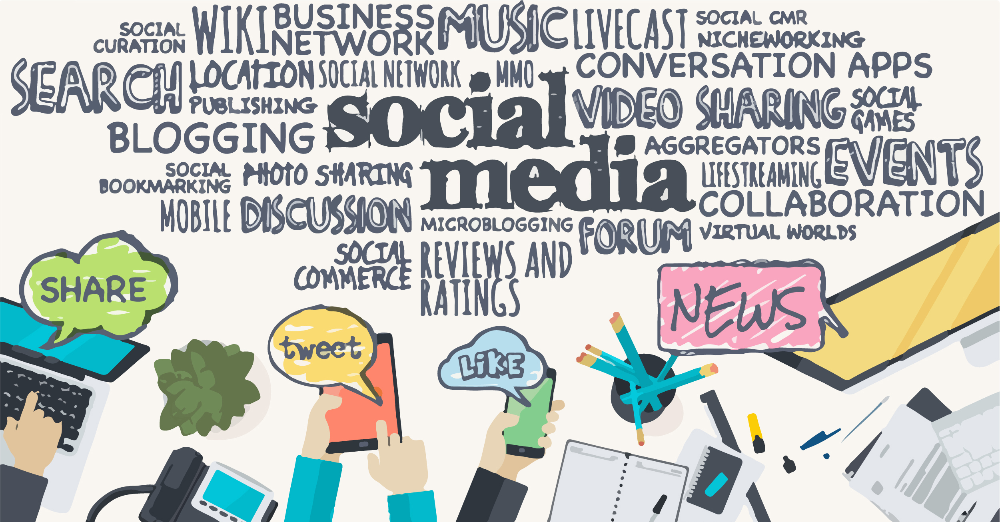
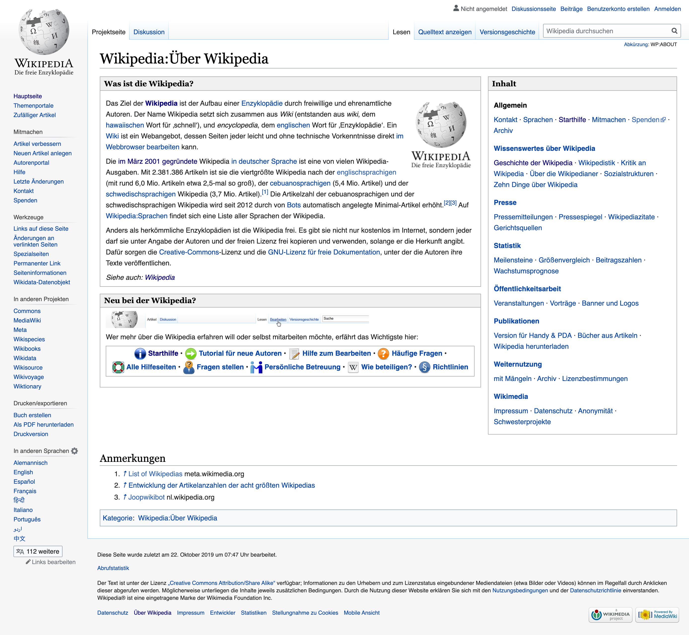
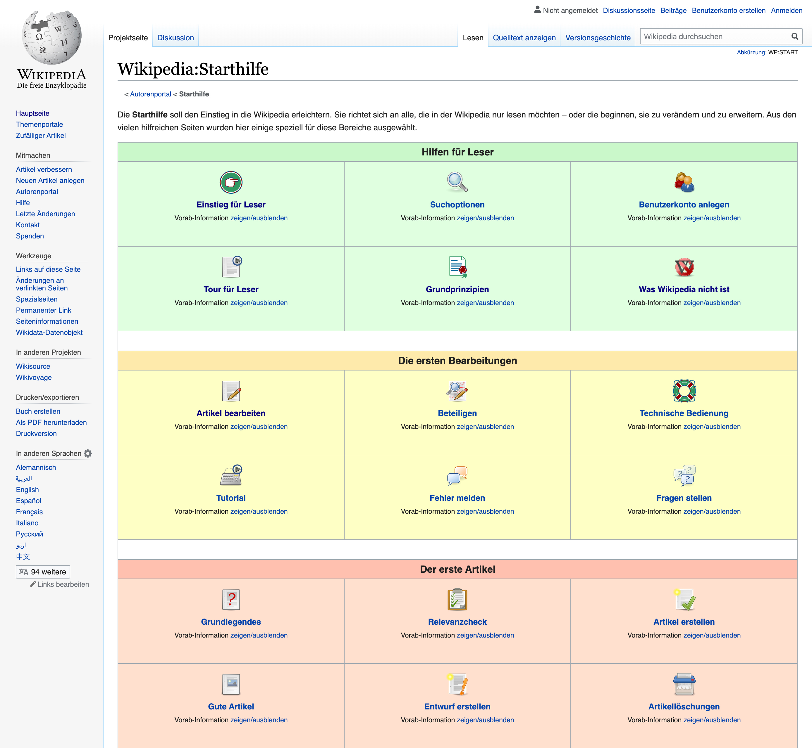
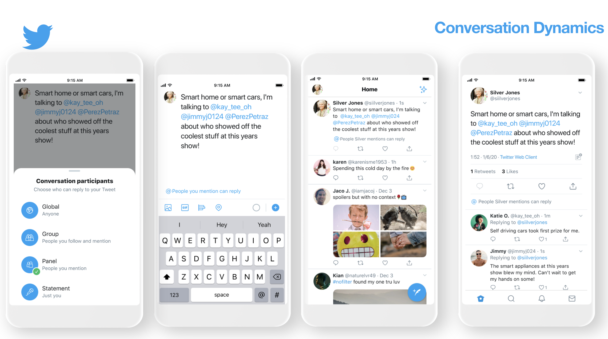
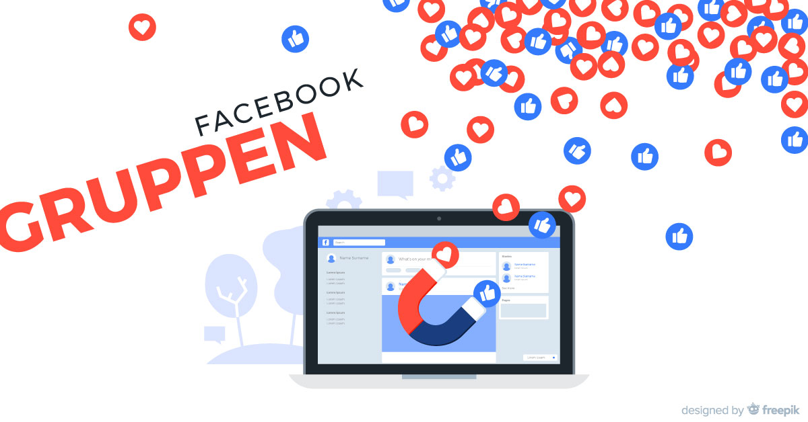

import Margin from 'gatsby-theme-signalwerk/src/components/Margin';
import Grid from 'gatsby-theme-signalwerk/src/components/Grid';
import Column from 'gatsby-theme-signalwerk/src/components/Column';
import Box from 'gatsby-theme-signalwerk/src/components/Box';

<Grid background>


*Sharing Plattform[^:fig:Abbildung von Pinterest]*

</Grid>

## Intro

Heutzutage ist es selbstverständlich, Inhalte über das Internet zu erstellen und zu verbreiten. Dafür wird unter anderem das Peer-to-Peer-System (P2P) verwendet und es werden Sharing Plattformen genutzt. Viele junge Nutzer&ast;innen benutzen die offenen Sharing Plattformen über Smartphone, Tablet oder Laptop, stellen Inhalte her und lesen gleichzeitig Inhalte von anderen Nutzer&ast;innen. Zudem entwickelten in kurzer Zeit zahlreiche Geschäfte, Unternehmen und Startups Produkte mit Sharing Plattformen. Trotz Fake News, Filterblasen, Datenmissbrauch und Mikrotargeting nutzen viele Social Media täglich. Diese Bewegung hat die ökonomische Digitalisierung stark beeinflusst.

Vor der Digitalisierung stammten die Informationen meistens von Autoren, Journalisten und anderen Fachleuten. Im Web 2.0 werden die Informationen auch durch Peer-to-Peer erstellt.
Damit die schriftlichen Informationen genutzt wurden und werden, müssen die Leser&ast;innen und Nutzer&ast;innen Vertrauen zu den Informationen und in die Informationsquellen haben. Wie entstand und entsteht das Vertrauen in schriftliche Informationen? Das soll in der vorliegenden Arbeit untersucht werden. Dabei wird in der Thesis der Fokus auf zwei Hauptfragen gelegt:
#

1. **Wie entstand Vertrauen zu Informationsquellen vor der Digitalisierung (zu Buchverlagen, Büchern, Zeitungen, Institutionen etc.)?**

2. **Wie hat das Web 2.0 und Methoden wie P2P Sharing das Vertrauen in Wissen/Information verändert?** <br/>
#

Zudem werden auch folgende Fragen untersucht: Wann und wie startete diese Revolution der Sharing Plattformen? Wie sieht das Vertrauen von Nutzer&ast;innen in Sharing Plattformen aus? Wie vertrauen die Nutzer&ast;innen den Informationsquellen? Hat sich das Vertrauen vor und nach der Digitalisierung verändert?
#

<Margin>

**Noch ein Hinweis:** <br/>

Im Text gibt es an mehreren Stellen solche Kästchen. Diese werden für kleine Fallbeispiele und für Themen verwendet, denen ich in der Bearbeitung der Thematik begegnet bin, die ich im Rahmen dieser Arbeit aber nicht vertieft behandelt werden konnten. Vereinzelt finden sich in diesen Kästchen auch Begriffsdefinitionen.

</Margin>

**Die Arbeit ist wie folgt aufgebaut:** <br/>
Nachdem die zentralen Begriffe definiert worden sind, wird ein Blick in die Vergangenheit geworfen: Welche schriftlichen Informationsquellen hat es vor der Digitalisierung gegeben? Wie funktionierte das damals vorherrschende B2C-Konzept? Und wie entsteht Vertrauen ins B2C-Konzept? Danach steht die Digitalisierung im Zentrum: Es werden die mit der Digitalisierung verbundenen Veränderungen aufgezeigt, das P2P-Konzept wird beschrieben und es wird der Frage nachgegangen, wie im P2P-Konzept Vertrauen entsteht. In einem weiteren Kapitel werden drei Fallbeispiele in Bezug auf P2P Vertrauen untersucht: Wikipedia, Twitter und Facebook. Diese drei Beispiele wurden gewählt, weil sie zu den wichtigsten P2P-Plattformen gehören. Um noch mehr über die Konzepte P2P und B2C und das Vertrauen in Wikipedia, Twitter und Facebook zu erfahren, wurde zudem eine Diskussion mit vier Personen aufgezeichnet. Die Ergebnisse dieses Gesprächs sind im Kapitel «Diskussion» dargestellt. Im letzten Kapitel, dem Schlusswort, werden die Ergebnisse dieser Untersuchung zusammengefasst, es wird ein Fazit gezogen und es werden weiterführende Fragestellungen formuliert.
##

<!--Für weitere Infos siehe [Github](https://github.com/signalwerk/gatsby-theme-signalwerk).-->

---
## Inhaltsverzeichnis
```toc
exclude:
- Inhaltsverzeichnis
- Commons
- Content Sharing
- Peer-to-Peer P2P
- Prosumenten
- Vertrauen
- Schriftliche Informationsquellen
- B2C-Konzept
- Entstehung von Vertrauen ins B2C-Konzept
- Entstehung der Digitalisierung und neue schriftliche Informationsquellen
- P2P-Konzept
- Entstehung von Vertrauen ins P2P-Konzept
- Wem vertraut ihr mehr – B2C oder P2P?
- Ist Twitter vertrauenswürdig?
- Ist Wikipedia vertrauenswürdig?
- B2C pro
- B2C contra
- P2P pro
- P2P contra
- Ja
- Nein
- Mentoring durch
- Tutoring durch
- Vorgelegt von
from-heading: 2
to-heading: 6
```

---
## Hauptteil

### Begriffsdefinitionen

#### Commons
Der Begriff «Commons» bezeichnet «gemeinschaftliche Formationen». Freiwillig Gleichberechtigte prozessieren dafür gemeinsam an bedürfnisorientierten Zielen. Die Gemeinschaft stellt die Ressourcen nicht nur her, sondern sie nutzt und pflegt sie auch. Die digitalen Ressourcen, wie z.B. Wikipedia, pflegen die Prosumenten gemeinsam und investieren Zeit darin ohne Bezahlung. Diese sozialen, kooperativen Prozesse fördern eine Dynamik von Commons in digitalen Ressourcen.

<Margin>

**Content Sharing** <br/>
Fachleute teilen ihr Wissen mit anderen Leuten. Die Interessenten darunter teilen das gelernte Wissen mit weiteren Personen.

*Funktion der Content Sharing.[^:fig:Abbildung von Pinterest]*

</Margin>

#### Content Sharing
Unter Content Sharing versteht man die gemeinsame Nutzung multimedialer Inhalte, welche im Internet geteilt werden. Dazu gehören Dokumente, Beiträge, Artikel, Informationen, Bilder, Audiodateien und Videos. _Auf den bekanntesten Sharing Plattformen wie Wikipedia, Google Cloud, GoogleDocs oder YouTube können Nutzer&ast;innen Inhalte veröffentlichen oder hinterlegen und mit anderen Nutzer&ast;innen teilen. Das Content Sharing führt dazu, dass die Menge von Inhalten im Internet grösser wird._[^Artikel von der Website der Marketing Börse – «Was sind eigentlich: Content Sharing Netzwerke?»]

#### Peer-to-Peer P2P
_Unter Peer-to-Peer versteht man ein Interaktionsmodell._[^Stokar et al., 2018, S. 73ff, «Sharing Economy –
teilen statt besitzen»] _Der Begriff «peer» bedeutet auf Englisch «Gleichgestellter» oder «Ebenbürtiger». Der Begriff hebt die Gleichwertigkeit von Menschen hervor._[^Peer-to-Peer in Wikipedia – https://de.wikipedia.org/wiki/Peer-to-Peer] Das Peer-to-Peer-System ist eine Kollaborationsplattform. Im Netzwerk werden die Informationen von natürlichen Personen geteilt und genutzt

Weitere Interaktionsmodelle sind Business-to-Consumer (B2C) und Business-to-Business (B2B).

#### Prosumenten
_«Prosumenten (Prosumer) sind Konsumenten, die zugleich Produzenten sind, oder auch Produzenten, die zugleich als Konsumenten auftreten. Beispiele sind Besucher eines Wikis, die gelegentlich mitarbeiten, und Blogger, die Beiträge anderer Blogger lesen und kommentieren.»_[^Zitat von Wirtschaftslexikon Gabler – https://wirtschaftslexikon.gabler.de/definition/prosument-54019]

Die Prosumenten beeinflussen und erhöhen die dynamische Struktur in den Content Sharing Plattformen.


#### Vertrauen
_«Vertrauen bezeichnet die subjektive Überzeugung (oder auch das Gefühl für oder Glaube an die) von der Richtigkeit, Wahrheit von Handlungen, Einsichten und Aussagen bzw. der Redlichkeit von Personen.»_[^Vertrauen in Wikipedia – https://de.wikipedia.org/wiki/Vertrauen]

Vertrauen wird nicht als selbstverständlich wahrgenommen, weil es stark von verschiedenen Situationen beeinflusst ist. _Gemäss Friesens kommt es darauf an, wie die Beziehung zwischen zwei oder mehreren Personen ist. Je stärker sie verbündet sind, desto mehr vertrauliche Informationen erhalten sie._[^Friesen, 2017, S. 19 «Bewertung von Vertrauensinstrumenten in der Sharing Economy» – https://opus.ostfalia.de/frontdoor/deliver/index/docId/839/file/Friesen_2017_Vertrauensinstrumente_SharingEconomy_Mitfahrgelegenheit.pdf] Bei persönlichen Treffen entscheiden in der Regel die Gefühle der Menschen darüber, wem sie vertrauen können und wem nicht. Auch sind Glaubwürdigkeit und Sympathie wichtig für das Vertrauen.
#

---

### Vor der Digitalisierung
#

#### Schriftliche Informationsquellen
_Wie Böhn und Seidler beschreiben, sind Wissensbestände im menschlichen Gedächtnis nicht dauerhaft speicherbar. Erst die schriftliche Archivierung ermöglichte die Speicherung von Wissen ausserhalb des Gedächtnisses._[^Böhn und Seidler 2014, S. 32, «Mediengeschichte: Eine Einführung»] Seitdem wurden unzählige Informationsquellen geschaffen. Vor der Digitalisierung waren die Informationsquellen ausschliesslich analoge, haptische Dinge, wie Bücher, Zeitung, Zeitschriften und weitere Printmedien. Diese wurden unter anderem in Archiven von Bibliotheken und Museen gelagert.

_Im 17. Jahrhundert entstand die Zeitung als erstes öffentliches Massenmedium und entwickelte sich zu einem wichtigen Kommunikationsmittel für das breite Publikum._[^Böhn und Seidler 2014, S. 60, «Mediengeschichte: Eine Einführung»] Später kamen weitere Massenmedien dazu, wie das Radio, das Fernsehen und weitere Printmedien (neben Zeitungen auch Zeitschriften, Plakate und Flugblätter). _Diese Massenmedien lieferten die aktuellen Informationen schnellstmöglich und für ein grosses Publikum. So konnten sich die neugierigen Bürger*innen über Politik, Gesellschaft, Kultur, Wirtschaft, Sport und das Geschehen in der Gesellschaft informieren._[^Böhn und Seidler 2014, S. 61, «Mediengeschichte: Eine Einführung»] _Wie Böhn und Seidler feststellen, hat die Entstehung der Zeitung die politischen und sozialen Bereiche bewegt und oft wurden Informationen zensiert. Seitdem wurde die Zensur in Phasen der politischen Revolution heftig kritisiert und im 18. Jahrhundert verlangten die Bürger*innen Pressefreiheit._[^Böhn und Seidler 2014, S. 62, «Mediengeschichte: Eine Einführung»] _Diese wurde später in die Menschenrechte aufgenommen, in denenzudem das Recht auf freie Meinungsäusserung festgehalten ist._[^Böhn und Seidler 2014, S. 63, «Mediengeschichte: Eine Einführung»]

Heute sind die Massenmedien als öffentliche Kommunikationsmittel eine Selbstverständlichkeit. Es gibt eine Vielzahl von Zeitungen und Zeitschriften (in Printform und als Onlinedienste).

<Margin>

_**Rundfunk - mündliche Informationsquellen**_[^Rundfunk in Wikipedia – https://de.wikipedia.org/wiki/Rundfunk] <br/>
_Die elektronischen Informationen, die über Radio und Fernsehen ausgestrahlt werden, bezeichnet man als Rundfunk. Die erste Radiotechnik wurde für das Militär entwickelt und erst später wurde es als Begleitmedium für alle eingesetzt._[^Böhn und Seidler 2014, S. 121, «Mediengeschichte: Eine Einführung»] Und noch etwas später wurde das Fernsehen erfunden. Mit diesen neue technischen Möglichkeiten konnten Informationen auch in weit entfernten Regionen der Welt empfangen werden. Die Inhalte der Informationsquellen sind meistens aktuelle Geschehen in Echtzeit und wurde an Rezipienten übermittelt

</Margin>

#### B2C-Konzept
Vor der Digitalisierung wurden schriftliche Informationen mit dem Interaktionsmodell B2C und über die schriftlichen Medien, Bücher und Zeitungen verbreitet. B2C bedeutet, dass Fachpersonen Informationen für Nutzer&ast;innen verfassen. Zu den Fachpersonen gehörten Journalist&ast;innen, Autor&ast;innen, Lyriker&ast;innen, Psycholog&ast;innen, Wissenschaftler&ast;innen, Schriftsteller&ast;innen, Ärzt&ast;innen und andere Fachleute. Die Nutzer&ast;innen konnten dadurch Informationen aus glaubwürdigen Informationsquellen lesen. Jedoch bekamen die Nutzer&ast;innen nur beschränkt schriftliche Informationen, denn die Fachpersonen sowie Personen aus dem Bereich der Politik haben entschieden, welche Informationen veröffentlicht werden sollen und welche nicht. _Dadurch wurden die Journalist&ast;innen und alle Bürger&ast;innen in ihrem Recht auf Informationszugang beschränkt. Dadurch haben die Bürger&ast;innen angefangen, für ihr Recht auf Informationsfreiheit zu kämpfen._[^Informationsfreiheit in Wikipedia – https://de.wikipedia.org/wiki/Informationsfreiheit]
#

> «Im Gesetz ist die Rezipientenfreiheit beschrieben, die besagt, dass man sich von überall her Informationen beschaffen darf.»[^Rezipientenfreiheit in Wikipedia – https://de.wikipedia.org/wiki/Rezipientenfreiheit]
#

#### Entstehung von Vertrauen ins B2C-Konzept
In Bezug auf Printmedien bauen die Menschen Vertrauen anders auf, als sie es bei persönlichen Begegnungen mit Menschen machen. Das Vertrauen in Bücher basiert unter anderem auf der Erwähnung der Autoren, auf Literaturlisten und weiteren Quellen. Zu den weiteren Quellen gehören beispielsweise Dokumente, Archive und Akten. In Zeitungen wurden Artikel von verschiedenen Journalist&ast;innen geschrieben. Zeitungen präsentieren ihre Informationen in verschiedenen Rubriken; dadurch können die Leser&ast;innen entsprechend ihrem Interesse zu Informationen kommen. Das Vertrauen der Leser&ast;innen gegenüber den Printmedien hängt von ihrem Wissen, ihrem Interesse und ihrer Lebenserfahrung ab. _Böhn und Seidler beschreiben es wie folgt: «Das Vertrauen in Informationsquellen wurde vermutlich von Interessen und Akzeptanz beeinflusst.»_[^Böhn und Seidler 2014, S. 60, «Mediengeschichte: Eine Einführung»] Die verschiedenen Zeitungen präsentierten unterschiedliche Ansichten, wodurch sich die Konsument&ast;innen entscheiden können, welche Zeitung für sie am glaubwürdigsten ist. Dadurch wird der Meinungsaustausch und die Diskussion gefördert. _«Jedoch sind durch die Meinungsverschiedenheit auch potentielle Konflikte entstanden», wie Böhn und Seider hervorheben._[^Böhn und Seidler 2014, S. 61, «Mediengeschichte: Eine Einführung»] Die Menschen wurden immer autonomer und die Wichtigkeit der Individualität der Menschen nahm immer mehr zu. Dadurch begann die Menschheit für ihre Rechte zu kämpfen.

<Margin>

**Fallbeispiel B2C - mündliche Informationsquellen** <br/>
Das glaubwürdige Vertrauen zwischen Menschen in der Business-to-Consumer-Interaktion (B2C) hängt vom Wissens- und Bildungsstand ab. So bildet zum Beispiel ein erfahrener Arzt/eine erfahrene Ärztin Assistent&ast;innen aus. Die Assistenzärzt&ast;innen vertrauen den Ärzt&ast;innen und lassen sich von ihnen fördern, weil sie in die Ärzt&ast;innen, die jahrelange fachliche und praktische Erfahrungen vorweisen, Vertrauen haben. <br/> <br/>

**Fallbeispiel P2P - mündliche Informationsquellen** <br/>
Die mündlichen Informationsquellen von früher entwickelten sich aus Gemeinschaften (Freunde, Verwandte und Bekannten). Es handelte sich um private Gemeinschaften und Fach-Communities, die ihr Wissen z.B. auf Kongressen oder anderen mündlichen Gesprächsforen wie Vorträgen, öffentlichen Diskussionen, Interviews, politische Reden oder religiösen Predigten, teilten.

</Margin>

### Zeitalter der Digitalisierung
#

#### Entstehung der Digitalisierung und neue schriftliche Informationsquellen
_Wie bei Böhn und Seidler zu lesen ist, wurde im Jahr 1969 das Internet erfunden und später wurden die ersten HTTP-Webseiten veröffentlicht. Seitdem wurde das Internet zunehmend wichtiger._[^Böhn und Seidler 2014, S. 146f., «Mediengeschichte: Eine Einführung»] Diese innovative Technologie funktioniert nur über den Computer, fördert die Vernetzung von verschiedenen Standorten und entwickelte sich dadurch in eine zentralistisch organisierte Informationsstruktur. Mehrere Rechner können über ein zentrales Netzwerk miteinander vernetzt sein. Seit Beginn der Digitalisierung werden grafisch zunehmend speziellere Benutzeroberflächen für Computer geschaffen, die Nutzungsmöglichkeiten werden immer vielfältiger und es sind neue schriftliche Informationsquellen entstanden: Digitale Medien, Links, E-Mails, Foren, Chats und Games.

_Nach 2000 kam die neueste Entwicklung des Internets, das Web 2.0, dazu. Stadler beschreibt, dass heutzutage die neuen sozialen Massenmedien wie Facebook, Twitter, LinkedIn, Instagram, WhatsApp und andere Plattformen, die nach 2000 entwickelt worden sind, die Netzwerkmacht haben._[^Stadler, 2016, S. 214, «Kultur der Digitalität»]

Die neue Generation von Web 2.0 belebt die interaktive und kollaborative Nutzung im Internet. Dadurch wachsen die digitalen Informationsquellen weiter. Dieses dynamische System funktioniert seit Web 2.0 und verbreitet sich rasch. Es wurden und werden unzählige digitalen Sharing Plattformen gegründet. Heutzutage werden die Contents von Sharing Plattformen und Social Media selbstverständlicher akzeptiert. Im Web 2.0 bewegen sich dynamische, interaktive und kollaborative Plattformen, wie zum Beispiel Wikipedia, Facebook, Twitter, Sharoo, UBER oder Amazon.

<Margin>


_**Web 2.0**_[^Web 2.0 Definition im Wirtschaftslexikon Gabler – https://wirtschaftslexikon.gabler.de/definition/web-20-51842] <br/>
Unter Web 2.0 versteht man eine produktiv nutzbare Plattform im Internet, die oft von Prosumenten hergestellt und gepflegt wird.

</Margin>


_Wie Stadler bemerkt, wurde die Gesellschaft zunehmend vielfältiger, widersprüchlicher und konfliktreichen._[^Stadler, 2016, S. 203, «Kultur der Digitalität»] Denn die Menschheit hat sich durch die Digitalität von einheitlich zu individuell verändert. _Gemäss Stadler identifizieren die Menschen heute diese Entwicklung als neu und revolutionär, denn sie können im Internet Informationen frei abrufen und recherchieren._[^Stadler, 2016, S. 21, «Kultur der Digitalität»] Durch die zahlreichen Informationen, die im Internet zur Verfügung stehen, haben die Menschen Zugang zu diversen Themen. Das wiederum weckt bei den Menschen das Interesse für weitere Informationen und für die politischen, sozialen und ökonomischen Entwicklungen. Seit dieser Veränderung hat sich die politische Haltung in Richtung liberale Demokratie entwickelt.

#### P2P-Konzept
Der liberale demokratische Prozess bietet Beteiligungsmöglichkeiten an und schafft Anreize, um gesellschaftlich mitzudenken. In der Dynamik des offenen Internets bewegt sich die Gesellschaft; sie kann diskutieren, argumentieren und mitbestimmen. Das fördert die Integration und die Nutzer&ast;innen können ihre Bedürfnisse abdecken. Die Nutzer&ast;innen können frei recherchieren oder ihre Daten an Plattformen liefern. Diese technische Entwicklung bringt mehr Interaktionsmöglichkeiten und die Nutzer&ast;innen können die Kommentare von anderen lesen oder selber kommentieren. _Die Inhalte werden P2P erstellt und genutzt. Zudem nimmt über P2P die Menge an Daten laufend zu. Allein Facebook hat mehr als eine Milliarde Nutzer*innen, welche unzählige Daten und Informationen liefern._[^Stadler, 2016, S. 215, «Kultur der Digitalität»]

Die Meinungsfreiheit ist gesetzlich geschützt. _Gemäss Stadler ist WikiLeaks eine der bekanntesten, öffentlichen Plattform._[^Stadler, 2016, S. 242, «Kultur der Digitalität»] WikiLeaks ist im politischen Bereich eine Provokation. Stadler beschreibt, dass Journalist&ast;innen, Spezialist&ast;innen und sogar Mitarbeiter&ast;innen WikiLeaks Daten liefern. _Stadler weist darauf hin, dass sie die Daten aus moralischen Gründen veröffentlichten, da sie einen Gewissenskonflikt hätten._[^Stadler, 2016, S. 243, «Kultur der Digitalität»]


#### Entstehung von Vertrauen ins P2P-Konzept
Aufgrund der Entwicklungen im Web 2.0 tauchten in Bezug auf das Vertrauen Konflikte auf.

Vor der Digitalität waren die Menschen analoge Gegenstände gewohnt und sie kommunizierten vor allem Face-to-Face. Im Internet wird über Rechner kommuniziert. Diese virtuelle Veränderung ist für Menschen aus früheren Generationen schwierig zu verstehen. In der Digitalität wird das Vertrauen langsam und durch verschiedene Methoden aufgebaut. Die Menschen lernen, wie sie mit fremden Leuten im Internet kommunizieren können. _Wie Stalder bemerkt, handeln die Menschen mit Hilfe komplexer Technologien auf verschiedenen Feldern zunehmend aktiv. Dadurch wurde die Digitalität zunehmend nach Referentialität, Gemeinschaftlichkeit und Algorithmizität cha­rak­te­ri­sie­rt._[^Stadler, 2016, S. 203, «Kultur der Digitalität»]

Das Vertrauen der Nutzer&ast;innen in die sozialen Massenmedien hängt von den Autor&ast;innen, den Unternehmen oder den Nutzer&ast;innen ab. Die Nutzer&ast;innen vertrauen ihrem Instinkt. Allein der Instinkt genügt nicht. Der Mensch macht mit dem Internet gute und schlechte Erfahrungen. Zu den schlechten Erfahrungen gehören unter anderem Filterblasen, Fake News, Datenmissbrauch und Überwachung. Aufgrund dieser Erfahrungen lernen die Nutzer&ast;innen, wann sie sich schützen müssen und wann sie sicher sind. Die Richtigkeit und Sicherheit sind heute primärer geworden. _Darum gibt es verschiedene Instrumente, um das Vertrauen prüfen zu können. Dazu gehören die Identitätsverifizierung, die Qualitätssicherung, die Usability, die Flexibilität, Quellenangaben, Kontaktinformationen und Bewertungen._[^Friesen, 2017, S. 23f., «Bewertung von Vertrauensinstrumenten in der Sharing Economy»]

Bei P2P Sharing-Plattformen funktioniert das Vertrauen zum Teil auch über den zwischenmenschlichen Kontakt. Das ist dann der Fall, wenn sich Nutzer&ast;innen aus der realen Welt kennen.
#


---
## Fallbeispiele

### Wikipedia
«Die freie Enzyklopädie» - so bezeichnet sich Wikipedia selbst. Wikipedia bietet seit 2001 eine der grössten, weltweit genutzten und offenen Plattformen an. Wikipedia funktioniert über Peer-to-Peer (P2P) Interaktion und hat eigene Regeln, wie die freien Autor&ast;innen, Journalist&ast;innen oder Amateur&ast;innen im Webbrowser Einträge bearbeiten können. _Zu den Grundprinzipien von Wikipedia gehören: «Wikipedia ist eine Enzyklopädie», «Neutralität», «Freie Inhalte» und «Keine persönlichen Angriffe»._[^Grundprinzipien von Wikipedia – http://de.wikipedia.org/wiki/Wikipedia:Grundprinzipien] Wikipedia hat keinen Chefredakteur/keine Chefredakteurin und die aktiven Prosumenten sind gleichberechtigt und können die letzten Änderungen von Artikeln lesen, bevor sie veröffentlicht werden.

 _«Ein Wiki ist ein Webangebot, dessen Seiten jeder leicht und ohne technische Vorkenntnisse direkt im Webbrowser bearbeiten kann.»_[^Über Wikipedia – https://de.wikipedia.org/wiki/Wikipedia:Über_Wikipedia] Diese kollaborative Seite wurde von vielen gleichberechtigten, freiwilligen Nutzer&ast;innen verfasst und erweitert. Dadurch sind über 1 Million Artikeln entstanden, welche immer wieder überarbeitet werden können. _«Wikipedia lag im September 2018 auf dem fünften Platz der am häufigsten besuchten Websites.»_[^Über Wikipedia – https://de.wikipedia.org/wiki/Wikipedia] Die Nutzer&ast;innen erstellen einen Account auf Wikipedia, bearbeiten eine Seite und veröffentlichen sie. Bei Wikipedia gibt es auch ein Forum, damit die Nutzer&ast;innen bei Konflikten und Meinungsverschiedenheiten gemeinsam diskutieren können. _In extremen Fällen wird ein rechtliches Verfahren eingeleitet, bei dem die Prosumenten gleichberechtigt behandelt werden._[^Konflikte vom rechtlichen Verfahren in Wikipedia – http://de.wikipedia.org/wiki/Wikipedia:Konflikte]

 <Grid>
 <Column start="5" end="9">

 
 *Seite der Wikipedia[^:fig:Seite der Wikipedia – https://de.wikipedia.org/wiki/Wikipedia:Über_Wikipedia]*

 </Column>
 <Column start="9" end="13">

 
 *Starthilfe für Register[^:fig:Starthilfe – https://de.m.wikipedia.org/wiki/Wikipedia:Starthilfe]*

 </Column>
 </Grid>


**Vertrauen in Wikipedia** <br/>
_Im 2014 hat das britische Markt- und Meinungsforschungsinstitut «YouGov» in England eine Umfrage zum Vertrauen in Wikipedia gemacht._[^Umfrage über Wikipedia, 2014 – http://de.wikipedia.org/wiki/Wikipedia#Vertrauen] Folgende Statistik wurde veröffentlicht:


* **60%** – die Informationsquellen sind **grösstenteils** vertrauenswürdig
* **7%** – die Informationsquellen sind **besonders** vertrauenswürdig
* **28%** – die Informationsquellen sind **eher nicht** vertrauenswürdig
* **6%** – die Informationsquellen sind **gar nicht** vertrauenswürdig


Die Artikel auf Wikipedia können mit verschiedenen Qualitätsmassstäben bewertet werden. Dazu gehören Glaubwürdigkeit, Vollständigkeit, Objektivität, Lesbarkeit, Relevanz, Stil und Aktualität. *Weitere Ausführungen zum Vertrauen in Wikipedia finden sich im Kapitel «Diskussion»*.


### Twitter


*Twitter[^:fig:Abbildung von Pinterest]*

Twitter gehört zu einer Social-Media-Plattform. Diese dynamische Kommunikationsplattform ist mehr auf die Politik ausgerichtet. Heutzutage haben sogar Politiker&ast;innen wie Donald Trump einen eigenen Account auf Twitter und schreiben regelmässig kurze Messages. Ihre Aussagen werden oft in analogen oder digitalen Zeitungen zitiert. Auch Journalist&ast;innen und Redakteur&ast;innen posten produktiv News auf Twitter. Unbekannte bis bekannte Nutzer&ast;innen können die Beiträge kommentieren und mitdiskutieren. Im Vergleich zu Facebook ist Twitter ein kleines soziales Netzwerk, doch seine Offenheit und Schnelligkeit machen die Kommunikation einfach. Wegen der Geschwindigkeit, in der die Nachrichten zu aktuellen Geschehnissen verbreitet werden, ist Twitter bekannter und auch beliebt geworden. <br/>

Das Merkmal von Twitter sind die Hashtags. Über den Hashtag «#» werden die Tweets miteinander verknüpft. Dadurch können sie schnell abgerufen werden. Die junge Generation nutzt Twitter häufig, um schnell etwas zu finden oder auffälliger sein zu können. Von den Vorteilen der Hashtags profitieren auch die Leute in den Bereichen Medien und Journalismus.
#

**Vertrauen in Twitter** <br/>
Durch die persönlichen Tweets von echten Nutzer&ast;innen wird bei den den Follower&ast;innen Vertrauen geschaffen *Weitere Ausführungen zum Vertrauen in Twitter siehe Kapitel «Diskussion»*.


### Facebook-Gruppen


*Facebook-Gruppen[^:fig:Abbildung von clicks digital Website]*

_In der grössten Social-Media-Plattform Facebook entstehen tagtäglich neue Gruppen und diese Gruppen liefern zahlreiche Informationen, Wissen und Ressourcen._[^Stadler, 2016, S. 215, «Kultur der Digitalität»] Die Informationen kann man online oder offline abrufen. Alle Nutzer&ast;innen können eine oder mehrere Gruppen erstellen und diese auch steuern. In einer Gruppe kommentieren, produzieren und diskutieren die anderen aktiven Nutzer&ast;innen gemeinsam. Dazu kommt noch, dass die Administrator&ast;innen von Gruppen anderen Personen Rollen zuweisen können, z.B. die Rollen der Administrator&ast;innen, der Moderator&ast;innen oder der Leser&ast;innen.

Bei der Erstellung einer Gruppe wird definiert, ob eine Gruppe öffentlich, geschlossen oder geheim sein soll. Meistens besteht eine Gruppe aus Nutzer&ast;innen, welche gemeinsame Interessen haben. Trotz gemeinsamer Interessen der Nutzer&ast;innen einer Gruppe gibt es auch Meinungsverschiedenheiten. _Deshalb wurde von den Gründer&ast;innen die Regel festgelegt, dass innerhalb eines Commons alle Entscheidungen kollektiv gefällt werden._[^Stadler, 2016, S. 250, «Kultur der Digitalität»]

Vor der Erstellung einer Gruppe müssen verschiedene Einstellungen wie Privatsphäre, Gruppenart und Kategorien gewählt werden, damit die Nutzer&ast;innen informiert sind, um was für eine Gruppe es sich handelt. Es können zum Beispiel folgende Kategorien gewählt werden: Lokale, Bildung, Essen, Sport, Tiere, Politik, Verkauf, Beruf, Kunst, Gemeinschaftliche Organisation, Musik, Religion, Person des öffentlichen Lebens, Gesundheit, Unternehmen und Sonstiges. Eine Übersicht aller Kategorien ist unter https://www.facebook.com/pages/category/ zu finden.
#

**Vertrauen in Facebook-Gruppen** <br/>
_Facebook hat seit 2018 viele Nutzer&ast;innen verloren, weil viele Nutzer&ast;innen seit dem Datenschutz-Skandal Facebook nicht mehr vertrauen. Nach dem Skandal verkündete Mark Zuckerberg, dass sich die Plattform «Facebook» optisch und inhaltlich in Bezug auf «neue Regel und andere Werte» ändern müsse, um das Vertrauen der Nutzer&ast;innen wieder zu gewinnen_[^Artikel vom Datenwerk Blog, 22. MAI 2019 – https://weblog.datenwerk.at/2019/05/22/vertrauen-in-facebook/]
#

---
## Diskussion

Bei der Gruppendiskussion waren vier Personen (27 bis 46 Jahre alt) anwesend. Sie bekamen drei Fragen. Die drei Fragen waren «Wem vertraut ihr mehr - B2C oder P2P?», «Ist Wikipedia vertrauenswürdig?» und «Ist Twitter vertrauenswürdig?». Das Gespräch wurde auf Video aufgezeichnet und anschliessend geschnitten. Die Aussagen wurden danach in Stichworten notiert. Basierend darauf wurde eine schriftliche Zusammenfassung gemacht, welche im Folgenden präsentiert wird. <br/>


### Wem vertraut ihr mehr – B2C oder P2P?

<Grid>
<Column start="5" end="9">

#### B2C pro
Durch das Wissen von den Fachleuten und der Professionalität der Fachleute entsteht Vertrauen in die Inhalte, die über B2C geschrieben worden sind.

</Column>
<Column start="9" end="13">

#### B2C contra
Bei B2C bestimmen die Fachleute die Informationen, welche veröffentlicht werden sollen. Sie haben die Entscheidungsmacht. Sie veröffentlichen ihre Arbeiten, ohne Kontrolle von Aussen. Nach der Veröffentlichung können deshalb Meinungskonflikte, Misstrauen und Proteste entstehen, auch von Seiten anderer Fachleute, wie zum Beispiel Journalist&ast;innen. Mit ihrer Sichtweise können die Fachleute die Leser&ast;innen manipulieren, da sie bestimmte Informationen zensieren können.

</Column>
</Grid>

<Grid>
<Column start="5" end="9">

#### P2P pro
Gleichberechtigte Personen können gemeinsam einen Meinungsaustausch führen. Das P2P-Konzept vermeidet Meinungskonflikte, worduch die kollaborative Entscheidungsfindung vorangetrieben werden kann. Jeder einzelne kann sich selbst einschätzen und selber argumentieren.

</Column>
<Column start="9" end="13">

#### P2P contra
Leute ohne Fachwissen können stellenweise leichtgläubig sein oder falsche Behauptungen (Fake News, falsche Informationen) veröffentlichen bzw. erhalten. Ohne Fachwissen werden Konflikte gefördert. Weil die Qualität der Inhalte nicht gesichert ist, wird die Richtigkeit in Frage gestellt.

</Column>
</Grid>


### Ist Twitter vertrauenswürdig?

<Grid>
<Column start="5" end="9">

#### Ja
Die Prosumenten liefern glaubwürdige und politische Informationen an Twitter. Diese Prosumenten kommen meistens aus dem Journalismus oder der Politik. Über Twitter pflegen sie ihr eigenes Image. Dadurch ist es für Nutzer&ast;innen vertrauenswürdig. Die Artikel auf Twitter wirken sorgfältig, konstruktiv, glaubwürdig und seriös. Weil die Prosumenten ihre Namen bekannt geben, entwickeln die Nutzer&ast;innen Vertrauen. Die Nutzer&ast;innen entscheiden autonom, in welche Richtung sie gehen wollen. Die Gegner&ast;innen dürfen ihre eigene Meinung auf Twitter veröffentlichen, wodurch die gleichberechtigte Diskussion gefördert wird.

</Column>
<Column start="9" end="13">

#### Nein
Die Prosumenten schreiben ihre Inhalte mit dem Zeichenlimit von 140 Zeichen. Manche Nutzer&ast;innen sind der Meinung, dass aufgrund dieses Zeichenlimits die Wahrheit von Informationen eingeschränkt ist. Die kurze Inhalte machen es schwieriger, einen Inhalt zu verstehen. Bei Twitter kommuniziert man vor allem über Politik. Die Nutzer&ast;innen mit geringem Politikinteresse erstellen deshalb keinen Account auf Twitter.

</Column>
</Grid>


### Ist Wikipedia vertrauenswürdig?

<Grid>
<Column start="5" end="9">

#### Ja
Wikipedia gibt es schon lange, die Qualität der Texte wird laufend geprüft, das Profil wird auf Echtheit geprüft und die Artkiel sind mit Quellen und Fakten belegt. Zudem sind die Artikel miteinander verknüpft. Dadurch entsteht Vertrauen in Wikipedia.

</Column>
<Column start="9" end="13">

#### Nein
Die laufende Aktualisierung macht, dass die Nutzer&ast;innen unsicher sind, ob eine Informationsquelle vertrauenswürdig ist oder nicht.

</Column>
</Grid>


<Box ratio="16-9">

<iframe width="560" height="315" src="https://www.youtube-nocookie.com/embed/KkYNvRgSaTQ" frameborder="0" allow="accelerometer; autoplay; encrypted-media; gyroscope; picture-in-picture" allowfullscreen></iframe>

</Box>

#
---
## Schluss

### Fazit
In der vorliegenden Arbeit wurde das Vertrauen in schriftliche Informationen vor der Digitalisierung und seit der Digitalisierung untersucht. Abschliessend wird versucht, die beiden Hauptfragen zu beantworten. <br/>
#

**Wie entstand Vertrauen zu Informationsquellen vor der Digitalisierung (zu Buchverlagen, Büchern, Zeitungen, Institutionen etc.)?** <br/>
Vor der Digitalisierung lieferten Fachleuten über B2C Informationen an analoge Printmedien und liessen sie veröffentlichen. Die inneren Arbeitsprozesse von B2C sind bereits untereinander geprüft und lassen sich bestätigen. Der Status der Fachleute überzeugte die Nutzer&ast;innen und bewirkt, dass sie Vertrauen entwickelten. Im politischen Bereich gab es Konflikte, vor allem durch Meinungsverschiedenheiten und Zensur. Aufgrund des Vertrauensmissbrauchs der beschränkten Informationsquellen von Fachleuten, beschlossen die Menschen zu reagieren. Nach der politischen Revolution in Bezug auf Pressefreiheit, Menschenrechte und Meinungsfreiheit, entwickelten die Menschen ihre Beglaubigungsstrategien und forderten das Recht auf Informationsfreiheit ein. In dieser Zeit wird auch die Individualität der Menschen vielfältiger und ihr Vertrauen entscheidet sich aufgrund eigener Lebenserfahrung, Wissen, Instinkt, Interesse und Akzeptanz. Durch das Massenmedium Zeitung entstand die Möglichkeit, dass alle Informationen erhalten konnten. Kurz vor der Digitalisierung entstanden Radio oder Fernsehen. Durch diese wurde so oft wie möglich das aktuelle Geschehen in Echtzeit ausgestrahlt. Das B2C-Konzept war damals sehr vertrauenswürdig und wurde als selbstverständlich wahrgenommen. <br/>
#

**Wie hat das Web 2.0 und Methoden wie P2P Sharing das Vertrauen in Wissen/Information verändert?** <br/>
Seit das Internet geschaffen wurde, sind unzählige Informationen an zentralisierte Netzwerke geliefert worden und werden immer noch geliefert. Gleichzeitig nahmen die Nutzer&ast;innen des Internets laufend zu. Unter den Nutzer&ast;innen befinden sich Vertreter&ast;innen der gesamten Gesellschaft: Junge bis alte Menschen mit ganz unterschiedlichem Bildungshintergrund. Das Internet verändert sich rasant in Bezug auf Technologie, Geräte, Vernetzung und Benutzeroberflächen.

Als das neue Web 2.0 veröffentlicht wurde, gründeten die Unternehmen immer mehr offene, kollaborative Plattformen wie Wikipedia, YouTube usw. Dadurch wurden die dynamischen und interaktiven Strukturen im Internet ausgebaut. Diese Strukturen eignen sich mehr für das P2P-Konzept: Alle Nutzer&ast;innen können aktiv mitproduzieren. Im Internet wachsen dadurch die digitalen schriftlichen Informationen tagtäglich weiter Dadurch nehmen auch Fake News, Unwahrheiten und Manipulationen zu. Aufgrund dieser Schattenseite des Internets verlangten die Menschen Schutz vor Vertrauensmissbrauch, Betrug, Lügen und Manipulation. Es wurden mehrere Methoden zur Erhöhung dieses Schutzes entwickelt. Dazu gehören Qualitätssicherungsprozesse, Verifizierung, Prüfung der Echtheit des Profils, Quellenangaben und Bewertungen. Durch diese Methoden und Beglaubigungsstrategien entwickeln Nutzer&ast;innen Vertrauen in Content Sharing Plattformen, insbesondere in solche, deren schriftliche Informationen über das P2P-Konzept erstellt und genutzt werden.


### Ausblick
Während der Bearbeitung meiner Thesis, entdeckte ich weitere interessante Themen und Fragestellungen, die ich aus zeitlichen Gründen nicht in dieser Thesis behandeln konnte, die aber in einer weitere Arbeit untersucht werden können. Zu diesen Fragestellungen gehören insbesondere die folgenden zwei: <br/>

* **«Brauchen die Nutzer&ast;innen noch das B2C-Konzept bei Content Sharing Plattformen?»** <br/>
* **«Beeinflusst das Usability | UI Design das Vertrauen der Nutzer*innen?»** <br/>

Diese zwei Fragen inspirieren mich sehr. Für beide Studien muss man mehr Zeit investieren, mehrere Analyse bzw. «Human Centered Design» und persönliche Interviews durchführen. Zurzeit findet man kaum Unterlagen zu diesen Fragestellungen. Deshalb wären Studien zu diesen zwei Fragestellungen gerade für die Bereiche UX / UI Desing und IT sehr nützlich.
#

<Grid>

---

</Grid>


<!-- references text-->

<!--
Vorname Nachname, [Titel der Seite](https://www.google.com/) (Abrufdatum: dd. mm. yyyy).
Vorname Nachname, Buchtitel, Auflage, Verlag, Erscheinungsort Jahr, erste Seite – letzte Seite.
-->

[^quote-one]: Beispiel für Fussnote

<!-- references figures-->
[^:fig:one]: Beispiel für Abbildungsverzeichnis.
[^:fig:pic-source]: Abbildung von [lorempixel.com](http://lorempixel.com/800/600/cats/1)


## Literatur- und Quellenverzeichnis
```references
```

## Abbildungsverzeichnis
(Kann auch bei Einzelnachweis gepflegt werden)

```references
# gets repalced with footnotes
group-include: fig

inline-link-prefix: 'Fig. '

reference-link-prefix: '↑ Fig. '
reference-link-suffix: ''

reference-text-suffix: ' – '
```


<Grid>

---

<Column start="1" end="5">

#### Mentoring durch
Franka Grosse <br/&ast;
HFIAD 2017 <br/>
Schule für Gestaltung Zürich <br/>
[franka.grosse@sfgz.ch](mailto:franka.grosse@sfgz.ch)

</Column>

<Column start="5" end="9">

#### Tutoring durch
Sarah Guidi <br/>
Schreibberatung für <br/>
Gehörlose und Schwerhörige <br/>
[sarah.guidi@dima-glz.ch](mailto:sarah.guidi@dima-glz.ch)
</Column>

<Column start="9" end="13">

#### Vorgelegt von
Natasha Ruf <br/>
5 Semester in Interaction Design HF <br/>
Schule für Gestaltung Zürich <br/>
[natasha.ruf@gmail.com](mailto:natasha.ruf@gmail.com)
</Column>

</Grid>
