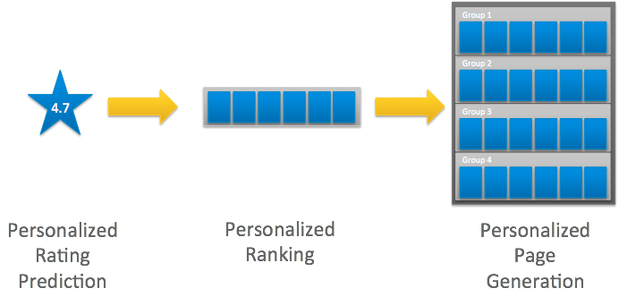
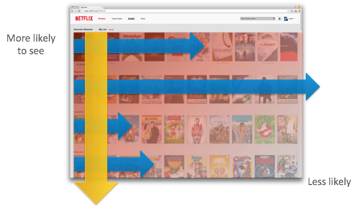

import Margin from 'gatsby-theme-signalwerk/src/components/Margin';
import Grid from 'gatsby-theme-signalwerk/src/components/Grid';
import Column from 'gatsby-theme-signalwerk/src/components/Column';
import Box from 'gatsby-theme-signalwerk/src/components/Box';


## Inhaltsverzeichnis
```toc
exclude: Inhaltsverzeichnis
from-heading: 2
to-heading: 3
```


## 1. Einleitung
### 1.1 Problemstellung

<Margin>

xxxxxx

</Margin>

Der Anteil an digitalen Produkten wie Webseiten und Apps auf dem Markt hat sich in den vergangenen Jahren signifikant gesteigert ([Statista, 2016](https://de.statista.com/statistik/daten/studie/290274/umfrage/anzahl-der-webseiten-weltweit/)[^source-statista]). Um sich von der Masse dieser Produkte abzuheben, nimmt das Benutzererlebnis einen immer entscheidenderen Differenzierungsfaktor ein. Es ist daher wichtig, direkt auf die BenutzerInnen einzugehen und ihre Wünsche und Bedürfnisse gezielt abzuholen. Diese sind jedoch bei jedem unterschiedlich, was heisst, dass die Benutzerführung und Inhalte des Produktes dynamisch anpassbar sein sollten. Die DesignerInnen können mit einer statischen Webseite oder App jedoch nicht auf alle individuellen Bedürfnisse eingehen, sondern es entsteht immer ein Kompromiss, der sich am Durchschnitt orientiert. Individuelle Anwendungen für tausende von UserInnen zu erstellen scheinen für DesignerInnen kaum umsetzbar zu sein. Neue Technologien wie Künstliche Intelligenz können hier zu einem entscheidenden Vorteil verhelfen.
Deshalb formuliere ich folgende Hypothese:
Das Benutzererlebnis verbessert sich durch den Einfluss von Künstlicher Intelligenz (KI).

[^source-statista]: [Statista, 2016); Statistik](https://de.statista.com/statistik/daten/studie/290274/umfrage/anzahl-der-webseiten-weltweit/) (Abrufdatum: 29.12.2019)

### 1.2 Ziel dieser Arbeit

Mittels Literaturanalyse soll herausgefunden werden, wie KI das Benutzererlebnis der Benutzeroberfläche dynamisch verändert. Es sollen die Vor- und Nachteile des Einsatzes von KI für die Gestaltung eines digitalen Produktes, wie einer Webseite, Software oder App, aufgezeigt werden. Darüber hinaus soll diskutiert werden, ob für die UserInnen ein entscheidender Vorteil im Benutzererlebnis entsteht, wenn KI beim Benutzen des Produktes miteinbezogen wird.

KI erlaubt es, automatische Anpassungen vorzunehmen, welche individuellen Lösungen für die UserInnen und die Erstellung ihrer Inhalte ermöglicht. Diese dynamischen Strukturen bilden den Grundstein dieser Arbeit. Anhand von zwei Fallbeispielen, bei welchen Personalisierung und das Vorbereiten von Inhalten im Vordergrund stehen, möchte ich aufzeigen, wie das Benutzererlebnis durch KI gesteigert werden kann.


## 2. Theoretischer Teil
### 2.1 Definitionen

#### Künstliche Intelligenz
Künstliche Intelligenz (KI), auch oft Artificial Intelligence (AI) genannt, ist eine Technik, welche Maschinen hilft, sich wie Menschen zu verhalten. Big Data ist nötig, um in gesammelten Daten eine Struktur zu erkennen und diese weiterzuverarbeiten ([Edureka, 2018](https://www.youtube.com/watch?v=WSbgixdC9g8)[^source-edureka]).

[^source-edureka]: [Edureka (2018); Youtubevideo](https://www.youtube.com/watch?v=WSbgixdC9g8) (Abrufdatum: 29.12.2019)


#### Maschinelles Lernen
Machine Learning (ML) ist eine Teilmenge der künstlichen Intelligenz,
welche als Algorithmus oder Modell funktioniert. Es erkennt Muster in Daten und lernt daraus, ohne explizit mit vordefinierten Regeln programmiert zu werden. Danach kann ML ähnliche Muster in neuen Daten voraussagen. ML kann sich also selbst beibringen, zu wachsen und sich zu verändern, wenn es neuen Daten ausgesetzt wird. Damit die Maschine dies kann, muss sie trainiert werden, indem man ihr möglichst viele Daten zur Verfügung stellt und definiert, was die Daten darstellen. Irgendwann kann die Maschine dann selber etwas identifizieren und es kategorisieren.
ML-Algorithmen sind nicht von Regeln abhängig, die von menschlichen ExpertInnen definiert wurden. Stattdessen verarbeiten sie Daten in Rohform – zum Beispiel Text, E-Mails, Dokumente, Social Media-Inhalte, Bilder, Sprache und Video.
Ausserdem ist ein ML-System ein Lernsystem, da es nicht programmiert ist, um eine Aufgabe zu erfüllen, sondern um zu lernen, die Aufgabe zu erfüllen ([Richa Bhatia, n.d.](https://analyticsindiamag.com/how-do-machine-learning-algorithms-differ-from-traditional-algorithms/)[^source-richa]).

[^source-richa]: [Richa Bhatia (n.d.)](https://analyticsindiamag.com/how-do-machine-learning-algorithms-differ-from-traditional-algorithms/) (Abrufdatum: 29.12.2019)

Im Zusammenhang mit digitalen Produkten kann ML verwendet werden, um das Erlebnis eines Produktes zu verbessern, indem es das Gelernte für die Weiterentwicklung des Benutzererlebnisses nutzt ([Edureka, 2018](https://www.youtube.com/watch?v=WSbgixdC9g8)[^source-edureka]).

<!-- [^source-edureka]: [Edureka (2018); Youtubevideo](https://www.youtube.com/watch?v=WSbgixdC9g8) (Abrufdatum: 29.12.2019) -->

#### Klassischer Algorithmus
Ein klassischer Algorithmus braucht die Eingabe und Logik vom Code, welche der Mensch definiert, um dadurch ein Ergebnis zu erhalten ([Richa Bhatia, n.d.](https://analyticsindiamag.com/how-do-machine-learning-algorithms-differ-from-traditional-algorithms/)[^source-richa]).
Im Unterschied zu ML verwenden herkömmliche Algorithmen einen mathematischen Ansatz, während maschinelle Lernalgorithmen grosse Datenmenge benötigen.
Traditionell werden Anwendungen programmiert, um bestimmte Entscheidungen zu treffen, meist beruhen diese auf vordefinierten Regeln. Diese Regeln basieren auf der menschlichen Erfahrung mit häufig auftretenden Szenarien. Da die Anzahl der Szenarien jedoch deutlich zunimmt, würde es massive Investitionen erfordern, um Regeln zu definieren, die alle Szenarien genau adressieren. Hier kann ML helfen ([Richa Bhatia, n.d.](https://analyticsindiamag.com/how-do-machine-learning-algorithms-differ-from-traditional-algorithms/)[^source-richa]).

#### A/B-Testing
A/B-Testing Ist ein Testverfahren, das vor allem für Softwareentwicklung und Webdesign verwendet wird. Dabei werden zwei Versionen eines Produktes verglichen. Die eine Hälfte der UserInnen sehen eine Version und die andere eine leicht veränderte Version des Produktes. Dies wird nach dem Zufallsprinzip ausgespielt. Mittels Analyse kann man herausfinden, auf welcher Version man eine bessere Rücklaufquote hat und schlussendlich nur noch diese den BenutzerInnen ausspielen ([AB Tasty, n.d.](https://www.abtasty.com/de/ab-testing/)[^source-tasty]).

[^source-tasty]: [AB Tasty (n.d.)](https://www.abtasty.com/de/ab-testing/) (Abrufdatum: 29.12.2019)

#### Benutzererlebnis/User Experience (UX)
> «I invented the term because I thought human interface and usability were too narrow. I wanted to cover all aspects of the person’s experience with the system including industrial design graphics, the interface, the physical interaction and the manual. Since then the term has spread widely [...] .» Don Norman ([vgl. Lukas Fischer, 2016](https://www.netnode.ch/blog/was-ist-user-experience)[^source-fischer]).

[^source-fischer]: [Lukas Fischer (2016)](https://www.netnode.ch/blog/was-ist-user-experience) (Abrufdatum: 29.12.2019)

Benutzererlebnis ist ein Gefühl, welches vor der Nutzung eines Produktes, während des Gebrauchs und nach der Verwendung ausgelöst wird. In diesem Kontext handelt es sich um ein digitales Produkt, das dieses Gefühl auslöst, also ein interaktives System wie eine Webseite, eine Software oder eine App.
Heutzutage konzentrieren sich Unternehmen darauf, mehr über die Bedürfnisse und Interessen ihres Publikums zu erfahren, damit sie die bestmöglichen Produkte, Dienstleistungen und Erfahrungen liefern können.
Dies dient dazu, ein positives Erlebnis zu generieren, damit die Person sich dem Produkt oder der Marke näher fühlt ([CJ Haughey, 2019](https://www.springboard.com/blog/improve-ux-with-ai-machine-learning/)[^source-haughey]).

[^source-haughey]: [CJ Haughey (2019)](https://www.springboard.com/blog/improve-ux-with-ai-machine-learning/) (Abrufdatum: 29.12.2019)

### 2.2 Einfluss der Personalisierung eines digitalen Produktes auf die Bedürfnisbefriedigung 
1998, als Jeff Bezos bereits vier Jahre damit beschäftigt war, Amazon aufzubauen, hatte er eine Vision zum Internet, welche er in einem Interview mit der Washington Post erläuterte: «Wenn wir 4,5 Millionen Kunden haben, sollten wir nicht nur einen Laden haben. Wir sollten 4,5 Millionen Läden haben» ([Cara Harshman, 2017](https://moz.com/blog/homepage-personalization)[^source-harshman]).

[^source-harshman]: [Cara Harshman (2017)](https://moz.com/blog/homepage-personalization) (Abrufdatum: 29.12.2019)

Wie Jeff Bezos es sich vorgestellt hatte, ist die Technologie heute soweit fortgeschritten, dass für alle BenutzerInnen ein individuelles Produkt geboten werden kann. Nachfolgend wird der positive Einfluss der Personalisierung digitaler Produkte anhand einiger Studien erläutert.

Vorteile von Web Personalisierung für die NutzerInnen sind laut L.A. MacAulay, et al. (2007).[^:lit:one] und G.S. Shergill & Z. Chen (2005)[^11], dass alle NutzerInnen unterschiedliche Bedürfnisse haben und die Anforderung für die Gestaltung der Webseite sich je nach BenutzerInnen ändert.
Online NutzerInnen empfinden starke Personalisierung als Hilfreich und sind eher bereit, weiteren auf sie abgestimmten Inhalt zu entdecken, als solchen, der für eine grössere Benutzergruppe statisch konzipiert wurde, meinen K.Y. Tam & S.Y. Ho (2006)[^12]. Auch bekannt ist, dass die Anpassung von Informationen und Inhalten an bestimmte NutzerInnen die «Last der Informationsflut» (Gauch, et al. 2007)[^13], Liang, et al. (2006)[^14] und Sieg, et al. (2007)[^15]) mindert und die Entscheidungsfindung der KonsumentInnen verbessert (K.Y. Tam & S.Y. Ho 2006)[^16] – was in der Folge zu einer erhöhten Zufriedenheit mit Online HändlerInnen führt (Kwon & Kim (2012)[^17], Liang et al. (2006)[^8] und Rust & Miu (2006)[^19]).
Laut Amber Kemmis ([2015](https://www.smartbugmedia.com/blog/8-reasons-personalized-websites-are-the-way-of-the-future)[^source-kemmis]) spricht für die Personalisierung eines digitalen Produktes, dass die Frustration der UserInnen verringert werden, indem man für sie irrelevante Inhalte ausschliesst.
Des Weiteren bleiben BenutzerInnen länger auf einer personalisierten Webseite. IBM verzeichnete durch Personalisierung des Inhalts auf ihrer Webseite eine Steigerung der durchschnittlichen Verweildauer um 269 Prozent ([Allison Banko, 2014](https://www.marketingsherpa.com/article/case-study/dynamic-website-social-referral-traffic)[^source-banko]). Darüber hinaus fand HubSpot in einer Studie heraus, dass personalisierte Call to Actions eine 42 Prozent höhere Konversionsrate von InteressentInnen zu KundInnen erreichten als wenn für alle BesucherInnen die gleichen Aktionsaufforderungen gewählt wurden ([Natalia N. Edwards, 2015 (S.2)](http://orca.cf.ac.uk/92126/1/2015edwardsnnphd.pdf)[^source-edwards]).

[^source-kemmis]: [Amber Kemmis (2015)](https://www.smartbugmedia.com/blog/8-reasons-personalized-websites-are-the-way-of-the-future) (Abrufdatum: 29.12.2019)

[^source-banko]: [Allison Banko (2014)](https://www.marketingsherpa.com/article/case-study/dynamic-website-social-referral-traffic) (Abrufdatum: 29.12.2019)

[^source-edwards]: [Natalia N. Edwards (2015) (S.2)](http://orca.cf.ac.uk/92126/1/2015edwardsnnphd.pdf) (Abrufdatum: 29.12.2019)

### 2.3 Benutzererlebnis und Künstliche Intelligenz
In gewisser Weise haben UX und ML das gleiche Ziel. Sie versuchen menschliches Handeln zu interpretieren und vorauszusehen, was eine Person als nächstes tun wird ([CJ Haughey, 2019](https://www.springboard.com/blog/improve-ux-with-ai-machine-learning/)[^source-haughey]).

Der Prozess der Erstellung eines besseren UX beruht oft auf KI-Algorithmen. Diese intelligenten Systeme können Informationen über Webseiten-Besucher oder App-Benutzer verarbeiten und dann Änderungen am Modell vornehmen, um es für die zukünftige Nutzung zu optimieren. Durch kontinuierliches Lernen und Anpassen verbessert der KI-Algorithmus die Benutzererfahrung, um eine ansprechendere, personalisierte Erfahrung zu ermöglichen.
Dank Innovationen in der maschinellen Lerntechnologie verfügen Unternehmen so über leistungsstarke neue Möglichkeiten, um ein besseres, individualsiertes Benutzererlebnis für digitale Produkte zu liefern ([CJ Haughey, 2019](https://www.springboard.com/blog/improve-ux-with-ai-machine-learning/)[^source-haughey]).

Das Sammeln von User-Daten ist ein essenzieller Bestandteil von KI. Die Daten werden in drei Kategorien gegliedert: Demografische (Name, Geschlecht, Standort, Alter, Arbeit usw.), Psychografische (Persönlichkeit, Interessen und eigene Meinung) und Technografische (Fokus auf die Hardware oder Software welche der User braucht). KI wird gebraucht, um zu entscheiden, wer als Zielgruppe definiert wird, was diese interessieren könnte, was ihre zukünftigen Anforderungen sind und was es für Gemeinsamkeiten zwischen den verschiedenen Zielgruppen gibt.
Anhand von drei Beispielen, Personalisierung, Vorbereitung von Inhalten und Assoziation, soll aufgezeigt werden, wie KI für die UX eingesetzt werden kann.
Maschinelles Lernen kann zur 1) Personalisierung eingesetzt werden, um benutzerorientierte Produkte zu entwickeln und so die Personen zielgerecht anzusprechen, indem man auf das Verhalten der BenutzerInnen eingeht. Dabei sammelt das System Erfahrungen durch Benutzerdaten, um Inhalte, Struktur und das Layout an die BenutzerInnen individuell anzupassen. Dies ermöglicht es, zum Beispiel Empfehlungen, Suchergebnisse, Benachrichtigungen oder Anzeigen zu verbessern. Darunter fallen auch Vorschläge mit Inhalten wie Videos mit ähnlichen Themen, populäre Videos, Videos geschaut von anderen Benutzern mit ähnlichen Interessen usw. Dieser Teil wird im Kapitel 3.1 anhand eines Fallbeispiels im Detail behandelt. KI kann auch eingesetzt werden, um 2) Inhalte vorzubereiten. Wie bereits erwähnt, ermöglicht ML, Vorhersagen darüber zu treffen, wie sich die BenutzerInnen als nächstes verhalten könnten oder zukünftige Entwicklungstendenzen vorherzusagen, indem man vergangene und aktuelle Informationen untersucht, um vorhandene Muster zu untersuchen (Richi Nayak, Nikhil lchalkaranje Lakhmi C. Jain (Eds.), 2008, S.24). Dieses Wissen kann helfen, für die nächsten Aktionen der BenutzerInnen entsprechend die passenden Inhalte vorzubereiten ([Sam Drozdov, 2018](https://uxdesign.cc/an-intro-to-machine-learning-for-designers-5c74ba100257)[^source-drozdov]).
Ein konkretes Beispiel dazu wird im Kapitel 3.2 beschrieben.
Auch das 3) Assoziieren, also Zusammenhänge erkennen, kann mit KI erleichtert werden. Dabei wird das Benutzerverhalten auf einer Webseite analysiert, um herauszufinden, was am ehesten in einer Einkaufssitzung gekauft wird. Amazon nutzt diese Technik bereits sehr gut, indem es dem Nutzer ähnliche Produkte von bereits ausgewählten Artikel anzeigt (Richi Nayak, Nikhil lchalkaranje Lakhmi C. Jain (Eds.), 2008, S.24).[^25]

[^source-drozdov]: [Sam Drozdov (2018)](https://uxdesign.cc/an-intro-to-machine-learning-for-designers-5c74ba100257) (Abrufdatum: 29.12.2019)

#### Prozess für das Gestalten eines nutzerzentrierten Benutzererlebnisses
Hinter dem Design, welches als eine Art Lösung funktionale und ästhetische Anforderungen erfüllt, verbirgt sich ein kundenorientierter Prozess. Um zielgerichtet die Bedürfnisse der BenutzerInnen zu stillen, ist der Ablauf eines User Centered Design wie folgt: 1) Konzeptualisierung der Idee, 2) Erstellen eines Prototyps und 3) das Testen davon, um es dann 4) auszuwerten und schliesslich 5) zu verbessern. Die einzelnen Iterationen können sich mehrmals wiederholen bis das Produkt den Bedürfnissen entspricht (Waldemar Karwowski und Tareq Ahram, 2018).[^26]


## 3. Analyse von Fallbeispielen
KI bietet Unternehmen einen Weg, im Web verborgene Fakten und Trends, welche mit einfachen Analysen nicht ersichtlich sind, aufzudecken. Vielen Firmen hilft es, die enormen Kundendaten, welche gesammelt werden, zu verwerten und Verhaltens-Trends sichtbar werden zu lassen. Einige Beispiele dazu sind das Verhalten der UserInnen zu analysieren, bevor sie bei einem Onlineshop Einkäufe stornieren und zu bestimmen, was sich gut verkauft und was nicht. Diese Methode nutzt die riesigen Datenmengen, um daraus mit Algorithmen zu lernen und so Muster zu erkennen. Dann werden diese Erkenntnisse zusammengefasst und Lösungsansätze vorgeschlagen (Richi Nayak, Nikhil lchalkaranje Lakhmi C. Jain (Eds.), 2008, S. 17).[^27]
Es gibt viele Gebiete im Web, die von Künstlicher Intelligenz profitieren können. Anhand zwei Fallbeispielen soll aufgezeigt werden, wie KI konkret eingesetzt wird. in einem ersten Schritt soll aber zuerst nochmal verdeutlicht werden, wie Personalisierung im Web funktioniert.

#### Web Personalisierung
Der Einsatz von digitalen Produkten steigt exponentiell als Haupt-Kommunikationskanal und Informationsquelle. Das Angebot im Web ist mittlerweile so gross, dass NutzerInnen auf der Suche nach bestimmten Informationen oft auf irrelevante Inhalte stossen. Mittel, um Informationen effizienter zu durchsuchen und nur relevante Inhalte an einzelne BenutzerInnen weiterzugeben, drängen sich immer mehr auf.
Um Informationen effizienter aus dem Web zu gewinnen, werden Personalisierungstechniken entwickelt, um die Ausgabe an die speziellen Anforderungen der EndbenutzerInnen anzupassen. Das Ziel ist es, eine verbesserte Benutzerfreundlichkeit, Datenkonsolidierung, Nutzerbindung und gezieltes Marketing zu erreichen. Wenn ihre Bedürfnisse nicht erfüllt werden, suchen sich die KundInnen eine andere Plattform, welche besser auf ihre individuellen Bedürfnisse zugeschnitten sind. Die personalisierten Empfehlungen erfolgen unter Verwendung von Informationen, die in Echtzeit erhalten oder zuvor gesammelt wurden. Dies bietet den AnwenderInnen Komfort, um möglichst effizient ihr Ziel zu erreichen.

Die Web-Personalisierung existiert hauptsächlich in drei verschiedenen Kategorien: Personalisierte Websuche, personalisierte Inhalte und personalisierte Werbeauslieferung. Es gibt mehrere anerkannte und weit verbreitete Techniken, um die Personalisierung von Benutzerprofilen zu beurteilen. Diese Werte können entweder aus den Eingaben der UserInnen oder dynamisch aus ihrem Nutzungsverhalten abgeleitet werden. Ein Profil sollte die Interessengebiete der BenutzerInnen und alle spezifischen Merkmale charakterisieren, die dem Informationssystem helfen, die relevanten Daten in der richtigen Form, am richtigen Ort und zur richtigen Zeit, zu liefern.

Diese Arbeit fokussiert auf personalisierten Inhalt, der das Ziel hat, das Benutzererlebnis der eigentlichen Dienstleistungsseite zu verbessern.
Personalisierter Inhalt beschreibt die Anpassung von Seiten an die Präferenzen der NutzerInnen. Der Grad der Anpassung variiert von einer einfachen Änderung wie Farbe und Layout bis hin zu einer anspruchsvolleren Anpassung, die es ermöglicht, benutzerspezifische Elemente in einem gewünschten Stil anzuzeigen. Das einfachste Beispiel ist die Verwendung von mehrsprachigen Funktionen, die es der Webseite ermöglichen, ein breiteres Publikum in verständlicher Weise zu erreichen.(Richi Nayak, Nikhil lchalkaranje Lakhmi C. Jain (Eds.), 2008, S. 25-26)[^28]

### 3.1 Netflix
#### Ein personalisiertes Empfeh­lungssystem
Netflix ist derzeit der weltweit führende Streaming-Entertainment-Dienst mit über 158 Millionen bezahlten Mitgliedschaften ([Statista, 2019](https://de.statista.com/statistik/daten/studie/196642/umfrage/abonnenten-von-netflix-quartalszahlen/)[^source-statista2]) in über 190 Ländern ([Oliver Lindberg, 2019](https://xd.adobe.com/ideas/perspectives/interviews/interview-with-netflix-user-experience-drives-design-ui/)[^source-lindenberg]), die zwischen TV-Serien, Dokumentationen und Spielfilmen in einer Vielzahl von Genres und Sprachen auswählen können. Momentan sind sie ein aktuelles Beispiel, welches den Einsatz von KI für Ihre Plattform nutzt. Sie verwenden die Personalisierung umfassend und präsentieren flexible Inhalte für jedes Mitglied. Dabei steht die Hierarchisierung im Vordergrund, das heisst, die für die UserInnen am wichtigsten oder interessantesten Inhalte werden ihnen zuerst präsentiert. Seit dem Beginn von Netflix veränderte sich der Online Streaming Dienst extrem. Früher war die Seite statisch, heute wird Personalisierung in Echtzeit angewendet. Dies führt zur maximalen Dynamik in der Struktur, dem Inhalt und des Designs der Onlineplattform. 2007 hat Netflix mit dem Streamen von ihren Inhalten begonnen. In den Anfängen arbeiteten sie mit einem einfachen Algorithmus. Das Layout ihrer Plattform besteht seit Beginn aus mehreren Zeilen, welche alle Serien und Filme gliedert. Die Seite ist in Zeilen aufgebaut, damit die UserInnen sich schneller durch die Menge an Inhalten navigieren können, da nie alle Inhalte auf einem Screen Platz finden würden. Die Titel der einzelnen Zeilen soll die Gliederung in klare Kategorien aufteilen um bei der Suche zu helfen.
Der Algorithmus ordnet die Zeilen bei allen UserInnen unterschiedlich an. Zwischen den Rubriken «Weiterschauen», sofern der User schon angefangene Serien oder Filme hat, den «Top 10 Auswahl», «Populär auf Netflix» und einigen personalisierten Genre-Zeilen inklusive einer Zeile mit «Weil du dies geschaut hast, schlagen wir dir dies vor», wird gewählt. In Abb. 1 ein Beispiel wie die Anordnung aussehen könnte.

[^source-statista2]: [Statista (2019); Statistik](https://de.statista.com/statistik/daten/studie/196642/umfrage/abonnenten-von-netflix-quartalszahlen/) (Abrufdatum: 29.12.2019)

[^source-lindenberg]: [Oliver Lindberg (2019); Statistik](https://xd.adobe.com/ideas/perspectives/interviews/interview-with-netflix-user-experience-drives-design-ui/) (Abrufdatum: 29.12.2019)


*Personalisierte Oberfläche von Netflix [^:fig:1]*

<!--
Da du eine "komplizierte" Fussnote hast mit link und allem kannst du dieser einen namen geben (hier im Beispiel «kompliziert»)
und danach diese gleich im Text (wie hier) oder sonst am schluss genauer definieren:
 -->

[^:fig:1]: [Name des Links](https://medium.com/netflix-techblog/interleaving-in-online-experiments-at-netflix-a04ee392ec55), zuletzt besucht am ...


Mit A/B-Testing konnte festgestellt werden, wo welche Zeile bei welchen UserInnen platzieren werden müssen. Irgendwann wurde es zu komplex, um mit der Menge an Zeilen und deren Platzierung umzugehen. Um dieses Problem zu lösen, wollte man mehr personalisierte Zeilen mit eigener Reihenfolgen der Videos. So sollte das Benutzererlebnis für jedes Mitglied individueller gestaltet und verbessert werden.

Wie bei Abb. 2 gezeigt, wurde durch Feedback (Ranking) der User bestimmt, welche Zeilen wohin platziert werden. Innerhalb der Zeilen waren die Videos anfangs aber nicht anhand des Users sortiert. Abb. 3 zeigt wie die BenutzerInnen die Seite scannen – her vertikal als horizontal, was bedeutet, dass Videos, die oben links präsentiert werden, eher wahrgenommen werden als Videos unten rechts.

<Grid background>
<Column start="1" end="7">


*Entwicklung des Personalisierungs-Ansatzes von Netflix. [^:fig:2]*

[^:fig:2]: [Name des Links](https://medium.com/netflix-techblog/learning-a-personalized-homepage-aa8ec670359a), zuletzt besucht am ...
</Column>
<Column start="7" end="13">


*Netflix' Navigationsmodells.[^:fig:3]*

[^:fig:3]: [Name des Links](https://medium.com/netflix-techblog/learning-a-personalized-homepage-aa8ec670359a), zuletzt besucht am ...
</Column>
</Grid>

Netflix möchte die ganze Bandbreite ihrer Plattform den Usern näher bringen und so Mitgliedern helfen, neue Interessen entdecken zu können. Deshalb müssen die Empfehlungen genau auf den Geschmack des Users zutreffen. Der Fokus sollte nicht nur auf einem Inhalt liegen.
Da die Anforderungen immer grösser wurden und der Algorithmus immer komplexer, begann man mit KI zu arbeiten, um die riesigen Datenmengen der User besser auswerten und nutzen zu können ([Chris Alvino und Justin Basilico, 2015](https://medium.com/netflix-techblog/learning-a-personalized-homepage-aa8ec670359a)[^source-basilico]).

[^source-basilico]: [Chris Alvino und Justin Basilico (2015); Medium Netflix Techblog](https://medium.com/netflix-techblog/learning-a-personalized-homepage-aa8ec670359a) (Abrufdatum: 29.12.2019)

#### 3.1.1 Personalisierung der Miniaturbilder (Thumbnails)
Das Hauptziel des personalisierten Empfehlungssystems von Netflix ist es, die richtigen Titel, zum richtigen Zeitpunkt und in der richtigen Reihenfolge jedem ihrer Mitglieder auszuspielen ([Ashok Chandrashekar, Fernando Amat, Justin Basilico und Tony Jebara, 2017](https://medium.com/netflix-techblog/artwork-personalization-c589f074ad76)[^source-jebara]).
Sie wollen den BenutzerInnen Inhalte liefern, die ihnen gefallen. Dafür ist es wichtig, ein Benutzererlebnis zu generieren, welches intuitiv und unterhaltsam ist. Das hilft den UserInnen, Inhalte auf Netflix möglichst zielorientiert zu finden. 90 Sekunden reichen für einen Benutzer, um zu entscheiden, ob er Interesse an einem Inhalt hat oder nicht, meint Gopal Krishnan vom Netflix Tech-Team. Wie kann Netflix den UserInnen helfen, die Inhalte schnell zu beurteilen und herauszufinden, ob sie für sie von Interesse sind oder nicht? Die Lösung liegt im Sprichwort: Ein Bild sagt mehr als tausend Worte. Das Gehirn kann ein Bild viel schneller verarbeiten als einen Text, welchen es noch mit visuellen Informationen verbinden muss. Besonders gut sind Bilder mit ausdrucksstarken Gesichtszügen, die die Stimmung des Inhalts vermitteln
([Gopal Krishnan, 2016](https://medium.com/netflix-techblog/selecting-the-best-artwork-for-videos-through-a-b-testing-f6155c4595f6)[^source-krishnan]).

[^source-jebara]: [Ashok Chandrashekar, Fernando Amat, Justin Basilico und Tony Jebara (2017); Medium Netflix Techblog](https://medium.com/netflix-techblog/artwork-personalization-c589f074ad76)(Abrufdatum: 29.12.2019)

[^source-krishnan]: [Gopal Krishnan (2016); Medium Netflix Techblog](https://medium.com/netflix-techblog/selecting-the-best-artwork-for-videos-through-a-b-testing-f6155c4595f6)(Abrufdatum: 29.12.2019)


Deshalb trainiert Netflix ihren maschinellen Algorithmus, um für jedes Mitglied das beste Filmcover basierend auf dem Filminhalt auszuwählen. Sie haben in der Regel bis zu einigen Dutzend Bilder für die Cover pro Titel. Die Bilder für einen Titel müssen zudem so vielfältig sein, dass sie ein breites potenzielles Publikum ansprechen, das an verschiedenen Aspekten des Inhalts interessiert ist. Es braucht ein Cover, das nicht nur verschiedene Themen (Genre, Schauspieler, Schauplätze) in einem Titel hervorhebt, sondern auch eine individuelle Ästhetik (Farbe, Stimmung, Bild- oder Textlastig) ([Ashok Chandrashekar, Fernando Amat, Justin Basilico und Tony Jebara, 2017](https://medium.com/netflix-techblog/artwork-personalization-c589f074ad76)[^source-jebara]).

Mit einem Katalog, der tausende von Titeln beinhaltet und einer vielfältigen Mitgliederbasis, die über mehr als hundert Millionen KundInnen umfasst, ist es entscheidend, richtige Titel für jedes einzelne Mitglied zu empfehlen. Aber die Aufgabe der Empfehlung endet nicht damit. Warum sollten die UserInnen sich um einen bestimmten Titel kümmern, den Netflix empfiehlt? Was kann Netflix über einen neuen und unbekannten Titel sagen, der das Interesse wecken wird? Wie kann der Online Streaming Dienst die Nutzer davon überzeugen, dass ein Titel sehenswert ist? Die Beantwortung dieser Fragen ist entscheidend, um den Mitgliedern zu helfen, Inhalte zu entdecken, insbesondere für unbekannte Titel. Ein Weg, um dieser Herausforderung zu begegnen, ist die Berücksichtigung der Coverbilder, die zur Darstellung der Titel verwendet werden. Wenn das Miniaturbild, das einen Titel darstellt, etwas einfängt, das die UserInnen ansprechen, dann dient es als Tor zu diesem Titel und gibt ihnen einen visuellen «Beweis» dafür, warum der Titel gut für sie sein könnte. Das Video Miniaturbild kann einen Schauspieler hervorheben, den die UserInnen kennen, einen aufregenden Moment, z.B. eine Verfolgungsjagd festhalten oder eine dramatische Szene enthalten, die die Kernaussage eines Films oder einer TV-Show vermittelt. Wenn man dieses perfekte Bild auf der Homepage der UserInnen präsentiert, dann werden sie mit grosser Wahrscheinlichkeit darauf klicken.

Abb. 4 und 5 sind Beispiele zur Personalisierung der Coverbilder. Wie Links zu sehen ist wird, wenn z.B die UserInnen oft romantische Filme schauen Netflix für den Film «Good Will Hunting» ein Cover zeigen, auf dem die zwei Hauptdarsteller sich in einer romantischen Szene näher kommen. Im Gegensatz werden bei UserInnen, die viel im Genre Komödien unterwegs sind, auf dem Cover der Schauspieler gezeigt, welcher auch in bekannten Komödien spielt. In der rechten Abbildung werden die Anzeigebilder für den Film Pulp Fiction gezeigt, da stellt man sich mehr die Frage, welchen Schauspieler die UserInnen mehr mögen.

<Grid background>
<Column start="1" end="7">


*Lieber Romantik oder Comedy?[^:fig:4]*

[^:fig:4]: [xxx, xxx](https://medium.com/netflix-techblog/artwork-personalization-c589f074ad76), zuletzt besucht am ...

</Column>
<Column start="7" end="13">


*Schauspielerin Uma Thurman oder John Travolta?[^:fig:5]*

[^:fig:5]: [xxx, xxx](https://medium.com/netflix-techblog/artwork-personalization-c589f074ad76), zuletzt besucht am ...

</Column>
</Grid>

Natürlich ist es nicht bei allen Fällen so klar, wie man die Szenarien personalisiert, damit es die UserInnen anspricht. Deshalb verlässt man sich hier am besten auf die Daten, die die UserInnen hinterlassen und auf KI, welche einem die Entscheidung abnimmt, welches Coverbild denn nun das richtige für die UserInnen sind. Insgesamt wird durch die Personalisierung von den Covern jedes Titels versucht, das Erlebnis zu verbessern.

Zu verstehen warum ein User auf ein Cover klickt oder nicht, ist für Netflix sehr wichtig. Nur so können sie sicherstellen, dass den Usern die richtigen Inhalte präsentiert werden und diese auch ansprechend sind für die Benutzer.

#### 3.1.2 Netflix und das Benutzererlebnis
Seit dem Start des Online Streamings im 2007 hat sich das Benutzererlebnis der Seite stark verändert. Anfangs arbeitete Netflix mit dem Postservice, bei dem man sich Filme nach Hause schicken lassen konnte. Damals war die Webseite noch als Plattform für den Internethandel ausgerichtet. So sah die Oberfläche der Netflix Homepage im 2007 aus.


*Netflix Webseite im 2007[^:fig:6]*

[^:fig:6]: [Web-Archiv, 2007](https://web.archive.org/web/20071116043251/http://www.netflix.com/), zuletzt besucht am ...

<!-- <Grid>
<Column start="4" end="13">
<iframe ratio="16:9" src="https://web.archive.org/web/20071116043251/http://www.netflix.com/"
width="100%" height="100%" name="Netflix Webseite 2007">

  <p>Ihr Browser kann leider keine eingebetteten Frames anzeigen:
  Sie können die eingebettete Seite über den folgenden
  Verweis aufrufen:
  https://web.archive.org/web/20071116043251/http://www.netflix.com/
  </p>

</iframe>
</Column>
</Grid> -->

Man konnte Filme dem Warenkorb hinzufügen und diesen dann ausleihen. Das Design konzentrierte sich auf Effizienz und dass die UserInnen so wenig Zeit wie möglich auf der Seite verbringen müssen. Ab 2007 kam dann der Wechsel, wo man die Filme direkt online schauen konnte, indem unter dem Film- oder Serientitel ein Play-Knopf angebracht wurde. Zu dieser Zeit war es revolutionär, dass man Filme direkt online schauen konnte, ohne sie zuerst per Post bestellen zu müssen. 2012 sah dann die Seite schon ein wenig anders aus.


*Netflix Webseite im 2012[^:fig:7]*

[^:fig:7]: [Web-Archiv, 2012](https://web.archive.org/web/20071116043251/http://www.netflix.com/), zuletzt besucht am ...

Bevor die Filme online geschaut werden konnten, wusste Netflix nie genau, ob die KundInnen die Filme zuhause tatsächlich schauen oder nicht. Durch das Streamen haben sie mehr Einblick in das Verhalten der UserInnen erhalten. Dies gab Netflix Ideen, wie sie ihre Inhalte besser und persönlicher gestalten können. Als das Streaming die Hauptfunktion von Netflix wurde, konzentrierte man sich darauf, mit dem UX den Gebrauch von Videoinhalten zu unterstützen.
Zum Beispiel wurde die Möglichkeit, direkt von einer Episode zur nächsten zu wechseln, erst hinzugefügt, als Netflix feststellte, dass viele BenutzerInnen bereits dieses Verhalten aufzeigen.
Nachdem sie sich vom ursprünglichen E-Commerce-Erlebnis entfernt hatten, haben sie sich sehr bemüht, die BenutzerInnen direkt in die Inhalte eintauchen zu lassen, um das Gefühl zu vermitteln, dass es keine zusätzliche Oberfläche gibt. Dies sieht man schön in der heutigen Umsetzung der Seite aus dem 2019.


*Netflix Webseite im 2019[^:fig:8]*

[^:fig:8]: [Web-Archiv, 2019](https://web.archive.org/web/20071116043251/http://www.netflix.com/), zuletzt besucht am ...

> «Ich denke, die resultierende Benutzeroberfläche fühlt sich so offensichtlich an, dass die Leute oft nicht erkennen, wie bewusst wir die Details gestaltet haben. Im Kern nimmt Netflix etwas extrem Komplexes und lässt es sehr einfach erscheinen.» Navin iyengar, Leiter Produktedesign für interaktiven Original Inhalt von Netflix.

Als globaler Service ist es Netflix wichtig, das beste Erlebnis für alle zu generieren, egal von welchem Land die UserInnen kommen, welche Sprache sie sprechen, von welcher Kultur sie sind oder was für einen Hintergrund die Personen haben. Durch die Datenanalyse weiss Netflix, dass ihre Plattform mehr am Fernseher, als am Mobiltelefon genutzt wird. Netflix muss seine UX stetig verbessern, da sie immer mehr neue Inhalte produzieren, von denen die UserInnen vielleicht noch nie zuvor gehört haben. So können die UserInnen herausfinden, was der Inhalt eines Videos ist und warum sie ihn sich ansehen sollten ([Oliver Lindberg, 2019](https://xd.adobe.com/ideas/perspectives/interviews/interview-with-netflix-user-experience-drives-design-ui/)[^source-lindenberg]).


### 3.2 Gmail Smart Reply
Im Unterschied zu Netflix wird bei Smart Reply der Fokus auf das Vorbereiten von Inhalten gesetzt. So soll es den UserInnen leichter fallen, das Tool zu nutzen.
Smart Reply ist eine Funktion, welche Google im Mai 2017 ihrem Mailprogramm hinzugefügt hat. Diese sollte dazu dienen, MobiltelefonbenutzerInnen die Arbeit beim Tippen zu erleichtern, indem es KI nutzt, um den Inhalt der Mails zu scannen und dann Antworten dafür vorzuschlagen. Die Zusatzfunktion kann auch am Desktop verwendet werden und wurde Ende 2018 für 10% aller E-Mail Antworten benutzt.
Wenn Gmail BenutzerInnen auf eine erhaltene E-Mail antworten möchten, erhalten sie (wie in Abb. 6 dargestellt) drei Antworten vorgeschlagen, basierend auf dem Inhalt in dem erhaltenen Schreiben.
Durch das Analysieren von Milliarden von E-Mails wurde das System Smart Reply trainiert, um eine wachsende Bibliothek an Satzteilen aufzubauen, aus denen es die Vorschläge generiert ([Alison DeNisco Rayome, 2018](https://www.techrepublic.com/article/gmails-smart-reply-is-an-example-of-what-real-ai-will-look-like-for-frontline-workers/)[^source-rayome]).

[^source-rayome]: [Alison DeNisco Rayome (2018); Techrepublic](https://www.techrepublic.com/article/gmails-smart-reply-is-an-example-of-what-real-ai-will-look-like-for-frontline-workers/)(Abrufdatum: 29.12.2019)


*Smart Reply Oberfläche auf dem Mobiltelefon.[^:fig:9]*

[^:fig:9]: [xxxx, 2019](https://ai.googleblog.com/2017/05/efficient-smart-reply-now-for-gmail.html), zuletzt besucht am ...


Abb. 10 zeigt, wie KI die erhaltene E-Mail analysiert, um danach passende Antwortmöglichkeiten vorschlagen zu können. Viele Faktoren, wie zum Beispiel die Hierarchie des Inhalts, sind für die Auswahl der drei Optionen abhängig.


*E-Mail Analyse[^:fig:10]*

[^:fig:10]: [xxx, 2019](https://ai.googleblog.com/2017/05/efficient-smart-reply-now-for-gmail.html), zuletzt besucht am ...

Das System findet sinnvolle Antworten, welche dem Inhalt der Email gerecht werden und nicht einfach Schlüsselwörter aus der erhaltenen Email verwendet. Die vorgeschlagenen Ergebnisse sind hilfreich und passen sich dem Schreibstil an.

Der Schlüssel zum Erfolg dieses Systems ist das Vertrauen und die Zuversicht, die die BenutzerInnen Gmail entgegenbringen, wenn sie die Smart Reply-Funktion nutzen ([Brian Strope und Ray Kurzweil, 2017](https://ai.googleblog.com/2017/05/efficient-smart-reply-now-for-gmail.html)[^source-kurzweil]).

[^source-kurzweil]: [Brian Strope und Ray Kurzweil (2017); Google Blog](https://ai.googleblog.com/2017/05/efficient-smart-reply-now-for-gmail.html)(Abrufdatum: 29.12.2019)

## 4. Diskussion

#### Vor- und Nachteile der Künstlichen Intelligenz beim Gestalten eines Benutzererlebnisses
Ein positiv emotionales Benutzererlebnis hängt von den Interaktionen ab, die das Produkt stärkt und die den BenutzerInnen über eine digitale Schnittstelle angeboten wird. Sie erwarten ein Gefühl der Zufriedenheit und Freude durch die Benutzung eines Produktes. Die Akzeptanz und der Erfolg eines Produktes hängt unter anderem von dessen Benutzererlebnis ab. Viele alltägliche Produkte verwenden heute bereits Algorithmen, um automatisierte Funktionen auszuführen, ohne sich dabei allerdings zu verbessern und oder eine Änderung vorzunehmen.
KI erlaubt es hingegen, eine optimale und massgeschneiderte Erfahrung von Produkten und Dienstleistungen für alle BenutzerInnen zu konzipieren.
Schlussendlich wird jedoch die mitgebrachte Erfahrung der BenutzerInnen und die durch das Benutzen des Produktes erworbene Erfahrung den Erfolg oder Verzicht auf das Produkt bestimmen, trotz der im Hintergrund verbundenen Intelligenz (Waldemar Karwowski und Tareq Ahram, 2018).[^37]

### 4.1 Vorteile
Die KI kann Big Data nutzen, um gezielt und in Echtzeit auf eine Person einzugehen. Die BenutzerInnen ändern sich stetig und KI kann mit dieser Entwicklung mithalten und die Produkte ständig wandeln und verbessern. So stehen die UserInnen immer im Zentrum und ihre Bedürfnisse werden mit dem Produkt direkt angesprochen und zielorientiert gestillt. Das Fallbeispiel über Netflix hat aufgezeigt, dass ihr Erfolg in der Einfachheit der Bedienung liegt, welche durch KI optimiert wird. Durch den Einsatz von KI wurden neue Bedürfnisse schnell erkannt und somit die KundInnen in den Mittelpunkt gerückt. Alles passt sich ihnen an und versucht das Benutzen der Plattform so angenehm wie möglich zu gestalten. Mit der Auswertung und Nutzung der Daten werden die KundInnen direkt bei der Produktentwicklung miteinbezogen, um so das Produkt stetig zu optimieren ([Sebastian Leder, 2017](https://www.cio.de/a/was-man-von-spotify-und-netflix-lernen-kann,3557262)[^source-leder]).

[^source-leder]: [Sebastian Leder (2017)](https://www.cio.de/a/was-man-von-spotify-und-netflix-lernen-kann,3557262)(Abrufdatum: 29.12.2019)

### 4.2 Nachteile
KI kann nicht genau gesteuert werden, da sie selber lernt und sich anpasst. Das Endergebnis ist somit nicht voll kontrollierbar. Ausserdem ist eine enorm grosse Datenmenge nötig, damit das maschinelle Lernmodell überhaupt arbeiten kann und sinnvolle Ergebnisse erzielt. Das heisst, die UserInnen müssen möglichst viele Daten von sich preisgeben oder durch das Nutzen generieren, damit das Erlebnis noch mehr auf sie zugeschnitten werden kann. Dies ist immer eine Gratwanderung zwischen dem Datenschutz und der Privatsphäre der UserInnen.
Personalisierung kann auch abschreckend wirken, wenn zu viele persönliche Daten erhoben werden, wo der Nutzen für die UserInnen nicht direkt ersichtlich ist ([Amber Kemmis 2015](https://www.smartbugmedia.com/blog/8-reasons-personalized-websites-are-the-way-of-the-future)[^source-kemmis]).
Ausserdem ist die Kontrolle von KI durch die Weiterentwicklung des autonomen Algorithmus schwierig. Der Mensch hat irgendwann keinen grossen Einfluss auf das Ergebnis von KI.


## 5. Schlussteil

### 5.1 Fazit
Vor dem Einsatz von KI konnten die DesignerInnen nicht individuell auf die UserInnen eingehen. Die digitalen Produkte musste man auf eine Gruppe von Benutzern zuschneiden und konnte somit nicht alle BenutzerInnen gleich zufriedenstellen. Durch KI, welche immer dazulernt und sich stetig verbessert, wird die Anpassungsfähigkeit eines Produktes an die UserInnen gesteigert und dies in Echtzeit.

Personalisierung ist definiert als die Anpassung eines Verbraucherproduktes, von Dienstleistungen und Informationen an die persönlichen Bedürfnisse der NutzerInnen, um die Servicequalität und somit das Benutzererlebnis zu verbessern.
Durch die Fallbeispiele habe ich festgestellt, dass KI das Benutzererlebnis verbessern kann. Bei Netflix war die Seite früher statisch, ohne maschinelle Algorithmen, aufgebaut. Heute wird durch KI Personalisierung in Echtzeit angewendet, um den Inhalt agil an die Nutzer anzupassen. Dies führt zur maximalen Dynamik in der Struktur, des Inhalts und des Designs der Onlineplattform.
Dadurch kann ein grosser Katalog an Inhalten navigierbar gemacht und Menschen mit den Inhalten verbunden werden, die sie interessieren ([Oliver Lindberg, 2019](https://xd.adobe.com/ideas/perspectives/interviews/interview-with-netflix-user-experience-drives-design-ui/)[^source-lindenberg]).
Darüber hinaus kann KI, wie beim Gmail Smart Reply Fallbeispiel aufgezeigt, durch das selbständige Vorbereiten von Inhalten und der Herleitung von Verbindungen UserInnen Arbeit abnehmen. Ohne Personalisierung gelangen die UserInnen meist nur über Umwegen an ihr Ziel. Dieser Fall zeigt jedoch auch die Herausforderungen beim Einsatz von KI auf einer digitalen Plattform auf. Zurzeit sind die Vorschläge von Smart Reply noch sehr eingeschränkt und lassen dem Nutzer keinen grossen Spielraum für die Antworten. Meist sind sie kurz und knapp, aber oft durchaus sinnvoll. Auf der anderen Seite muss man sich bewusst sein, dass Google alle Mails mitliest und genau deren Inhalt kennt.

Es stellt sich jedoch die Frage, ob es überhaupt nötig ist, das Benutzererlebnis so persönlich zu gestalten. Vielleicht reicht es schon, gewisse Benutzergruppen zu clustern und auf diese einzugehen.

Die Wahrung der Privatsphäre ist eine weitere Herausforderung beim Einsatz von KI. Ich denke, bei Themen wie Netflix, wo es «bloss» um das Fernsehverhalten geht, kann bereits zu weit in die Privatsphäre eingedrungen werden. Die Inhalte, welche sie schauen, können Infos über ihre Religion, politisches Interesse oder sonstige Einstellungen aufzeigen. Solange Netflix diese Daten nicht missbraucht, finde ich, nutzt es den UserInnen viel, da ihnen das ganze Erlebnis angenehmer gestaltet wird.
Bei der Datensammlung sind die soziale Kompetenzen gefragt, um zu wissen, wie weit ein Unternehmen (Beispielsweise Netflix oder Google mit Gmail) bei der Personalisierung gehen kann. Abschliessend finde ich, dass personalisierte Webseiten dennoch ein grosser Gewinn sowohl für Marketingexperten als auch für Webseiten-Benutzer. Letztendlich können Marketingspezialisten Webseiten effizienter nutzen. Gleichzeitig müssen sich die NutzerInnen weniger mit für sie unnötigen Inhalten auseinandersetzen und erhalten nur die Informationen, die sie auch interessieren ([Amber Kemmis 2015](https://www.smartbugmedia.com/blog/8-reasons-personalized-websites-are-the-way-of-the-future)[^source-kemmis]).

### 5.2 Ausblick
Datenschutz ist im Web ein grosses Thema. Die Problematik der Privatsphäre durch das Sammeln und Nutzen der persönlichen Daten muss beachtet werden. Vor allem im Zusammenhang mit Hyper Personalisation muss man sich fragen, wo die Grenzen sind, dass sich der User nicht zu beobachtet fühlt aber trotzdem direkt auf seine Bedürfnisse angesprochen werden kann. Wie weit kann man gehen, um die Arbeit eines Benutzers zu erleichtern, ohne dass er sich entblösst fühlt? Des Weiteren wäre es interessant zu untersuchen, wie stark sich die individuellen Interessen von jedem User unterscheiden, bzw. ob sich Personalisierung auf individueller Ebene überhaupt lohnt oder ob es auch reicht, lediglich Cluster zu bilden.


## 6. Anhang

### Literaturverzeichnis
```references
# gets repalced with footnotes
group-include: lit

inline-link-prefix: 'Lit. '

reference-link-prefix: '↑ Lit. '
reference-link-suffix: ''

reference-text-suffix: ' – '
```

[^:lit:one]: 


### Quellenverzeichnis
```references

```

### Abbildungsverzeichnis

```references
# gets repalced with footnotes
group-include: fig

inline-link-prefix: 'Abb. '

reference-link-prefix: '↑ Abb. '
reference-link-suffix: ''

reference-text-suffix: ' – '
```


<Grid>


---

<Column start="1" end="5">

#### Mentoring durch
Ulrike Felsing <br/>
HFIAD 2017 <br/>
Schule für Gestaltung Zürich <br/>
[ulrike.felsing@sfgz.ch](mailto:ulrike.felsing@sfgz.ch)

</Column>

<Column start="5" end="13">

#### Vorgelegt von
Nicole Watrinet <br/>
Zürich <br/>
[nicolewatrinet@outlook.com](mailto:nicolewatrinet@outlook.com)
</Column>

</Grid>
