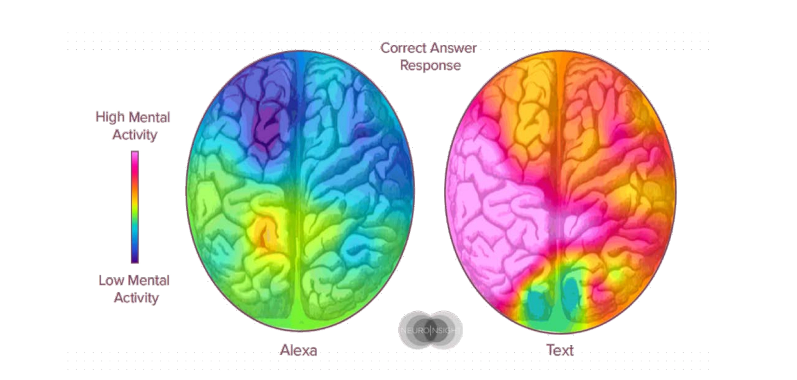
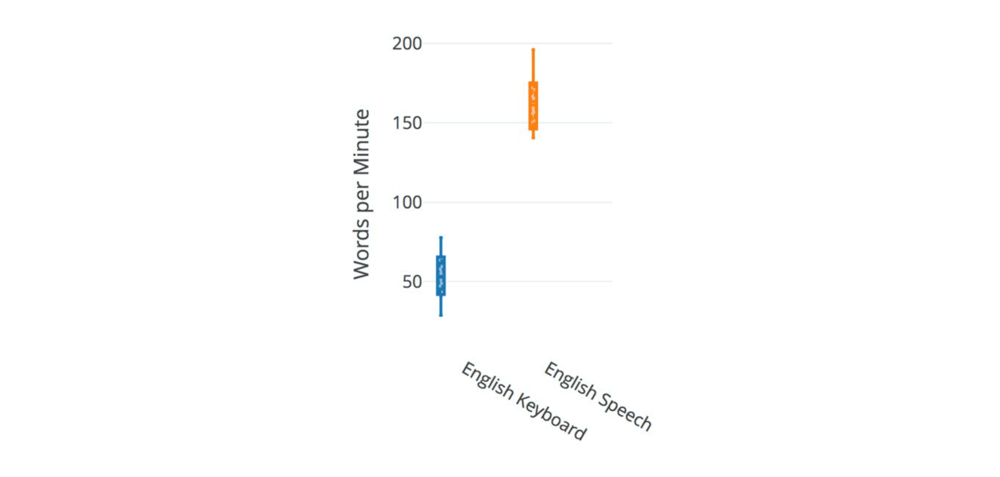
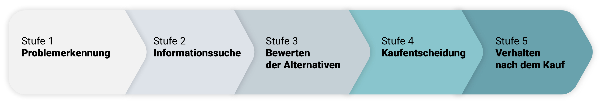
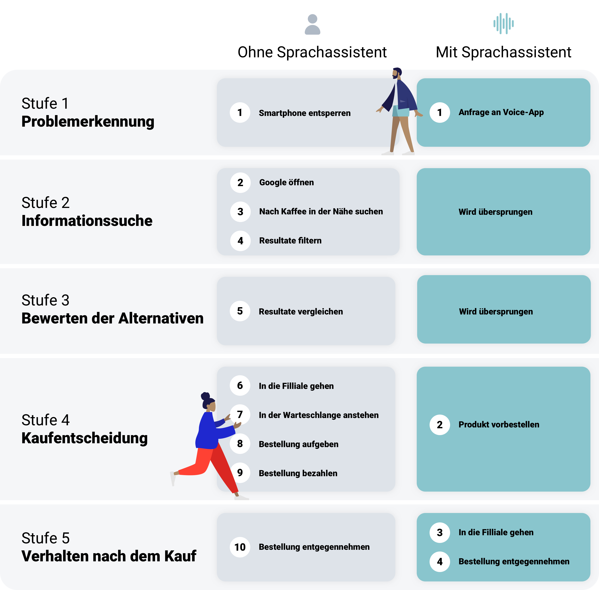

import Margin from 'gatsby-theme-signalwerk/src/components/Margin';
import Grid from 'gatsby-theme-signalwerk/src/components/Grid';
import Column from 'gatsby-theme-signalwerk/src/components/Column';
import Box from 'gatsby-theme-signalwerk/src/components/Box';

<Grid>


*Alexa, Google, Siri & Co. als fester Bestandteil unserer täglichen Routine_.[^:abb:one]_*

</Grid>

## Inhaltsverzeichnis
```toc
exclude: Inhaltsverzeichnis
from-heading: 2
to-heading: 2
```

## 1.0 Einleitung&nbsp;– Sprachassistenten auf dem Vormarsch
Die Verbreitung von Sprachassistenten hat in den letzten Jahren rasant zugenommen. Die smarten Helfer erfreuen sich nicht nur in den USA grosser Beliebtheit. Zurzeit besitzen ca. 30&#x202F;% aller amerikanischen Haushalte Sprachassistenten, diese Zahl wird zukünftig weiter steigen. Laut dem Voicebot Consumer Adaption Report von 2019 wurden in den USA insgesamt 66.4&#x202F;Mio. neue Sprachassistenten installiert, dies entspricht ca. achtmal der Bevölkerung der Schweiz _(Voicebot.ai, 2019, 10).[^:lit:one]_ 

Daher ist es nicht überraschend, dass Unternehmen sich verstärkt mit Sprachassistenten beschäftigen. Da diese einen neuen Kanal zur Kundenkommunikation darstellen. Diese Arbeit verschafft eine Übersicht über den aktuellen technischen Stand von Sprachassistenten sowie Voice-Apps und deren Einsatz in der Customer Journey. Zusätzlich wird aufgezeigt, inwiefern sich die Customer Journey durch den neuen Touch-Point Sprachassistenten hinsichtlich der zunehmenden Dynamik im E-Commerce verändert hat. Erläutert wird das Potenzial von Sprachassistenten und deren Auswirkungen auf die Customer Journey anhand eines praktischen Fallbeispiels.

Dabei werden zuerst die Grundlagen der klassischen Customer Journey nach Kotler _(Kotler et al. 2016, 237–246).[^:lit:two]_ beschrieben und anschliessend anhand der Voice-App von Starbucks [(«Starbucks Reorder»)](https://www.amazon.com/Starbucks-Coffee-Co-Reorder/dp/B01F9RRL46) näher untersucht. Dieses Beispiel ist hierfür besonders geeignet, da die Smartphone-App von Starbucks sich bereits vor Jahren als eine digitale Erweiterung der herkömmlichen Customer Journey etabliert hat. Starbucks versucht diese nun mit der Voice-App für Echo (Alexa, Sprachassistenten von Amazon) zu ergänzen. Durch die Sprachsteuerung und die Integration der Voice-App in den Alltag, soll der Kaufprozess effizienter gestaltet und der Kunde stärker an die Marke gebunden werden _(Held, 2018).[^:qu:one]_

## 2.0 Sprache als Interaktion mit dem Computer
Hinter dem Phänomen Sprachassistent steckt ein Prozess, der im Jahre 1941 mit der ersten Rechenmaschine von Konrad Zuse [Konrad Zuse](https://de.wikipedia.org/wiki/Konrad_Zuse) seinen Anfang nahm. Schon damals stellte man sich die Frage, wie Nutzer mit dem Computer am effizientesten kommunizieren können _(Hörner, 2019, 2).[^:lit:three]_ 

### 2.1 Die Entwicklung der Computerschnittstellen in den letzten 80 Jahren
Die rasante Entwicklung von Computern fing mit der Lochkarte an und ging mit Tastaturen und Textmonitoren zu Monitoren mit Mausbedienung über. So wurden bei Computern Schnittstellen geschaffen, welche die Bedienung erleichtern sollten. In diesem Kontext stellte das Aufkommen von Touchscreens eine weitere grosse Veränderung der Bedienung von Computern dar. Durch die vereinfachte Bedienung sind diese Geräte in der Lage, den Alltag ihrer NutzerInnen massiv zu erleichtern und haben sich aufgrund ihrer Fähigkeiten als ständige Begleiter dieser etabliert. Dabei gilt: je einfacher ein Gerät bedient werden kann, desto massentauglicher ist es [(Siehe auch 1.2 Prinzip des geringsten Aufwandes)](#22-das-prinzip-des-geringsten-aufwandes). Der nächste sinnvolle Schritt in dieser Entwicklung ist unter anderem die berührungsfreie Steuerung mittels Sprache _(Hörner, 2019, 2–5).[^:lit:three]_ 

### 2.2 Das Prinzip des geringsten Aufwandes
Ist die Bedienung eines Geräts intuitiv, empfinden die NutzerInnen dies als angenehm. Dahinter steckt das Prinzip des geringsten Aufwandes. Diese Theorie besagt, dass Lebewesen dazu neigen, ein Ziel auf dem einfachsten Weg zu erreichen. Diesem simplen Prinzip bedienen sich auch zahlreiche anderen Innovationen der letzten Jahrzehnte.

Aufgrund dieser Theorie, ist es nicht verwunderlich, dass Sprache sich als einfachste Form der Bedienung von Computern zunehmend durchsetzt. In einer britischen Studie wurden 102 Smartphone NutzerInnen gebeten, einige Aufgaben jeweils mit dem Smartphone und anschliessend mittels Alexa (Sprachassistentin von Amazon) zu lösen. Währenddessen wurden die Hirnaktivitäten der Teilnehmer gemessen. Dabei konnte erwiesen werden, dass beim Gebrauch von Sprachassistenten die Gehirnaktivität um ein Vielfaches geringer ist, wie beim Tippen auf dem Smartphone. Daraus lässt sich schliessen, dass es einem Individuum deutlich einfacher fällt, ein Gerät durch natürliche Sprache zu bedienen _(JWT, 2017, 21).[^:lit:four]_ 


*Gehirnaktivität bei der Eingabe durch natürliche Sprache und der Eingabe über die Smartphone-Tastatur._[^:abb:two]_*

Doch nicht nur die vereinfachte Bedienung der Geräte mittels Sprache ist ein Grund für die Beliebtheit von Sprachassistenten, sondern auch die Geschwindigkeit, mit der Aufgaben gelöst werden können. Laut einer Studie der Stanford University (2018), erfolgt das Verfahren «Speech to text» 3× schneller als Tippen mit der Tastatur _(Stanford University, 2018).[^:qu:two]_


*Vergleich von Worte per Minute mittels Tastatur und «Speech to text»._[^:abb:three]_*


## 3.0 Sprachassistenten&nbsp;– Hintergrund und Funktionsweise
Durch die steigende Beliebtheit von Sprachassistenten in den USA und Europa, ist es keine Überraschung, dass Unternehmen sich mit dieser vielversprechenden Technologie beschäftigen. In folgendem Kapitel soll darauf eingegangen werden, wie Sprachassistenten funktionieren und wie Unternehmen von Sprachassistenten profitieren.

### 3.1 Was sind Sprachassistenten
Sprachassistenten ermöglichen es den NutzerInnen, mittels natürlicher Sprache mit dem Computer zu kommunizieren. Die Dynamik von Sprachassistenten, welche sie von «Voice interaction», also dem Bedienen eines Computers mittels Stimme (Sprachdialogsystem) unterscheidet, verbirgt sich im Prozess dahinter. Um genauer darauf eingehen zu können, müssen zunächst die Begriffe Sprachdialogsystem (SDS) und Sprachassistent genauer beleuchtet werden _(Hörner, 2019, 7).[^:lit:three]_

#### 3.1.1 Sprachdialogsystem (SDS)
Ein Sprachdialogsystem (SDS) ermöglicht die Steuerung und Dateneingabe mittels natürlicher Sprache am Computer. Diese Art der Bedienung vereinfacht den Gebrauch und die Benutzeroberfläche von Computern erheblich. Jedoch kann ein solches System einen Computer nur sehr eingeschränkt Bedienen _(Hörner, 2019, 7).[^:lit:three]_

Ein Beispiel für ein SDS ist die Bedienung eines Computers über eine Telefonleitung. Es können vorgegebene Abläufe gesteuert werden, allerdings kann das Gerät weder von den Nutzern und Nutzerinnen für andere Zwecke gebraucht werden, noch kann es auf deren Anfragen reagieren. _(Hörner, 2019, 7).[^:lit:three]_

#### 3.1.2 Sprachassistent
Nützlich für den täglichen Gebrauch wird ein Sprachdialogsystem erst, wenn es in einem dynamischen Umfeld funktionieren kann. Dies erfordert im Gegensatz zum SDS erweiterte Fähigkeiten vom System, nämlich das Einordnen vom Gesprochenen in einen umfassenden Kontext, sowie das Verknüpfen von diesem mit weiteren Informationen. Erst hierdurch wird aus einem SDS ein Sprachassistent _(Hörner, 2019, 7).[^:lit:three]_

Als Beispiel für die Verarbeitung von gesprochenen Befehlen wird folgende Anfrage an den Sprachassistenten untersucht: «Wie komme ich am schnellsten mit dem Zug ins Hotel?» Hierbei muss die Bedeutung (Was ist mit dem Begriff «Zug» gemeint?) mit Informationen (Wo ist das Hotel? Wie lautet der aktuelle Standort der Nutzerin oder des Nutzers?) verbunden werden. Ein Sprachassistent kann sich diese Informationen (aktueller Standort sowie der des Hotels wurde nicht genannt) aus GPS Daten sowie früherem Handeln (Buchung des Hotels) der NutzerInnen mit Zugriff auf deren privaten Daten beschaffen. Ebenfalls weiss der Sprachassistent, dass die direkteste Zugverbindung herausgesucht werden soll. Falls ein Zug ausfällt oder Verspätung hat, weist der Sprachassistent auch darauf hin und schlägt eine alternative Verbindung vor. Je nach Gesprächsverlauf und Antwort, kann der Sprachassistent reagieren und gezielt darauf eingehen. Ein Sprachassistent nimmt also, wie es der Name bereits verrät, tatsächlich die Rolle eines Assistenten ein _(Hörner, 2019, 7–8).[^:lit:three]_

### 3.2 Wie funktionieren Sprachassistenten
Verwendet werden Sprachassistenten häufig als App auf dem Smartphone (Siri, Google Assistant) oder als Lautsprecher in der Wohnung (Alexa Echo, Google Home, Apple HomePod). Neu sind diese auch bereits als fester Bestandteil der Haushaltsgeräte und Fahrzeuge zu finden. An dieser Stelle ist es wichtig anzumerken, dass der eigentliche Sprachassistent nicht der Lautsprecher, sondern die Software dahinter ist. Die Geräte (Smartphone, Lautsprecher) dienen lediglich als Schnittstelle zwischen Mensch und Rechenzentrum, welches die Software des Sprachassistenten beheimatet _(Hörner, 2019, 9–10).[^:lit:three]_

Um die Funktionsweise des Sprachassistenten einfach zu erklären, wird das Konzept der Hardware mit dem menschlichen Körper verglichen. Die Software fungiert hierbei als «Gehirn». Folglich können die Bestandteile, welche mit ihrer Umgebung interagieren, als weitere Körperteile verstanden werden, nämlich «Ohren» und «Mund».

#### 3.2.1 Das Mikrofon&nbsp;– die «Ohren» des Sprachassistenten
Damit Sprachassistenten Befehle entgegennehmen können, benötigen sie Mikrofone. Die Geräte müssen jederzeit einsatzbereit sein und nehmen daher ihre Umgebung ständig auf, um Informationen zu verarbeiten. Wird ein festgelegtes Aktivierungswort bemerkt (z.B.: «Ok, Google»), wird die Hardware «Körper», mit der Software «Gehirn», im Rechenzentrum verbunden. Das permanente Zuhören mag zuerst ethisch fragwürdig erscheinen, allerdings deuten Anbieter und Anbieterinnen von Sprachassistenten darauf hin, keine Aufnahmen zu machen, solange kein Aktivierungswort registriert wurde [(Siehe auch: 6.2 Nachteile der Sprachassistenten in der Customer Journey aus Sicht der Kundinnen und Kunden)](#64-vorteile-der-sprachassistenten-in-der-customer-journey-aus-sicht-der-der-kundinnen-und-kunden) _(Hörner, 2019, 10).[^:lit:three]_

#### 3.2.2 Die Software&nbsp;– das «Gehirn» des Sprachassistenten
Die Software verarbeitet jetzt die eingehenden Sprachbefehle. Zuerst muss die Sprache von Hintergrundgeräuschen separiert werden, danach ist das Verstehen des Gesprochenen notwendig, wobei Sinn mit Wissen verknüpft wird. Dazu müssen der Wunsch und die dazugehörige Einschränkung erkannt werden. Bei einer Anfrage wie: «Ok, Google, sag Spotify, es soll die Playlist Training abspielen», wäre der Wunsch das Abspielen der Playlist und die Einschränkung die Namen der Playlists sowie die Software, welche die Musik abspielt. Nach der Verarbeitung erfolgt eine direkte Antwort an die BenutzerInnen, dabei kommen die Lautsprecher («Mund») zum Einsatz _(Hörner, 2019, 10–17).[^:lit:three]_

#### 3.2.3 Lautsprecher&nbsp;– der «Mund» des Sprachassistenten
Die Antwort an die BenutzerInnen des Sprachassistenten erfolgt in der Regel über die Lautsprecher («Mund») und kann die Form eines Sprachfeedbacks, einer Rückfrage oder das Ausführen eines Dienstes annehmen (z.B. Abspielen der Musik) _(Hörner, 2019, 10).[^:lit:three]_


*Skizze der Funktionsweise von Sprachassistenten._[^:abb:four]_*

### 3.3 Wie Unternehmen Sprachassistenten nutzen&nbsp;– das Beispiel Alexa Skills und Voice Apps
Um die Fragestellung, inwiefern sich die Customer Journey durch den neuen Touch-Point «Sprachassistent» verändert hat, beantworten zu können. Wird in folgendem Abschnitt aufgezeigt, wie Unternehmen Sprachassistenten nutzen können. Jedes Gehirn (in diesem Fall die Software des Sprachassistenten) ist nur so gut, wie die Informationen, mit denen es gefüttert wird. Hier kommt eine Besonderheit der Sprachassistenten zu Tage: die Erweiterung des Gehirns und dessen Fähigkeiten durch sog. Voice Apps. Vergleichbar ist dieses System mit dem Smartphone. Nützlich für den Alltag wird das Gerät erst durch Apps von Drittanbietern _(Hörner, 2019, 15).[^:lit:three]_

Voice Apps stellen neben der Verbindung zum Sprachassistenten (z.B. Google Assistent oder Amazon Echo) zusätzlich eine Methode zur Ermittlung von Antworten aus der eigenen Datenbank (Datenbank von Drittanbieterinnen und Drittanbietern) zur Verfügung _(Hörner, 2019, 16–17).[^:lit:three]_

> Geht bei Amazon Echo eine Anfrage in der Form «Alexa, frage (Name der Voice App) …» ein, so sucht der Sprachassistent nach der erwähnten Voice App und holt dort die benötigten Informationen oder führt einen Dienst aus. Dieser Voice App Name ist eine zentrale Voraussetzung für die direkte Aktivierung und Ansprache der Voice App durch die NutzerInnen und muss bei Amazon, Google und gegebenenfalls in Systemen anderer Sprachassistenten hinterlegt werden (vgl. Hörner, 2019, 17).[^:lit:three]

Ein Beispiel für eine solche Anfrage, ist die Kommunikation mit [«Bring»](https://getbring.com/#!/app), einer Einkaufslisten App, welche mittels Sprachassistent bedient werden kann: «Alexa, frage ‹Bring›, ob ich Milch schon der Einkaufsliste hinzugefügt habe». Der Sprachassistent beantwortet die Anfrage nun nicht über eine Google Suche, sondern greift auf die Informationen der Voice App zu.

## 4.0 Die Customer Journey
Die Digitalisierung ermöglicht die Aufzeichnung und das Verarbeiten des Kundenverhaltens. Dadurch rückt die Customer Journey, also alle Kontaktpunkte zwischen einem Kunden und der Marke bis zum Kauf des Produkts, stärker in den Fokus von Marketingstrategien. Damit im nächsten Kapitel die Customer Journey mit Sprachassistenten anhand eines Fallbeispiels untersucht werden kann, werden in diesem Kapitel die Grundlagen der Customer Journey erläutert _(Hörner, 2019, 66).[^:lit:three]_

Vorab muss erwähnt werden, dass die Customer Journey nie für alle Kunden gleich abläuft. Trotz der Unterschiede, lässt sich in allen Customer Journeys ein ähnliches Kundenverhalten in bestimmten Phasen erkennen. Ein gängiges Modell zur Darstellung dieser Phasen ist das fünfstufige Kaufentscheidungsmodell von Kotler _(Kotler et al. 2016, 237–246).[^:lit:two]_ Aufgrund seiner begrenzten Anzahl an Stufen lässt sich der Kaufprozess mithilfe dieses Modells im Vergleich zu anderen Modellen vereinfacht darstellen. Daher ist es durchaus dazu geeignet, das Potential von Sprachassistenten in der Customer Journey an einem Beispiel aufzuzeigen _(Hörner, 2019, 16–17).[^:lit:three]_


*Der Kaufprozess nach Kotler mit seinen insgesamt 5 Stufen._[^:abb:five]_*

In der ersten Stufe des Modells geht es um die Problemerkennung, welche beim Kunden entweder durch innere oder äussere Einflüsse ausgelöst werden kann. Innere Einflüsse gehen von den Kundinnen und Kunden aus, während äussere Einflüsse meist durch herkömmliche Werbung ausgelöst werden. Beispielsweise können ein Hungergefühl (innerer Einfluss) oder das Bedürfnis nach erhöhter körperlicher Leistung (äusserer Einfluss) als Auslöser für den Kauf eines Snacks angesehen werden. Es lässt sich also feststellen, dass am Anfang einer Kaufentscheidung immer ein Bedürfnis oder eine Problemerkennung stehen _(Hörner, 2019, 68).[^:lit:three]_ Auf die Problemerkennung folgt die Informationssuche. Hierbei geht es darum, zu erkennen, wie das Problem gelöst oder das Bedürfnis befriedigt werden kann. Für den Kunden geht es hierbei darum, wer das passende Produkt oder die passende Dienstleistung anbieten kann _(Hörner, 2019, 71).[^:lit:three]_ Wurden in der Phase der Informationssuche mehrere Anbieterinnen und Anbieter gefunden, so geht es in der dritten Stufe darum, diese zu prüfen und zu vergleichen _(Hörner, 2019, 75–76).[^:lit:three]_ Hierfür kann die Google Suche als ein Beispiel betrachtet werden, wobei die Kundinnen und Kunden sich zwischen zwei Angeboten entscheiden sollen. Die Ergebnisse, welche nun in der Google Suchergebnissen erscheinen, sind ausschlaggebend für ihre Kaufentscheidung. Als Beispiel für solche Informationen können Ort, Preise, Produkte und Bewertung angesehen werden. Darauf folgt die vierte Stufe, nämlich die Kaufentscheidung, bei der es darum geht, den Kaufprozess der Kundin oder des Kunden möglichst einfach zu gestalten. Im Falle eines Onlineshops kann dies durch einen auf wenige Schritte reduzierten Checkout-Prozess ermöglicht werden _(Hörner, 2019, 79).[^:lit:three]_ In der letzten Phase, der nach dem Kauf, ist es wichtig, der Kundin oder dem Kunden ein gutes Gefühl zu geben. Der Kauf soll sich richtig anfühlen. Dies kann bei einem Online Einkauf durch eine Bestätigungsmail erfolgen. Aber auch Versandverfolgungs- und Rücksendemöglichkeiten können dieses positive Gefühl verstärken _(Hörner, 2019, 80).[^:lit:three]_

## 5.0 Die Customer Journey mit Sprachassistenten: Fallbeispiel der Starbucks Voice-App («Starbucks Reorder»)
2010 wurde die [Starbucks App](https://www.starbucks.ch/coffeehouse/mobile-apps/) für Smartphones eingeführt. Damit kann der Kunde jederzeit auf die Digitalform seiner Mitgliedskarte zugreifen und somit mit dem Smartphone an der Kasse bezahlen. 2017 wurde erstmals die Voice-App [(«Starbucks Reorder»)](https://www.amazon.com/Starbucks-Coffee-Co-Reorder/dp/B01F9RRL46) von Starbucks für Alexa vorgestellt. Der User kann sich in dieser mit demselben Account wie in der etablierten Starbucks-App registrieren. Durch das Einbinden des gleichen Accounts wie auf der Smartphone-App wird dem Sprachassistenten der Zugriff auf bisherige Bestellungen sowie besuchte Filialen ermöglicht _(CNET News, 2017).[^:qu:five]_ Hierdurch kann der Kunde mittels natürlicher Spracheingabe bisher getätigte Bestellungen in der Filiale seiner Wahl erneut platzieren. Um die Voice-App zu benutzen, muss mindestens eine Bestellung via Smartphone App getätigt worden sein _(Duncan, 2019).[^:qu:three]_

<br/>

<Box ratio="16:9">

<iframe width="560" height="315" src="https://www.youtube.com/embed/3C6qVqwy5TA" frameborder="0" allow="accelerometer; autoplay; encrypted-media; gyroscope; picture-in-picture" allowfullscreen></iframe>

</Box>

<br/>

Nun soll der Einfluss von Sprachassistenten anhand eines praktischen Beispiels aufgezeigt werden, nämlich soll der Kunde seinen Starbucks Kaffee über die Voice-App für Echo bestellen. Im Vergleich mit der herkömmlichen User Journey ohne Sprachassistenten, lässt sich durch den Dialog mit dem Kunden eine enorme Steigerung in der Effizienz feststellen. Insgesamt wirkt sich das vor allem durch die Reduktion mehrerer Teilschritte auf wenige gezielte Anfragen auf die Dynamik aus. Früher musste der Kunde ein Vielfaches an Teilschritten ausführen um an seine Bestellung zu gelangen. Interessant ist auch das komplette Überspringen der Informationssuche und der Bewertung von Alternativen. Diese unterschiedlichen Abläufe der Customer Journey sollen an folgender Grafik aufgezeigt werden.


*Teilschritte in der Cutomer Journey von Starbucks, mit und ohne Sprachassistent._[^:abb:six]_*

Im [vorherigen Kapitel](#40-die-customer-journey) wurde das Modell nach Kotler beschrieben, nun soll anhand dessen die Voice App «Starbucks Reorder» als ein praktisches Fallbeispiel an den einzelnen Stufen näher untersucht werden.

### 5.1 Stufe 1: Problemerkennung durch Sprachassistenten
Sprachassistenten können ein Bedürfnis der NutzerInnen erkennen und diese unterbewusst darauf hinweisen. Es ist nicht anzunehmen, dass das Prinzip der bisher unterbrechender Werbung in digitalen Audiomedien (bspw. Werbung in Spotify), auch auf Sprachassistenten erfolgreich bestehen kann _(JWT, 2017, 30–31).[^:lit:four]_ Vielmehr fliesst der Hinweis auf ein Bedürfnis in die alltägliche Hilfestellung eines Sprachassistenten und einer Voice-App ein _(Hörner, 2019, 70).[^:lit:three]_ Zum Beispiel kann der Kunde sein Guthaben auf der Mitgliedskarte von Starbucks einsehen (Hilfestellung). Die [Starbucks Voice-App](https://www.amazon.com/Starbucks-Coffee-Co-Reorder/dp/B01F9RRL46) ermöglicht diesen Service ohne eine Website oder eine App öffnen zu müssen. Der Befehl «Alexa, frage Starbucks nach dem Guthaben meiner Mitgliedschaft» ersetzt mehrere Teilschritte, die ursprünglich notwendig waren, um an diese Informationen zu gelangen. Durch diesen vereinfachten Zugriff (Mehrwert) auf die Benutzerdaten, beschäftigen sich die Kundinnen und Kunden mit der Marke und werden viel eher auch gleich noch eine Bestellung platzieren _(Duncan, 2019).[^:qu:three]_ 

### 5.2 Stufe 2 und 3: Informationssuche und Bewerten der Alternativen mit Sprachassistenten
In diesem Szenario befinden sich die Kundinnen und Kunden zu Hause und werden sich in Kürze auf den Weg zur Arbeit machen. Sie besitzten eine Mitgliedschaft bei Starbucks und haben zusätzlich die [Voice-App](https://www.amazon.com/Starbucks-Coffee-Co-Reorder/dp/B01F9RRL46) des Kaffee Herstellers zu Hause auf Amazon Echo (Alexa) installiert. Für die NutzerInnen werden die Auswirkung von Sprachassistenten auf die Customer Journey vor allem in den Phasen der Informationssuche sowie der Bewertung der Alternativen besonders spürbar. Haben sich diese bewusst für die Starbucks-App auf ihrem Smartphone sowie der Starbucks-Voice App für Echo (Alexa) entschieden, so ist die Informationssuche und das Bewerten der Alternativen nicht mehr notwendig _(Duncan, 2019).[^:qu:three]_ Mussten die Kundinnen und Kunden früher die Resultate filtern, die Alternativen miteinander vergleichen und sich zwischen diesen entscheiden, ist die ausgewählte Marke (Starbucks) nun zu einem festen Bestandteil ihrer täglichen Routine geworden _(Hörner, 2019, 75–76).[^:lit:three]_

### 5.3 Stufe 4: Kaufentscheidung mit Sprachassistenten
Durch die Steigerung der Effizienz mittels Sprachassistenten und das Integrieren der Voice-App in den Alltag der NutzerInnen, überspringen diese die zweite und die dritte Phasen in der Customer Journey nach Kotler. Vielmehr gehen diese direkt in die vierte Stufe über, nämlich die der Kaufentscheidung. Hierbei geht es wie auch in der herkömmlichen Customer Journey darum, wie einfach oder komfortabel ein Produkt gekauft werden kann _(Hörner, 2019, 79–80).[^:lit:three]_

#### 5.3.1 Aktivierung der Voice-App
Die Kundinnen und Kunden stellen nun folgende Anfrage an den Sprachassistenten und die Voice-App: «Alexa, sag Starbucks, ich möchte meinen Lieblingskaffee zum Abholen in meiner Filiale bestellen». Durch das Aktivierungswort «Alexa» hört der Sprachassistent der Umgebung nun aktiv zu. Anhand der Anweisung «sag Starbucks», weiss der Sprachassistent, dass er sein «Gehirn» (Software) (s. 2.0 Sprachassistenten&nbsp;– Hintergründe und Funktionsweise) um die Informationen aus der Starbucks Datenbank erweitern muss. Nun verbindet er sich mit der vorinstallierten Starbucks Voice-App. Erst jetzt kann der Sprachassistent die Anfrage bearbeiten _(Hörner, 2019, 16–17).[^:lit:three]_ Dies ist notwendig, da die Anfrage der Kundinnen und Kunden mehrere der Software unbekannte Parameter enthält. Somit sind deren Lieblingskaffee sowie die betroffene Filiale Informationen, welche in der Voice-App von Starbucks vorhanden sind _(Hörner, 2019, 7–8).[^:lit:three]_

#### 5.3.2 Verarbeitung der Bestellung durch den Sprachassistenten
Hat der Sprachassistent die Anfrage entgegengenommen, muss diese nun verarbeitet sowie ein Feedback an die Kundinnen und Kunden zurückgegeben werden. Auf die oben beschriebene Anfrage wird ihnen folgendes Feedback wiedergegeben: «Ein Kaffee (Produktname) wurde dem Warenkorb hinzugefügt und ist um XX:XX&#x202F;Uhr (Zeit) in folgender Filiale (Ort) zum Abholen bereit. Möchtest du den Kaffee für ein Total von XX.XX&#x202F;CHF (Betrag) bestellen?» Somit werden der Kundin und dem Kunden nochmals alle Details ihrer Bestellung in einem kurzen Satz vermittelt, da bei einer Bestellung über einen Sprachassistenten nicht zwingend ein Interface mit visuellem Feedback vorausgesetzt werden kann _(Hörner, 2019, 79–80).[^:lit:three]_

Der Einsatz von Sprachassistenten ermöglicht den Kundinnen und Kunden mehr Flexibilität, somit können diese den gesamten Prozess parallel zu einer anderen Tätigkeit ausführen. Zum Beispiel können sie zu Hause, während dem sie die Bestellung aufgeben, gleichzeitig eine Jacke anziehen, da sie durch die Sprachbedienung die Hände frei haben. Früher war dies nicht möglich, da für eine Bestellung ein Device (Smartphone oder Computer) notwendig waren. Dies wirkt sich zudem vor allem durch die Integration in den Alltag auf die Dynamik aus. Die Kundinnen und Kunden beginnen alltägliche Tätigkeiten (das Anziehen einer Jacke) mit einer Bestellung zu verbinden _(Held, 2018).[^:qu:one]_

### 5.4 Stufe 5: Verhalten nach dem Kauf mit Sprachassistenten
Auch bei der Customer Journey mit Sprachassistenten gilt es in der Phase nach dem Kauf, den Kundinnen und Kunden ein positives Gefühl zu geben. Im Beispiel der Starbucks Voice-App kann diese ihre bezahlte Bestellung abholen, ohne in der Schlange anstehen zu müssen. Die Bestellungen werden immer bereit sein, sobald der sie die Filiale betreten. Dadurch gestaltet sich die tägliche Kaffeebestellung mittels Voice-App effizienter als früher. Zusätzlich können die Kundinnen und Kunden durch die Voice-App ihre Benutzerdaten unkompliziert mittels Sprache abrufen. Anders formuliert, gilt es den Kundinnen und Kunden Möglichkeiten zu bieten, sich auch mittels Sprachassistenten mit der Marke zu beschäftigen. Hinsichtlich der Dynamik wird dies durch die Integration der Marke in den Alltag durch die Voice-App bemerkbar. Im Vergleich zu früher ist die Marke bei den Kundinnen und Kunden ein fixer Bestandteil geworden und im Normalfall konkurrenzlos. Dadurch kann in Zukunft über gesammelte Daten, persönlichen Dialoge, Informationsanfragen und Hilfestellungen, die Bindung von Kundinnen und Kunden an die Marke erhöht werden _(Hörner, 2019, 81).[^:lit:three]_

## 6.0 Diskussion
Sprachassistenten bringen viele Neuerungen in unseren Alltag ein und ermöglichen eine neue Art der Interaktion zwischen der Marke und deren Kundinnen und Kunden. Durch Dialoge und Hilfestellungen integriert sich die Marke stärker in deren Alltag als beispielsweise herkömmliche Apps für das Smartphone. Für die Kundinnen und Kunden wird der Gebrauch einer Voice-App selbstverständlich. Auch können komplexe Aufgaben, für die früher mehrere Teilschritte benötigt wurden, durch eine einzige Anfrage an den Sprachassistenten erledigt werden _(Held, 2018).[^:qu:one]_

Trotz grosser Fortschritte in den letzten Jahren steckt die Entwicklung von Sprachassistenten allerdings noch in den Kinderschuhen. Daher ist es nachvollziehbar, dass Sprachassistenten in der Customer Journey zurzeit abgesehen von den vielen Vorteilen, auch Nachteile mit sich bringen. In den folgenden Unterkapiteln werden die Vor- und Nachteile von Sprachassistenten in der Customer Journey jeweils aus der Sicht von Kundinnen und Kunden sowie Anbieterinnen und Anbieter aufgeführt.

### 6.1 Nachteile der Sprachassistenten in der Customer Journey aus Sicht der Anbieterinnen und Anbieter
Einer dieser Nachteile kann das Fehlen eines Bildschirms bei gewissen Produkten sein. Eine Umfrage von [JWT](https://www.jwt.com/de/) ergab, dass sich das Einkaufen über Sprachassistenten aufgrund des fehlenden Bildschirms eher auf alltägliche Einkäufe wie Lebensmitteln oder Gegenstände geringen Werts konzentriert _(JWT, 2017, 10).[^:lit:four]_ Dies kann gewisse Anbieterinnen und Anbieter davon abschrecken, sich überhaupt mit Sprachassistenten zu beschäftigen. Beispielsweise können DetailhändlerInnen, deren Produktsortiment eine extrem breite Preisspanne aufweist, niemals alle Produkte über eine Voice-App anbieten. Vielleicht könnte sich ein bestimmter Teil des Sortiments auf dem Kanal Voice-App sehr gut verkaufen. Dennoch würden die Kundinnen und Kunden die teureren Produkte schlichtweg nicht über diesen Kanal erwerben. Es stellt sich für Unternehmen hier die Frage, ob es sich überhaupt lohnt, dem Trend von Sprachassistenten nachzugehen oder ob die Ressourcen besser in den bisherigen Onlineauftritt investiert werden sollten.

Zusätzlich wird es für Unternehmen zukünftig von grosser Bedeutung sein, eine enge Beziehung mit Google, Apple und Amazon zu pflegen, da diese Anbieterinnen und Anbieter die entscheidenden Faktoren (sog. Gatekeeper) in den Phasen der Problemerkennung und Informationssuche der Customer Journey mit Sprachassistenten sein werden. Dies kann für gewisse Unternehmen ein Nachteil sein, da nicht alle über dieselben Ressourcen verfügen, um sich in den Spitzenpositionen des Marktes platzieren zu können _(JWT, 2017, 30–31).[^:lit:four]_

### 6.2 Nachteile der Sprachassistenten in der Customer Journey aus Sicht der Kundinnen und Kunden
Gatekeeper spielen auch für die Kundinnen und Kunden eine wichtige Rolle. Es ist anzunehmen, dass es einzelnen Voice-App Anbieterinnen und Anbieter gelingen wird, sich Spitzenpositionen zu sichern (bspw. Uber oder Starbucks) und diese fast schon Monopolstellungen im Bereich der Bedienung mittels Sprachassistenten geniessen werden. Allerdings macht dies das Angebot auf Sprachassistenten sehr einseitig. Die meisten NutzerInnen wollen aber nicht nur einseitige Angebote beziehen können, die Anfrage an den Sprachassistenten oder an eine Voice-App sollte vielmehr die optimalen Optionen aufzeigen und den Kundinnen und Kunden somit als Assistenten unterstützen _(JWT, 2017, 30–31).[^:lit:four]_

Auch bringt die Interaktion zwischen dem Individuum und dem Gerät mittels Sprache eine neue Komplexität bezüglich der Eingabe mit sich. Sprachassistenten können die natürliche Sprache zwar immer besser verstehen und können die gesprochenen Befehle mittlerweile sehr gut verarbeiten, dennoch gibt es Probleme die noch nicht gelöst sind. Dialekte sowie Behinderungen beeinträchtigen den Umgang mit Sprachassistenten. Für Menschen mit sprachlichen Behinderungen ist es fast unmöglich, einen Sprachassistenten zu nutzen _(JWT, 2017, 14–15).[^:lit:four]_

Eine weitere Hürde ist die Privatsphäre. Laut einer Umfrage von JWT _(JWT, 2017, 14–15)[^:lit:four]_, fühlen sich 22&#x202F;% der befragten Personen unwohl dabei, einen Sprachassistenten in der Öffentlichkeit zu benutzen. Das Lauschen umstehender Personen, stellt für viele einen Eingriff in die Privatsphäre dar. Für 44&#x202F;% der befragten Personen geht der Eingriff in die Privatsphäre noch weiter. Sie fühlen sich nicht nur durch umstehende Personen belauscht, sie haben auch Bedenken, dass Sprachassistenten permanent zuhören und Gespräche aufzeichnen _(Voicebot.ai, 2019, 30).[^:lit:one]_ 

### 6.3 Vorteile der Sprachassistenten in der Customer Journey aus Sicht der Anbieterinnen und Anbieter
Trotz der bisher aufgegriffener Bedenken gewinnen Sprachassistenten zunehmend an Beliebtheit&nbsp;– das nicht ohne Grund. Sprachassistenten bieten den Anbieterinnen und Anbietern einen Mehrwert, somit ergeben sich durch die neu geschaffenen Kontaktpunkte mittels Sprachassistenten und Voice-Apps neue Möglichkeiten mit Kundinnen und Kunden in Kontakt zu treten. Durch personalisierte Dialoge können Bedürfnisse bei ihnen einfacher geweckt werden. Zusätzlich kann sich eine Anbieterin oder ein Anbieter einer Voice-App in deren Alltag integrieren. Bedingung hierfür ist ein offensichtlicher Mehrwert für die NutzerInnen. Dadurch werden Massnahmen zur Bindung von Kundinnen und Kunden subtiler und im Vergleich zu herkömmlichen Massnahmen effektiver _(Held, 2018).[^:qu:one]_

### 6.4 Vorteile der Sprachassistenten in der Customer Journey aus Sicht der Kundinnen und Kunden
Nicht nur für Anbieterinnen und Anbieter, sondern auch für Kundinnen und Kunden ergeben sich durch die neu geschaffenen Kontaktpunkte in der Customer Journey mehrere Vorteile. Durch Sprachassistenten wird die Bedienung einfacher und effizienter. Dies bestätigen laut einer einer Umfrage von JWT _(JWT, 2017, 14–15)[^:lit:four]_ auch 76&#x202F;% der befragten NutzerInnen. Durch die Sprache wird die Bedienung und der Prozess des Einkaufens natürlicher, einfacher und schneller [(Siehe auch: 2.0 Sprache als Interaktion mit dem Computer)](#20-sprache-als-interaktion-mit-dem-computer) _(JWT, 2017, 14–15)[^:lit:four]_, was wiederum die Effizienz dieser Vorgänge steigert. 

Wie im obigen Fallbeispiel verdeutlicht wurde, ist Effizienz einer der Hauptgründe für die Nutzung von Sprachassistenten. Sinnbildlich dafür steht die im Fallbeispiel gezeigte Grafik[^:abb:six]. Komplexe Abläufe, die früher auf dem Computer oder dem Smartphone mehrere Teilschritte benötigten, werden durch Dialoge und Personalisierung auf wenige Anfragen ohne Bildschirm oder Device reduziert _(Held, 2018).[^:qu:one]_

Ein Teilaspekt dieser Effizienzsteigerung ist auch die Personalisierung. Sprachassistenten und Voice-Apps merken sich jetzt schon gewisse Parameter aus den Anfragen (oder diese können Hinterlegt werden) und können so in Zukunft noch genauer auf die Kundinnen und Kunden eingehen. Es reicht mittlerweile «Im Lieblingskino» oder «Im Lieblingsrestaurant» zu reservieren. Auch werden bei Anfragen vermehrt Standort, Arbeitsweg oder Wohnsitz in die Antwort miteinbezogen. So wird den Kundinnen und Kunden genau das gezeigt, was sie zu diesem Zeitpunkt interessiert. Die Fähigkeit der Personalisierung spiegelt sich auch in den Bedürfnissen der NutzerInnen wieder. Sprachassistenten sollten sie so verstehen, wie sie ihre Mitmenschen verstehen _(JWT, 2017, 26–27).[^:lit:four]_

## 7.0 Fazit
Sprachassistenten und Voice-Apps sind immer mehr dazu in der Lage, Menschen zu verstehen und integrieren sich zunehmend in deren Alltag. Dies als einen Hype abzustempeln wäre angesichts der aktuellen Entwicklung falsch. Während Devices mit Bildschirmen in den nächsten Jahren klar das wichtigste Medium bleiben, wird die Akzeptanz für Sprachassistenten weiter zunehmen _(Held, 2018).[^:qu:one]_ Der aktuelle technische Stand von Sprachassistenten und Voice-Apps erlaubt es jetzt schon, diese in unterschiedlichste Geräte einzubauen. Die smarten Helfer sind mittlerweile in Smartphones, Autos und Stores zu finden. Unternehmen setzen vermehrt auf das Medium Sprachassistent und können selber ein Teil davon werden. Der Kunde kann anstatt dem Sprachassistenten und Google, eine Marke direkt via Voice-App ansprechen und somit auf eine spezifische Datenbank des Herstellers zugreifen. Dadurch können sich Marken gezielter in die Customer Journey mit Sprachassistenten platzieren _(Hörner, 2019, 16).[^:lit:three]_

Inwiefern sich die Customer Journey durch den neuen Touch-Point Sprachassistenten verändert hat, wurde im [Fallbeispiel](#50-die-customer-journey-mit-sprachassistenten-fallbeispiel-der-starbucks-voice-app-«starbucks-reorder») anhand des Kaufprozesses nach Kotler veranschaulicht. Durch die Aufteilung der Customer Journey in fünf Phasen, wurden die Veränderungen hinsichtlich der Dynamik hervorgehoben. Aufgezeigt wurde, dass Sprachassistenten sich vermehrt in unseren Alltag integrieren. Verdeutlicht wird dies durch das Überspringen der zweiten und dritten Phase, nämlich der Informationssuche und Bewertung der Alternativen. Durch die Integration der Marke in den Alltag der Kundinnen und Kunden, sind diese stärker an sie gebunden und wenden sich seltener anderen Alternativen zu _(Held, 2018).[^:qu:one]_

Ein grosser Vorteil von Sprachassistenten ist die Effizienz. Durch die Interaktion mittels natürlicher Sprache werden komplexe Abläufe auf eine einzelne gezielte Anfragen reduziert und ermöglichen den NutzerInnen so eine natürliche Art der Kommunikation mit Computer und Marke. Die aktuelle Entwicklung von Sprachassistenten in der Customer Journey steht noch am Anfang, eine deutliche Tendenz in Richtung Voice-Commerce ist jedoch vorhanden _(Held, 2018).[^:qu:one]_

## 8.0 Ausblick
Die Customer Journey hat sich durch den Einsatz von Sprachassistenten gewandelt und wird sich auch zukünftig weiterhin verändern. Die Zukunft wird vermehrt im Gebiet des Assistenten und der Personalisierung sein. Sprachassistenten werden die menschliche Sprache noch besser verstehen und noch gezielter auf die Kundinnen und Kunden eingehen können _(JWT, 2017, 40–41).[^:lit:four]_

### 8.1 Auf kurze Sicht: Verstehen der NutzerInnen
Einerseits werden Sprachassistenten besser sprachlich mit den NutzerInnen kommunizieren können. Sie werden schnellere, natürlichere Dialoge führen können. Andererseits werden sie sich auf der Bedürfnisebene weiterentwickeln. Sprachassistenten werden die NutzerInnen noch besser verstehen und diesen Produkte und Inhalte zeigen können, die sie genau zu diesem Zeitpunkt an diesem Ort interessieren. Zurzeit stecken Sprachassistenten noch in den Startlöchern, was kontinuierliche Dialoge angeht, doch in diesem Bereich werden in naher Zukunft einige Fortschritte beobachtet werden können _(JWT, 2017, 22–21, 32–33).[^:lit:four]_

### 8.2 Auf lange Sicht: Marken finden ihre Stimme
Zurzeit gibt es noch nicht die Möglichkeit, die Stimmen und Persönlichkeiten von Sprachassistenten anzupassen. Doch in Zukunft werden Marken ihre eigene, individuelle Stimme entwickeln _(MetaProfiler, 2019).[^:qu:four]_ Denn nicht jede Marke identifiziert sich mit der Stimme und Persönlichkeit von Alexa, Siri & Co. und umgekehrt. So kann in Zukunft die Markenbindung und -individualität durch individuelle Stimmen und Persönlichkeiten der Voice-Apps noch mehr gestärkt werden _(JWT, 2017, 38–39).[^:lit:four]_ 


<Grid>

---

</Grid>


<!-- references text-->

<!--
Vorname Nachname, [Titel der Seite](https://www.google.com/) (Abrufdatum: dd. mm. yyyy).
Vorname Nachname, Buchtitel, Auflage, Verlag, Erscheinungsort Jahr, erste Seite – letzte Seite.
-->

[^:lit:one]: Bret Kinsella, Ava Mutchler, Voicebot Consumer Adaption Report 2019, Voicebot.ai, USA 2019, [voicebot.ai](https://voicebot.ai/smart-speaker-consumer-adoption-report-2019/)
[^:lit:two]: Philip Kotler, Gary Armstrong, Lloyd C. Harris, Grundlagen des Marketing, 7. Auflage, Pearson Studium, Vereinigtes Königreich 2019.
[^:lit:three]: Thomas Hörner, Marketing mit Sprachassistenten, Springer Gabler, Deutschland 2019.
[^:lit:four]: Marie Stafford, J. Walter Thompson, Speak Easy, JWT, London 2017. [jwtintelligence](https://www.jwtintelligence.com/trend-reports/speak-easy/)


## Literaturverzeichnis
```references
# gets repalced with footnotes
group-include: lit

inline-link-prefix: 'Lit.&#x202F;'

reference-link-prefix: '↑ Lit. '
reference-link-suffix: ''

reference-text-suffix: ' – '
```

[^:qu:one]: Samuel Held, [locationinsider](https://locationinsider.de/voice-commerce-wie-aus-alexa-google-assistant-siri-und-cortana-die-touchpoints-der-zukunft-werden/) (Abrufdatum: 09. 12. 2019)

[^:qu:two]: Sherry Ruan, Jacob O. Wobbrock, Kenny Liou, Andrew Ng, James Landay, [stanford](https://hci.stanford.edu/research/speech/index.html) (Abrufdatum: 10. 12. 2019)

[^:qu:three]: Zachary Duncan, [medium](https://medium.com/voice-tech-podcast/how-starbucks-can-utilize-voice-tech-why-your-business-should-too-b237f9840533) (Abrufdatum: 13. 12. 2019)

[^:qu:four]: MetaDesign, [MetaProfiler](https://metaprofiler.com/) (Abrufdatum: 12. 12. 2019)

[^:qu:five]: CNET News, [Youtube CNET-News](https://www.youtube.com/watch?v=3C6qVqwy5TA) (Abrufdatum: 08. 12. 2019)


## Quellenverzeichnis
```references
# gets repalced with footnotes
group-include: qu

inline-link-prefix: 'Qu.&nbsp;'

reference-link-prefix: '↑ Qu. '
reference-link-suffix: ''

reference-text-suffix: ' – '
```

[^:abb:one]: Abbildung erstellt von Nils Mäder, design library free for commercial or personal use by [Pablo Stanley](https://twitter.com/pablostanley), [humaaans](https://www.humaaans.com/)

[^:abb:two]: Abbildung von Marie Stafford, J. Walter Thompson, Speak Easy, JWT, London 2017, 20–21.

[^:abb:three]: Abbildung von Sherry Ruan, Jacob O. Wobbrock, Kenny Liou, Andrew Ng, James Landay, [stanford](https://hci.stanford.edu/research/speech/index.html) 

[^:abb:four]: Abbildung von Thomas Hörner, Marketing mit Sprachassistenten, Springer Gabler, Deutschland 2019, 11.

[^:abb:five]: Abbildung erstellt von Nils Mäder, Grundlage der Grafik von [Thomas Groissberger](http://www.groissberger.at/phasen-des-kaufprozesses-nach-kotler/).

[^:abb:six]: Abbildung erstellt von Nils Mäder, design library free for commercial or personal use by [Pablo Stanley](https://twitter.com/pablostanley), [humaaans](https://www.humaaans.com/)

## Abbildungsverzeichnis
```references
# gets repalced with footnotes
group-include: abb

inline-link-prefix: 'Abb.&#x202F;'

reference-link-prefix: '↑ Abb. '
reference-link-suffix: ''

reference-text-suffix: ' – '
```


<Grid>

---

<Column start="1" end="5">

#### Mentoring durch
Ulrike Felsing <br/>
HFIAD 2017 <br/>
Schule für Gestaltung Zürich <br/>
[ulrike.felsing@sfgz.ch](mailto:ulrike.felsing@sfgz.ch)

</Column>

<Column start="5" end="13">

#### Vorgelegt von
Nils Mäder<br/>
Zürichstrasse 8<br/>
8610 Uster<br/>
[mail@nilsmaeder.ch](mailto:mail@nilsmaeder.ch)
</Column>

</Grid>
