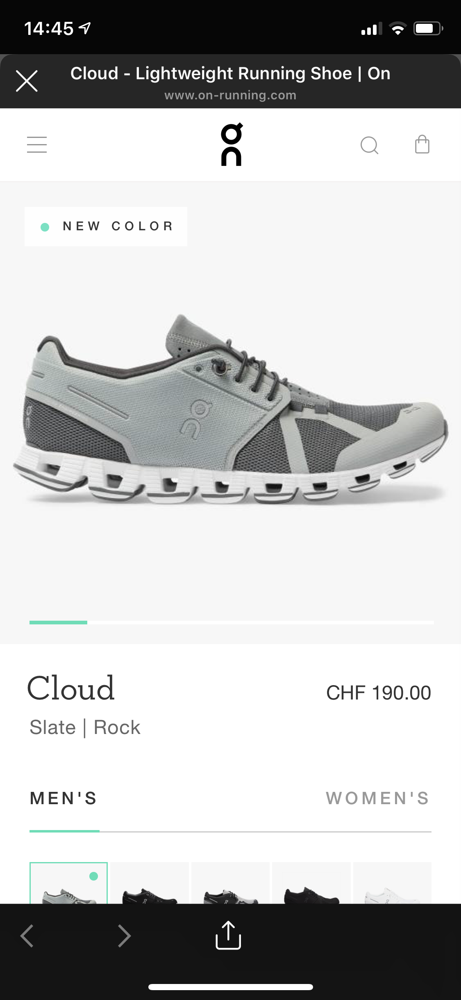

import Margin from 'gatsby-theme-signalwerk/src/components/Margin';
import Grid from 'gatsby-theme-signalwerk/src/components/Grid';
import Column from 'gatsby-theme-signalwerk/src/components/Column';
import Box from 'gatsby-theme-signalwerk/src/components/Box';


## 1 Einleitung
Soziale Medien sind heutzutage nicht mehr wegzudenken. Facebook, Instagram, Twitter und viele weitere haben sich in unser alltägliches Leben eingenistet. Beiträge werden angeschaut, bewertet und geteilt. Diese erhalten heutzutage professionellen Charakter in der Bild -und Videosprache. Es war bisher nur eine Frage der Zeit, wann kommerzielle Firmen auf die Plattformen aufspringen, um sich kundennah zu präsentieren. Nun ist es soweit, dass sie ihre Produkte darüber verkaufen. Im Rahmen dieser Arbeit möchte ich auf das Kaufverhalten der NutzerInnnen auf sozialen Plattformen eingehen. Ich stelle mir die Frage, wie das Kaufverhalten durch Social Commerce beeinflusst wird und wie es Onlineshopping zum sozialen Erlebnis macht. Zusätzlich gehe ich auf den heutigen Bestellprozess auf einer Sozialen Plattform ein. Dort zeige ich verschiedene Methoden auf, die sich eignen, diesen zu verbessern. Auf welche Arten Unternehmen ihre Beiträge auf Sozialen Plattformen platzieren werde ich nicht darlegen. Ebenfalls werde ich nicht auf InfluencerInnen und dessen Verkaufsstrategien eingehen.
In einem konkreten Fallbeispiel von Instagram beleuchte ich den Kaufprozess eines Produktes und dessen potential in Zukunft. Dieses Beispiel zeigt auf, dass der «One Click» Kaufprozess der Schlüssel für viele Unternehmen darstellt. In einem zweiten Fallbeispiel werde ich den chinesischen Markt analysieren und feststellen, wie weit dieser bezüglich Social Commerce entwickelt ist. Ich werde zeigen, wo der soziale Dienst WeChat ansetzt und wie die chinesische Bevölkerung die Plattform heute bereits nutzt.

## Inhaltsverzeichnis
```toc
exclude: Inhaltsverzeichnis
from-heading: 2
to-heading: 6
``` 

## Theoretische Ebene

### 2.1 Was ist Social Commerce
Unternehmen verbreiten ihre Botschaften heutzutage nicht mehr als Monolog zum Kunden, sondern vielmehr als Dialog, um direkt mit ihrem Zielpublikum zu interagieren. Soziale Plattformen bieten die Möglichkeit Inhalte wie Bilder, Videos und Artikel zu teilen. So können die NutzerInnen diese weltweit sehen und darauf mit Kommentaren und Fragen reagieren. Seit kurzer Zeit bieten vereinzelte Plattformen Instrumente, um spezifische Produkte auf Beiträgen, sogenannten Posts, zu platzieren. NutzerInnen solcher Plattformen verbinden sich mit unterschiedlichen Firmen und verfolgen die Paletten an neuen Produkten sowie Dienstleistungen dieser. Die Produkte können mit dem Freundeskreis geteilt und direkt aus den sozialen Plattformen gekauft werden. An diesem Punkt wird nun von Social Commerce gesprochen.

> «Durch Social Commerce ergeben sich neue Möglichkeiten der Interaktion und Kollaboration zwischen Unternehmen und Einzelpersonen. Das Vertrauen in Soziale Netzwerke fördert die Kaufentscheidung für individuell vorgeschlagene Produkte.» – Kilchhofer S.

Meine Definition von Social Commerce setzt sich aus dem Zitat von Marsden (2009[^:qv:marsden_2009]) und Baghdadi (2019, S. 6[^:lv:buerklin_2019]) zusammen.

Nachfolgend die beiden Zitate.
> «social shopping is the new motor driving the social commerce trend. Promotes purchase decisions primarily through the ‘liking’ social intelligence heuristic allowing people to shop with people they know, like, and trust. Adds emotion into the e-commerce mix, and enables real time recommendations.» – Marsden P.

> «Social commerce is doing commerce in a collaborative and participative way, by using social media, through an enterprise interactive interface that enables social interactions.» – Baghdadi Y.


### 2.2 Wann hat alles angefangen?
Im Jahr 2005 startete Yahoo mit einem ersten Indikator von Social Commerce. Der Service erlaubte den BenutzerInnen eine Funktion, Produkte online zu teilen und zu kommentieren. Nachfolgend zu dieser Entwicklung entstand 2009 der erste Facebook Shop. Dieser beinhaltete einen Webshop der Blumenfirma 1800flowers und dieser wurde direkt über ihre Facebookseite eingebunden. (vgl. Crunchbase, 2009[^:qv:crunchbase_2009]) Dieses Ereignis gilt bis heute als Meilenstein von Social Commerce.

In dieser Weise hat sich Social Commerce mit der schnellen Entwicklung der Sozialen Medien rasant weiterentwickelt. Der Ansatz führt weg von Produkt orientierten Plattformen (typischerweise E-Commerce)  zu Nutzer orientierten Plattformen (Social Commerce).

### 2.3 Was ist der Unterschied zwischen E-Commerce und S-Commerce?
Beide Formen von Commerce haben dasselbe Ziel. Das beinhaltet den Verkauf von Produkten und Dienstleistungen über eine Online Umgebung. Zudem streben beide Formen grosse Verbreitung und Vertrauen der KäuferInnen an. KonsumentInnen erwarten heutzutage, dass sie jedes Produkt jederzeit und von überall auf der Welt direkt und unkompliziert bestellen können.

Die klassische Form von E-Commerce findet über eine Webseite auf einem Computer oder einem Smartphone statt. Einzelne Unternehmen bieten Online ihre Produkte zum Kauf an und KäuferInnen können diese Produkte dort beziehen. Zusätzlich gibt es unabhängige Portale, welche Produkte verschiedener Hersteller anbieten. Auf solchen Plattformen werden Produkte angeschaut, verglichen und bestellt. Der ganze Einkaufsprozess wird über diese abgewickelt. Diese Interaktionen mit den angebotenen Produkten finden heute vermehrt statt. Jene belaufen sich auf Kommentare und Bewertungen der Produkte. Auf diese Art können Kaufentscheide beeinflusst werden. Die Interaktion zwischen den Nutzern und den Firmen hinter den Produkten, sowie zwischen anderen Nutzern, findet beinahe nicht statt. Drei bekannte E-Commerce Plattformen sind Amazon, Alibaba und Digitec.

Im Gegenzug ist Social Commerce vermehrt in einer App auf mobilen Geräten vorhanden und wird in einem Sozialen Netzwerk angewendet. Die Käuferinnen befinden sich somit nicht mehr auf einer losgelösten Einkaufsplattform, sondern in einem Sozialen Netzwerk. Auf diesen werden die Profile von Freunden und Unternehmen identisch angezeigt und so ist es schwierig die Inhalte voneinander zu unterscheiden. Dies hilft den kommerziellen Profilen Vertrauen zu schaffen und nähe zum Kunden zu gewinnen. NutzerInnen entscheiden selbst über ihre Interessen und richten sich das Netzwerk auf ihre Bedürfnisse ein. Dies geschieht oft unterbewusst, indem sie unterschiedlichen Seiten folgen. Die Hürde sich dabei kommerzielle Inhalte anzusehen, sinkt stark. Ich werde auf dieses Verhalten mit einem Beispiel, von einer Sportartikelfirma, im Kapitel 3.1 eingehen. 

Der grosse Unterschied zwischen diesen zwei Verkaufsformen entsteht beim Kaufprozess. Die Möglichkeiten der Interaktion mit den Verkäufern und anderen NutzerInnen auf Sozialen Plattformen sind vielfältiger und der Kaufentscheid kann dadurch stärker beeinflusst werden. So können NutzerInnen auf unterschiedliche Art und Weise mit Unternehmen interagieren. (vgl. Bürklin, 2019, S. 3[^:lv:buerklin_2019]) Beispielsweise werden Posts kommentiert, geliked und geteilt. Über diese Plattformen können sogar private Nachrichten direkt an das Unternehmen gesendet werden. Die Unternehmen sehen dieses Feedback unmittelbar und können in Echtzeit darauf reagieren.

### 2.4 Welche Schritte beinhaltet ein Kaufprozess?
Um den Kaufprozess darzustellen, stütze ich mich auf das «Fünf-Phasen-Modell» von Philip Kotler. (vgl. Hofer, 2019[^:qv:hofer_2019]) Er berücksichtigt den gesamten Kaufprozess und nicht nur die Kaufentscheidung. Das Modell von Kotler wird in folgende fünf Phasen aufgeteilt: 


Die fünf Phasen des Kaufprozesses[^:av:phasen_kaufprozess]*

#### 2.4.1 Problemerkennung
Das Zentrale bei der Problemerkennung ist ein Bedürfnis zu schaffen, welches gestillt werden muss. Wenn bei einem Kunden der Bedarf nach einem Gut oder einer Dienstleistung entsteht, beginnt der Kunde mit der Informationssuche eines passenden Produktes.

#### 2.4.2 Informationssuche
Kotler nennt bei der Informationssuche zwei Suchzustände. Der erste ist die «aktive Informationssuche». Auf Social Commerce bezogen, werden hier aktiv Produkte zu einer gewollten Kategorie angeschaut. Ein Beispiel hierfür könnten Winterschuhe sein, welche ein Bedürfnis des Kunden in den kommenden Monaten sind. Die Informationssuche auf ein solches Produkt kann lange andauern und wird durch einen höheren Leistungsanspruch zusätzlich genauer. Der zweite Suchzustand nennt Kotler die «erhöhte Wachsamkeit». Ein Beispiel hierfür wäre der Kauf von Zahnpasta. Der Kunde hat das Bedürfnis einer neuen Zahnpasta und wird passiv durch Werbung beeinflusst. Meistens kauft der Kunde durch eine spontane Entscheidung das Zahnpasta Produkt ein ohne sich vorher gross über dessen Informationen informiert zu haben.

#### 2.4.3 Bewertung der Alternativen
Das gesammelte Wissen der Informationssuche wird nun verwendet um Produkte miteinander zu Vergleichen und zu Bewerten. Die Kriterien hierfür sind meist sehr persönlich. Der letzte Schritt besteht darin, dass der Suchende den Artikel mit dem grössten Gesamtnutzen präferiert und in den Prozess der Kaufentscheidung einmündet.

#### 2.4.4 Kaufentscheidung
Für die Kaufentscheidung sind zwei Kräfte ausschlaggebend. Zum einen kann die Meinung von einer Drittperson ein unerwartetes Ereignis auslösen. Je vertrauter die Person ist, umso eher wird den Kauf beeinflusst. Dies kann sich positiv sowie negativ auswirken. Die andere Kraft beschäftigt sich mit der sozialen Bewährtheit. Dies betrifft unter anderem Social Commerce. Die Bewährtheit trifft zu, wenn viele andere Personen das Produkt ebenfalls gekauft haben und dies in Form eines Likes oder einer Bewertung geteilt haben. So kann eine positive Meinung entstehen, welche zu einer schnelleren Kaufentscheidung führt.

Andere Einflussfaktoren können zum Abbruch des Bestellprozess führen, wenn zum Beispiel die Webseite währenddessen abstürzt oder der Prozess zu umständlich funktioniert.

#### 2.4.5 Verhalten nach dem Kauf
Die Kundenbindung ist das grosse Ziel in der Nachkaufphase. Dies erfolgt unter anderem durch gezielte Werbung neuer Produkte oder Mund zu Mund Propaganda, wenn der Kunde zufrieden ist. Diese Propaganda wird immer mehr über Soziale Netzwerke geführt, womit die Marke eine höhere Reichweite erlangt.

### 2.5 Wie verändert sich das Einkaufsverhalten online?
Wenn wir zurück in die analoge Welt blicken, gibt es immer noch sehr viele kleine Läden in Einkaufshäusern und Shoppingstrassen. Einen grossen Teil der Kundschaft macht die Laufkundschaft aus. Viele stöbern in den Läden und kaufen Produkte, welche sie nicht gesucht haben und ihnen trotzdem gefallen. Preisreduktionen und Rabatte steuern dieses Phänomen zusätzlich. 

In der Onlinewelt wird vermehrt auf dieses Einkaufsverhalten gesetzt. Unternehmen wollen Kunden dazu ermutigen Dinge zu kaufen, welche sie eigentlich gar nicht gesucht haben. In der Welt von Sozialen Medien werden rund um die Uhr Inhalte unter UserInnen geteilt, die das Einkaufen ankurbeln. Unter anderem können die UserInnen zielgruppenorientiert erfasst werden und so bestimmte Werbeinhalte erhalten. Die Beeinflussung der Kaufentscheidung befasst sich mit der Meinungsbildung von Drittpersonen. Die Beeinflussung ist dadurch sehr unterbewusst und die letzte Entscheidung vor dem Kauf kann so dem Käufer abgenommen werden.

#### 2.5.1 Was ist ein One Click Kaufprozess?
Ein solcher Prozess sieht vor, die ausgewählte Ware mit einem einzigen Knopfdruck zu bestellen. Ohne die aufwändige Eingabe von Lieferadresse, Kreditkartendaten oder ähnliches. Dies funktioniert mit hinterlegten Nutzerangaben, sodass der Shop bereits alle Daten inklusive Zahlungsmittel gespeichert hat. Die NutzerInnen können dann das Produkt nur noch auswählen und bestellen. Hier stellt sich nun die Frage, wieso es einen solchen One Click Kaufprozess benötigt. Es gibt einige Gründe die klar dafür sprechen. Das Angebot ist im Vergleich zum Einzelhandel vielfältiger. Zudem ist das Vertrauen in Online Shops stark gestiegen und somit auch die Anzahl an Bestellungen. Um die Anzahl zu erhöhen, muss der Bestellprozess vereinfacht und beschleunigt werden. Durch eine Vereinfachung des digitalen Kaufprozesses können auf diese Weise die ersten drei Punkte des Kotler Modells stark verkürzt werden.
Produkte werden durch andere Käufer vorgeschlagen und der Nutzer betätigt mit einem guten Gefühl den «Jetzt Kaufen» Button, wodurch der Artikel bereits bestellt wird. Wie ein solcher One Click Kaufprozess aussieht, werde ich im folgenden Fallbeispiel erläutern.

## 3 Instagram im Bezug auf soziales Einkaufen
Eine fortschrittliche Plattform im Bezug auf Social Commerce ist Instagram. Diese gehört Facebook und ist somit dem grössten Sozialen Netzwerk der Welt angeschlossen. Im Rahmen dieser Arbeit habe ich mich intensiv mit meiner Nutzung der Plattform auseinandergesetzt. 
Was bietet Instagram bezüglich Social Commerce bereits heute und wo wird der Weg bezüglich sozialem Einkaufen hingehen?

### 3.1 Wie sich On Running auf Instagram präsentiert
Eine riesige Anzahl an Marken präsentieren sich auf Instagram. Nicht nur um ihre Produkte zu zeigen, sondern vielmehr um die Follower mit eigenen Inhalten zu berauschen. Viele Unternehmen verwenden ein Instagram Profil, um sich als Marke zu positionieren und bekannter zu machen. Die Inhalte werden mit Hochglanz bearbeitet und danach dem Endverbraucher präsentiert. 


Das Profil von On Running vom 25.12.2019.[^:av:profile_on-running]

Für meine Arbeit habe ich das Profil von On Running analysiert. Ich folge dem Profil bereits seit einigen Jahren und habe somit die Firma in ihrere Wachstumsphase miterlebt. On Running ist eine Sportartikelmarke aus Zürich, die anfänglich mit einem neuen System für Laufschuhe auf sich aufmerksam machte. Mittlerweile hat sie den Markt sehr beeinflusst und ist weltweit bekannt. On Running nutzt Instagram um einerseits ihre Produktpalette zu zeigen und andererseits ihr Engagement bei Anlässen zu repräsentieren. Unter anderem geben sie immer wieder Einblicke in ihre Produktentwicklung, welche zur Offenheit und Transparenz des Unternehmens beitragen. Ich als Enduser kann mich somit stark mit dem Unternehmen identifizieren und kaufe so eventuell mehr Produkte. Durch diese Verbundenheit sehe ich jederzeit neue Produkte und kann diese durch einen Kommentar meinen Freunden weiterempfehlen. Nachfolgend habe ich zwei Posts ausgewählt, welche die Vielfalt der Beiträge aufzeigt. 

<Grid>
<Column start="1" end="7">


In diesem Post wird ein Projekt gezeigt, um die Verbundenheit zur Schweiz und den Schweizer Bergen darzustellen.[^:av:on-running_post_shoe]

</Column>
<Column start="7" end="13">


Hier wird in einem Video ein neuer Schuh vorgestellt. Dieser Einblick zeigt den Head of Design von On Running selbst. Solche Posts geben Einsicht in das Unternehmen und in die Entwicklung ihrer Produkte. [^:av:on-running_post_moutain]

</Column>
</Grid>

### 3.2 Wie wird heute auf Instagram sozial eingekauft?
Instagram bietet verschiedene Interaktionsmöglichkeiten auf einem einzelnen Post. Er kann geliked, kommentiert und geteilt werden. Zusätzlich können Posts auf eine Merkliste gesetzt werden. Diese sind zu einem späteren Zeitpunkt einfacher auffindbar. Alle Funktionen sind unter dem Beitrag mit einem Tipp erreichbar. 
Die Plattform unterscheidet zwei unterschiedliche Arten von Posts. Zum einen gibt es konventionelle Bilder und Videos und seit dem Jahr 2019 können Produkte direkt auf dem Post verlinkt werden. Letztere sind für das Einkaufen relevant.
Mit dem folgenden Post werde ich einen möglichen Kaufprozess eines Produktes erläutern und die herangehensweise aufzeigen.

<Grid>
<Column start="1" end="5">


Ein Klick auf das «Einkaufstaschen» Symbol, «View products», unten links, lässt auf dem Bild kleine weisse Punkte erscheinen.[^:av:on-running_kaufprozess_1]

</Column>
<Column start="5" end="9">


Bei einem weiteren Klick auf einen der Punkte. werden die Produkte, welchen auf dem Foto zu erkennen sind, angezeigt.[^:av:on-running_kaufprozess_2]

</Column>

<Column start="9" end="13">


Wenn nun ein Produkt gewählt wird, kommt eine detaillierte Ansicht des Produktes zum Vorschein. Diese Ansicht zeigt den Namen und den Preis des Produktes.[^:av:on-running_kaufprozess_3]

</Column>
</Grid>

Der User hat bis zu diesem Zeitpunkt die Instagram App noch nicht verlassen. Wenn sich der User noch näher für das Produkt interessiert, kann er auf die Herstellerwebseite wechseln und landet in einem Browser, der sich in den Vordergrund der eigentlichen App legt.

<Grid>
<Column start="1" end="5">


Produkt On Cloud Schuh[^:av:on-running_kaufprozess_4]

</Column>
<Column start="5" end="9">


Modell und Grösse auswählen[^:av:on-running_kaufprozess_5]

</Column>

<Column start="9" end="13">


Produkt auschecken[^:av:on-running_kaufprozess_6]

</Column>
</Grid>  

Bei professionell umgesetzten Webseiten, wird direkt auf das Produkt gelinkt und der Konsument kann in diesem Fall die Turnschuhe über das Smartphone bestellen.[^:av:on-running_kaufprozess_4] Ab diesem Zeitpunkt liegt der gesamte Bestellprozess beim Hersteller und Instagram hat keinen Einfluss mehr auf die Bestellung. Je nachdem wie der Prozess des Shops aussieht, ist dieser einfacher oder komplizierter gestaltet. Im Fall von On Running ist der Bestellprozess durch die klare Benutzerführung einfach und verständlich.

Der typische Bestellprozess läuft wie folgt ab:
Als erstes kann die Farbe sowie die Grösse des Produktes gewählt werden. Als nächster Schritt kann das Produkt nun in den Warenkorb gelegt werden.[^:av:on-running_kaufprozess_5] Dieser wird danach ausgecheckt[^:av:on-running_kaufprozess_6] und die eigenen Personendaten müssen eingegeben werden. Üblicherweise wird nun die Adresse verfasst und eine Zahlungsmethode ausgewählt. Wenn alle diese Schritte erfolgt sind, kann das Produkt definitiv bestellt werden. Trotzdem ist die neue Art Posts mit Produkten zu erstellen sehr lukrativ. Laura Dover (2019[^:qv:dover_2019]), Global Digital Communication Manager bei Barbour sagt: «Seit wir angefangen haben, die Funktion zu nutzen, sind unsere Verkäufe über Instagram um 42 % gestiegen. Der über Instagram generierte Traffic auf unserer Website wuchs um 98 %.»  

Wie in diesem Beispiel ersichtlich ist, braucht es viele Schritte bis zur endgültigen Bestellung. 
Oftmals befindet sich der Einkäufer nicht zuhause, sondern ist unterwegs. Dadurch ist es für den Kunden einfach abgelenkt zu werden, sodass er den Bestellprozess wieder verlässt. Neue Prozessmethoden werden benötigt, um solche Absprünge zu reduzieren. Im nächsten Absatz werde ich auf diese konkreten Methoden eingehen und die Vorteile davon aufzeigen. 

### 3.3 Wie wird morgen auf Instagram sozial eingekauft?
Instagram testet seit März 2019 «Instagram Checkout». (Instagram, 2019[^:qv:instagram_2019]) Diese Funktion ermöglicht dem Kunden einen Kaufprozess, bei welchem der Käufer das Soziale Netzwerk nicht verlassen muss. Die Bestellung erfolgt in zwei Schritten. Im ersten Schritt wird das Produkt wie gewohnt ausgewählt. Im zweiten Schritt wird nicht wie bisher ein Browserfenster geöffnet, sondern das Produkt direkt per Knopfdruck bestellt. Alle weiteren Daten werden einmalig in der App hinterlegt und müssen nicht erneut eingeben werden. Während dem stöbern seines eigenen Feeds können Produkte so ohne Mehraufwand bestellt werden. Durch diesen schlanken Bestellprozess wird das Verlassen des Kaufprozesses stark reduziert und impulsive Einkäufe sind häufiger.

Diese Funktion ist vorerst nur in Amerika verfügbar und wird mit wenigen Marken getestet. Eine davon ist ColourPop.[^:av:instagram_checkout]
Die Integration wird von Instagram gesteuert und die Anzeige kann nicht vom Shop bestimmt werden.
Zusammengefasst bietet Instagram eine tolle Interaktion auf Posts, um Produkte darzustellen. Mit der heutigen Lösung können beliebige Produkte bereits über das Smartphone gekauft werden. Der Bestellprozess kann jedoch noch stark vereinfacht werden, um öfters einen Kaufabschluss zu forcieren. Die neuen Ansätze von Instagram zielen in diese Richtung und man kann gespannt sein, wie sich diese Lösung global entwickelt. 
Eine andere Angehensweise werde ich im Kapitel 4.2 in einem Fallbeispiel des chinesischen Marktes aufzeigen.


Prozess von Instagram Checkout[^:av:instagram_checkout] 

## 4 Die Eigenheiten des chinesischen Marktes
Der chinesische Online Markt ist sehr spezifisch und unterscheidet sich stark vom Rest der Welt. In diesem Kapitel möchte ich den dynamischen Markt und seine Eigenheiten aufzeigen. Zudem gehe ich auf die Soziale Plattform WeChat ein und werde einige Funktionen davon genauer vorstellen. In China gibt es bereits sehr grosse E-Commerce Plattformen wie Alibaba und JingDong (JD). Alleine Alibaba dominiert den Markt mit einem Anteil von 53%. (Yao, 2019, S. 47[^:lv:yao]) Um ein Gefühl der gewaltigen Zahlen zu erhalten, nachfolgend eine Übersicht der Geschäfts- und Mitarbeiterentwicklung von Alibaba:


Geschäfts- und Mitarbeiterentwicklung von Alibaba[^:av:geschaefts-und_mitarbeiterentwicklung_alibaba] 

Der chinesische E-Commerce Markt hat dementsprechend ein riesiges Potential, ebenfalls in Social Commerce durchzustarten. Bereits heute wurde analysiert, warum chinesische Millennials das Bedürfnis einer hohen sozialen Interaktion haben. Millennials, junge Menschen die zwischen 1980 und 1995 geboren wurden, sind durch die Ein-Kind-Politik geprägt. Die Eltern haben in nur ein Kind investiert und dieses ist privilegierter in seinen Ausgabegewohnheiten und kann sich im Vergleich zu westlichen Millennials mehr leisten. Die chinesischen Millenials interagieren sehr stark Digital, um Kontakte zu knüpfen und online Spass zu haben. Daher ist Einkaufen für sie nicht nur Einkaufen, sondern Geselligkeit und Unterhaltung. Das Onlineshopping und die soziale Interaktion verschmelzen ineinander. Die Kommunikation über Soziale Medien ist daher der wichtigste Einflussfaktor für ihre Kaufentscheidungen. Dies zeigt der chinesische Luxusmarkt, bei dem die Millennials und die Generation Z bis 2025 45% des Konsums beitragen werden.(Yao, 2019, S. 49[^:lv:yao]) 

### 4.1 Der Einfluss von WeChat
WeChat wurde anfangs für das Versenden von Chat Nachrichten und Bildern entwickelt und wird heute als Gesamtsystem für viele weitere Zusatzfunktionen verwendet. Unter anderem gibt es Funktionen, um Taxis oder Lebensmittel zu bestellen, Rechnungen zu bezahlen, Arzttermine zu buchen oder ein Visa für die USA zu beantragen. Dies sind nur exemplarische Beispiele, um die Vielfältigkeit der App aufzuzeigen. Um weitere Informationen und einen Gesamtüberblick über WeChat zu geben, habe ich das Video «How China Is Changing Your Internet» von The New York Times im Quellenverzeichnis verlinkt.[^:qv:wechat-nyt] Der Messenger wird von der Firma Tencent betrieben, welche nicht zu der Alibaba Group gehört. Zu meinem Erstaunen leitet WeChat nahezu alle Daten an die chinesischen Behörden weiter.

### 4.2 WeChat’s Social Commerce Funktionen
WeChat hat drei Funktionen, welche Social Commerce beinhalten. Diese sind WeChat Stores, WeChat Mini-Programme und den WeChat «Good product Circle». Ich werde nachfolgend alle drei kurz beleuchten. Der Unterschied zu Instagram besteht bei WeChat, dass sich ganze Online Shops in das System einbinden lassen und nicht nur einzelne Produkte verlinkt werden. Dies bietet den Produktanbietern ganz neue Möglichkeiten. Wie sich ein solcher Shop integrieren lässt, zeige ich in den nächsten beiden Absätzen.

#### 4.2.1 WeChat Stores
Ein Onlineshop kann eine losgelöste App entwickeln, welche dann als WeChat Store offiziell über WeChat angezeigt werden kann. Dies muss jedoch nicht eine native App sein, sondern kann auch als Webseite eingebunden werden. Mit einer Store App hat man die Flexibilität den Shop beliebig zu gestalten und ihn unter anderem in verschiedenen Sprachen anzubieten. WeChat selber hat weniger Auflagen bezüglich dem Inhalt der App. Wobei ein gesamter Neubau eines Shops einiges aufwändiger und kostspieliger ist.

#### 4.2.2 WeChat Mini-Programme
Grundsätzlich gibt es vier Kategorien, für welche Mini-Programme ausgelegt sind. Spiele, Nachrichten, Werkzeuge und Onlinehandel. Da ich mich in meiner Arbeit nur auf das Thema des Einkaufens fokussiere, werde ich nur auf den Bereich des Onlinehandels eingehen. Im Vergleich zu einem WeChat Store sind Mini-Programme viel leichtgewichtiger und binden sich besser in das WeChat Ökosystem ein. Nutzer können bei einem geteilten Link direkt in der Messenger App bleiben und sind sich diese Basisfunktionalitäten bereits gewohnt. Die Mini-Programme benötigen keine manuelle Installation und können mit ihren maximalen 10 Megabyte sehr schnell geladen werden. Das interessante an Mini-Programmen ist, dass diese selber gestaltet werden können. So kann sich ein ausserordentlich gut umgesetzter Shop zusätzlich von der Konkurrenz abheben. Um ein bildhaftes Beispiel zu zeigen, wie solche Programme aussehen könnten, sind folgend der Shop von Starbucks und Walmart abgebildet. Beide Stores können ihren Produktauftritt und Bestellprozess selber wählen.


WeChat Mini-Programme von Starbucks und Walmart[^:av:wechat-mini-programs] 

Die Nutzeranzahl von Mini-Programmen stieg von 2017 zu 2018 um 68%. Ausserdem beträgt die Summe aller WeChat Mini-Programme aktuell 2.3 Millionen. Im Vergleich umfasst der Apple Appstore heute 2.1 Millionen Applikationen. (Topdigitalagency, 2019[^:qv:topdigitalagency_2019])

##### 4.2.2.1 Vergleich von Stores und Mini-Programmen
WeChat Stores und WeChat Mini-Programme  sind sehr ähnlich und lassen sich mit einem Beispiel des Giesswein Online Shops gut erklären. Bei einem Mini-Programm wird der Onlineshop direkt in das Ökosystem der WeChat eingebunden und kein Absprung auf eine andere App ist nötig. Auf der Abbildung[^:av:wechat-giesswein-vergleich] wird der Shop in WeChat direkt eingebunden und es fühlt sich an wie eine richtige App. Rechts hingegen wird die Webseite von Giesswein aufgerufen und diese dann als Browser Ansicht angezeigt. Letztere Anzeige ist somit ähnlich wie derzeit bei Instagram.


WeChat Mini-Programme von Starbucks und Walmart[^:av:wechat-giesswein-vergleich] 


#### 4.2.3 WeChat Good Product Circle
Beim Good Product Circle gibt es drei unterschiedliche Arten der sozialen Interaktion unter Freunden. Es gibt zum einen Empfehlungen von Freunden, private Gruppen sowie eine Funktion, die anzeigt, was andere gekauft haben. Auf der folgenden Abbildung[^:av:wechat-good-product-circle] wird gezeigt, wie ein Produkt als Empfehlung in den gesamten Freundeskreis oder in eine private Gruppe geteilt werden kann. In diesem Beispiel wird ein Smartphone aus einem Mini-Programm vom Onlineshop JD.com geteilt. Dieses wird danach auf dem Feed der Freunde geteilt.


WeChat Good Product Circle[^:av:wechat-good-product-circle] 

Im Umkehrschluss kann danach ein Freund auf den geteilten Artikel klicken und wird auf die Seite von JD.com geleitet. Dort kann er das Produkt mit Alipay kaufen. Der Bezahldienst Alipay ist direkt in WeChat integriert und von allen Mini-Programmen eingebunden. Dies vereinfacht allen beteiligten die Eingabe der Nutzerdaten und führt zu einem sehr schlanken Bestellprozess.

Bei der Funktion, welche gekaufte Produkte der Freunde anzeigt, müssen die Nutzer die Produkte nicht effektiv Teilen, sondern sie erscheinen automatisch bei einem abgeschlossenen Einkauf. Der Name des Käufers wird jedoch nicht angezeigt. Durch diese starke Nutzerinteraktion dieser Möglichkeiten können sich die Nutzer sehr stark mit den angezeigten Produkten identifizieren. Das Empfehlungssystem eliminiert zusätzlich gefälschte Anzeigen und steigert die Glaubwürdigkeit der empfohlenen Produkte.

Aufgrund der grossen Teilrate unter Freunden, müssen Marken ihre Werbestrategie ändern um den «Good Product Circle» optimal zu nutzen. Der Schlüssel hierzu ist Bestseller Produkte mit guter Mundpropaganda zu platzieren. Da diese Funktion auf echten Verbrauchern aufbaut, hat nun jeder Benutzer und jede Benutzerin die Möglichkeit Produkte zu empfehlen und so InfluencerIn zu werden. Zusammengefasst bringt der Shopping Circle einen kompletten Kreislauf mit sich. Als erstes werden Empfehlungen von Freunden verglichen, diese dann auf verschiedenen Mini-Programmen angeschaut und schlussendlich mit Alipay gekauft. Nach dem Kauf wird das Produkt im eigenen Freundeskreis wieder geteilt und der Zyklus beginnt erneut von vorne. Dies trägt dazu bei, dass der «Good Product Circle» bald zu einer der grössten Funktionen von WeChat gehört.

## 5 Diskussion
Social Commerce bringt bereits heute viele Vorteile mit sich. Dieses Gebiet wird sich in den nächsten Jahren stark entwickeln und mit dem Wachstum gibt es auch Nachteile für die Konsumenten. Die Produktauswahl wächst stetig und die Sozialen Plattformen werden mit Produkten überflutet. Bei einer so grossen Auswahl werden die Produkte mehr und mehr miteinander verglichen und lokale Läden haben dagegen keine Chance mehr. 
Das Vergleichen der Produkte, welches den gesellschaftliche Druck gerade unter Jungen Leuten in die Höhe steigen lässt, wird meiner Meinung zunehmen. Ausserdem ändert sich das Kaufverhalten durch die kürzeren Kaufprozesse grundlegend. So werden Spontankäufe angekurbelt, welche man früher nicht vollzogen hätte. Der Konsum wird erhöht und die Wegwerfgesellschaft heutzutage noch verstärkt. Die starke Bindung der Menschheit zu Sozialen Netzwerken, gibt Unternehmen eine einfache Möglichkeit diese Vertrautheit auszunutzen. 

Wie die Fallbeispiele von Instagram und WeChat gezeigt haben, verschmelzen die sozialen Interaktionen zwischen Freunden und Unternehmen. Diese Verschmelzung bietet viele Chancen für beide Parteien. Auf den Plattformen gibt es einen unkomplizierten Austausch durch Kommentare, Likes und Nachrichten. Diese offene Kommunikation trägt ausschlaggebend zum gesamten Kaufprozess bei. Überdies empfehlen sich Freunde und Bekannte gegenseitig neue Produkte, welche bei einer Kaufentscheidung durchaus entscheidend sind. Das Vertrauen in Onlineshopping ist vorhanden und so werden zukünftig noch mehr Bestellungen Online abgewickelt werden. Einfache Bestellprozesse tragen hier zusätzlich zum Erfolg bei.

## 6 Fazit
Social Commerce ist vielfältig und doch sehr konkret. Zu dieser Erkenntnis bin ich während dem Schreibprozess dieser Arbeit gekommen. Es gibt verschiedene Ansätze den Onlinehandel über die Sozialen Kanäle weiterzubringen. Die Interaktionsmöglichkeiten zwischen den Unternehmen und den Konsumenten sind im Vergleich zu E-Commerce signifikant. Unternehmen erkennen vermehrt den Vorteil ihre Produkte auf Sozialen Medien zu platzieren um damit eine höhere Verbreitung zu erreichen. Mit einem vereinfachten Bestellprozess bietet Instagram neue Wege, um dies zu begünstigen. WeChat geht bereits heute mit eigenen Mini-Programmen und Stores noch einen Schritt weiter und bindet ganze Ökosysteme in den Sozialen Zyklus ein. Der «Good Product Cycle» setzt hier noch einen drauf, indem er NutzerInnen auffordert, gekaufte Produkte zu teilen und das Vergleichen der Produkte unter Freunden alltäglich macht. Wir dürfen gespannt sein wie sich Social Commerce weiterentwickelt. Eines steht fest: Das Potential und die Möglichkeiten sind noch lange nicht ausgeschöpft.


## Literaturverzeichnis
[^:lv:buerklin_2019]: Bürklin, N. (2019). _Social Commerce Consumer Behaviour in Online Environments_. Cham: Springer. DOI: 10.1007/978-3-030-03617-1
[^:lv:yao]: Yao, Y. (2019). _Social Commerce Consumer Behaviour in Online Environments_. Cham: Springer. DOI: 10.1007/978-3-030-03617-1

```references
group-include: lv

inline-link-prefix: ''

reference-link-prefix: '↑ '
reference-link-suffix: ''

reference-text-suffix: ' – '
```


## Quellenverzeichnis

[^:qv:test_jahr]: Nachname, Vorname (Jahr). [_Titel der Webseite_](link), Abgerufen am 03. Januar 2020.

[^:qv:marsden_2009]: Marsden, P. (2009). [_The 6 Dimensions of Social Commerce: Rated and Reviewed_](https://digitalwellbeing.org/the-6-dimensions-of-social-commerce-rated-and-reviewed), Abgerufen am 03. Januar 2020.
[^:qv:crunchbase_2009]: Crunchbase (2009). [_1-800-FLOWERS.COM Sets Up Shop Inside Facebook_](https://techcrunch.com/2009/07/29/1-800-flowerscom-sets-up-shop-inside-facebook/), Abgerufen am 23. November 2019.
[^:qv:hofer_2019]: Hofer, K. (2019). [_Kaufprozess_](hhttps://www.advidera.com/glossar/kaufprozess/), Abgerufen am 15. Dezember 2019.
[^:qv:dover_2019]: Dover, L (2019). [_Instagram Shopping_](https://de-de.facebook.com/business/instagram/shopping), Abgerufen am 03. Januar 2020.
[^:qv:instagram_2019]: Instagram. (2019). [_Instagram Checkout_](https://instagram-press.com/blog/2019/03/19/instagram-checkout/), Abgerufen am 15. November 2019.
[^:qv:wechat-nyt]: New York Times, (2016). [_How China Is Changing Your Internet_](https://www.nytimes.com/video/technology/100000004574648/china-internet-wechat.html), Abgerufen am 05. Dezember 2019.
[^:qv:topdigitalagency_2019]: Topdigitalagency, (2019). [_WeChat Mini Programs: The Complete Guide for Business_](https://topdigital.agency/wechat-mini-programs-the-complete-guide-for-business/), Abgerufen am 02. Januar 2020.

```references
group-include: qv

inline-link-prefix: ''

reference-link-prefix: '↑ '
reference-link-suffix: ''

reference-text-suffix: ' – '
```


## Abbildungsverzeichnis
[^:av:phasen_kaufprozess]: Groissberger.at. (2019). [_Phasen des Kaufprozess nach Kotler_](http://www.groissberger.at/phasen-des-kaufprozesses-nach-kotler/), Abgerufen am 02. Januar 2020.
[^:av:profile_on-running]: Instagram, (2019). [_on-running Profilseite](https://www.instagram.com/on_running), Abgerufen am 25. Dezember 2019.
[^:av:on-running_post_shoe]: Instagram, (2019). [_on-running Cloud Hi Edge_](https://www.instagram.com/tv/B3w3u5kB6QB/?igshid=1bku54zz2ayub), Abgerufen am 25. Dezember 2019.
[^:av:on-running_post_moutain]: Instagram, (2019). [_on-running On Moutain Hut_](https://www.instagram.com/p/B4NgDZ5B8aw/?igshid=n4gb7m6lwvoo), Abgerufen am 25. Dezember 2019.
[^:av:on-running_kaufprozess_1]: Instagram, (2019). Abgerufen am 25. Dezember 2019.
[^:av:on-running_kaufprozess_2]: Instagram, (2019). Abgerufen am 25. Dezember 2019.
[^:av:on-running_kaufprozess_3]: Instagram, (2019). Abgerufen am 25. Dezember 2019.
[^:av:on-running_kaufprozess_4]: Instagram, (2019). Abgerufen am 25. Dezember 2019.
[^:av:on-running_kaufprozess_5]: Instagram, (2019). Abgerufen am 25. Dezember 2019.
[^:av:on-running_kaufprozess_6]: Instagram, (2019). Abgerufen am 25. Dezember 2019.
[^:av:instagram_checkout]: Instagram, (2019). [_Instagram Checkout_](https://instagram-press.com/blog/2019/03/19/instagram-checkout/), Abgerufen am 15. November 2019.
[^:av:geschaefts-und_mitarbeiterentwicklung_alibaba]: Wikipedia, (2019). [_Geschäfts- und Mitarbeiterentwicklung_](https://de.wikipedia.org/wiki/Alibaba_Group), Abgerufen am 27. Dezember 2019.
[^:av:wechat-mini-programs]: digilinkasia.com, (2019), [_WeChat New Feature -- 好物圈_](http://www.digilinkasia.com/?route=wechat-new-feature), Abgerufen am 02. Januar 2020.
[^:av:wechat-giesswein-vergleich]: 


```references
group-include: av

inline-link-prefix: 'Abb. '

reference-link-prefix: '↑ Abb. '
reference-link-suffix: ''

reference-text-suffix: ' – '
```

<Grid>

---

<Column start="1" end="5">

#### Mentoring durch
Martin Werren <br/>
HFIAD 2017 <br/>
Schule für Gestaltung Zürich <br/>
[martin.werren@sfgz.ch](mailto:martin.werren@sfgz.ch)

</Column>

<Column start="5" end="13">

#### Vorgelegt von
Severin Kilchhofer<br/>
Würzwies 10<br/>
8064 Zürich<br/>
[severin.kilchhofer@bluewin.ch](mailto:severin.kilchhofer@bluewin.ch)
</Column>

</Grid>
