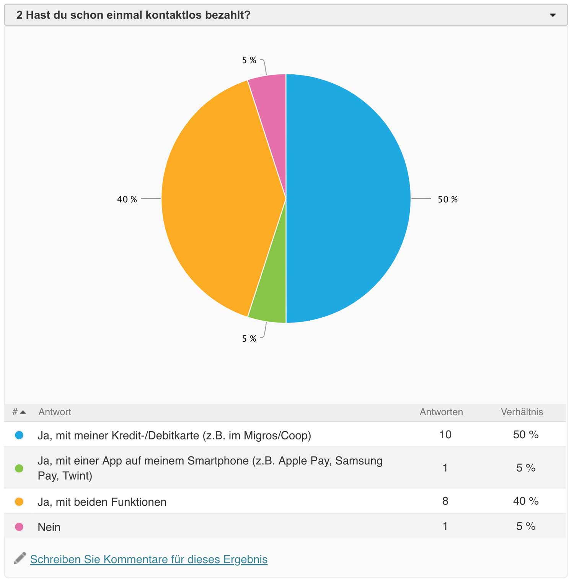

import Margin from 'gatsby-theme-signalwerk/src/components/Margin';
import Grid from 'gatsby-theme-signalwerk/src/components/Grid';
import Column from 'gatsby-theme-signalwerk/src/components/Column';
import Box from 'gatsby-theme-signalwerk/src/components/Box';

<Grid>
<Column start="3" end="13">


*Kontaktloses Bezahlen via Smartphone[^:fig:1]*
[^:fig:1]: Photo by Christiann Koepke on [Unsplash](https://unsplash.com/photos/2gExZO8zK58)

</Column>
</Grid>

## Einleitung

Handel ist seit jeher ein wichtiger Bestandteil unserer Zivilisation. Der ursprüngliche Tauschhandel mit realen Objekten wurde im Laufe der Jahrhunderte mehr und mehr durch symbolische Werte abgelöst. Über erste Münzen, denen ein symbolischer Wert zugewiesen wurde, zu Papiergeld, welches in verschiedenen Währungen und Werten erhältlich ist, bis hin zu Kreditkarten und Smartphone-Applikationen, welche Zahlungen ohne physischen Kontakt ermöglichen, hat sich der Handel mit Waren und Dienstleistungen stetig weiterentwickelt und scheint sich auch weiter dynamisch zu verändern. Die Zahlungskarten-Anbieterin Visa ermöglichte 2007 als erstes Unternehmen das kontaktlose Bezahlen, indem sie einen NFC-Chip in ihre Kreditkarten integrierte. Nachdem diese Bezahlvariante während den darauffolgenden zehn Jahren eher wenig Beachtung fand, kommt sie seit einigen Jahren immer mehr zum Einsatz, auch wenn viele Schweizerinnen und Schweizer eine eher hohe Hemmschwelle haben, diesen Dienst zu nutzen. Nachdem digitale Transaktions-Technologien wie Bluetooth Low Energy (BLE), Near Field Communication (NFC) und Quick Response (QR) Code zunehmend perfektioniert wurden, verbreiten sich diese nun auch in Bereichen, in denen diesbezüglich über längere Zeit eine Stagnierung festzustellen war. So ist beispielsweise im Pferdesport in den letzten Jahren das Bedürfnis aufgekommen, mit der Zeit zu gehen und kontaktloses Bezahlen mit einer Applikation und einem Wearable an Veranstaltungen zu ermöglichen. 

## Inhaltsverzeichnis

```toc
exclude: 
  - Inhaltsverzeichnis
  - Einzelnachweise
  - Abbildungsverzeichnis
from-heading: 2
to-heading: 3
```

### Problemstellung

Mit der Digitalisierung eröffneten sich im Bereich von Zahlungstransaktionen viele neue Möglichkeiten. Im Pferdesport werden bis heute Start- und Logiekosten sowie Gewinngelder in Bargeld oder per Banküberweisung bezahlt. Im Jahr 2019 haben erstmals mehrere Schweizer Pferdesportanlässe den Dienst EventClearing eingeführt, welcher ein einfaches, kontaktloses Abwickeln aller Geldtransaktionen im Rahmen von Pferdesport-Events ermöglicht.

In der vorliegenden Thesis soll daher untersucht werden, wo es im Bezug auf die Nutzung von kontaktlosem Bezahlen im Pferdesport noch Vorbehalte gibt und wieso, beziehungsweise ob und wie diese vom Design abhängig sind. Dabei soll ermittelt werden, worauf die Akzeptanz von kontaktlosen Bezahlsystemen basiert und wohin die Tendenz in der Zukunft gehen soll.

### Fragestellung

Entsprechend der Problemstellung sollen im Rahmen der vorliegenden Arbeit die nachfolgenden Forschungsfragen beantwortet werden:

1. **Welche Faktoren bilden Hemmschwellen oder verhindern die Nutzung von kontaktlosen Bezahlmöglichkeiten?**
2. **Welchen Einfluss hat das Interface auf die Entscheidung für kontaktloses Bezahlen?**
3. **Unter welchen Voraussetzungen kann sich EventClearing im Pferdesport etablieren?**

Diese Fragen werden anhand einer Recherche in der relevanten Fachliteratur sowie einer Umfrage unter Teilnehmerinnen und Teilnehmern von Pferdesportevents beantwortet.

### Methode und Aufbau

Als Basis für diese Arbeit dient Literatur bezüglich kontaktlosem/mobilen/digitalen Bezahlen, welche innerhalb der Nebis Bibliotheken recherchiert wurde. Im Weiteren fand ein Interview mit Matthias Lienhop, Gründer von EventClearing, statt. Eine Umfrage zu kontaktlosem Bezahlen und EventClearing wurde erstellt und von aktiven Turnierreiterinnen und Turnierreitern beantwortet. Im Kapitel *Umfrage* wird genauer auf diese eingegangen.

## Kontaktloses Bezahlen

### Funktionsweise des kontaktlosen Bezahlens

Unter kontaktlosem Bezahlen versteht man einen Zahlvorgang, der ohne physischen Kontakt abgeschlossen wird. Dabei werden einerseits Debit- oder Kreditkarten verwendet, welche mittels NFC-Technologie ohne physischen Kontakt zu einem Terminal den offenen Betrag abbuchen oder es werden Smartphone-Applikationen wie zum Beispiel Twint, Apple Pay oder Samsung Pay eingesetzt, wobei die Bezahlung nebst NFC auch durch das Erfassen eines QR-Codes oder mittels BLE-Technologie erfolgen kann. Im Folgenden wird näher auf diese drei Technologien eingegangen.

#### Near Field Communication

Die gängigste Methode für kontaktloses Bezahlen ist die Near Field Communication (NFC). Dieser Übertragungsstandard ermöglicht einen Datenaustausch innerhalb weniger Zentimeter ohne physischen Kontakt und wird international von den grössten Kartenorganisationen sowie Smartphone-Herstellern verwendet. Das sogenannte Tappen mittels NLC ist in der Schweiz für Beträge bis CHF&#x00A0;40.– ohne Eingabe eines PIN-Codes möglich. Ist der Betrag höher, fordert das Terminal die Eingabe des PIN-Codes. NFC-Chips entsprechen der Norm ISO/IEC 14443-3:2011.[^quote-1]
[^quote-1]:  International Organization for Standardization (ISO, o.J.) ISO/IEC 14443-3:2011. [Identification cards – Contactless integrated circuit cards&#x00A0;– Proximity cards.](http://www.iso.org/iso/catalogue_detail.htm?csnumber=50942) Zugegriffen: 21.&#x202F;Dezember&#x00A0;2019

Während Debit- und Kreditkarten ausschliesslich mit einem NFC-Chip auskommen, werden bei Smartphone-Applikationen für kontaktloses Bezahlen neben NFC oft zusätzliche Sicherheitsmechanismen wie Secure Element[^quote-2] oder HCE[^quote-3] eingesetzt. Während Smartphone-Hersteller wie Samsung und Huawei die NFC für Android-Applikationen frei zur Verfügung stellen, limitiert Apple bei die Nutzung von NFC bei iPhones bislang auf Apple Pay, womit andere Applikationen nicht auf diese Technologie zugreifen können. Dadurch verhindert Apple aktuell eine gesamtheitliche Lösung für kontaktloses Bezahlen. Ob Apple in Zukunft die NFC-Schnittstelle von iPhones für weitere Applikationen freigeben wird, ist unklar.
[^quote-2]: Vgl. Ludwig Hierl, Hrsg. (2017). Mobile Payment&#x00A0;– Grundlagen, Strategien, Praxis. Heilbronn, Deutschland: Springer Gabler Verlag. S.&#x202F;151, 8.4.1. 
[^quote-3]: ebd. S.&#x202F;152, 8.4.2.

#### Quick Response Code

<Margin>


*Quick Response Code[^:fig:2]*

</Margin>

[^:fig:2]: Abbildung von [Wikipedia/QR-Code](https://upload.wikimedia.org/wikipedia/commons/c/cb/QRCodeWikipedia.png)

Der Quick Response Code, kurz QR-Code, ist eine grafische Darstellung von Datenelementen, welche von Geräten mit einer Kamera und entsprechenden Software gescannt und entschlüsselt werden können. Im Zusammenhang mit kontaktlosem Bezahlen handelt es sich dabei beispielsweise um Rechnungsinformationen, welche dadurch an ein Gerät übermittelt werden, womit das manuelle Erfassen entfällt.[^quote-4] Ein Beispiel eines QR-Codes ist in Abbildung&#x00A0;2 dargestellt.
[^quote-4]: ebd. S.&#x202F;150. 8.4.2.

Im Gegensatz zur NFC-Technologie ist nahezu jedes Smartphone mit einer entsprechenden App in der Lage, einen QR-Code zu erfassen und zu entschlüsseln, was eine leichte und breit gestreute Nutzung ermöglicht. Ein weiterer Vorteil besteht darin, dass QR-Codes auch analog zur Verfügung gestellt werden können. Gegenwärtig befindet sich auf fast allen Electronic-Cash-(EC)-Terminals ein kleines Display, welches während dem Bezahlvorgang neben dem zu zahlenden Betrag auch einen QR-Code anzeigt, welcher kontaktloses Bezahlen ermöglicht.

#### Bluetooth Low Energy

Beim kontaktlosen Bezahlen mittels Bluetooth Low Energy (BLE) werden Daten ähnlich wie beim *Tappen* mittels NFC-Technologie von einem Sender- an ein Empfangsgerät geschickt.[^quote-5] Dabei schickt das Smartphone der zahlenden Person als Sender die für die Transaktion nötigen Daten an einen sogenannten Beacon als Empfänger. In der Schweiz wird diese Variante z. B. von Twint angeboten. So ermöglicht die Supermarktkette Coop mittels entsprechendem Beacon an jeder Coop-Kasse das kontaktlose Bezahlen mittels Twint-Applikation. 
[^quote-5]: ebd. S.&#x202F;151. 8.4.3.
Der Vorteil dieser Technologie ist die Herstellerunabhängigkeit und folge dessen ihre grosse Reichweite. Aktuelle Smartphones können ohne Limitierungen über die BLE-Technologie verfügen. Es ist jedoch notwendig, dass Kassensysteme zusätzlich mit einer Bluetooth-Schnittstelle ausgestattet werden.[^quote-6] 
[^quote-6]:  ebd. S.&#x202F;151. 8.4.3.
 

### Nutzung von kontaktlosem Bezahlen in der Schweiz

Laut dem Bericht Swiss Payment Monitor 2019 ist das kontaktlose Bezahlen aktuell mit einem Bekanntheitsgrad von 90&#x202F;% in der Bevölkerung auf dem Vormarsch.[^quote-7] Bezüglich der Sicherheit bestehen seitens der Nutzenden allerdings noch immer Bedenken, welche wesentlich grösser sind als bei Barzahlungen und Kartenzahlungen mit physischem Kontakt. Trotzdem gewinnt das kontaktlose Bezahlen an Sympathie und Akzeptanz. Das System beginnt sich langsam aber sicher durchzusetzen, vor allem dank den Debitkarten mit NFC-Chip, welche hauptsächlich bei jüngeren Benutzenden hoch im Kurs stehen. So können sich drei von fünf im Rahmen des Swiss Payment Monitor 2019 befragten Personen vorstellen, in den nächsten Jahren vermehrt kontaktlos zu bezahlen.[^quote-8] In Abbildung&#x00A0;3 findet sich ein Vergleich der Bekanntheit von neueren Zahlungsmitteln zwischen 2018 und 2019:
[^quote-7]: Vgl. Bettina Gehring, Sandro Graf, Dr.&#x202F;Tobias Trütsch, ZHAW, Universität St. Gallen (2019).  [Swiss Payment Monitor 2019.](https://medien.swisspaymentmonitor.ch/SPM19_Booklet_de.pdf) S.&#x202F;4. Zugegriffen: 27.&#x202F;Dezember&#x00A0;2019 
[^quote-8]: edb. S.&#x202F;5.


<Grid background>
<Column start="3" end="12">


*Bekanntheit neuerer Zahlungsinstrumente[^:fig:3]*
[^:fig:3]: Abbildung aus [Swiss Payment Monitor 2019](https://medien.swisspaymentmonitor.ch/SPM19_Booklet_de.pdf)

</Column>
</Grid>

Generell kann festgestellt werden, dass alle Technologien an Bekanntheit gewonnen haben. Mit 99&#x202F;% am häufigsten verwendet und somit mit einer niedrigen Hemmschwelle verbunden sind Online-Zahlungen mittels Kreditkarte. Im direkten Vergleich sind das jedoch nur drei Prozent mehr als das kontaktlose Bezahlen mittels Kreditkarte, welches mit 96&#x202F;% an zweiter Stelle folgt. An dritter Stelle liegt mit 94&#x202F;% das kontaktlose Bezahlen mit Debitkarte.[^quote-9] Verglichen mit physischen Zahlungsmethoden punktet kontaktloses Bezahlen bei den Befragten des Swiss Payment Monitor 2019 hauptsächlich mit der Debit- und Kreditkarte erstens in Bezug auf die einfache Nutzung, zweitens den geringen Zeitaufwand und drittens die zukunftsorientierte Technologie, wie Abbildung&#x00A0;4 darstellt:
[^quote-9]: Bettina Gehring, Sandro Graf, Dr.&#x202F;Tobias Trütsch, ZHAW, Universität St. Gallen (2019).  [Swiss Payment Monitor 2019.](https://medien.swisspaymentmonitor.ch/SPM19_Booklet_de.pdf) S.&#x202F;10. Zugegriffen: 27.&#x202F;Dezember&#x00A0;2019 


<Grid background>
<Column start="3" end="12">


*Wahrnehmung der Zahlungsmittel[^:fig:4]*
[^:fig:4]: Abbildung aus [Swiss Payment Monitor 2019](https://medien.swisspaymentmonitor.ch/SPM19_Booklet_de.pdf)

</Column>
</Grid>

### Rolle von Benutzerführung und Interface

Die aktuell meistverwendeten Zahlungsmittel in der Schweiz sind Bargeld und Kredit-oder Debitkarten. Beide verfügen über kein Interface und die Einfachheit der Zahlungsmittel wirkt sich positiv auf deren Verwendung aus. Es ist keine Schulung erforderlich. Der Umgang damit wird erlernt, indem die Benutzenden sich entweder darüber informieren oder bei anderen Personen sehen, wie es funktioniert. Anders ist dies bei den verschiedenen Smartphone-Applikationen, welche kontaktloses Bezahlen ermöglichen. Bei diesen nimmt die Gestaltung der Benutzeroberfläche, des Interface, welches an eine gut strukturierte Benutzerführung gebunden sein muss, einen wesentlichen Einfluss auf die Nutzung der Applikation. Dabei spielt eine einfache Benutzeroberfläche bei dem virtuellen Point of Sale (dem Zahlungsabschluss) eine noch wichtigere Rolle als die Benutzeroberfläche in der Applikation selbst. Sind grafische Elemente bei einem nicht relevanten Schritt in der Anwendung beispielsweise zu klein oder schwer lesbar, hindert das die Benutzenden nicht an deren Nutzung. Während des Zahlungsprozesses führt ein schlechtes Interface laut einer Studie von VocaLink jedoch bei 23&#x202F;% aller befragten Personen, welche unter 35&#x00A0;Jahren alt sind und bereits per Applikation auf dem Smartphone bezahlt haben, zu einem Abbruch der Saldierung.[^quote-10] Es ist also massgebend, mit welchem Design die Applikation auftritt und wie der Zahlungsabschluss eingebunden ist. Daraus resultieren drei wesentliche Schlussfolgerungen zur Implementation von Zahlverfahren für Mobile Payments:
[^quote-10]: Vgl. Ludwig Hierl, Hrsg. (2017). Mobile Payment&#x00A0;– Grundlagen, Strategien, Praxis. Heilbronn, Deutschland: Springer Gabler Verlag. S.&#x202F;290, 17.3.1.

1. Das Interface muss auf das mobile Endgerät ausgerichtet werden. Jeder Button und jedes Icon muss den Benutzenden die genaue Absicht in entsprechender Grösse und Verhältnis signalisieren.

2. Das Frontend muss über ein State of the Art Backend verfügen, respektive eine aktuelle Technologie, die weit verbreitet ist und stetig weiterentwickelt wird. So genügen wenig Anpassungen seitens Frontend, um die Applikation auf dem neuesten Stand zu halten.

3. Das Interface muss bequem zu bedienen sein (Convenience) und Sicherheit vermitteln. Wie bereits erwähnt, spielt die Einfachheit und die Sicherheit eine zentrale Rolle.

Folgt ein Hersteller diesen drei Grundbausteinen, ist die Applikation in der Benutzerführung optimal aufgebaut und somit die Benutzerfreundlichkeit gegeben.[^quote-11]

[^quote-11]: ebd. S.&#x202F;290, 17.3.1.


### Beispiele für kontaktloses Bezahlen

Die Möglichkeiten von kontaktlosem Bezahlen in der Schweiz sind vielfältig und nehmen stetig zu. Im folgenden Abschnitt werden die verschiedenen Angebote in Bezug auf Benutzerführung und Benutzeroberfläche untersucht. Seit Beginn der Digitalisierung kann man feststellen, dass der Gestaltung der Benutzeroberfläche immer grössere Bedeutung zukommt. Je einfacher und schneller Benutzende an das Ziel gelangen, desto höher ist die Wahrscheinlichkeit, dass die Applikation nicht nur genutzt sondern auch weiterempfohlen wird und sich so auch durchsetzen kann.

#### Debit- und Kreditkarten&#x00A0;– ohne Interface

Am meisten verbreitet ist die Verwendung von kontaktlosem Bezahlen mittels Debit- oder Kreditkarte. Die grössten Kartenanbietenden und auch die Schweizer Banken haben zwischen 2014 und 2016 auf Debit-/Kreditkarten mit der Funktion zum kontaktlosen Bezahlen (NFC-Chip) umgerüstet.[^quote-12] Die Karten von Kundinnen und Kunden der jeweiligen Unternehmen sind fortlaufend durch Neue ersetzt worden. Gefragt wurden sie nicht. Das System wurde sozusagen autoritär eingeführt. 71&#x202F;% der Debitkarten und 95&#x202F;% der Kreditkarten verfügen per Ende 2018 über den NFC-Chip, Tendenz steigend.[^quote-13]
[^quote-12]:  SRF Kassensturz. [Kontaktlos zahlen: Das müssen Kunden wissen.](https://www.srf.ch/sendungen/kassensturz-espresso/themen/geld/kontaktlos-zahlen-das-muessen-kunden-wissen) Zugegriffen: 23.&#x202F;Dezember&#x00A0;2019
[^quote-13]: Bettina Gehring, Sandro Graf, Dr.&#x202F;Tobias Trütsch, ZHAW, Universität St. Gallen (2019).  [Swiss Payment Monitor 2019.](https://medien.swisspaymentmonitor.ch/SPM19_Booklet_de.pdf) S.&#x202F;5. Zugegriffen: 27.&#x202F;Dezember&#x00A0;2019

#### Twint&#x00A0;– mit Interface

Das Unternehmen Twint AG stellte mit ihrer gleichnamigen Software als erstes Schweizer Unternehmen eine Applikation zur Verfügung, mit der kontaktlos via Smartphone bezahlt und kassiert werden kann. Die Applikation wird an die eigene Telefonnummer gekoppelt und per Debit- oder Kreditkarte aufgeladen oder direkt mit einem Konto verbunden.[^quote-14]
[^quote-14]: Stephanie Fuchs (2018). Digital Payment – eine rEvolution im Zahlungsverkehr. S.&#x202F;2, 2.3.

<Grid>
<Column start="3" end="12">


*UBS Twint Benutzeroberflächen[^:fig:5]*
[^:fig:5]: Abbildungen von [UBS/Twint](https://www.ubs.com/ch/de/private/digital-banking/private/Twint.html)

</Column>
</Grid>

Die Benutzeroberfläche von Twint ist sehr einfach. Die Benutzerführung ist sauber, strukturiert und klar verständlich dargestellt. Benutzende wählen nach dem Öffnen der Applikation direkt aus, ob sie Geld senden oder anfordern möchten. Die Empfängerin oder der Empfänger wird anhand der Telefonnummer kontaktiert.[^quote-15] Kontaktlos bezahlt werden kann an allen Kassen, welche über ein Terminal verfügen, das QR-Codes anzeigen kann. In allen Coop Filialen sind zudem Beacons installiert, welche das Bezahlen via BLE-Technologie ermöglichen. Die Benutzenden wählen auf dem Interface lediglich, wie sie bezahlen möchten.[^quote-16]
[^quote-15]: Twint (2019). [Funktionen.](https://www.Twint.ch/privatkunden/funktionen/) Zugegriffen: 29.&#x202F;Dezember&#x00A0;2019
[^quote-16]: ebd.

Twint ermöglicht auch das Senden und Empfangen von Geldbeträgen zwischen Freundinnen, Freunden und Bekannten. Dabei wird der gewünschte Kontakt ausgewählt, die Summe eingegeben, wenn gewünscht eine Nachricht hinterlegt und zum Auslösen der Transaktion der Slider *Senden* nach rechts gezogen.[^quote-17] Häufig kommt Twint auch beim Parkieren zum Einsatz. Bei Parkuhren, an welchen ein Twint-Aufkleber mit QR-Code angebracht ist, können Autofahrerinnen und Autofahrer diesen mit der Twint-App scannen, ihr Kontrollschild in der App hinterlegen und über ein Einstellrad in der Applikation die gewünschte Parkzeit einstellen.[^quote-18] Zusammengefasst basiert der Erfolg dieser Applikation auf folgenden Mehrwerten:
- Unkomplizierte Installation und Registrierung
- Sehr einfache und intuitive Bedienung
- Hohe Sicherheit als Schweizer Produkt 
- Bereits an über 30&#x202F;000 Zahlstellen akzeptiert, Tendenz steigend
- Geld kann zwischen Benutzenden gesendet und angefordert werden (Peer-to-Peer-Funktion)

BenutzerInnen wird dank Twint einfaches kontaktloses Bezahlen ermöglicht, ohne Bargeld oder gar eine Brieftasche bei sich tragen zu müssen.[^quote-19]

[^quote-17]: ebd.
[^quote-18]: Twint (2019). [Funktionen.](https://www.Twint.ch/privatkunden/funktionen/) Zugegriffen: 29.&#x202F;Dezember&#x00A0;2019
[^quote-19]: Fabio Colombo (2017). Mobile Payment - Twint, Wie wird Twint zu einem der wichtigsten Bezahlmedien. Fachhochschule Nordwestschweiz, Hochschule für Wirtschaft. S.&#x202F;26, 2.4.3.

#### EventClearing&#x00A0;– mit/ohne Interface

Die Applikation EventClearing wurde speziell für Reitsport-Events entwickelt und soll dazu dienen, den Zahlungsverkehr zwischen den Veranstaltenden und den Teilnehmenden, sowie Konsumenten zu vereinfachen. Sie kann einer Reitsportveranstaltung den kompletten Verzicht auf physisches Bezahlen ermöglichen. EventClearing ermöglicht ein mobiles Abwickeln aller Transaktionen via Smartphone für Benutzende mit EventClearing Account. Gastnutzende können an Veranstaltungen ein Wearable Armband leihen, welches kontaktlose Transaktionen innerhalb der Veranstaltung ermöglicht.

## Bezahlstruktur im Pferdesport

Pferdesport-Veranstaltungen werden zunehmend grösser und komplexer, das Feld der Teilnehmenden breiter, die Wechsel von Reiterinnen und Reitern sowie Pferden immer häufiger und kurzfristiger. Diese Dynamik verlangt nach zeitgemässen Strukturen und Technologien, welche in der Schweiz in den vergangenen Jahren nach und nach eingeführt wurden. In diesem Kapitel soll auf die historische Entwicklung und den Ist-Zustand der Bezahlstruktur im Pferdesport eingegangen werden und anhand einer Betrachtung der ersten Pilotversuche mit EventClearing einen Ausblick auf die mögliche Zukunft erfolgen.

### Historische Entwicklung der Bezahlstruktur

Noch bis vor 20&#x00A0;Jahren wurde für die Teilnahme an einem Pferdesportanlass eine analoge Nennkarte mit den entsprechenden Informationen über Reiter, Reiterin und Pferd zur eindeutigen Identifikation ausgefüllt und den Veranstaltenden überreicht oder per Post zugestellt, während das zu bezahlende Nenngeld bar vor Ort beglichen werden konnte. Der entsprechende Betrag musste von der Reiterin, dem Reiter oder einer Mittelsperson vor Prüfungsbeginn im Sekretariat bezahlt werden. Nach Abschluss der einzelnen Prüfungen wurden die Preisgelder an der Rangverkündigung bar in einem vorab abgefüllten Umschlag ausgehändigt. Immer häufiger wurde jedoch eine Bezahlung der Nenngelder via Banküberweisung verlangt, was mit der Einführung des Online-Bankings im Zuge der Digitalisierung deutlich vereinfacht wurde. Das Bezahl-Prozedere blieb jedoch für die Veranstaltenden mit einen beträchtlichen Aufwand verbunden, da die Einzahlungen weiterhin manuell kontrolliert wurden und die Auszahlungen wie gehabt in bar erfolgten. Lediglich die Einzahlung der Nenngelder konnte durch Online-Banking getätigt werden.

Um das Jahr 2007 schaltete der Schweizerische Verband für Pferdesport auf seiner Website eine Plattform auf, welche digitale Nennungen ermöglichte und die analoge Nennkarte nach und nach zum Verschwinden brachte. Um eine Nennung zu tätigen, mussten die Benutzenden nun auf der Plattform einen Account eröffnen und die Nenngelder direkt auf der Plattform mittels Kreditkarte oder einem Postfinance-Konto begleichen. Andere Zahlungsarten waren nicht mehr möglich. Das neue System wurde schweizweit eingeführt. Bei der Auszahlung der Preisgelder änderte sich vorerst nichts. Diese wurden weiterhin bar in ein Couvert abgefüllt und an der Preisverteilung überreicht.[^quote-20] 

Seit 2019 wird schliesslich mit EventClearing ein System im Schweizer Pferdesport eingeführt, welches ein bargeldloses Ein- und Auszahlen von Nenn- und Preisgeldern ermöglicht.[^quote-21]
[^quote-20]:  SVPS. [Weitere Zahlungsmöglichkeiten auf my.fnch.ch.](https://www.fnch.ch/de/Pferd/Aktuell/Alle-News-1/Weitere-Zahlungsmoeglichkeiten-auf-my-fnch-ch.html) Zugegriffen: 27. Dezember&#x00A0;2019
[^quote-21]:  EventClearing. [Bargeldloses Zahlungssystem im Schweizer Pferdesport. Heute gewonnen, morgen auf dem Konto.](https://www.eventclearing.lu/wp-content/uploads/2019/05/Layout-1_Seite-28.pdf) Zugegriffen: 27.&#x202F;Dezember&#x00A0;2019


### Ist-Zustand des Geldflusses

Bis anhin müssen alle Reiterinnen und Reiter, die an Turnieren teilnehmen, einen Account auf der Plattform des Schweizerischen Verbandes für Pferdesport (SVPS) my.fnch.ch erstellen. Dieser Account beinhaltet ein Konto, welches vom SVPS verwaltet wird und auf das vorab Geld überwiesen werden muss, um eine Nennung an einem Turnier zu tätigen. Ohne genügenden Saldo ist eine Nennung nicht möglich.[^quote-22] Erst wenn das Guthaben via Überweisung aufgestockt ist, kann die Anmeldung für eine Prüfung regulär erfolgen. Sind die einzelnen Prüfungen gemeldet, überweist der SVPS das Geld an die Veranstalter. 
[^quote-22]: SVPS. [my.fnch.ch.](https://my.fnch.ch/konto) Zugegriffen: 29.&#x202F;Dezember&#x00A0;2019
Am Turnier erhalten Reiterinnen und Reiter, welche sich in einer Prüfung klassiert haben (min. 30&#x202F;% der gestarteten Paare), Preise in Form von Bargeld, Gutscheinen oder Naturalien mit vorgegebenen Mindestwerten.[^quote-23] Die Mindestwerte des SVPS werden in Abbildung&#x00A0;6 dargestellt:
[^quote-23]:  SVPS. [Reglemente, Springreglement SR 2020.](https://www.fnch.ch/de/Disziplinen/Springen/Reglemente.html) S.&#x202F;9, 3.5. Zugegriffen: 29.&#x202F;Dezember&#x00A0;2019

<Grid background>
<Column start="3" end="11">


*Wert der Bar- und Naturalpreise des SVPS[^:fig:6]*
[^:fig:6]: Tabelle aus [SVPS Springreglement SR 2020](https://www.fnch.ch/de/Disziplinen/Springen/Reglemente.html )

</Column>
</Grid>

Die Reiterinnen und Reiter nehmen die Preise analog entgegen und entscheiden individuell, wie sie diese verwenden. Während sowohl Nenn- wie Preisgeld bei Amateuren in der Regel privat bezahlt und kassiert wird, werden die Nenngelder von professionellen Reiterinnen und Reitern hauptsächlich von ihren Arbeitgebenden oder Sponsoren übernommen. Je nach Vertrag geht entsprechend auch das Preisgeld ganz oder teilweise an die Arbeitgebenden oder Sponsoren, was den Geldfluss tendenziell verkompliziert. Die meisten Gelder werden früher oder später erneut für Nennungen benötigt, was es unumgänglich macht, dass diese erneut auf ein Bankkonto eingezahlt werden müssen.

Für eventuelle Übernachtungen des Pferdes an der Veranstaltung müssen die Kosten für Stallungen, Einstreu, Futter, etc. vor der Abreise bar im Sekretariat beglichen werden. Da die Teilnehmenden bei mehrtägigen Turnieren in einer kurzen Zeitspanne abreisen, führt dies oft zu langen Wartezeiten vor dem Sekretariat.[^quote-24]
[^quote-24]: EventClearing. [Bargeldloses Zahlungssystem im Schweizer Pferdesport. Heute gewonnen, morgen auf dem Konto.](https://www.eventclearing.lu/wp-content/uploads/2019/05/Layout-1_Seite-28.pdf) Zugegriffen: 27.&#x202F;Dezember&#x00A0;2019 

Im Bereich der Gastronomie und der Aussteller wird der Geldfluss sehr individuell gehandhabt. Üblich ist, dass die Verpflegung an Turnieren zum grössten Teil vom Veranstalter konzipiert und organisiert wird. Dabei wird auch an grösseren Turnieren wie zum Beispiel den jährlichen Pferdesporttagen in Uster welche vom Reitverein Uster durchgeführt werden, die Kasse immer noch in bar betrieben. Kartenzahlungen sowie kontaktlose Bezahlmöglichkeiten werden nicht akzeptiert. Externe Gastronomen und Aussteller bieten individuelle Zahlungslösungen an.[^quote-25]
[^quote-25]: Stephanie Fuchs. Reitverein Uster. Pferdesporttage Uster 2019.

Bei Pferdesport Turnieren ist somit bis anhin immer viel Bargeld im Umlauf. Auf der einen Seite müssen die Veranstaltenden die Gewinngelder für die Preisverteilungen bereithalten, welche für jede Prüfung in Umschläge abgefüllt, sortiert, gelagert und den Klassierten übergeben werden. Auf der anderen Seite tragen die Teilnehmenden und ihre Grooms, sowie die Besucherinnen und Besucher Bargeld für die Konsumation auf sich oder lagern dies in ihren Fahrzeugen. Dies führt zu einem erhöhten Diebstahlrisiko. Sowohl das Sekretariat als auch die Transporter und Lastwagen der Teilnehmenden sind in der Vergangenheit immer wieder Ziel von Diebstählen geworden.[^quote-26]
[^quote-26]: EventClearing. [Bargeldloses Zahlungssystem im Schweizer Pferdesport. Heute gewonnen, morgen auf dem Konto.](https://www.eventclearing.lu/wp-content/uploads/2019/05/Layout-1_Seite-28.pdf) Zugegriffen: 27.&#x202F;Dezember&#x00A0;2019

### Pilotversuche mit EventClearing

Mit den Pferdesporttagen Galgenen, dem Summer Masters Maienfeld und der Schweizer Meisterschaft CH-J-YR-2019 haben sich 2019 drei Veranstaltende für die Nutzung von EventClearing entschieden. Verglichen mit den herkömmlichen Ausschreibungen fällt bei der Ausschreibung dieser Events auf der Webseite des SVPS als erstes ein prominent platzierter Text auf, welcher auf die Nutzung von EventClearing hinweist und den Teilnehmenden mitteilt, dass sie bei einer Nennung dieser Veranstaltung die AGB’s von EventClearing akzeptieren.[^quote-27] Bei der Ausschreibung zum Hallenturnier Würenlos 2020 lautet dieser Text folgendermassen:
[^quote-27]: EventClearing. [Pilot-Versuche.](https://www.eventclearing.lu/nationale-reitturniere-schweiz/) Zugegriffen: 29.&#x202F;Dezember&#x00A0;2019

> *«Das Preisgeld wird nur über EventClearing per Banktransfer ausgezahlt. Um das Gewinngeld direkt im Anschluss an das Turnier zu erhalten, hinterlegen Sie bei app.eventclearing.lu bitte Ihre Bankverbindung, sofern Sie noch nicht mit EventClearing zusammengearbeitet haben. EventClearing (Matthias Lienhop 076&#x202F;334&#x202F;76&#x202F;08 / matthias@eventclearing.lu) wird für Sie eine Turnierabrechnung inkl. gezahlter Nenn- und gewonnener Preisgelder pro Pferd erstellen. Diese Abrechnung wird Ihnen unaufgefordert an die E-Mail-Adresse zugestellt, welche Sie bei my.fnch.ch und in Ihrem persönlichen Profil bei app.eventclearing.lu hinterlegt. Mit der Nennung akzeptieren die Reiter diese Vorgehensweise zur Auszahlung der Preisgelder.»*[^quote-28]

[^quote-28]:  Zitat SVPS. [Ausschreibung Hallenturnier Würenlos 2020](https://info.fnch.ch/#/veranstaltungskalender/ausschreibung/47976) Zugegriffen: 29.&#x202F;Dezember&#x00A0;2019

Das gewonnene Preisgeld wird somit von EventClearing direkt auf das SVPS-Konto der hinterlegten Person auf my.fnch.ch vergütet. Dabei besteht die Möglichkeit, die Gelder gegebenenfalls auch direkt an die Arbeitgebenden oder Sponsoren auszahlen zu lassen. Die Preisgelder können somit auch unmittelbar wieder als Nenngelder verwendet werden, wie der Kreislauf des bargeldlosen Zahlungsverkehrs im Pferdesport mit EventClearing in Abbildung&#x00A0;5 aufzeigt: 

<Grid>
<Column start="3" end="9">


*Kreislauf EventClearing[^:fig:7]*
[^:fig:7]: Abbildung von [EventClearing](https://www.eventclearing.lu/wp-content/uploads/2019/05/Layout-1_Seite-28.pdf)

</Column>
</Grid>

Im Bereich der Gastronomie und der Aussteller besteht für Teilnehmende mit SVPS-Account die Möglichkeit, mit der EventClearing-App kontaktlos zu bezahlen. Externe Gastronomen oder Aussteller können sich durch EventClearing lizenzieren lassen und erhalten ein eigenes Konto, welches Überweisungen mittels EventClearing ermöglicht.[^quote-29] Weiter wird durch EventClearing ein Wearable-Armband für kontaktloses Bezahlen angeboten. Dieses kann auch von Besucherinnen und Besuchern ohne SVPS-Account an den Kassen mit Bargeld sowie Debit- oder Kreditkarte aufgeladen werden, womit auch diese innerhalb der Veranstaltung kontaktlos bezahlen können. 
[^quote-29]: EventClearing. [Licensed Parnter](https://www.eventclearing.lu/licence-partner/) Zugegriffen: 29.&#x202F;Dezember&#x00A0;2019

Laut Philipp Züger, OK-Präsident der Pferdesporttage Galgenen, welche eine Pilotveranstaltung war, bringt EventClearing auch für die Veranstalterinnen und Veranstalter sehr viele Vorteile.

> *«Auf nationaler Ebene sehe ich vor allem für die Organisatoren grosse Vorteile mit EventClearing», erklärt Züger. Gut zwei Dutzend Prüfungen&#x00A0;– von Jungpferdeprüfungen bis N&#x202F;155&#x00A0;– werden in Galgenen ausgetragen. Bisher habe er jeweils anhand einer Exceltabelle für jede einzelne Prüfung mühsam ermittelt, wie viele Banknoten er für sämtliche Platzierten benötigte, das Geld entsprechend bei der Bank bestellt, abgeholt und bis zur Verwendung sicher verwahrt: «Zum Glück haben wir dafür einen Firmentresor, denn wir sprechen von einem Preisgeld in der Höhe von 70&#x202F;000 bis 80&#x202F;000 Franken, das wir auszahlen.»*[^quote-30]

[^quote-30]: Zitat Ausschreibung EventClearing. [Bargeldloses Zahlungssystem im Schweizer Pferdesport. Heute gewonnen, morgen auf dem Konto.](https://www.eventclearing.lu/wp-content/uploads/2019/05/Layout-1_Seite-28.pdf) Zugegriffen: 27.&#x202F;Dezember&#x00A0;2019

### Umfrage

Um umfassende Informationen zum Thema kontaktloses Bezahlen in Bezug auf Pferdesportveranstaltungen zu erhalten, wurde im Rahmen dieser Arbeit eine Umfrage unter Reiterinnen und Reitern durchgeführt. Dabei wurden 20 Personen verschiedener Altersklassen befragt, die aktuell an Pferdesport Turnieren teilnehmen.

#### Methodische Vorgehensweise

Die Umfrage *Kontaktloses Bezahlen im Pferdesport – Status Quo, Möglichkeiten und Perspektiven* wurde im November 2019 erstellt und war über den Onlinedienst [survio.com](https://www.survio.com/de/) verfügbar. Der Link zu der Umfrage wurde über WhatsApp an aktive Turnierreiterinnen und Turnierreiter aller Altersgruppen verschickt und war während einer Woche erreichbar. Durch diese Umfrage sollte ersichtlich werden, inwiefern Reiterinnen und Reiter mit kontaktlosem Bezahlen vertraut sind und worauf allfällige Bedenken zurückzuführen sind. In einem nächsten Schritt wurde eruiert, ob sie EventClearing bereits kennen und wie sie dazu stehen. Die Antworten wurden anonym gesammelt und direkt über [survio.com](https://www.survio.com/de/) ausgewertet.

#### Ergebnisse

Als erstes wurde nach dem Kenntnisstand bezüglich  kontaktlosem Bezahlen gefragt. 100&#x202F;% der Befragten gaben an, zu wissen, was mit kontaktlosem Bezahlen gemeint ist und wie dies funktioniert. Auf die Frage, ob sie diese Funktion nutzen, haben 50&#x202F;% angegeben, schon einmal mit einer Debit- oder Kreditkarte kontaktlos bezahlt zu haben. 40&#x202F;% der Befragten gaben an, ausserdem bereits kontaktlos mit einer Applikation auf ihrem Smartphone bezahlt zu haben, während 5&#x202F;% bis anhin nur mittels Bezahlapplikation auf dem Smartphone kontaktlos bezahlt haben (Abbildung&#x00A0;8).[^quote-31]

[^quote-31]: Stephanie Fuchs (2019). Umfrage Kontaktloses Bezahlen im Pferdesport – Status Quo, Moglichkeiten und Perspektiven. 

Genauere Hinweise auf die möglicherweise vorhandene Hemmschwelle zur Nutzung dieser Technologie liefert die Frage, ob es die Befragten Überwindung gekostet hat, kontaktlos zu bezahlen. 80&#x202F;% der Befragten gaben an, dass sie das kontaktlose Bezahlen keine Überwindung kostete und sie dieses ohne Bedenken ausführten. Der Entscheid, die Technologie zu nutzten, war an die Vermutung geknüpft, dass diese schon funktionieren würde (Abbildung&#x00A0;9). Dieses Vertrauen in die Technologie spiegelt sich auch in den Details der Antworten wieder. 65&#x202F;% der Befragten gaben an, bei der Anwendung in keiner Art und Weise sicherheitstechnische Bedenken gehabt zu haben. 15&#x202F;% hatten Zweifel und machten sich Sorgen um die Sicherheit des Geldes oder der Daten. Nur 5&#x202F;% der Befragten hatten jedoch gravierende Zweifel, womit für sie die Hemmschwelle zur Nutzung des kontaktlosen Bezahlens zu gross war.[^quote-32]

[^quote-32]: ebd. 

<Grid background> 
<Column start="2" end="7">


*Auswertung der Frage «Hast du schon einmal kontaktlos bezahlt?»[^:fig:8]*
[^:fig:8]: Abbildung von Stephanie Fuchs. Umfrage «Kontaktloses Bezahlen im Pferdesport&#x00A0;– Status Quo, Möglichkeiten und Perspektiven»

</Column>
<Column start="8" end="13">


*Auswertung der Frage «Hat es dich Überwindung gekostet?»[^:fig:9]*
[^:fig:9]: ebd.

</Column>
</Grid>


In Bezug auf den Einfluss von Benutzerführung und Interface auf die Entscheidung für oder gegen kontaktloses Bezahlen gaben 45&#x202F;% der befragten Reiterinnen und Reiter an, eine Applikation nicht zu verwenden, wenn sie aus ihrer Sicht zu kompliziert ist. Lediglich 15&#x202F;% meinten, sie würden sich unabhängig von der Komplexität der App ihr annehmen und sie erlernen. 40&#x202F;% gaben an, eine komplexe Applikation nur dann zu benutzen, wenn sie dazu gezwungen werden beziehungsweise wenn die App ein Bestandteil des ganzen Systems ist und somit nicht umgangen werden kann (Abbildung&#x00A0;10).

55&#x202F;% aller befragten ReiterInnen kennen EventClearing und schätzen es. Weitere 30&#x202F;% haben noch nichts davon gehört, finden die Idee aber sehr gut. Lediglich 15&#x202F;% konnten sich bis anhin nicht damit anfreunden (Abbildung&#x00A0;11).[^quote-33]

[^quote-33]: ebd. 

<Grid background> 
<Column start="2" end="7">


*Auswertung der Frage «Benutzt du Apps auch wenn sie schwierig zu bedienen sind?»[^:fig:10]*
[^:fig:10]: ebd.

</Column>
<Column start="8" end="13">


*Auswertung der Frage «Wie findest du EventClearing?»[^:fig:11]*
[^:fig:11]: ebd.

</Column>
</Grid>

90&#x202F;% der Befragten vertrauen der Technologie voll und ganz. Niemand hatte bei der Verwendung von EventClearing Bedenken oder würde auf Grund dessen eine solche Veranstaltung in Zukunft meiden. Lediglich 10&#x202F;% möchten sich vor einer Verwendung zuerst besser informieren. 

Abschliessend gaben die Befragten an, dass sie auch das Wearable Armband von EventClearing benutzen würden um vor Ort kontaktlos zu bezahlen. 55&#x202F;% der ReiterInnen wollen es benutzen, obwohl diese Technologie aktuell nicht sehr weit verbreitet ist. Weitere 25&#x202F;% sind sich noch nicht sicher und 20&#x202F;% möchten auf die Verwendung dieses Wearable verzichten.[^quote-34]

[^quote-34]: ebd.

## Fazit

Rückblickend auf diese Arbeit folgen hier die wichtigsten Erkenntnisse in einer Diskussion sowie der Beantwortung der einleitenden Fragen und einem Ausblick. Zusammengefasst stehen Schweizerinnen und Schweizer kontaktlosem Bezahlen aber immer positiver gegenüber und ihre Hemmschwelle es zu nutzen sinkt. Die bekanntere Variante ohne Interface könnte ihre höhere Beliebtheit neben der hohen Convenience zusätzlich auch dank der Effizienz erlangt haben. Eine Karte aus der Geldbörse zu ziehen und an ein EC-Terminal zu halten ist sehr effektiv im Gegensatz zu Applikationen die geöffnet und bedient werden müssen. 

### Diskussion der Ergebnisse

Die Antworten aus der Umfrage *Kontaktloses Bezahlen im Pferdesport&#x00A0;– Status Quo, Möglichkeiten und Perspektiven* decken sich mit jenen bisheriger Studien und zeigen eine zunehmende Akzeptanz moderner Zahlungsstrukturen. Trotz vorhandener Skepsis bei der internationalen Einführung von Event&#x200D;Clearing im Jahr 2016, wird es drei Jahre später von nationalen und internationalen ReiterInnen sehr geschätzt. Sicherheitstechnisch gibt es bei Benutzenden gegenüber EventClearing sehr wenig Bedenken. So könnten die Chancen für eine erfolgreiche Einführung der Smartphone Applikation in der Schweiz gut stehen, wichtig ist aber auch wann und wie diese an Benutzende gebracht wird. Etwas schwieriger wird es bei dem Wearable das von EventClearing angeboten wird. Benutzende mit Applikation können beides als Zahlungsinstrument verwenden, wobei die Sympathien eher bei der App liegen. Das Wearable ist mehrheitlich auch für Besuchende von Veranstaltungen gedacht. Eine obligatorische Nutzung dessen könnte einige Personen aufgrund von Unbekanntheit abschrecken.


### Beantwortung der Fragestellung

Im Folgenden sollen die beiden einleitend gestellten Forschungsfragen basierend auf den Ergebnissen dieser Arbeit beantwortet werden.

**Welche Faktoren bilden Hemmschwellen oder verhindern die Nutzung von kontaktlosen Bezahlmöglichkeiten?**

Die Hemmschwelle bei der Nutzung von kontaktlosem Bezahlen wird einerseits durch individuelle Faktoren wie Alter, spezifische Lebensumstände, soziales Bezugsnetz und berufliche Einbettung bestimmt. Andererseits wird sowohl aus der Literatur als auch aus der Umfrage aber ersichtlich, dass die Argumente Sicherheit, Vertrauen und Convenience über alle sozialen Schichten hinweg bei der Entscheidung für oder gegen kontaktloses Bezahlen an erster Stelle stehen. Technologien ohne Interface sind bereits stark verbreitet und bekannt. Die Skepsis, diese zu nutzen, ist daher in den vergangenen Jahren beachtlich gesunken.

 **Welchen Einfluss hat das Interface auf die Entscheidung für kontaktloses Bezahlen?**

Smartphone-Applikationen mit Interface haben tendenziell noch eine geringere Akzeptanz. Die Benutzerfreundlichkeit der Benutzeroberflächen wird dabei individuell sehr unterschiedlich wahrgenommen. Da Applikationen mit Interface weder obligatorisch noch autoritär eingeführt werden können, bleibt eine Auseinandersetzung der Benutzenden mit der Materie fakultativ und eine Nichtverwendung möglich. Ein weiterer Punkt ist der zusätzliche Zeitaufwand vom Entsperren der Applikation bis hin zu der Zahlung. Je nach Interface variiert dieser und ist verglichen mit Zahlungen ohne Interface ein Mehraufwand.

**Unter welchen Voraussetzungen kann sich EventClearing im Pferdesport etablieren?**

Die Untersuchung zeigt, dass sich die Bezahlstruktur in der Gesellschaft generell sowie auch im Pferdesport in Richtung moderner kontaktloser Zahlungsmittel entwickelt. Um EventClearing und ähnliche Technologien erfolgreich zu etablieren, braucht es jedoch ein gut durchdachtes Konzept. Dabei ist es sinnvoll auf Systeme und Technologien aufzubauen, welche den Benutzenden bereits bekannt sind und diese fortlaufend zu optimieren. Wie die Einführung des kontaktlosen Bezahlens mit Debit- und Kreditkarten zeigte, können so auch andere Bezahlsysteme autoritär eingeführt werden, ohne ein allzu grosses Risiko, dass sie nicht verstanden werden. Das bereits bekannte Verfahren mit seinen einfachen und praktischen Funktionen wirkt vertraut, vermittelt Sicherheit und wird dadurch als angenehm empfunden.

Ein weiterer wichtiger Faktor ist die Reichweite des Systems. Die Smartphone-Applikation Twint und NFC-Karten werden schweizweit an sehr vielen Zahlstellen akzeptiert. Nahezu jedes EC-Terminal verfügt über eine Kontaktlos-Schnittstelle (auch VPay genannt) und über ein kleines Interface, das den Benutzenden neben dem zu zahlenden Preis einen QR-Code anzeigt, der eine Zahlung über Twint ermöglicht. Der Erfolg von Twint liegt mitunter auch in der simplen Gestaltung der Benutzeroberfläche. Die Benutzenden benötigen wenig Onboarding, um die Applikation verstehen und anwenden zu können. In der durchgeführten Umfrage gaben die Reiterinnen und Reiter zwar mehrheitlich an, Bezahl-Applikationen auch zu verwenden, wenn sie schwierig zu bedienen sind und keine andere Bezahlmöglichkeit besteht. Jedoch wird die Geschwindigkeit einer erfolgreichen Verbreitung dadurch deutlich reduziert, da weniger Empfehlungen ausgesprochen werden. Damit sich EventClearing in der Szene etablieren kann, ist ein sauberes Interface daher ein zentraler Faktor für den Erfolg der Applikation. Das kontaktlose Bezahlen über die App oder das Wearable sollte reibungslos und schnell funktionieren sowie innerhalb einer Veranstaltung überall akzeptiert werden, damit sich EventClearing längerfristig durchsetzen und eine breite Anwendung finden kann.


### Ausblick

Technischen Entwicklungen sind in unserer Zeit kaum mehr Grenzen gesetzt und die Geschwindigkeit der Entwicklung nimmt fortlaufend zu. Die neuere Geschichte des Zahlungsverkehrs ist durch eine stetige Veränderung und Entwicklung geprägt. Man kann auch sagen, dass es eine Geschichte von Versuch und Irrtum ist. Möglichkeiten werden eruiert und ausprobiert. Verfahren, die nicht funktionieren, werden früher oder später von neuen Konzepten abgelöst und erfolgreiche Methoden werden kontinuierlich weiterentwickelt. Rückschläge sind ein Bestandteil der Entwicklung und verbessern die jeweiligen Prozesse. Mittels Testing und Usability Walkthroughs kann diesen entgegengewirkt werden und so bleibt zu hoffen, dass Fehlfunktionen oder Unverständlichkeiten in einem frühen Stadium erkannt und behoben werden können. So gesehen scheint es folgerichtig, dass die Zukunft bezüglich einer Weiterentwicklung offen ist und dynamisch verlaufen wird.


## Einzelnachweise

```references
```

## Abbildungsverzeichnis

```references
# gets repalced with footnotes
group-include: fig

inline-link-prefix: 'Fig. '

reference-link-prefix: '↑ Fig. '
reference-link-suffix: ''

reference-text-suffix: ' – '
```

<Grid>


---

<Column start="1" end="4">

#### Mentoriert durch

Prof.&#x202F;Alex Hanimann <br/>
9000 St.&#x202F;Gallen <br/>
[alex.hanimann@bluewin.ch](mailto:alex.hanimann@bluewin.ch)

</Column>

<Column start="4" end="7">

#### Vorgelegt von

Stephanie Fuchs <br/>
8627 Grüningen <br/>
[stfffchs@gmail.com](mailto:stfffchs@gmail.com)
</Column>

<Column start="7" end="13">

#### Lehrgang

Schule für Gestaltung Zürich <br/>
Bildungsgang Interaction Design HF 2017-2020 <br/>
Kommunikationsdesign mit Vertiefung Interaction Design <br/>
[www.sfgz.ch](https://sfgz.ch/)
</Column>

</Grid>