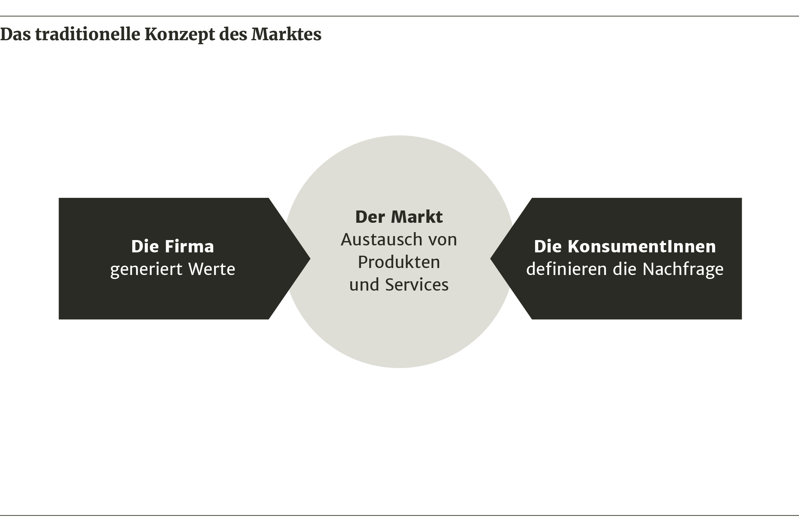
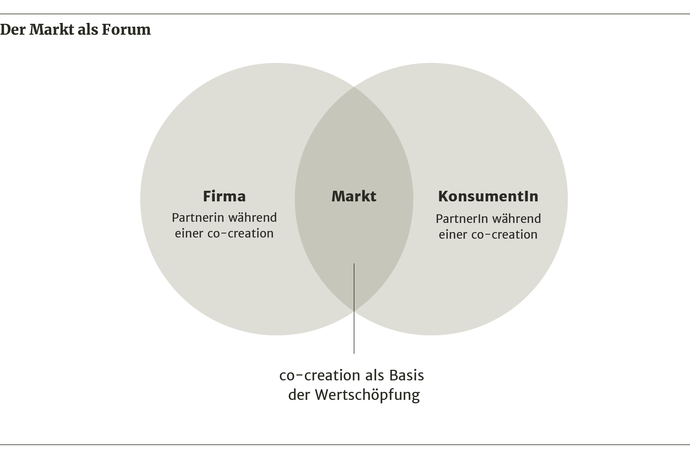
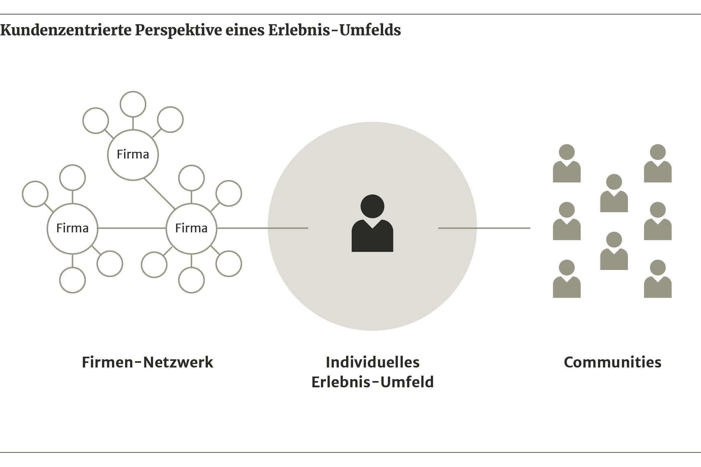
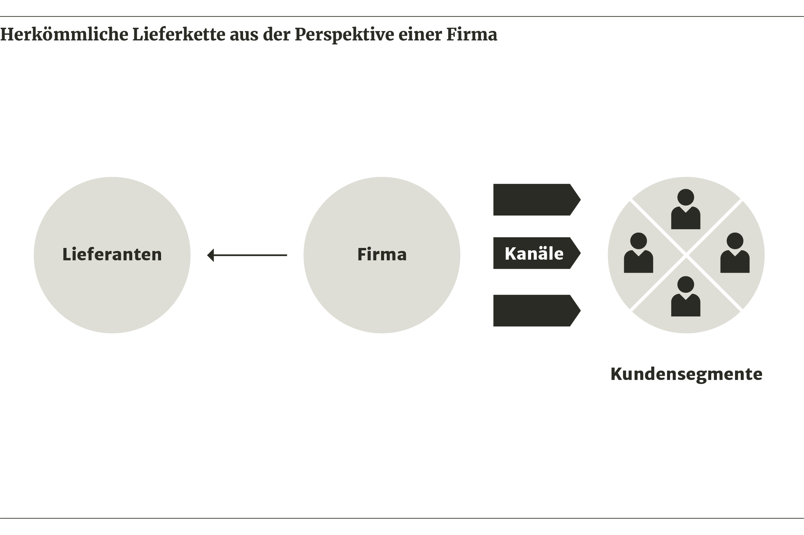

import Margin from 'gatsby-theme-signalwerk/src/components/Margin';
import Grid from 'gatsby-theme-signalwerk/src/components/Grid';
import Column from 'gatsby-theme-signalwerk/src/components/Column';
import Box from 'gatsby-theme-signalwerk/src/components/Box';

## Inhaltsverzeichnis
```toc
exclude: Inhaltsverzeichnis
from-heading: 2
to-heading: 6
```

## Einleitung

### Unternehmen und KundInnen – früher und heute
In der ersten Hälfte des 19. Jahrhunderts zeichnete sich der Laden um die Ecke über Kundennähe aus, die Ladenbesitzer kannten ihre Kundschaft und konnten diese individuell beraten und bedienen. Durch die Form des persönlichen Austauschs hatten die Läden eine entscheidende gesellschaftliche Funktion inne, indem sie Lokalnachrichten verbreiteten, bevor dies Radio und Fernsehen übernahmen.[^quote-one] Das Einkaufserlebnis war folglich also ein ganz persönliches und durch Interaktion mit den VerkäuferInnen geprägt, zudem wurden zwischen diesen beiden Parteien auch eine Vielzahl an nützlichen Informationen, sowohl für die KundInnen als auch für die VerkäuferInnen ausgetauscht.

[^quote-one]: Galloway 2017, S.&#x202F;27

Seither hat sich das Einkaufserlebnis mehrfach stark gewandelt, Warenhäuser wie das *Selfridges* in London boten Kunden neben verschiedenen Warenabteilungen auch Restaurants, ein Erste-Hilfe-Zimmer oder sogar einen Dachgarten an und versuchten sich damals vor allem über Service auszuzeichnen. Harry Selfridge prägte im Zuge dessen die Formel «Der Kunde hat immer Recht».[^quote-two] Und auch die daraufhin entstehenden Einkaufszentren versuchten den KundInnen ein möglichst bequemes Einkaufserlebnis zu ermöglichen, indem dass mehrere Geschäfte an einem Ort erreichbar gemacht und diese durch Gastronomiebereiche und Kinos miteinander verbunden wurden.

[^quote-two]: Galloway 2017, S.&#x202F;27

Als daraufhin zwischenzeitlich «der Kunde ist König» zum alles bestimmenden Leitsatz erhoben wurde und riesige Supermärkte versuchten, sich vor allem über Multipackungen, Rabatte und dem damit verbundenen niedrigen Preis zu profilieren, kamen in den 1980er Jahren wieder vermehrt Fachgeschäfte auf, die sich auf spezifische Marken und exklusive Produkte konzentrierten und versuchten, den KundInnen im Geschäft selbst ein möglichst besonderes Einkaufserlebnis zu ermöglichen.

Heute wird ein grosser Teil der Produkte direkt über das Internet bezogen und dadurch bietet sich für Unternehmen und KundInnen die Möglichkeit, wieder direkt und unmittelbar miteinander zu interagieren, wodurch sich auch die Beziehung zwischen den beiden erneut verändert.

Bezeichnend für diese Veränderung ist das Beispiel *Napster*, eine *Peer-to-Peer* Musiktauschbörse bei welcher über das Internet auf unzählige Musikstücke zugegriffen werden konnte und die nach rechtlichen Streitigkeiten 2001 geschlossen werden musste.[^quote-three] Die grosse Beliebtheit der Plattform machte deutlich, dass KundInnen zwar ein überaus grosses Interesse an den Produkten der Musikindustrie haben, auf die Musik aber lieber auf Grund ihrer eigenen Vorlieben und nicht anhand von vordefinierten, durch Plattenfirmen zusammengestellten Produkten wie Alben oder Sampler zugreifen möchten.[^quote-four]

[^quote-three]: Wikipedia 2020, Napster

[^quote-four]: Prahalad/Ramaswamy 2004, S.&#x202F;36

Dieses Beispiel zeigt exemplarisch auf, wie durch das Internet der unmittelbare Zugang zu einem breiten Angebot ermöglicht wird und wie sich dadurch auch die Beziehung der KonsumentInnen zu einem Produkt gewandelt hat. Gleichzeitig bietet das Internet aber auch die Möglichkeit, dass sich Unternehmen und KundInnen einander annähern können und dabei wird vermehrt auf eine Kollaboration in Form einer Co-Creation gesetzt.

Da KundInnen und Firmen nun in unmittelbarem Kontakt zueinander stehen, können diese direkt miteinander interagieren. Ziel der folgenden Arbeit ist es, die verschiedenen Formen der Zusammenarbeit aufzuzeigen, die durch eine Co-Creation ermöglicht werden und zu ergründen, inwiefern sich diese Kooperation auf die Beziehung zwischen Firmen und KundInnen auswirkt. Anschliessend soll auf die Veränderungen in Bezug auf das Angebot und die damit verbundene Definition von Wertschöpfung sowie auf Chancen und Risiken in Zusammenhang mit einer Co-Creation eingegangen werden.


## Die direkte Zusammenarbeit in einer Co-Creation

### Über Co-Creation
Der Begriff Co-Creation wurde von C. K. Prahalad und Venkat Ramaswamy in ihrem 2004 veröffentlichten Buch *The Future of Competition* geprägt. Darin wird Co-Creation als eine Zusammenarbeit zwischen Firmen und KundInnen beschrieben, bei der in enger Kooperation gemeinsam Produkte entwickelt werden.

Gemäss Prahalad und Ramaswamy (2004) lassen sich vier Hauptaspekte definieren, die bei einer Co-Creation beachtet werden müssen. Das sogenannte DART-Modell (*Dialog, Access, Risk Assessment, Transparency*) besagt, dass in einer Co-Creation zwischen Unternehmen und KundInnen der Fokus hauptsächlich auf den Dialog, den Zugang, die Risikobeurteilung sowie die Transparenz gelegt werden sollte. Dabei definieren Prahalad und Ramaswamy die Begriffe wie folgt.

### Das DART-Modell

**_Dialog:_** Zwischen einer Firma und den KundInnen wird ein enger Austausch gepflegt. Dabei sollten sich beide auf Augenhöhe begegnen, sich intensiv miteinander auseinandersetzen und bereit sein, voneinander zu lernen.

**_Access:_** Ein direkter Zugang sollte gewährleistet werden, etwa zu einer Plattform, um sich mit Gleichgesinnten auszutauschen oder aber auch zu Experten, um von deren Fachwissen zu profitieren. Dabei sollten Werkzeugen bereitgestellt werden, die eine individuelle Nutzung eines Angebots ermöglichen.

**_Risk assessment:_** Das eigenverantwortliche Abwägen zwischen Vor- und Nachteilen gewinnt an Bedeutung. Das Risiko in Bezug auf ein Produkt, sollte sowohl von den Unternehmen als auch den KundInnen selbst eingeschätzt werden können.

**_Transparency:_** Um Rückschlüsse, z. B. auf Firmenabläufe oder auf das persönliche Verhalten, zuzulassen, sollten Informationen frei verfügbar sein und offen mit diesen umgegangen werden.


Werden die Punkte aus dem DART-Modell berücksichtigt, gehen Prahalad und Ramaswamy davon aus, dass sich eine für beide Seiten interessante Zusammenarbeit ergeben kann. Beispielhaft für eine Kollaboration im Stile einer Co-Creation ist die Firma *Local Motors*, die im Folgenden vorgestellt werden soll.

### Die Firma *Local Motors*
*Local Motors* ist ein Autohersteller aus den USA, der in einem engen Austausch mit einer *Community* aus DesignerInnen, IngenieurInnen und Autofans Fahrzeuge über das Internet entwickelt.

Die *Community*-Mitglieder sind dabei in einzelne Kategorien eingeteilt, z. B. *Builder, Designer, Visitor* etc. und je nach Registrierung können diese auf einer extra darauf ausgerichteten Online-Plattform Entwürfe für Fahrzeuge hochladen und so anhand von regelmässig stattfindenden Wettbewerben das Design oder auch das Innenleben von diesen mitgestalten. Dabei legt *Local Motors* viel Wert auf gegenseitiges Feedback, so geben sich die TeilnehmerInnen während des Wettbewerbs wechselseitig Rückmeldungen zu den kontinuierlich auf der Website veröffentlichten Vorschlägen.

Über ein *Crowd-Voting* wird anschliessend in der *Community* darüber abgestimmt, welche Vorschläge in Produktion gehen sollen. Wird ein Fahrzeug von einem Kunden oder einer Kundin  geordert, liefern Partnerfirmen die Komponenten an sogenannte *Microfactories*, kleine Werkhallen, in denen die Autos dann von *Local Motors*-MechanikerInnen sowie den KundInnen selbst zusammengebaut werden.[^quote-five]

[^quote-five]: Buhse/Reppesgaard/Lessmann/Henkel/Lange 2011

Diese Form der direkten Beteiligung sowohl von KonsumentInnen als auch von Partnerfirmen an einem Produkt ist bezeichnend für eine Co-Creation. Anschliessend soll nun beleuchtet werden, inwiefern sich die Rolle der KonsumentInnen durch deren aktive Beteiligung verändert.

### Die neue Rolle der KonsumentInnen innerhalb des Marktes
Die heutigen KonsumentInnen sind gemäss Prahalad und Ramaswamy (2004) informiert, vernetzt und gestalten ihren Konsum aktiv mit, wodurch sich auch ihre Position innerhalb eines Marktes grundlegend verändert. Während sie früher innerhalb des Marktes isoliert und auf die Rolle der KonsumentInnen reduziert wurden, verfügen sie nun dank dem Internet über eine Vielzahl an Informationen und Tools, die es ihnen ermöglichen, sich direkt zu beteiligen.[^quote-six] Aufgrund der wachsenden Unzufriedenheit mit einer von Firmen vordefinierten Auswahl, kombiniert mit den Möglichkeiten des Internets, bringen KonsumentInnen ihre Wünsche und Bedürfnisse also vermehrt in einen Wertschöpfungsprozess mit ein[^quote-seven] und begeben sich dabei mit Firmen in einen engen Austausch. Prahalad und Ramaswamy empfehlen daher, den Markt primär als ein Forum zu betrachten, in dem sich die beiden Rollenbilder Konsument und Produzent miteinander vermischen. [^quote-eight]

[^quote-six]: Prahalad/Ramaswamy 2004, S.&#x202F;2

[^quote-seven]: Prahalad/Ramaswamy 2004, S.&#x202F;4

[^quote-eight]: Prahalad/Ramaswamy 2004, S.&#x202F;134


*Die Interaktion zwischen KonsumentInnen und Firmen ist auf den Austausch von Produkten reduziert.[^:fig:pic-source-one]*


*Der Markt wird als Forum betrachtet, in dem sich KundInnen und Firmen austauschen.[^:fig:pic-source-two]*

Dabei verschwindet die klare Trennung innerhalb des Wertschöpfungsprozesses zwischen ProduzentInnen und KonsumentInnen. Der Futurologe Alvin Toffler hat dafür den Begriff «Prosumenten» geprägt, der benennt, dass KonsumentInnen nun also auch gleichzeitig ProduzentInnen sind.[^quote-nine]

[^quote-nine]: Wikipedia 2020, Prosumer

Unterstützt durch das Internet verändert sich also die Rolle der KonsumentInnen. Während früher die Interaktion zwischen einer Firma und den KundInnen oftmals nur auf den Austausch von Produkten reduziert war, wird heute ein direkter und kontinuierlicher Dialog geführt. Dadurch werden auch Produktentwicklungen ganz massgeblich beeinflusst. Anschliessend soll erst aus Firmen- und dann aus KundInnenperspektive betrachtet werden, welche Auswirkungen der direkte Austausch auf die Entwicklung von Produkten hat und inwiefern beide Seiten von einer engen Kooperation profitieren können.

### Wie Firmen anhand von Co-Creation Innovation entwickeln
ManagerInnen fokussierten sich früher primär auf intern entwickelte Innovationen, um einen Wettbewerbsvorteil zu erhalten. Dabei wurden die Produkte auf Grund von Marktforschungen oder in punktueller Zusammenarbeit mit sogenannten *Lead Usern* (KundInnen welche sich aufgrund ihrer aussergewöhnlichen Merkmalen von anderen abheben) entwickelt und diese darauf dann an den Märkten den KonsumentInnen angeboten.

Nun werden die NutzerInnen bereits bei der Entwicklung eines Produktes aktiv mit einbezogen. Auf Grund der vereinfachten Mobilisierung einer grossen Anzahl an Menschen über das Internet ist es möglich, in kurzer Zeit, eine Vielzahl an Rückmeldungen zu generieren – dabei ersetzen kontinuierliche Feedback-Schleifen den bisher linear vordefinierten Ablauf einer Produktentwicklung, wodurch Firmen die Entwicklungszeit drastisch verkürzen sowie ihre Kosten reduzieren können.

Auch bei *Local Motors* wird ein Fahrzeug nicht intern entwickelt und im Anschluss daran dann ein fertiges Produkt auf den Markt gebracht, vielmehr werden die KonsumentInnen bereits von Anfang an in der sogenannten *Create it*-Phase anhand von Wettbewerben direkt mit eingebunden. Dadurch sind die Entwicklungskosten für die Firma erheblich geringer. Zum Vergleich: Während die Entwicklungszeit des Modells *Rally Fighter* bei *Local Motors* gerade mal 18 Monate dauerte und 3,6 Millionen Dollar gekostet hat, liegt der Zeitraum für eine Produktlancierung in der klassischen Autoindustrie bei 5 bis 7 Jahren und die Kosten dafür können sich auch gut einmal auf 1,5 Milliarden belaufen.[^quote-ten]

[^quote-ten]: Buhse/Reppesgaard/Lessmann/Henkel/Lange 2011, S.&#x202F;10

Zudem führt der frühe Einbezug der NutzerInnen in einen Entwicklungsprozess auch dazu, dass Firmen zielgerichteter produzieren können. Dank dem direkten Feedback (quasi in Echtzeit), kennen Firmen ihre KundInnen heute besser denn je und können dadurch ihre Strategie gezielter anpassen.

*Local Motors* setzt dafür ihre Online-Plattform ein, auf der sich die *Community* über aktuelle Projekte austauschen kann. So wird einerseits die Innovationskraft der *Crowd* genutzt, indem auf die Ideen und Anregungen einer Vielzahl von Menschen zurückgegriffen werden kann, zusätzlich gewinnt *Local Motors* über den direkten Austausch mit den KundInnen aber auch Einblicke in Bezug auf deren Bedürfnisse und Wünsche.[^quote-eleven]

[^quote-eleven]: Buhse/Reppesgaard/Lessmann/Henkel/Lange 2011, S.&#x202F;27

Die unmittelbare Rückmeldung der KundInnen hat auch starken Einfluss darauf, wie Firmen ihre Prozesse organisieren. Während früher anhand von langwieriger Marktforschung Erkenntnisse über ein Produkt gewonnen wurden, können Firmen heute aufgrund der schnellen Rückmeldungen der KundInnen über das Internet in viel kürzeren Intervallen ihre Entwicklungen anpassen und bei Bedarf auch neu ausrichten.

Folglich werden Innovationen heute nicht mehr im Alleingang durch Firmen entwickelt wodurch die bisherige firmenzentrierte Sicht immer mehr durch eine konsumentenzentrierte ersetzt wird. Die KundInnen rücken damit im Innovationsprozess zunehmend ins Zentrum.

Dank dem unmittelbaren Austausch haben also auch die KonsumentInnen die Möglichkeit direkten Einfluss auf eine Produktentwicklung zu nehmen und Angebote in ihrem Sinne mit zu gestalten. Dieser Aspekt soll im Folgenden behandelt werden.


### Wie KundInnen von einer Co-Creation profitieren können
Während Innovationen also früher hinter verschlossenen Türen vorangetrieben wurden, werden diese heute in einem engen Austausch mit den KundInnen entwickelt.

Mittels Feedback, Umfragen, *Crowd-Voting* oder Wettbewerben können diese dabei direkt an einer Produktentwicklung teilhaben. So dient die Online-Plattform von *Local Motors* einerseits dazu, um mit den KundInnen in einen Dialog zu treten und dadurch ihre Bedürfnisse und Wünsche besser kennenzulernen, die Website kann aber zudem auch dazu genutzt werden, um Produktinnovationen von Anfang an und in enger Zusammenarbeit mit den KundInnen anhand von Wettbewerben zu entwickeln.

Im Falle von *Local Motors* wird dafür ein Gesamtprojekt in monatliche Einzelwettbewerbe unterteilt, welche über die Online-Plattform ausgeschrieben werden. Die Vorschläge der TeilnehmerInnen werden darauf in einer sogenannten *Punch-List* veröffentlicht und dokumentiert, wobei sich die DesignerInnen gegenseitiges Feedback geben. Mittels *Crowd-Voting* wird dann bestimmt, welches Design am besten ankommt und für das fertige Produkt zur Anwendung kommt.[^quote-twelve]

[^quote-twelve]: Buhse/Reppesgaard/Lessmann/Henkel/Lange 2011, S.&#x202F;28

Da die KundInnen über die Plattform einen unmittelbaren Zugang zu der Firma erhalten und sich somit einfacher denn je mit einbringen können, ist es möglich, dass diese ihre Wertvorstellungen, Bedürfnisse und Wünsche direkt in eine Produktentwicklung mit einfliessen lassen.[^quote-thirteen]

[^quote-thirteen]: Prahalad/Ramaswamy 2004, S.&#x202F;31

Durch dieses Engagement erreichen die KundInnen, dass sich ein neues Angebot näher an ihren Bedürfnissen orientiert. Während früher darauf abgezielt wurde, ein Produkt anhand von Marketing-Massnahmen zu verkaufen, wird heute also vermehrt versucht, eine Nachfrage über die Passgenauigkeit eines Produkts in Bezug auf die Ansprüche der NutzerInnen zu schaffen.

Durch den engen Einbezug der KundInnen wird die bisher übliche Unterteilung in eine interne Entwicklungsphase und den darauffolgenden Verkauf eines Produktes auf dem Markt, aufgehoben. Diese enge Zusammenarbeit setzt dabei aber einen offenen Dialog zwischen den Unternehmen und den KundInnen voraus, worauf hier im Folgenden eingegangen werden soll.

### Offenheit als Strategie – Dialogbereitschaft und Transparenz
Während Firmen früher von einer gewissen Informationsasymmetrie durchaus auch profitieren konnten[^quote-fourteen] und z. B. die Zusammensetzung eines Produkts ein gut gehütetes Firmengeheimnis war, herrscht heute eine neue Form der Transparenz, etwa in Bezug auf Preise sowie Kosten und KonsumentInnen können sich über Produkte oder aber auch deren Herstellungsprozesse genau informieren.

[^quote-fourteen]: Prahalad / Ramaswamy 2004, S.&#x202F;30

Wenn Folglich Information über Produkte einfach abgerufen werden können,[^quote-fifteen] sind die Firmen gut beraten, über ein transparentes Verhalten, Vertrauen zwischen sich und ihren KundInnen aufzubauen.[^quote-sixteen] Dabei geht es um weit mehr als Pressemitteilungen und wirksame Publicity, sondern darum, die KundInnen in einen engen und kontinuierlichen Dialog sowie in öffentliche Debatten mit einzubinden[^quote-seventeen] und diese dabei als gleichwertige Gesprächspartner zu betrachten.

[^quote-fifteen]: Prahalad/Ramaswamy 2004, S.&#x202F;30

[^quote-sixteen]: Prahalad/Ramaswamy 2004, S.&#x202F;32

[^quote-seventeen]: Prahalad/Ramaswamy 2004, S.&#x202F;129

Gleichzeitig betrifft diese neue Transparenz aber auch die KonsumentInnen, in dem diese, z. B. im Gegenzug für den Zugriff auf Angebote, auch Informationen in Bezug auf ihr persönliches Verhalten oder ihre Wertvorstellungen offenlegen.

Die enge Kollaboration zwischen Unternehmen und KundInnen verändert aber nicht nur deren Beziehung untereinander, auch der Umgang mit den Produkten selbst ist dank einem unmittelbaren Zugang zu diesen einem Wandel unterzogen, was im nächsten Abschnitt erläutert werden soll.


## Das Erlebnis als zentraler Wert in einer Co-Creation

### Der Wert von Produkten
Prahalad und Ramaswamy (2004) gehen davon aus, dass der effektive Besitz eines Produktes zunehmend an Bedeutung verliert und die KonsumentInnen in Zukunft vielmehr nach einem Zugang zu einem auf sie zugeschnittenen Erlebnis suchen. Während früher versucht wurde, über eine möglichst breite Produktpalette oder über eine Vielzahl an zusätzlichen Funktionen verschiedenste Kundengruppen für sich zu gewinnen, wird zunehmend das individuelle Erlebnis bei der Nutzung eines Angebots wichtiger.

Dies wird am Beispiel einer Digitalkamera illustriert, bei der für Prahalad und Ramaswamy nicht primär deren Produktionsart oder Funktionalitäten relevant sind, sondern in  erster Linie das Erlebnis, welches durch die Kamera ermöglicht wird, z. B. in dem Bilder aus dem Urlaub mit anderen geteilt werden können.[^quote-eighteen] Dafür müssen die KundInnen ein Produkt nicht zwangsläufig besitzen, oftmals besteht der Wert eines Angebots für sie bereits in dessen Nutzung.

[^quote-eighteen]: Prahalad / Ramaswamy 2004, S.&#x202F;47

Da sich Wettbewerbsvorteile also nicht primär über den Preis, die Qualität sowie die Vielfalt an Funktionen erreichen lassen, empfehlen Prahalad und Ramaswamy, dass sich Firmen weg von einer produktzentrierten Sichtweise, hin zu einem Co-Creation-Erlebnis aus der Sicht der KonsumentInnen bewegen. Dabei ist es für sie nicht entscheidend, ob und durch welches Gerät dieses Erlebnis ermöglicht wird,[^quote-nineteen] Produkte und Services sind für sie nur ein Teil eines gesamthaften Erlebnisses.[^quote-twenty]

[^quote-nineteen]: Prahalad/Ramaswamy 2004, S.&#x202F;59

[^quote-twenty]: Prahalad/Ramaswamy 2004, S.&#x202F;116

Haben sich Firmen in der Vergangenheit also darauf fokussiert, Produktinnovationen zu entwickeln, wird es zukünftig vermehrt darum gehen, ein Umfeld für ein entsprechendes Erlebnis bereitzustellen.

Firmen sollten daher darum bemüht sein, den KonsumentInnen ein möglichst breites Angebot zu offerieren aus welchem sich diese dann ihr ganz persönliches und individuelles Produkt zusammenstellen können.[^quote-tone] Im Folgenden soll auf diese verschiedenen Formen der Personalisierung eingegangen werden.

[^quote-tone]: Prahalad/Ramaswamy 2004, S.&#x202F;116

### Das personalisierte Nutzererlebnis
Die KundInnen haben über das Internet die Möglichkeit, Produkte auf einfache Weise zu verändern und diese ihren persönlichen Bedürfnissen anzupassen. In dem Zusammenhang spricht man von einem personalisierten Kundenerlebnis. Nicht selten legen Firmen daher ehemals interne, produktspezifische Daten zu einzelnen Komponenten offen, damit sich die KundInnen daraus ihr ganz individuelles Angebot zusammenstellen können.

Bei *Local Motors* haben IngenieurInnen und DesignerInnen der *Community* in der sogenannten *Develop it*-Phase direkten Zugang zu sämtlichen Bauteilen als CAD-Dateien, können diese bearbeiten und im Detail weiterentwickeln. Somit können theoretisch alle Bestandteile eines Fahrzeugs individuell verändert und angepasst werden.

In der so genannten *Mod it*-Phase lässt sich zudem ein Fahrzeug auch nach dem Kauf durch die KonsumentIn weiter modifizieren und anpassen. So stehen alle Bauteile der Fahrzeuge weiterhin als *Open Source* der *Community* zur Verfügung und können von dieser bearbeitet und anschliessend auch den anderen NutzerInnen wieder zur Verfügung gestellt werden.[^quote-ttwo]

[^quote-ttwo]: Buhse/Reppesgaard/Lessmann/Henkel/Lange 2011, S.&#x202F;49

Anders als früher kaufen die KonsumentInnen also heute nicht ein abgeschlossenes Gesamtpaket, sondern stellen sich aus einer Vielzahl von Angeboten ihr ganz persönliches Produkt zusammen. Dabei besteht aber ein grundsätzlicher Unterschied zwischen einer Co-Creation und einer Individualisierung von Produkten, was im Anschluss erläutert werden soll.

### *Mass Customization* in Abgrenzung zu Co-Creation
Haben Firmen früher primär mit einer Diversifizierung des Angebots auf unterschiedlichen Kundenwünsche reagiert, wird heute auch versucht über eine sogenannte *Mass Customization*[^quote-tthree] auf Basis von bestehenden Komponenten ein individuell passendes Produkt anzubieten. Prahalad und Ramaswamy (2004) definieren den Begriff so, dass dabei die Vorteile einer Massenproduktion zu niedrigen Kosten mit dem gezielten Ausrichten auf die einzelnen KonsumentInnen kombiniert werden. Dank der sogenannten *Mass Customization* ist es möglich, ohne grossen Mehraufwand auf die unterschiedlichen Wünsche der KundInnen einzugehen.

[^quote-tthree]: Eichenauer 2017, S.&#x202F;32

Anstelle der bisherigen Massenproduktion können KundInnen also aus einer Anzahl vordefinierter Komponenten ihr eigenes Produkt zusammenstellen. Dies ist aber nicht eine Co-Creation im eigentlichen Sinne, vielmehr können die KundInnen ihr Produkt anhand von bestimmten Vorgaben selbst konfigurieren. So haben z. B. bei *Local Motors* KundInnen bei der sogenannten *Skin-Customization* die Möglichkeit, die Lackierung des Fahrzeugs selber zu definieren.[^quote-tfour]

[^quote-tfour]: Buhse / Reppesgaard / Lessmann / Henkel / Lange 2011, S.&#x202F;47

Die AnbieterInnen gehen so aber eigentlich nur im Ansatz auf die Wünsche und Präferenzen ihrer KundInnen ein.[^quote-tfourb] Primär wird die *Mass Customization* dazu genutzt, unter Berücksichtigung der eigenen Lieferkette produzieren zu können. Dabei handelt es sich also nur um eine Spielart der Co-Creation, die den KonsumentInnen zwar ein individualisiertes aber dadurch noch nicht personalisiertes Produkt verschafft.

[^quote-tfourb]: Prahalad / Ramaswamy 2004, S.&#x202F;89

Anders als bei einer *Mass Customization*, bei der Produkte am Ende einer Produktionskette noch einen letzten Schliff durch den Kunden erhalten, definieren sich Produkte bei einer Co-Creation also über ein kontinuierliches Mitgestalten über das gesamte Angebot hinweg sowie über das damit verbundene, persönliche Gesamterlebnis. In dem Zusammenhang gewinnt auch das Firmennetzwerk zusätzlich an Bedeutung, da erst durch eine Vielzahl an unterschiedlichen Angeboten eine entsprechend flexibles und individuelles Umfeld für die KonsumentInnen gewährleistet werden kann.[^quote-tfive] Auf diese neuen Formen der Partnerschaften soll im nächsten Abschnitt eingegangen werden.

[^quote-tfive]: Prahalad / Ramaswamy 2004, S.&#x202F;97

### Die Gewichtung von Partnerschaften
Um auf möglichst viele Fähigkeiten zurückgreifen und den KonsumentInnen dadurch ein möglichst breites Angebot bieten zu können, ist es wichtig, dass sich Firmen mit anderen Anbietern zusammenschliessen und sich dabei als Knotenpunkte innerhalb eines Netzwerkes begreifen, die den KonsumentInnen ein vollumfängliches Erlebnis über verschiedenste Kanäle hinweg ermöglichen.[^quote-tsix]

[^quote-tsix]: Prahalad/Ramaswamy 2004, S.&#x202F;49


*Das Erlebnis-Umfeld besteht aus einem Netzwerk aus Firmen sowie einer Community.[^:fig:pic-source-three]*

Dies hat Auswirkungen auf die gesamte Lieferkette. Da auf Grund der spezifischen Anforderungen der KundInnen nach jeweils unterschiedlichen Lösungen verlangt wird, läuft diese nicht mehr linear ab, sondern wird je nach individuellen Bedürfnissen immer wieder neu sortiert.[^quote-tseven]

[^quote-tseven]: Prahalad/Ramaswamy 2004, S.&#x202F;97


*Eine Firma erstellt in Zusammenarbeit mit Lieferanten Produkte und verkauft diese anschliessend an unterschiedliche Kundengruppen. [^:fig:pic-source-four]*

Da alle Standardbauteile der *Local Motors* Fahrzeuge auch in vielen weiteren Autos verbaut sind, können diese nach dem Kauf auch in anderen Werkstätten gewartet werden. Weil zudem die technische Informationen und Baupläne offen liegen und über das Internet heruntergeladen werden können, wird hier über den Einbezug von Partnerfirmen erreicht, dass die KundInnen ein möglichst bequemes Nutzererlebnis haben.[^quote-teight]

[^quote-teight]: Buhse/Reppesgaard/Lessmann/Henkel/Lange 2011, S.&#x202F;46

Auch daran wird deutlich, dass für die KundInnen Werte neu also nicht mehr primär aus der Konsumation eines Produktes am Ende einer Wertschöpfungskette bestehen, sondern über die Teilnahme an der gesamten Wertschöpfung.

Um optimal auf die Interessen der KundInnen eingehen zu können, werden Angebote über die verschiedensten Bereiche hinweg kombiniert und dabei Allianzen mit den unterschiedlichsten Partnern gebildet. Eine Co-Creation intensiviert also nicht nur den Austausch zwischen Unternehmen und KundInnen, auch Firmen untereinander nähern sich darüber einander an. Dadurch lassen sich vielfältige Angebote über unterschiedliche Themenfeldern hinweg erstellen, worauf im nächsten Abschnitt eingegangen werden soll.

### Relevante Inhalte durch strategische Partnerschaften
Erst durch das gezielte Einbeziehen diverser Angebote von verschiedensten Partnern wird ein umfassendes Kundenerlebnis also überhaupt erst möglich. Die Zusammenarbeit zwischen Firmen dient aber auch oftmals dazu, für die NutzerInnen relevanten Inhalt zu generieren und diesen ein auf ihre Interessen abgestimmtes Angebot zu ermöglichen.

Dies zeigt sich beispielsweise an der Zusammenarbeit zwischen *Apple* und *Nike* im Rahmen von *Nike+*. Bei diesem Angebot können NutzerInnen über einen Sender im Schuh und ursprünglich in Kombination mit einem *iPod* Daten über ihre absolvierten Läufe aufzeichnen. Gleichzeitig bekommen sie über eine Plattform im Internet Zugang zu den *Online-Communities* von *Apple* und *Nike*. Das Angebot setzt dabei auf die bei Joggern beliebte Kombination aus Musik hören und Laufen und stellt somit die Schnittmenge der Interessensfelder der potentiellen NutzerInnen dar. Da sich beide Firmen in dem Zusammenhang gut ergänzen, wird dadurch für die NutzerInnen ein sinnstiftendes Angebot ermöglicht.[^quote-tnine]

[^quote-tnine]: Ramaswamy 2008

Erst die in dem Zusammenhang häufig genannte Entstehung eines Ökosystems aus Partnerfirmen bietet den KonsumentInnen die Möglichkeit, ihre verschiedenen Interessen während der Nutzung eines Angebots miteinander zu verbinden. Gleichzeitig erweitert dieses Netzwerk aber auch die *Community* insgesamt, wie der folgende Abschnitt verdeutlicht.

### Der Austausch mit der *Community*
Auch der Austausch in der *Community* über Plattformen ermöglicht es, für die NutzerInnen relevanten Inhalt und somit ein sinnstiftendes Gesamterlebnis zu generieren. Dabei stehen für die NutzerInnen primär die Interaktionen mit Gleichgesinnten oder aber auch SpezialistInnen im Zentrum.

Ein Beispiel für einen sinnstiftenden Austausch zwischen Laien und Fachleuten ist die *Local Motors-Community*. Dort besteht für NutzerInnen die Möglichkeit sich über das Netzwerk mit IngenieurInnen und MechanikerInnen auszutauschen und dadurch mehr über ihr spezifisches Interessenfeld zu erfahren.

In der *Build it*-Phase haben die KonsumentInnen die Möglichkeit, ihr Fahrzeug mit MechanikerInnen von *Local Motors* gemeinsam in einer *Microfactory* zusammenzubauen. Dabei werden die Basisarbeiten von den *Local Motors* MitarbeiterInnen übernommen und anschliessend wird das komplette Fahrzeug zusammen mit den KundInnen fertig montiert. Dadurch erhalten die KundInnen vertiefte Einblicke in den Fertigungsprozess und haben, dank dem direkten Zugang zu den MechanikerInnen die Möglichkeit, sich Fachwissen anzueignen.[^quote-fone]

[^quote-fone]: Buhse / Reppesgaard / Lessmann / Henkel / Lange 2011, S.&#x202F;44

Während früher also die Werbung um ein fertiges Produkt herum eine künstliche Erlebniswelt geschaffen hat, wird heute mittels Co-Creation anhand eines realen Erlebnisses einen Wert für die KonsumentInnen generiert.

Ein weiteres Beispiel für einen sinnstiftenden Zugang zu einem für die NutzerInnen relevanten Inhalt bietet *Nike+*. So haben NutzerInnen über die Website von *Nike+* die Möglichkeit, Trainingstipps von Profis zu erhalten, sich über beliebte Laufstrecken zu informieren, sich gegenseitig anzuspornen, etc. Der Austausch innerhalb der *Community* ist für sie also ein ganz elementarer Grund für die Nutzung des Angebots.[^quote-ftwo]

[^quote-ftwo]: Ramaswamy 2008

Wie aufgezeigt wurde, verändert sich also durch eine Co-Creation grundlegend die Beziehung zwischen KundInnen und Unternehmen und damit geht auch eine neue  Wertedefinition in Bezug auf Produkte einher. Diese Entwicklungen bringen sowohl Vor- als auch Nachteile mit sich und im Folgenden sollen daher Chancen und Risiken thematisiert werden, die sich auf Grund der Co-Creation ergeben können.

## Chancen und Risiken der Co-Creation

### Das Abwägen zwischen Vor- und Nachteilen
Gemäss Prahalad und Ramaswamy (2004) wird Co-Creation die Debatte um das Abwägen zwischen Vor- und Nachteilen einer Produktnutzung intensivieren. Eine grössere Transparenz und mehr Mitbestimmung für die KundInnen kann dazu führen, dass diese auch vermehrt eine Eigenverantwortung wahrnehmen müssen, ob und unter Einbezug welcher Risiken sie ein Angebot nutzen wollen.[^quote-fthree]

[^quote-fthree]: Prahalad/Ramaswamy 2004, S.&#x202F;32

Da KonsumentInnen Zugang zu ehemals internem Wissen erhalten, steigen auch die Möglichkeiten, sich über allfällige Risiken bei der Nutzung eines Angebots detaillierter zu informieren. Zukünftig wird also nicht mehr das Management einer Firma für sie entscheiden, welche Risiken wie einzuschätzen und tragbar sind.[^quote-ffour] So müssen die NutzerInnen im Falle von *Nike+* z. B. selber abwägen, ob sie bereit sind, ihre persönlichen Trainingsdaten gegen für sie relevanten Inhalt, wie beispielsweise Trainingstipps herzugeben und dafür der Firma Einsicht in ihre persönlichen Vorlieben gewähren.[^quote-ffive]

[^quote-ffour]: Prahalad/Ramaswamy 2004, S.&#x202F;27

[^quote-ffive]: Ramaswamy 2008

Aber auch sicherheitstechnische Aspekte spielen dabei eine Rolle. Da die Fahrzeuge bei *Local Motors* nicht in einer fertigen, abgeschlossenen Form auf den Markt kommen und sich die Konstruktionen von den KundInnen beliebig abändern lassen, ist folglich auch keine Herstellergarantie im eigentlichen Sinne möglich. Auch hier liegt es in der Eigenverantwortung der NutzerInnen, was für sie  wichtiger ist, das ganz individuelle Fahrzeug oder eine Sicherheitsgarantie, wie sie bei herkömmlichen Automarken üblich ist.

Da Firmen also mehr einen «Werkzeugkasten» als ein fertiges Produkt bereitstellen, aus dem sich die NutzerInnen dann bedienen können, liegt der Umgang mit einem Angebot stärker in deren eigenem Ermessen.

Gleichzeitig müssen aber auch Firmen eine neue Risikoabwägung vornehmen, da die zunehmende Transparenz dazu führt, dass auch die Konkurrenz Einblicke in ehemals interne Firmenabläufe, wie z. B. Herstellungsprozesse, erhalten können. So macht die enge Zusammenarbeit mit anderen Firmen zwar ein umfassendes Kundenerlebnis erst möglich, gleichzeitig führt diese aber auch dazu, dass ehemals interne Informationen mit potentiellen Konkurrenten ausgetauscht werden müssen und diese somit auch einen vertieften Einblick in das eigene Geschäftsmodell erhalten.

Im Falle der Baupläne von *Local Motors*-Fahrzeugen wiegt diese Tatsache aber wohl weniger schwer, als der Umstand, dass durch diese Öffnung zufriedene KundInnen erreicht werden. Diese neue Transparenz bei Firmen ist ein Zeichen dafür, dass frühere Wettbewerbsvorteile, wie z. B. die Bauweise von Produkten, nicht mehr so gewichtig sind und dafür zunehmend versucht wird, diese über ein Kundenerlebnis und der damit verbundenen, gesteigerten Kundenloyalität aufzuwiegen.

### Die *Community* erhält mehr Gewicht
Wie bei Plattformen üblich, stellt sich auch die Frage nach der Kuratierung. Der vermehrte Austausch muss zunehmend betreut werden, dadurch wird *Community-Management* immer wichtiger. Zwar wird bei *Local Motors* versucht, eine Betreuung durch eine Verteilung auf unterschiedliche Schultern innerhalb der *Community* zu bewerkstelligen (so dienen z. B. engagierte NutzerInnen anderen als Vorbilder), trotzdem wurden aber auch extra weitere *Community*-ManagerInnen eingestellt.[^quote-fsix]

[^quote-fsix]: Buhse/Reppesgaard/Lessmann/Henkel/Lange 2011, S.&#x202F;36

Der Dialog auf Augenhöhe mit der *Community* führt zudem auch zu mehr Einfluss der KonsumentInnen. So haben diese dank dem Internet die Möglichkeiten, sich öffentlich zu äussern sowie Debatten anzustossen und damit direkten Einfluss auf eine Firma zu nehmen, wodurch sich auch ihre Macht gegenüber einer Firma vergrössert.

### Die Demokratisierung von Entscheidungen
Durch die zunehmend demokratischen Verhältnisse z. B. bei Abstimmungen sollten Prozesse, welche unter Einbezug der *Crowd* vollführt werden, klaren Regeln folgen und sich innerhalb eines vordefinierten Rahmens bewegen. Dabei sollten die Entscheidungsgewalten und Rollenverteilungen im Vorfeld genau definiert und auch kommuniziert werden. So ist das Mitbestimmungsrecht der *Community* im Falle von *Local Motors* beispielsweise limitiert. Die letzte Entscheidung darüber, welcher Wettbewerbs-Vorschlag effektiv für die Produktion verwendet wird, liegt bei Jay Rogers, dem CEO der Firma.[^quote-fseven]

[^quote-fseven]: Buhse/Reppesgaard/Lessmann/Henkel/Lange 2011, S.&#x202F;17

## Fazit
Das Internet hat die Beziehung zwischen KundInnen und Unternehmen grundlegend verändert. Auf Grund von kontinuierlichen Feedbacks können Produktentwicklungen in enger Zusammenarbeit erstellt werden, wodurch Firmen ihre Strategie gezielter ausrichten und für NutzerInnen passgenauere Angebote ermöglicht werden.

Dadurch verändert sich auch die Rolle der KundInnen, diese werden von passiven KonsumentInnen zu aktiven Mitwirkenden in der gesamten Wertschöpfungskette. Da ein Produkt nun direkt mitgestaltet und, dank dem vereinfachten Zugang über das Internet, auch den persönlichen Bedürfnissen angepasst werden kann, haben diese Produkte aber keine klar definierte Form mehr, sondern unterscheiden sich je nach Anforderungen der KundInnen.

Mit der Individualisierung und dem direkten Zugang zu einer breiten Auswahl an Angeboten geht auch eine neue Wertedefinition einher. Der effektive Besitz eines materiellen Produktes wird weniger wichtig, vielmehr steht für den Kunden die Nutzung eines Angebots, also z. B. der Austausch innerhalb einer *Community* oder der Zugang zu relevanten Inhalten sowie das damit verbundene Erlebnis im Zentrum.

Über den Ausbau von Partnerschaften versuchen Firmen, den vielseitigen Ansprüchen der KundInnen gerecht zu werden und diesen ein personalisiertes Erlebnis zu ermöglichen. Der Wertschöpfungsprozess verschiebt sich dabei weg von Produkten und Services hin zu einem Co-Creation-Erlebnis unter Einbezug der gesamten *Community*.

Diese Form der Kollaboration setzt eine erhöhte Transparenz sowohl auf Firmenseite als auch bei den KundInnen voraus. Mit dem Austausch von Informationen und dem Zugang zu persönlichen Daten steigt aber auch das Risiko, da z. B. ehemals internes Wissen auch von der Konkurrenz genutzt werden kann oder aber die gesammelten Daten der KonsumentInnen auch in anderen Nutzungskontexten wiederverwendet werden können.

In gewissem Sinne führt die Co-Creation über das Internet aber wieder zu einer Annäherung zwischen Firmen und ihren KundInnen und zu einer Form des direkten Austauschs, wie dieser früher in einem Laden um die Ecke gepflegt wurde, allerdings neu in Kombination mit den Skalierungsmöglichkeiten des Internets, indem sich nun eine grosse *Community* sowie ein ganzes Netzwerk aus Firmen an einer gemeinsamen Zusammenarbeit beteiligen können.

Abschliessend kann daher gesagt werden, dass sowohl der enge Austausch als auch die damit einhergehende grössere Transparenz und der unmittelbare Zugang zu Angeboten sowohl Chancen als auch Risiken beinhalten und zwar für die Firmen als auch die KundInnen selbst. Wenn diese aber bereit sind, sich trotz allfälliger Risiken zu öffnen und dadurch gegenseitig voneinander zu lernen führt dies im Idealfall dazu, dass beide Seiten von dieser neuen Nähe zwischen Unternehmen und Kunden profitieren können.

## Anhang

### Endnoten
```references
```

### Literaturverzeichnis
Galloway, S. (2018). the four. Die geheime DNA von Amazon, Apple, Facebook und Google.
Deutschland: Plassen.

Prahalad, C. K./Ramaswamy V. (2004). The Future of Competition. Co-Creating Unique Value with Customers.
USA: Harvard Business School Press.

Eichenauer S. (2017). Crowdsourcing als neuer Ansatz der Interaktion zwischen Marken und ihren Kunden.
Deutschland: Verlag Dr. Kovač.

Buhse W./Reppesgaard L./Lessmann U./Henkel S./Lange J. O. (2011). Der Case Local Motors: Co-Creation und Collaboration in der Automotive-Industrie.
Deutschland/Schweiz: doubleYUU/Forschungsstelle für Customer Insight der Universität St. Gallen/T-Systems International GmbH.

Ramaswamy V. (2008). Co-creating value through customers’ experiences: the Nike case.
England: Emerald Group Publishing Limited.

### Quellenverzeichnis

Wikipedia (2020). Napster (Online-Musikdienst).
https://de.wikipedia.org/wiki/Napster_(Online-Musikdienst),
zuletzt besucht am Sonntag, 6. Januar 2020; 10:14 Uhr.

Wikipedia (2020). Prosumer.
https://de.wikipedia.org/wiki/Prosumer,
zuletzt besucht am Sonntag, 5. Januar 2020; 16:46 Uhr.

### Abbildungsverzeichnis

```references
# gets repalced with footnotes
group-include: fig

inline-link-prefix: 'Abb. '

reference-link-prefix: '↑ Abb. '
reference-link-suffix: ''

reference-text-suffix: ' – '
```

[^:fig:pic-source-one]: Abb. 1: Prahalad, C. K. / Ramaswamy V. (2004). The Future of Competition. Co-Creating Unique Value with Customers. USA: Harvard Business School Press. (97) Nachbau der Originalgrafik

[^:fig:pic-source-two]: Abb. 2: Prahalad, C. K. / Ramaswamy V. (2004). The Future of Competition. Co-Creating Unique Value with Customers. USA: Harvard Business School Press. (96) Nachbau der Originalgrafik

[^:fig:pic-source-three]: Abb. 3: Prahalad, C. K. / Ramaswamy V. (2004). The Future of Competition. Co-Creating Unique Value with Customers. USA: Harvard Business School Press. (120) Nachbau der Originalgrafik

[^:fig:pic-source-four]: Abb. 4: Prahalad, C. K. / Ramaswamy V. (2004). The Future of Competition. Co-Creating Unique Value with Customers. USA: Harvard Business School Press. (122) Nachbau der Originalgrafik

<Grid>

---

<Column start="1" end="5">

#### Mentoring durch
Ulrike Felsing <br/>
HFIAD 2017 <br/>
Schule für Gestaltung Zürich <br/>
[ulrike.felsing@sfgz.ch](mailto:ulrike.felsing@sfgz.ch)

</Column>

<Column start="5" end="13">

#### Vorgelegt von
Wolfgang Schoeck <br/>
HFIAD 2017 <br/>
Schule für Gestaltung Zürich <br/>
[wolfgang.schoeck@sfgz.ch](mailto:wolfgang.schoeck@sfgz.ch)
</Column>

</Grid>
